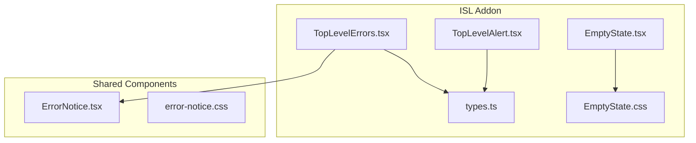
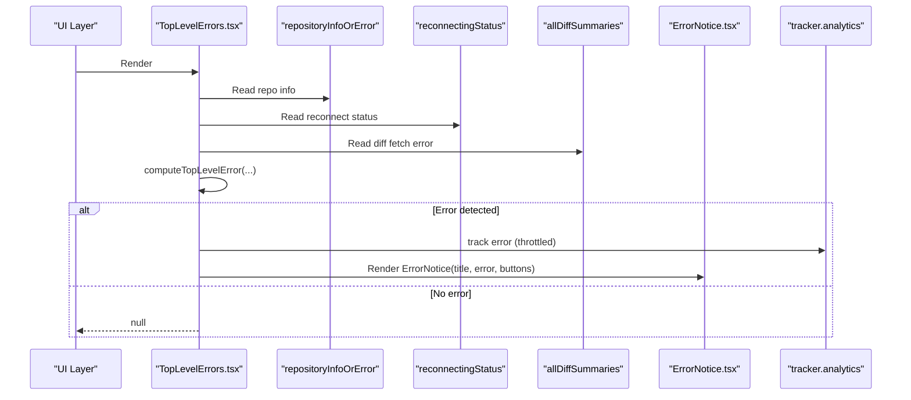
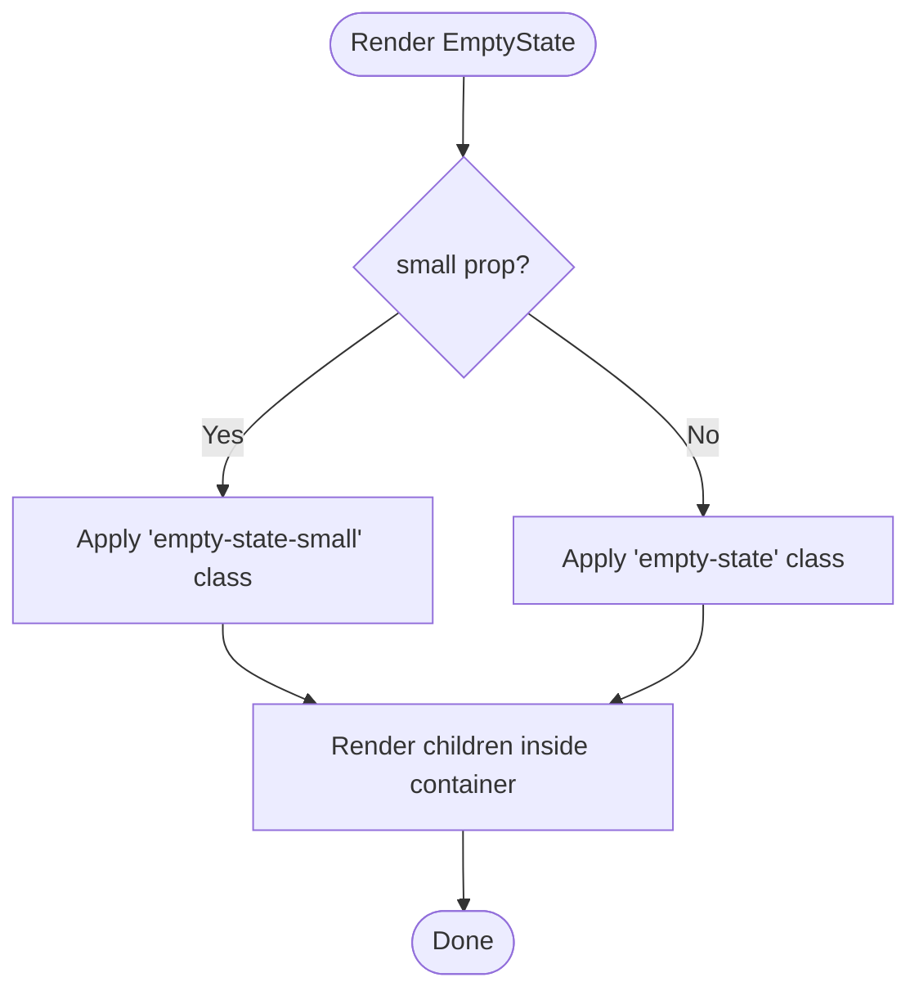
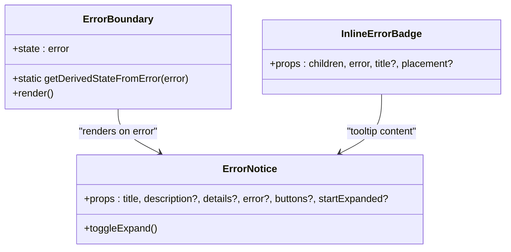
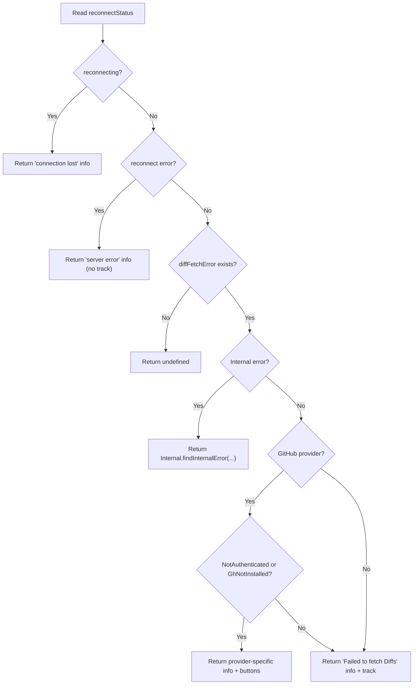
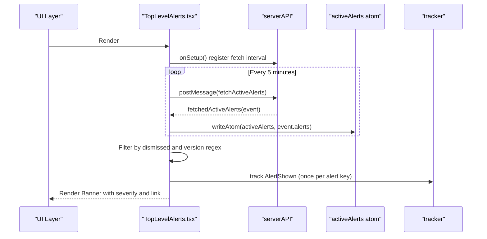
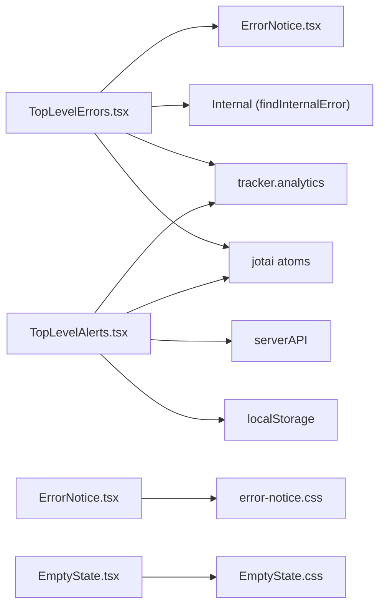

# Error Handling and UI States

<cite>
**Referenced Files in This Document**
- [EmptyState.tsx](file://addons/isl/src/EmptyState.tsx)
- [EmptyState.css](file://addons/isl/src/EmptyState.css)
- [TopLevelErrors.tsx](file://addons/isl/src/TopLevelErrors.tsx)
- [TopLevelAlert.tsx](file://addons/isl/src/TopLevelAlert.tsx)
- [ErrorNotice.tsx](file://addons/components/ErrorNotice.tsx)
- [error-notice.css](file://addons/components/error-notice.css)
- [types.ts](file://addons/isl/src/types.ts)
</cite>

## Table of Contents
1. [Introduction](#introduction)
2. [Project Structure](#project-structure)
3. [Core Components](#core-components)
4. [Architecture Overview](#architecture-overview)
5. [Detailed Component Analysis](#detailed-component-analysis)
6. [Dependency Analysis](#dependency-analysis)
7. [Performance Considerations](#performance-considerations)
8. [Troubleshooting Guide](#troubleshooting-guide)
9. [Conclusion](#conclusion)

## Introduction
This document explains how ISL handles error states and empty UI scenarios. It covers:
- EmptyState for repository initialization and empty lists
- Global error presentation via TopLevelErrors and TopLevelAlert
- ErrorBoundary and ErrorNotice for robust user-facing error reporting
- Analytics and debugging integration for error visibility
- Practical guidance for customizing error messages, adding new error types, and handling edge cases

## Project Structure
The error handling and UI state system spans two packages:
- addons/isl/src: ISL-specific components and global state
- addons/components: Shared UI primitives (including ErrorNotice)

**Diagram sources**
- [TopLevelErrors.tsx:1-138](file://addons/isl/src/TopLevelErrors.tsx#L1-L138)
- [TopLevelAlert.tsx:1-153](file://addons/isl/src/TopLevelAlert.tsx#L1-L153)
- [EmptyState.tsx:1-17](file://addons/isl/src/EmptyState.tsx#L1-L17)
- [EmptyState.css:1-34](file://addons/isl/src/EmptyState.css#L1-L34)
- [ErrorNotice.tsx:1-121](file://addons/components/ErrorNotice.tsx#L1-L121)
- [error-notice.css:1-82](file://addons/components/error-notice.css#L1-L82)
- [types.ts:619-628](file://addons/isl/src/types.ts#L619-L628)

**Section sources**
- [TopLevelErrors.tsx:1-138](file://addons/isl/src/TopLevelErrors.tsx#L1-L138)
- [TopLevelAlert.tsx:1-153](file://addons/isl/src/TopLevelAlert.tsx#L1-L153)
- [EmptyState.tsx:1-17](file://addons/isl/src/EmptyState.tsx#L1-L17)
- [EmptyState.css:1-34](file://addons/isl/src/EmptyState.css#L1-L34)
- [ErrorNotice.tsx:1-121](file://addons/components/ErrorNotice.tsx#L1-L121)
- [error-notice.css:1-82](file://addons/components/error-notice.css#L1-L82)
- [types.ts:619-628](file://addons/isl/src/types.ts#L619-L628)

## Core Components
- EmptyState: A lightweight container for empty or initialization states, supporting a compact variant.
- ErrorNotice: A user-friendly error card with expandable details, optional buttons, and a tooltip-based inline badge.
- ErrorBoundary: A class-based React error boundary that renders ErrorNotice when unhandled errors occur.
- TopLevelErrors: Computes and displays global errors based on connectivity, authentication, and diff-fetch failures.
- TopLevelAlerts: Manages and displays ongoing operational alerts with severity and dismissal behavior.

**Section sources**
- [EmptyState.tsx:10-16](file://addons/isl/src/EmptyState.tsx#L10-L16)
- [ErrorNotice.tsx:17-61](file://addons/components/ErrorNotice.tsx#L17-L61)
- [ErrorNotice.tsx:69-86](file://addons/components/ErrorNotice.tsx#L69-L86)
- [TopLevelErrors.tsx:31-110](file://addons/isl/src/TopLevelErrors.tsx#L31-L110)
- [TopLevelAlert.tsx:51-87](file://addons/isl/src/TopLevelAlert.tsx#L51-L87)

## Architecture Overview
The system integrates reactive state (via jotai atoms), analytics tracking, and platform-specific actions to surface actionable errors and alerts.

**Diagram sources**
- [TopLevelErrors.tsx:112-137](file://addons/isl/src/TopLevelErrors.tsx#L112-L137)
- [ErrorNotice.tsx:17-61](file://addons/components/ErrorNotice.tsx#L17-L61)

**Section sources**
- [TopLevelErrors.tsx:112-137](file://addons/isl/src/TopLevelErrors.tsx#L112-L137)
- [ErrorNotice.tsx:17-61](file://addons/components/ErrorNotice.tsx#L17-L61)

## Detailed Component Analysis

### EmptyState: Initialization and Empty Lists
EmptyState provides a centered, readable container for empty or initializing UI regions. It supports a compact variant for dense layouts.

Key behaviors:
- Accepts children for flexible content
- Applies a small variant class for reduced prominence
- Uses a dedicated stylesheet for consistent spacing and typography

**Diagram sources**
- [EmptyState.tsx:10-16](file://addons/isl/src/EmptyState.tsx#L10-L16)
- [EmptyState.css:8-27](file://addons/isl/src/EmptyState.css#L8-L27)

**Section sources**
- [EmptyState.tsx:10-16](file://addons/isl/src/EmptyState.tsx#L10-L16)
- [EmptyState.css:8-27](file://addons/isl/src/EmptyState.css#L8-L27)

### ErrorNotice: Detailed Error Reporting and Guidance
ErrorNotice presents a concise yet expandable error card. Users can toggle details, see stack traces, and take action via optional buttons. It also exposes an ErrorBoundary wrapper and an inline tooltip-based badge.

Highlights:
- Expandable details area for verbose diagnostics
- Optional buttons array for recovery actions
- InlineErrorBadge shows a compact indicator with a tooltip containing the full ErrorNotice
- ErrorBoundary catches downstream errors and renders a friendly ErrorNotice

**Diagram sources**
- [ErrorNotice.tsx:17-61](file://addons/components/ErrorNotice.tsx#L17-L61)
- [ErrorNotice.tsx:69-86](file://addons/components/ErrorNotice.tsx#L69-L86)
- [ErrorNotice.tsx:91-120](file://addons/components/ErrorNotice.tsx#L91-L120)

**Section sources**
- [ErrorNotice.tsx:17-61](file://addons/components/ErrorNotice.tsx#L17-L61)
- [ErrorNotice.tsx:69-86](file://addons/components/ErrorNotice.tsx#L69-L86)
- [ErrorNotice.tsx:91-120](file://addons/components/ErrorNotice.tsx#L91-L120)
- [error-notice.css:8-56](file://addons/components/error-notice.css#L8-L56)

### TopLevelErrors: Global Error Management
TopLevelErrors computes a unified error state from:
- Reconnection status (network/connectivity)
- Repository info (validation and provider)
- Diff summaries (code review data fetch)

It returns a structured info object with:
- title: localized headline
- error: Error instance (with preserved stack)
- buttons: optional recovery actions
- trackErrorName: analytics label for throttled tracking

**Diagram sources**
- [TopLevelErrors.tsx:31-110](file://addons/isl/src/TopLevelErrors.tsx#L31-L110)

**Section sources**
- [TopLevelErrors.tsx:24-29](file://addons/isl/src/TopLevelErrors.tsx#L24-L29)
- [TopLevelErrors.tsx:31-110](file://addons/isl/src/TopLevelErrors.tsx#L31-L110)
- [TopLevelErrors.tsx:112-137](file://addons/isl/src/TopLevelErrors.tsx#L112-L137)

### TopLevelAlerts: Ongoing Operational Alerts
TopLevelAlerts fetches active alerts from the server periodically and renders them as banners with severity badges. Users can dismiss alerts (persisted locally) and navigate to related documentation.

Key aspects:
- Periodic polling via serverAPI
- Version-aware filtering using regex
- Local storage-backed dismissal
- Severity-based coloring and logging

**Diagram sources**
- [TopLevelAlert.tsx:38-49](file://addons/isl/src/TopLevelAlert.tsx#L38-L49)
- [TopLevelAlert.tsx:51-87](file://addons/isl/src/TopLevelAlert.tsx#L51-L87)
- [TopLevelAlert.tsx:129-151](file://addons/isl/src/TopLevelAlert.tsx#L129-L151)
- [types.ts:619-628](file://addons/isl/src/types.ts#L619-L628)

**Section sources**
- [TopLevelAlert.tsx:38-49](file://addons/isl/src/TopLevelAlert.tsx#L38-L49)
- [TopLevelAlert.tsx:51-87](file://addons/isl/src/TopLevelAlert.tsx#L51-L87)
- [TopLevelAlert.tsx:129-151](file://addons/isl/src/TopLevelAlert.tsx#L129-L151)
- [types.ts:619-628](file://addons/isl/src/types.ts#L619-L628)

## Dependency Analysis
- TopLevelErrors depends on:
  - Jotai atoms for reactive state
  - Internal error detection
  - Platform integration for external links
  - Analytics tracker for error telemetry
- ErrorNotice is a standalone component with optional integration via ErrorBoundary and InlineErrorBadge.
- TopLevelAlerts depends on:
  - Server API for fetching alerts
  - Jotai atoms for state
  - Local storage for dismissal persistence
  - Analytics tracker for alert lifecycle events

**Diagram sources**
- [TopLevelErrors.tsx:13-22](file://addons/isl/src/TopLevelErrors.tsx#L13-L22)
- [TopLevelAlert.tsx:16-25](file://addons/isl/src/TopLevelAlert.tsx#L16-L25)
- [ErrorNotice.tsx:1-15](file://addons/components/ErrorNotice.tsx#L1-L15)
- [EmptyState.tsx:8-8](file://addons/isl/src/EmptyState.tsx#L8-L8)

**Section sources**
- [TopLevelErrors.tsx:13-22](file://addons/isl/src/TopLevelErrors.tsx#L13-L22)
- [TopLevelAlert.tsx:16-25](file://addons/isl/src/TopLevelAlert.tsx#L16-L25)
- [ErrorNotice.tsx:1-15](file://addons/components/ErrorNotice.tsx#L1-L15)
- [EmptyState.tsx:8-8](file://addons/isl/src/EmptyState.tsx#L8-L8)

## Performance Considerations
- Throttled analytics: TopLevelErrors tracks error events with a throttle to avoid excessive logging.
- Minimal re-renders: Jotai atoms enable fine-grained updates; avoid unnecessary subscriptions.
- Alert deduplication: Alerts are logged only once per key to reduce noise.
- CSS encapsulation: Stylesheets keep UI consistent without heavy runtime computations.

[No sources needed since this section provides general guidance]

## Troubleshooting Guide
Common scenarios and resolutions:
- Connectivity loss: The system shows a transient “connection lost” message while reconnecting. No analytics are tracked until connectivity is restored.
- Invalid token: A specific error prompts users to reopen ISL with a fresh link. Recovery guidance is provided via a button.
- Authentication failures with GitHub: Distinct messages for missing CLI or not-authenticated state, with a “Learn more” button linking to documentation.
- Diff fetch failures: Generalized error with analytics tagging for diagnostics. Internal errors are prioritized via an internal detector.
- Alert visibility: Ensure the alert’s version regex matches the current ISL version; otherwise it will be filtered out.

Operational tips:
- Use ErrorBoundary around risky subtrees to prevent app crashes and show user-friendly messages.
- Prefer InlineErrorBadge for compact indicators; reserve ErrorNotice for detailed modals or persistent panels.
- For analytics debugging, verify that throttled tracking fires appropriately and that alert keys are unique.

**Section sources**
- [TopLevelErrors.tsx:36-62](file://addons/isl/src/TopLevelErrors.tsx#L36-L62)
- [TopLevelErrors.tsx:80-106](file://addons/isl/src/TopLevelErrors.tsx#L80-L106)
- [TopLevelErrors.tsx:127-135](file://addons/isl/src/TopLevelErrors.tsx#L127-L135)
- [TopLevelAlert.tsx:57-64](file://addons/isl/src/TopLevelAlert.tsx#L57-L64)
- [ErrorNotice.tsx:69-86](file://addons/components/ErrorNotice.tsx#L69-L86)

## Conclusion
ISL’s error handling and UI state system combines reactive state, localized messaging, actionable recovery steps, and analytics-driven insights. EmptyState ensures meaningful empty states, ErrorNotice delivers user-friendly diagnostics, TopLevelErrors centralizes global error computation, and TopLevelAlerts communicates ongoing operational concerns. Together, they provide a robust foundation for resilient and user-centric error experiences.