# ISL Web Interface

<cite>
**Referenced Files in This Document**
- [App.tsx](file://addons/isl/src/App.tsx)
- [index.tsx](file://addons/isl/src/index.tsx)
- [TopBar.tsx](file://addons/isl/src/TopBar.tsx)
- [CommitTreeList.tsx](file://addons/isl/src/CommitTreeList.tsx)
- [CwdSelector.tsx](file://addons/isl/src/CwdSelector.tsx)
- [Drawers.tsx](file://addons/isl/src/Drawers.tsx)
- [CommitInfoView.tsx](file://addons/isl/src/CommitInfoView/CommitInfoView.tsx)
- [ISLShortcuts.tsx](file://addons/isl/src/ISLShortcuts.tsx)
- [responsive.tsx](file://addons/isl/src/responsive.tsx)
- [theme.tsx](file://addons/isl/src/theme.tsx)
- [themeDark.css](file://addons/components/theme/themeDark.css)
- [themeLight.css](file://addons/components/theme/themeLight.css)
- [tokens.stylex.ts](file://addons/components/theme/tokens.stylex.ts)
- [layout.ts](file://addons/components/theme/layout.ts)
</cite>

## Table of Contents
1. [Introduction](#introduction)
2. [Project Structure](#project-structure)
3. [Core Components](#core-components)
4. [Architecture Overview](#architecture-overview)
5. [Detailed Component Analysis](#detailed-component-analysis)
6. [Dependency Analysis](#dependency-analysis)
7. [Performance Considerations](#performance-considerations)
8. [Troubleshooting Guide](#troubleshooting-guide)
9. [Conclusion](#conclusion)
10. [Appendices](#appendices)

## Introduction
This document describes the ISL (Sapling Interactive Smartlog) web interface built with React. It explains the application layout, component hierarchy, state management, navigation, commit tree visualization, sidebar panels, workspace selection, reusable UI components, theming and styling, user interaction patterns, keyboard shortcuts, accessibility, responsive design, and integration points with the broader ISL ecosystem.

## Project Structure
The ISL web app is a React application bootstrapped from a single entry point and composed of modular UI components. The main application renders either a full ISL workspace or a comparison view depending on mode. It orchestrates drawers (sidebar panels), top navigation, commit tree visualization, and error/empty states.

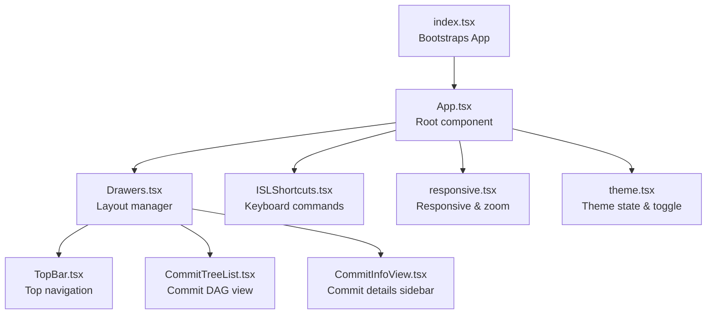

**Diagram sources**
- [index.tsx:1-19](file://addons/isl/src/index.tsx#L1-L19)
- [App.tsx:50-125](file://addons/isl/src/App.tsx#L50-L125)
- [Drawers.tsx:35-81](file://addons/isl/src/Drawers.tsx#L35-L81)
- [TopBar.tsx:35-65](file://addons/isl/src/TopBar.tsx#L35-L65)
- [CommitTreeList.tsx:218-245](file://addons/isl/src/CommitTreeList.tsx#L218-L245)
- [CommitInfoView.tsx:116-135](file://addons/isl/src/CommitInfoView/CommitInfoView.tsx#L116-L135)
- [ISLShortcuts.tsx:21-45](file://addons/isl/src/ISLShortcuts.tsx#L21-L45)
- [responsive.tsx:19-70](file://addons/isl/src/responsive.tsx#L19-L70)
- [theme.tsx:17-60](file://addons/isl/src/theme.tsx#L17-L60)

**Section sources**
- [index.tsx:1-19](file://addons/isl/src/index.tsx#L1-L19)
- [App.tsx:50-125](file://addons/isl/src/App.tsx#L50-L125)

## Core Components
- Application shell and routing:
  - Root component initializes providers and decides between ISL workspace and comparison view.
  - Handles repository error states and renders empty states with actionable guidance.
- Layout and drawers:
  - Central layout manager that hosts left/right/top/bottom drawers and main content area.
  - Supports collapsible/resizable drawers with drag handles and minimum sizes.
- Top navigation bar:
  - Hosts workspace selector, refresh, search/filter, actions, and settings.
  - Integrates tooltips, badges, and platform-specific controls.
- Commit tree visualization:
  - Renders a DAG of commits with selection, search filtering, and contextual actions.
  - Supports narrow layouts, progress indicators, and stack actions.
- Commit info sidebar:
  - Shows commit details, editable message fields, diffs, and actions (amend/commit).
  - Integrates with code review providers and message synchronization.
- Workspace selection:
  - Multi-level selector for repositories, nested repos, and submodules with search and breadcrumbs.
- Theming and responsiveness:
  - Theme state with platform-awareness and local overrides.
  - Zoom and compact rendering toggles; responsive breakpoints for narrow commit tree.

**Section sources**
- [App.tsx:50-125](file://addons/isl/src/App.tsx#L50-L125)
- [Drawers.tsx:35-81](file://addons/isl/src/Drawers.tsx#L35-L81)
- [TopBar.tsx:35-65](file://addons/isl/src/TopBar.tsx#L35-L65)
- [CommitTreeList.tsx:218-245](file://addons/isl/src/CommitTreeList.tsx#L218-L245)
- [CommitInfoView.tsx:116-135](file://addons/isl/src/CommitInfoView/CommitInfoView.tsx#L116-L135)
- [CwdSelector.tsx:184-212](file://addons/isl/src/CwdSelector.tsx#L184-L212)
- [theme.tsx:17-60](file://addons/isl/src/theme.tsx#L17-L60)
- [responsive.tsx:19-70](file://addons/isl/src/responsive.tsx#L19-L70)

## Architecture Overview
The ISL web interface uses a centralized state model with Jotai atoms for reactive UI updates. Components subscribe to atoms for server state, selection, previews, and UI flags. The layout composes drawers around the main content, and shortcuts drive UI actions.

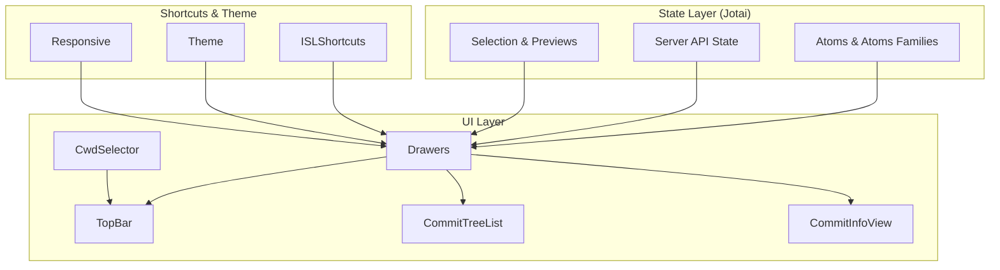

**Diagram sources**
- [App.tsx:50-125](file://addons/isl/src/App.tsx#L50-L125)
- [Drawers.tsx:35-81](file://addons/isl/src/Drawers.tsx#L35-L81)
- [TopBar.tsx:35-65](file://addons/isl/src/TopBar.tsx#L35-L65)
- [CommitTreeList.tsx:218-245](file://addons/isl/src/CommitTreeList.tsx#L218-L245)
- [CommitInfoView.tsx:116-135](file://addons/isl/src/CommitInfoView/CommitInfoView.tsx#L116-L135)
- [CwdSelector.tsx:184-212](file://addons/isl/src/CwdSelector.tsx#L184-L212)
- [ISLShortcuts.tsx:21-45](file://addons/isl/src/ISLShortcuts.tsx#L21-L45)
- [theme.tsx:17-60](file://addons/isl/src/theme.tsx#L17-L60)
- [responsive.tsx:19-70](file://addons/isl/src/responsive.tsx#L19-L70)

## Detailed Component Analysis

### Application Shell and Providers
- Initializes client-ready handshake with the backend and sets up providers.
- Renders either the ISL workspace with drawers and empty-state handling or a comparison view.

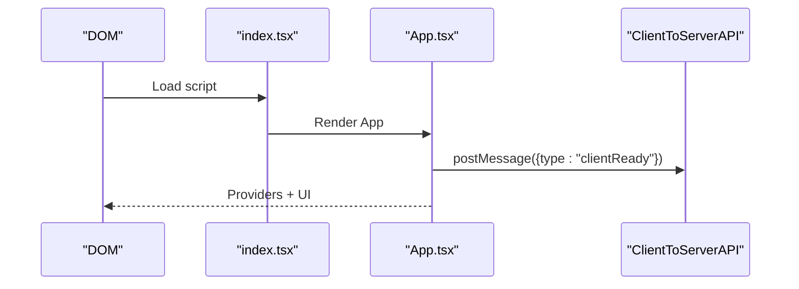

**Diagram sources**
- [index.tsx:16-19](file://addons/isl/src/index.tsx#L16-L19)
- [App.tsx:53-58](file://addons/isl/src/App.tsx#L53-L58)

**Section sources**
- [App.tsx:50-72](file://addons/isl/src/App.tsx#L50-L72)
- [index.tsx:16-19](file://addons/isl/src/index.tsx#L16-L19)

### Layout and Drawers
- Manages resizable/collapsible drawers around the main content area.
- Enforces minimum sizes and sticky collapse thresholds; supports vertical and horizontal sides.

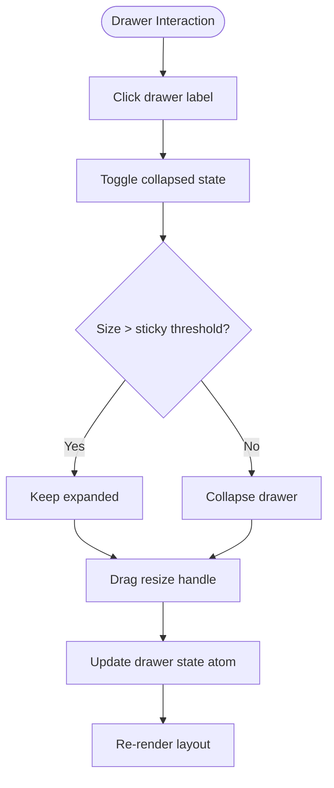

**Diagram sources**
- [Drawers.tsx:154-186](file://addons/isl/src/Drawers.tsx#L154-L186)

**Section sources**
- [Drawers.tsx:35-81](file://addons/isl/src/Drawers.tsx#L35-L81)
- [Drawers.tsx:86-186](file://addons/isl/src/Drawers.tsx#L86-L186)

### Top Navigation Bar
- Conditionally renders based on commit load state and remote availability.
- Provides pull, workspace selector, download menu, shelving, bulk actions, bookmarks, refresh, focus mode, bug report, and settings.

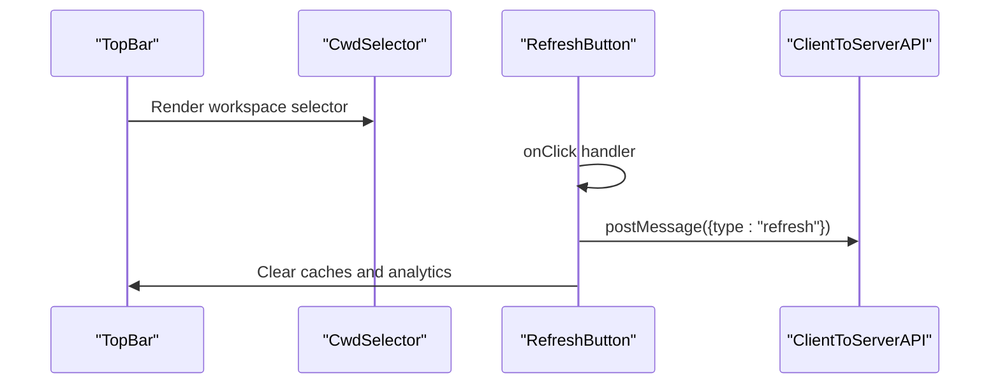

**Diagram sources**
- [TopBar.tsx:35-65](file://addons/isl/src/TopBar.tsx#L35-L65)
- [TopBar.tsx:72-93](file://addons/isl/src/TopBar.tsx#L72-L93)
- [CwdSelector.tsx:371-377](file://addons/isl/src/CwdSelector.tsx#L371-L377)

**Section sources**
- [TopBar.tsx:35-65](file://addons/isl/src/TopBar.tsx#L35-L65)
- [TopBar.tsx:72-93](file://addons/isl/src/TopBar.tsx#L72-L93)

### Commit Tree Visualization
- Renders a DAG of commits with selection, search filtering, and contextual actions.
- Handles “You are here” virtual commit, stack actions, and progress overlays.
- Uses responsive width to switch to narrow layout and adjusts rendering accordingly.

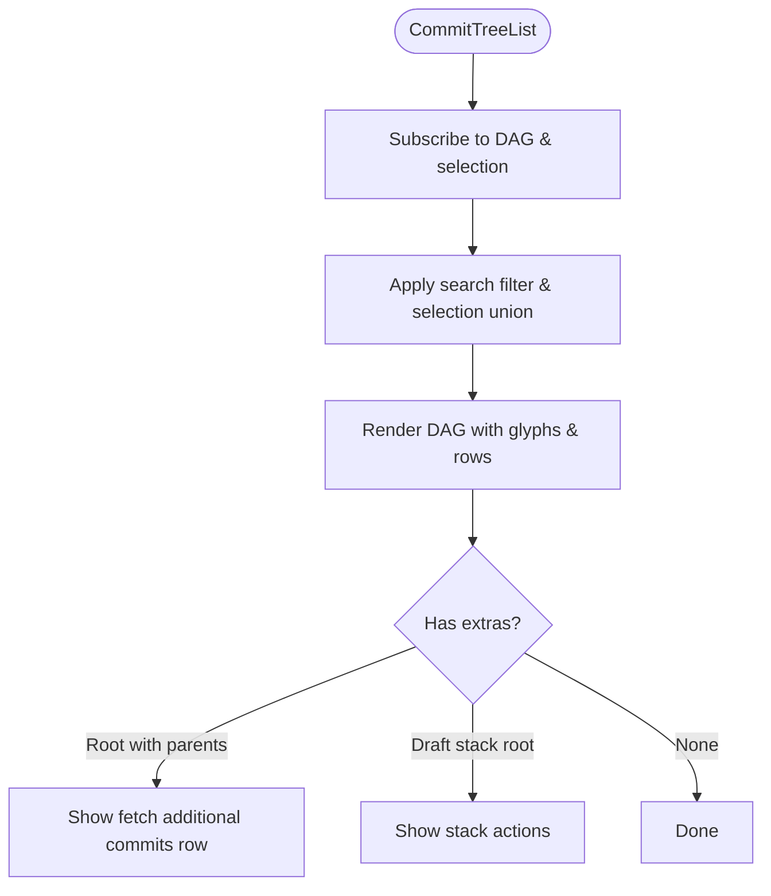

**Diagram sources**
- [CommitTreeList.tsx:64-96](file://addons/isl/src/CommitTreeList.tsx#L64-L96)
- [CommitTreeList.tsx:98-116](file://addons/isl/src/CommitTreeList.tsx#L98-L116)
- [CommitTreeList.tsx:122-131](file://addons/isl/src/CommitTreeList.tsx#L122-L131)
- [responsive.tsx:65-70](file://addons/isl/src/responsive.tsx#L65-L70)

**Section sources**
- [CommitTreeList.tsx:218-245](file://addons/isl/src/CommitTreeList.tsx#L218-L245)
- [CommitTreeList.tsx:64-96](file://addons/isl/src/CommitTreeList.tsx#L64-L96)
- [responsive.tsx:65-70](file://addons/isl/src/responsive.tsx#L65-L70)

### Commit Info Sidebar
- Shows commit details, editable message fields, diffs, and actions.
- Integrates with code review providers and message synchronization.
- Supports multi-commit selection, suggested rebase, and fold preview actions.

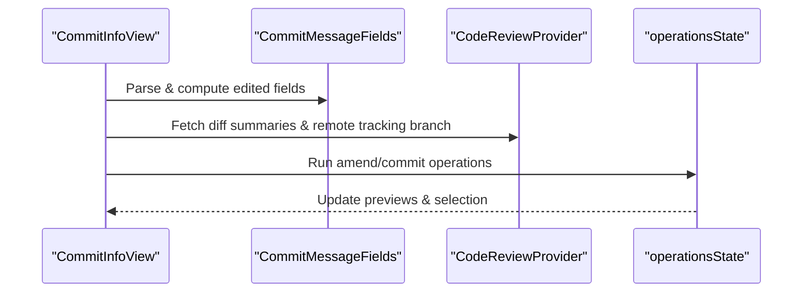

**Diagram sources**
- [CommitInfoView.tsx:190-218](file://addons/isl/src/CommitInfoView/CommitInfoView.tsx#L190-L218)
- [CommitInfoView.tsx:247-270](file://addons/isl/src/CommitInfoView/CommitInfoView.tsx#L247-L270)
- [CommitInfoView.tsx:663-800](file://addons/isl/src/CommitInfoView/CommitInfoView.tsx#L663-L800)

**Section sources**
- [CommitInfoView.tsx:116-135](file://addons/isl/src/CommitInfoView/CommitInfoView.tsx#L116-L135)
- [CommitInfoView.tsx:190-218](file://addons/isl/src/CommitInfoView/CommitInfoView.tsx#L190-L218)
- [CommitInfoView.tsx:663-800](file://addons/isl/src/CommitInfoView/CommitInfoView.tsx#L663-L800)

### Workspace Selection (CwdSelector)
- Multi-level selector for repositories, nested repos, and submodules.
- Supports search, breadcrumbs, and keyboard-triggered dropdown toggles.

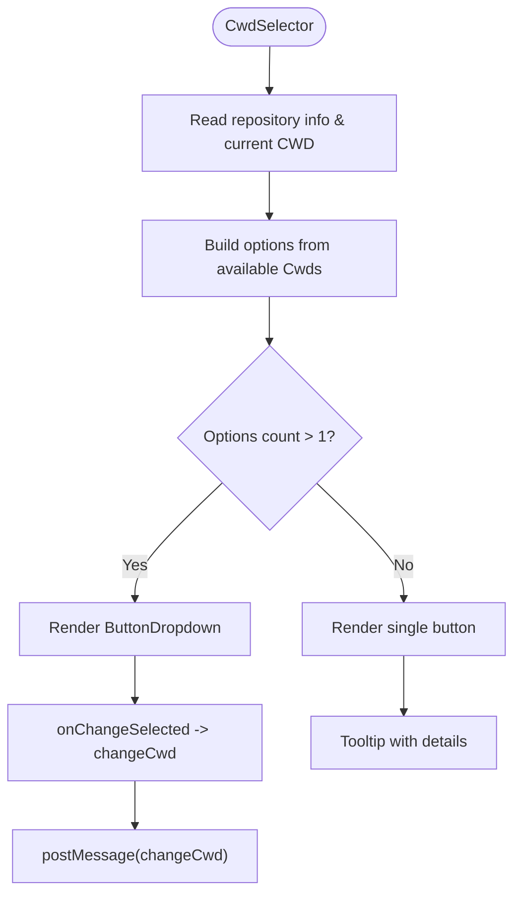

**Diagram sources**
- [CwdSelector.tsx:184-212](file://addons/isl/src/CwdSelector.tsx#L184-L212)
- [CwdSelector.tsx:217-275](file://addons/isl/src/CwdSelector.tsx#L217-L275)
- [CwdSelector.tsx:371-377](file://addons/isl/src/CwdSelector.tsx#L371-L377)

**Section sources**
- [CwdSelector.tsx:184-212](file://addons/isl/src/CwdSelector.tsx#L184-L212)
- [CwdSelector.tsx:371-377](file://addons/isl/src/CwdSelector.tsx#L371-L377)

### Theming and Styling
- Theme state combines platform theme and local overrides; exposes a shortcut to toggle theme.
- CSS variables define dark/light theme tokens; StyleX tokens provide programmatic theme variables.
- Responsive zoom and compact rendering are controlled via atoms and CSS custom properties.

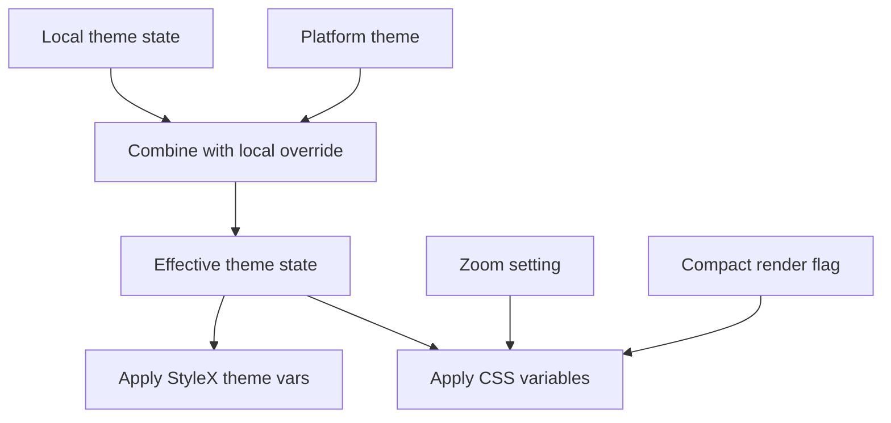

**Diagram sources**
- [theme.tsx:25-44](file://addons/isl/src/theme.tsx#L25-L44)
- [themeDark.css:8-79](file://addons/components/theme/themeDark.css#L8-L79)
- [themeLight.css:8-78](file://addons/components/theme/themeLight.css#L8-L78)
- [tokens.stylex.ts:14-119](file://addons/components/theme/tokens.stylex.ts#L14-L119)
- [responsive.tsx:23-28](file://addons/isl/src/responsive.tsx#L23-L28)

**Section sources**
- [theme.tsx:17-60](file://addons/isl/src/theme.tsx#L17-L60)
- [themeDark.css:8-79](file://addons/components/theme/themeDark.css#L8-L79)
- [themeLight.css:8-78](file://addons/components/theme/themeLight.css#L8-L78)
- [tokens.stylex.ts:14-119](file://addons/components/theme/tokens.stylex.ts#L14-L119)
- [responsive.tsx:23-28](file://addons/isl/src/responsive.tsx#L23-L28)

### Keyboard Shortcuts and Accessibility
- Centralized command dispatcher defines shortcuts for navigation, selection, filtering, theme, and toggles.
- Provides a modal to display all shortcuts with platform-appropriate modifier keys.
- Components subscribe to commands to perform actions without imperative key handlers.

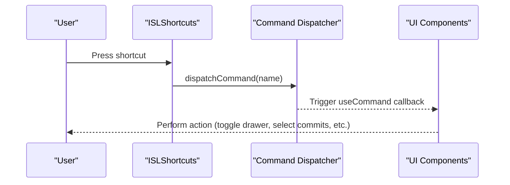

**Diagram sources**
- [ISLShortcuts.tsx:21-45](file://addons/isl/src/ISLShortcuts.tsx#L21-L45)
- [ISLShortcuts.tsx:78-113](file://addons/isl/src/ISLShortcuts.tsx#L78-L113)

**Section sources**
- [ISLShortcuts.tsx:21-45](file://addons/isl/src/ISLShortcuts.tsx#L21-L45)
- [ISLShortcuts.tsx:78-113](file://addons/isl/src/ISLShortcuts.tsx#L78-L113)

## Dependency Analysis
The UI relies on a small set of shared libraries and internal modules:
- Jotai for state management and atom families.
- Shared utilities for debouncing, hooks, and platform abstractions.
- ISL components library for UI primitives (buttons, tooltips, icons, etc.).

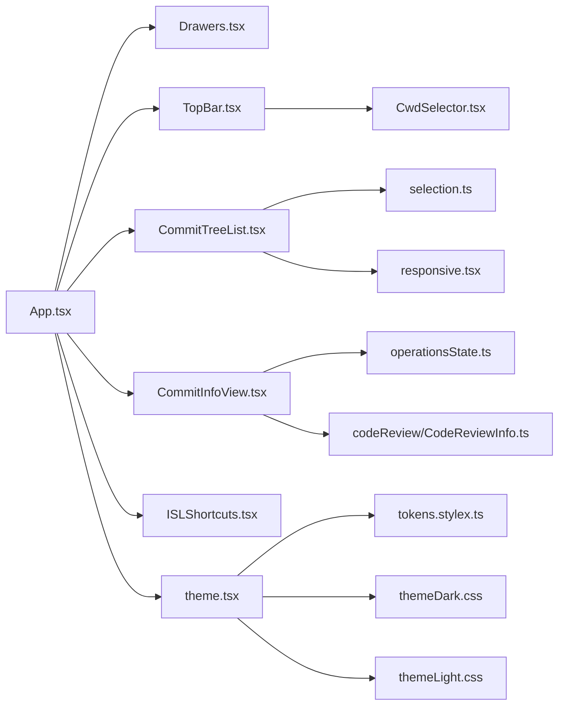

**Diagram sources**
- [App.tsx:50-125](file://addons/isl/src/App.tsx#L50-L125)
- [TopBar.tsx:35-65](file://addons/isl/src/TopBar.tsx#L35-L65)
- [CommitTreeList.tsx:218-245](file://addons/isl/src/CommitTreeList.tsx#L218-L245)
- [CommitInfoView.tsx:116-135](file://addons/isl/src/CommitInfoView/CommitInfoView.tsx#L116-L135)
- [CwdSelector.tsx:184-212](file://addons/isl/src/CwdSelector.tsx#L184-L212)
- [ISLShortcuts.tsx:21-45](file://addons/isl/src/ISLShortcuts.tsx#L21-L45)
- [theme.tsx:17-60](file://addons/isl/src/theme.tsx#L17-L60)
- [tokens.stylex.ts:14-119](file://addons/components/theme/tokens.stylex.ts#L14-L119)
- [themeDark.css:8-79](file://addons/components/theme/themeDark.css#L8-L79)
- [themeLight.css:8-78](file://addons/components/theme/themeLight.css#L8-L78)

**Section sources**
- [App.tsx:50-125](file://addons/isl/src/App.tsx#L50-L125)
- [theme.tsx:17-60](file://addons/isl/src/theme.tsx#L17-L60)

## Performance Considerations
- Efficient DAG rendering:
  - Subset computation unions selection and filters to minimize render work.
  - Virtual “You are here” commit insertion avoids heavy recomputation.
- Lazy and conditional rendering:
  - Suspense around comparison view; conditional rendering of top bar until commits are loaded.
- Debounced interactions:
  - Resizing drawer handler is debounced to reduce layout thrash.
- Responsive thresholds:
  - Narrow commit tree triggers compact rendering and reduced widths to improve readability and performance on small screens.

[No sources needed since this section provides general guidance]

## Troubleshooting Guide
- Empty states and repository errors:
  - The app detects invalid CWD, missing repositories, unhealthy EdenFS, and invalid commands, and surfaces actionable guidance or selection prompts.
- Refresh and cache:
  - Refresh button clears optimistic state, removes forgotten operations, regenerates generated files, and posts a refresh message to the server.
- Keyboard shortcuts:
  - Use the shortcut help modal to discover available commands and their key combinations.

**Section sources**
- [App.tsx:127-282](file://addons/isl/src/App.tsx#L127-L282)
- [TopBar.tsx:72-93](file://addons/isl/src/TopBar.tsx#L72-L93)
- [ISLShortcuts.tsx:78-113](file://addons/isl/src/ISLShortcuts.tsx#L78-L113)

## Conclusion
The ISL web interface is a modular, state-driven React application that integrates tightly with the ISL backend via a client-server API. Its layout centers around resizable drawers, a robust commit tree visualization, and a powerful commit info sidebar. Theming, responsiveness, and keyboard shortcuts provide a polished, accessible experience across platforms.

[No sources needed since this section summarizes without analyzing specific files]

## Appendices

### Component Usage Examples
- Rendering the app:
  - Mount the root component from the entry file to initialize providers and UI.
- Using drawers:
  - Wrap main content and sidebars with the drawers component and provide labels and error boundaries.
- Workspace selection:
  - Place the CWD selector in the top bar; it will render a dropdown when multiple valid CWDs exist.
- Commit tree:
  - Render the commit tree list; it will subscribe to selection and previews and adjust layout based on responsive state.
- Commit info sidebar:
  - Render the commit info view; it will manage message editing, diffs, and actions based on selection and provider state.

**Section sources**
- [index.tsx:16-19](file://addons/isl/src/index.tsx#L16-L19)
- [Drawers.tsx:35-81](file://addons/isl/src/Drawers.tsx#L35-L81)
- [CwdSelector.tsx:184-212](file://addons/isl/src/CwdSelector.tsx#L184-L212)
- [CommitTreeList.tsx:218-245](file://addons/isl/src/CommitTreeList.tsx#L218-L245)
- [CommitInfoView.tsx:116-135](file://addons/isl/src/CommitInfoView/CommitInfoView.tsx#L116-L135)

### Customization Options
- Theme:
  - Toggle theme via keyboard shortcut or programmatically via theme state atom.
  - Adjust zoom level and compact rendering via responsive settings.
- Layout:
  - Collapse/expand drawers and drag to resize; minimum sizes prevent unusable views.
- Shortcuts:
  - Extend or override commands using the centralized dispatcher.

**Section sources**
- [theme.tsx:53-60](file://addons/isl/src/theme.tsx#L53-L60)
- [responsive.tsx:23-39](file://addons/isl/src/responsive.tsx#L23-L39)
- [Drawers.tsx:154-186](file://addons/isl/src/Drawers.tsx#L154-L186)
- [ISLShortcuts.tsx:21-45](file://addons/isl/src/ISLShortcuts.tsx#L21-L45)

### Integration with the ISL Ecosystem
- Client-server communication:
  - The app posts messages to the server for refresh, CWD changes, and diff fetching.
- Platform integration:
  - Uses platform APIs for opening files, links, and theme detection.
- Feature flags and internal integrations:
  - Optional internal components and flags enable advanced features conditionally.

**Section sources**
- [App.tsx:53-58](file://addons/isl/src/App.tsx#L53-L58)
- [TopBar.tsx:17-29](file://addons/isl/src/TopBar.tsx#L17-L29)
- [CommitInfoView.tsx:191-196](file://addons/isl/src/CommitInfoView/CommitInfoView.tsx#L191-L196)