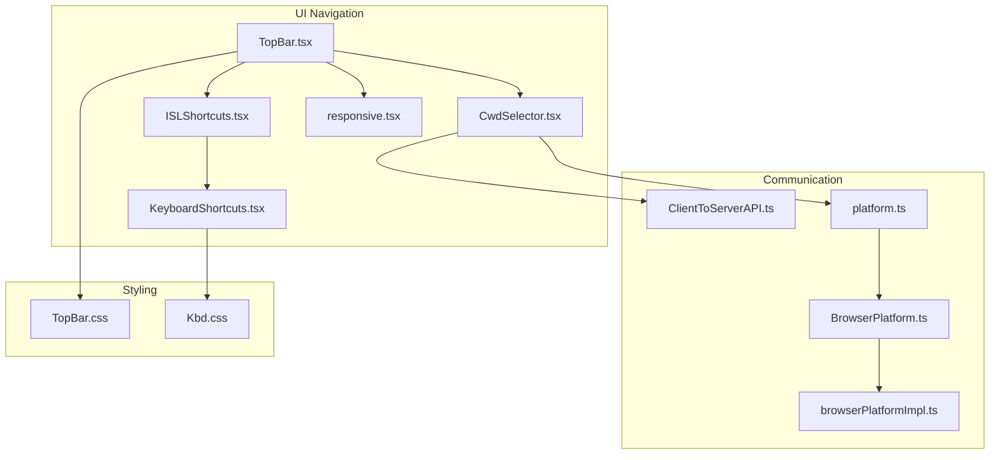
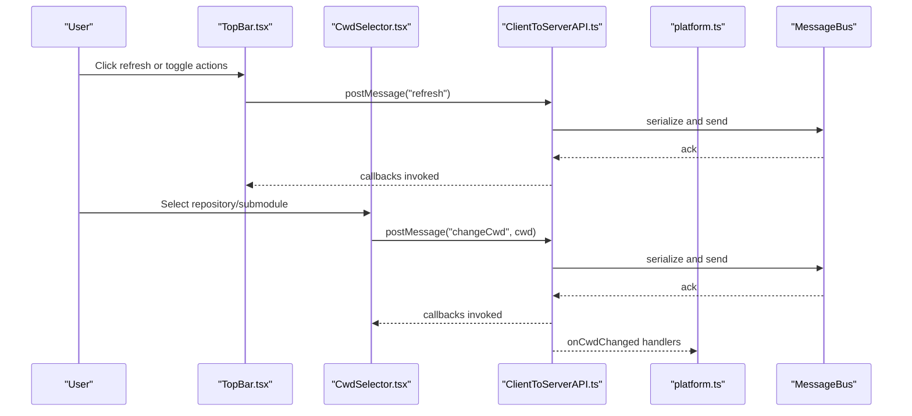
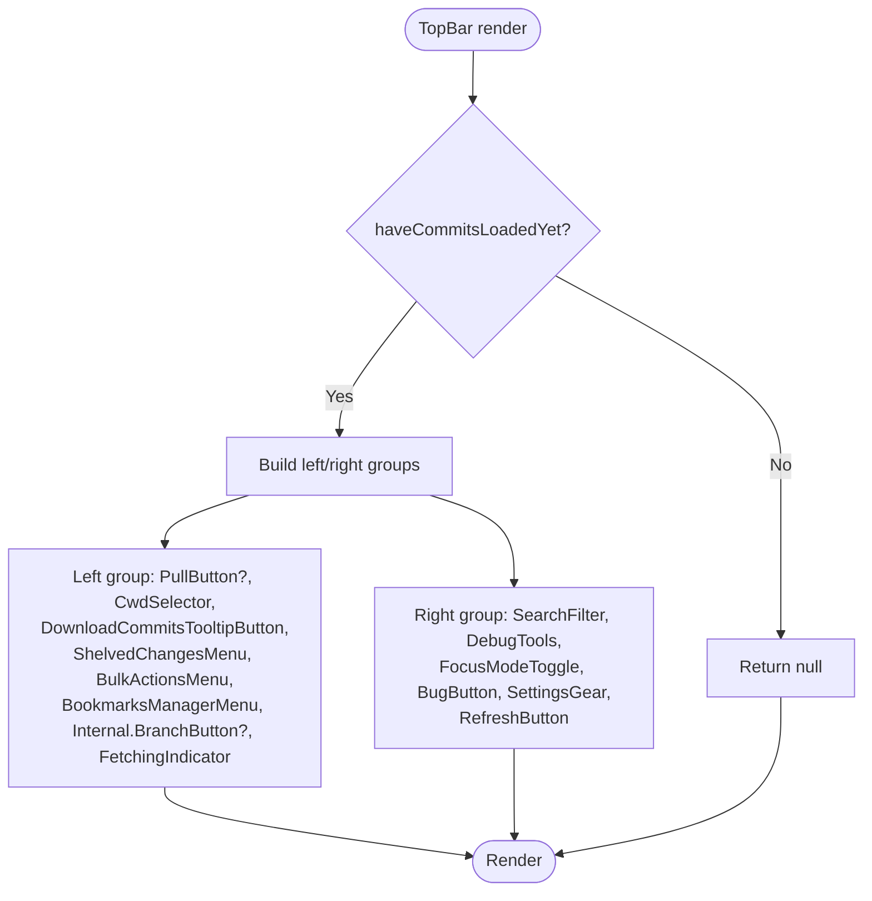
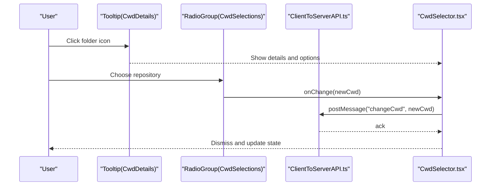
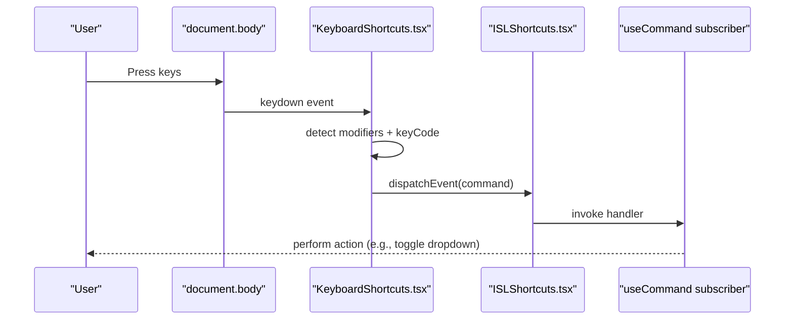
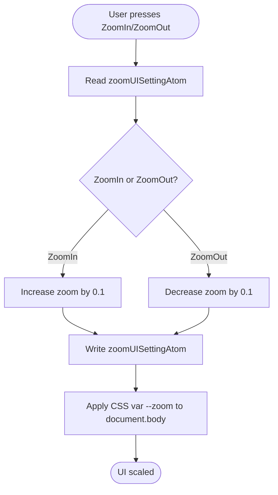
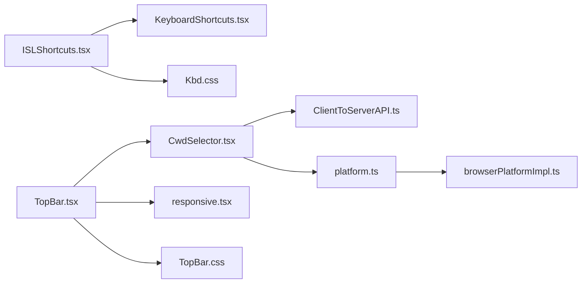

# Navigation Components

<cite>
**Referenced Files in This Document**
- [TopBar.tsx](file://addons/isl/src/TopBar.tsx)
- [TopBar.css](file://addons/isl/src/TopBar.css)
- [CwdSelector.tsx](file://addons/isl/src/CwdSelector.tsx)
- [ISLShortcuts.tsx](file://addons/isl/src/ISLShortcuts.tsx)
- [KeyboardShortcuts.tsx](file://addons/components/KeyboardShortcuts.tsx)
- [responsive.tsx](file://addons/isl/src/responsive.tsx)
- [ClientToServerAPI.ts](file://addons/isl/src/ClientToServerAPI.ts)
- [platform.ts](file://addons/isl/src/platform.ts)
- [BrowserPlatform.ts](file://addons/isl/src/BrowserPlatform.ts)
- [browserPlatformImpl.ts](file://addons/isl/src/platform/browserPlatformImpl.ts)
- [Kbd.css](file://addons/components/Kbd.css)
</cite>

## Table of Contents
1. [Introduction](#introduction)
2. [Project Structure](#project-structure)
3. [Core Components](#core-components)
4. [Architecture Overview](#architecture-overview)
5. [Detailed Component Analysis](#detailed-component-analysis)
6. [Dependency Analysis](#dependency-analysis)
7. [Performance Considerations](#performance-considerations)
8. [Troubleshooting Guide](#troubleshooting-guide)
9. [Conclusion](#conclusion)
10. [Appendices](#appendices)

## Introduction
This document explains the ISL navigation components with a focus on:
- TopBar: repository information display, action buttons, and status indicators
- CwdSelector: workspace switching, dropdown menus, and repository detection
- Keyboard shortcut system: command handling, accessibility, and customization
- Responsive behavior and mobile-friendly adaptations
- Integration with platform-specific navigation patterns

## Project Structure
The navigation system spans several modules:
- TopBar composes multiple navigation controls and status indicators
- CwdSelector manages working directory selection and submodule navigation
- ISLShortcuts defines the global command set and dispatch mechanism
- KeyboardShortcuts provides the underlying key handling and modifier logic
- ClientToServerAPI bridges UI actions to the backend
- platform and browserPlatformImpl define platform-specific capabilities and messaging
- responsive.tsx coordinates UI density and zoom for compact/mobile layouts
- Styles for TopBar and Kbd ensure consistent appearance and accessibility

**Diagram sources**
- [TopBar.tsx:35-65](file://addons/isl/src/TopBar.tsx#L35-L65)
- [CwdSelector.tsx:184-212](file://addons/isl/src/CwdSelector.tsx#L184-L212)
- [ISLShortcuts.tsx:21-45](file://addons/isl/src/ISLShortcuts.tsx#L21-L45)
- [KeyboardShortcuts.tsx:132-159](file://addons/components/KeyboardShortcuts.tsx#L132-L159)
- [responsive.tsx:19-70](file://addons/isl/src/responsive.tsx#L19-L70)
- [ClientToServerAPI.ts:20-29](file://addons/isl/src/ClientToServerAPI.ts#L20-L29)
- [platform.ts:30-99](file://addons/isl/src/platform.ts#L30-L99)
- [BrowserPlatform.ts:21](file://addons/isl/src/BrowserPlatform.ts#L21)
- [browserPlatformImpl.ts:32-121](file://addons/isl/src/platform/browserPlatformImpl.ts#L32-L121)
- [TopBar.css:8-29](file://addons/isl/src/TopBar.css#L8-L29)
- [Kbd.css:8-46](file://addons/components/Kbd.css#L8-L46)

**Section sources**
- [TopBar.tsx:35-65](file://addons/isl/src/TopBar.tsx#L35-L65)
- [TopBar.css:8-29](file://addons/isl/src/TopBar.css#L8-L29)

## Core Components
- TopBar: Renders grouped action buttons and status indicators, conditionally showing push-related controls and a refresh action. It integrates CwdSelector and other navigation controls.
- CwdSelector: Provides a breadcrumb-like selector for repositories and submodules, supports toggling via keyboard shortcuts, and displays repository info and current working directory.
- ISLShortcuts: Defines a centralized command map with keyboard shortcuts and exposes a dispatcher and helper hooks for subscribing to commands.
- KeyboardShortcuts: Implements the low-level key handling, modifier detection, and event dispatching used by ISLShortcuts.
- ClientToServerAPI: Encapsulates message passing to the backend, including working directory changes and refresh triggers.
- platform and browserPlatformImpl: Define platform capabilities and message bus integration for browser-like environments.
- responsive.tsx: Manages UI zoom and compact rendering modes, enabling responsive behavior.

**Section sources**
- [TopBar.tsx:35-65](file://addons/isl/src/TopBar.tsx#L35-L65)
- [CwdSelector.tsx:184-212](file://addons/isl/src/CwdSelector.tsx#L184-L212)
- [ISLShortcuts.tsx:21-45](file://addons/isl/src/ISLShortcuts.tsx#L21-L45)
- [KeyboardShortcuts.tsx:132-159](file://addons/components/KeyboardShortcuts.tsx#L132-L159)
- [ClientToServerAPI.ts:20-29](file://addons/isl/src/ClientToServerAPI.ts#L20-L29)
- [platform.ts:30-99](file://addons/isl/src/platform.ts#L30-L99)
- [browserPlatformImpl.ts:32-121](file://addons/isl/src/platform/browserPlatformImpl.ts#L32-L121)
- [responsive.tsx:19-70](file://addons/isl/src/responsive.tsx#L19-L70)

## Architecture Overview
The navigation architecture connects UI components to platform services and the backend via a message bus. TopBar orchestrates navigation controls, CwdSelector handles repository/workspace selection, and ISLShortcuts provides a unified keyboard command system.

**Diagram sources**
- [TopBar.tsx:72-93](file://addons/isl/src/TopBar.tsx#L72-L93)
- [CwdSelector.tsx:371-377](file://addons/isl/src/CwdSelector.tsx#L371-L377)
- [ClientToServerAPI.ts:179-185](file://addons/isl/src/ClientToServerAPI.ts#L179-L185)
- [platform.ts:115](file://addons/isl/src/platform.ts#L115)

## Detailed Component Analysis

### TopBar
TopBar renders a responsive two-group bar:
- Left group: pull, CwdSelector, download commits, shelved changes, bulk actions, bookmarks manager, internal branch button, and a fetching indicator
- Right group: search filter, debug tools, focus mode, bug report, settings, and refresh

It conditionally renders the pull button based on remote availability and hides itself until initial data is loaded.

**Diagram sources**
- [TopBar.tsx:35-65](file://addons/isl/src/TopBar.tsx#L35-L65)

**Section sources**
- [TopBar.tsx:35-65](file://addons/isl/src/TopBar.tsx#L35-L65)
- [TopBar.css:8-29](file://addons/isl/src/TopBar.css#L8-L29)

### CwdSelector
CwdSelector provides:
- Main selector label derived from repository root and current working directory
- Optional ButtonDropdown for quick switching when multiple valid CWDs exist
- Tooltip with repository info and active working directory
- Submodule breadcrumbs for nested repositories
- Keyboard shortcut integration via useCommandEvent

Key behaviors:
- Determines whether to hide right borders for adjacent buttons
- Filters available CWDs to valid repositories
- Computes labels using repository-relative paths
- Supports changing CWD via ClientToServerAPI

**Diagram sources**
- [CwdSelector.tsx:340-369](file://addons/isl/src/CwdSelector.tsx#L340-L369)
- [CwdSelector.tsx:397-439](file://addons/isl/src/CwdSelector.tsx#L397-L439)
- [CwdSelector.tsx:371-377](file://addons/isl/src/CwdSelector.tsx#L371-L377)

**Section sources**
- [CwdSelector.tsx:184-212](file://addons/isl/src/CwdSelector.tsx#L184-L212)
- [CwdSelector.tsx:217-275](file://addons/isl/src/CwdSelector.tsx#L217-L275)
- [CwdSelector.tsx:277-338](file://addons/isl/src/CwdSelector.tsx#L277-L338)
- [CwdSelector.tsx:340-369](file://addons/isl/src/CwdSelector.tsx#L340-L369)
- [CwdSelector.tsx:397-439](file://addons/isl/src/CwdSelector.tsx#L397-L439)
- [CwdSelector.tsx:444-518](file://addons/isl/src/CwdSelector.tsx#L444-L518)

### Keyboard Shortcut System
ISLShortcuts defines a command map with keyboard shortcuts and exposes:
- A dispatcher that converts key combinations into named events
- A hook to subscribe to commands
- A helper to emit commands programmatically
- A label registry for UI help

KeyboardShortcuts provides:
- Modifier flags and key codes
- Global keydown listener that ignores text inputs
- EventTarget-based dispatch to registered handlers

**Diagram sources**
- [KeyboardShortcuts.tsx:71-114](file://addons/components/KeyboardShortcuts.tsx#L71-L114)
- [KeyboardShortcuts.tsx:143-151](file://addons/components/KeyboardShortcuts.tsx#L143-L151)
- [ISLShortcuts.tsx:21-56](file://addons/isl/src/ISLShortcuts.tsx#L21-L56)

**Section sources**
- [ISLShortcuts.tsx:21-56](file://addons/isl/src/ISLShortcuts.tsx#L21-L56)
- [KeyboardShortcuts.tsx:19-56](file://addons/components/KeyboardShortcuts.tsx#L19-L56)
- [KeyboardShortcuts.tsx:62-69](file://addons/components/KeyboardShortcuts.tsx#L62-L69)
- [KeyboardShortcuts.tsx:143-151](file://addons/components/KeyboardShortcuts.tsx#L143-L151)

### Accessibility and Styling
- Keyboard hints: Kbd.css provides theme-aware styling for keyboard shortcuts in tooltips and help dialogs.
- Tooltip integration: TopBar and CwdSelector use tooltips to present contextual help and actions.
- Platform integration: platform.ts and browserPlatformImpl.ts define clipboard, persistence, and message bus behavior for browser-like environments.

**Section sources**
- [Kbd.css:8-46](file://addons/components/Kbd.css#L8-L46)
- [platform.ts:30-99](file://addons/isl/src/platform.ts#L30-L99)
- [browserPlatformImpl.ts:32-121](file://addons/isl/src/platform/browserPlatformImpl.ts#L32-L121)

### Responsive Navigation Behavior
responsive.tsx enables:
- Zoom adjustments via keyboard shortcuts (ZoomIn/ZoomOut)
- Compact rendering mode toggled by a config-backed atom
- Width observation to adapt commit tree layout
- Narrow-width thresholds for compact vs. wide layouts

**Diagram sources**
- [responsive.tsx:30-39](file://addons/isl/src/responsive.tsx#L30-L39)
- [responsive.tsx:23-28](file://addons/isl/src/responsive.tsx#L23-L28)

**Section sources**
- [responsive.tsx:19-70](file://addons/isl/src/responsive.tsx#L19-L70)

## Dependency Analysis
The navigation components rely on:
- ClientToServerAPI for backend communication
- platform/browserPlatformImpl for environment-specific behavior
- KeyboardShortcuts/ISLShortcuts for command handling
- Jotai atoms for reactive state (e.g., repository info, server CWD)
- StyleX and CSS for styling and responsive behavior

**Diagram sources**
- [ISLShortcuts.tsx:21-45](file://addons/isl/src/ISLShortcuts.tsx#L21-L45)
- [KeyboardShortcuts.tsx:132-159](file://addons/components/KeyboardShortcuts.tsx#L132-L159)
- [TopBar.tsx:35-65](file://addons/isl/src/TopBar.tsx#L35-L65)
- [CwdSelector.tsx:184-212](file://addons/isl/src/CwdSelector.tsx#L184-L212)
- [ClientToServerAPI.ts:20-29](file://addons/isl/src/ClientToServerAPI.ts#L20-L29)
- [platform.ts:30-99](file://addons/isl/src/platform.ts#L30-L99)
- [browserPlatformImpl.ts:32-121](file://addons/isl/src/platform/browserPlatformImpl.ts#L32-L121)
- [responsive.tsx:19-70](file://addons/isl/src/responsive.tsx#L19-L70)
- [TopBar.css:8-29](file://addons/isl/src/TopBar.css#L8-L29)
- [Kbd.css:8-46](file://addons/components/Kbd.css#L8-L46)

**Section sources**
- [ClientToServerAPI.ts:20-29](file://addons/isl/src/ClientToServerAPI.ts#L20-L29)
- [platform.ts:30-99](file://addons/isl/src/platform.ts#L30-L99)
- [browserPlatformImpl.ts:32-121](file://addons/isl/src/platform/browserPlatformImpl.ts#L32-L121)
- [responsive.tsx:19-70](file://addons/isl/src/responsive.tsx#L19-L70)

## Performance Considerations
- Debounce or throttle frequent UI updates (e.g., resize observers) to avoid layout thrashing.
- Prefer memoization for computed labels and option lists in CwdSelector to minimize re-renders.
- Limit tooltip content to essential information to reduce DOM overhead.
- Use compact rendering mode on narrow widths to improve perceived performance.

## Troubleshooting Guide
Common issues and remedies:
- Working directory not updating: verify ClientToServerAPI message posting and onCwdChanged handlers are registered and invoked.
- Keyboard shortcuts not firing: ensure the target is not a text input and that modifiers match the command definition.
- Tooltip overlaps or misalignment: adjust TopBar CSS gaps and sticky positioning for the current viewport.
- Platform persistence failures: inspect platform.getPersistedState/setPersistedState behavior in browserPlatformImpl.

**Section sources**
- [ClientToServerAPI.ts:209-218](file://addons/isl/src/ClientToServerAPI.ts#L209-L218)
- [KeyboardShortcuts.tsx:62-69](file://addons/components/KeyboardShortcuts.tsx#L62-L69)
- [TopBar.css:8-29](file://addons/isl/src/TopBar.css#L8-L29)
- [browserPlatformImpl.ts:58-99](file://addons/isl/src/platform/browserPlatformImpl.ts#L58-L99)

## Conclusion
The ISL navigation system combines a flexible TopBar, a robust CwdSelector, and a powerful keyboard command framework. Together with platform abstractions and responsive utilities, it delivers an efficient, accessible, and adaptable navigation experience across environments.

## Appendices

### Customizing Navigation Elements
- Add a new action button: compose a new component and place it in the appropriate group within TopBar.
- Extend CwdSelector: introduce new options in the availableCwds atom and handle changes via ClientToServerAPI.
- Integrate with platform-specific patterns: leverage platform.ts capabilities (e.g., openFile, clipboardCopy) in your components.

**Section sources**
- [TopBar.tsx:35-65](file://addons/isl/src/TopBar.tsx#L35-L65)
- [CwdSelector.tsx:103-128](file://addons/isl/src/CwdSelector.tsx#L103-L128)
- [ClientToServerAPI.ts:179-185](file://addons/isl/src/ClientToServerAPI.ts#L179-L185)
- [platform.ts:30-99](file://addons/isl/src/platform.ts#L30-L99)

### Adding New Shortcuts
- Define a new command in ISLShortcuts with a unique name and key combination.
- Provide a human-readable label in ISLShortcutLabels.
- Subscribe to the command using useCommand in the relevant component.
- Optionally expose a programmatic dispatcher via dispatchCommand.

**Section sources**
- [ISLShortcuts.tsx:21-56](file://addons/isl/src/ISLShortcuts.tsx#L21-L56)
- [ISLShortcuts.tsx:58-76](file://addons/isl/src/ISLShortcuts.tsx#L58-L76)
- [KeyboardShortcuts.tsx:132-159](file://addons/components/KeyboardShortcuts.tsx#L132-L159)

### Platform-Specific Navigation Patterns
- Browser-like environments: use browserPlatformImpl for clipboard, persistence, and message bus configuration.
- Electron/standalone: implement a custom Platform and wire it into window.islPlatform before loading ISL.
- VS Code webview: platform.ts is replaced at bundle time with a VS Code-specific implementation.

**Section sources**
- [BrowserPlatform.ts:21](file://addons/isl/src/BrowserPlatform.ts#L21)
- [browserPlatformImpl.ts:32-121](file://addons/isl/src/platform/browserPlatformImpl.ts#L32-L121)
- [platform.ts:107-118](file://addons/isl/src/platform.ts#L107-L118)