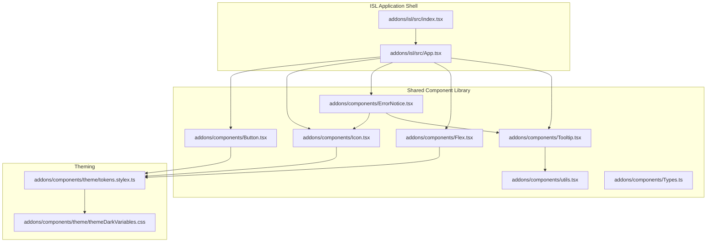
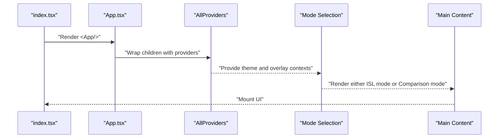
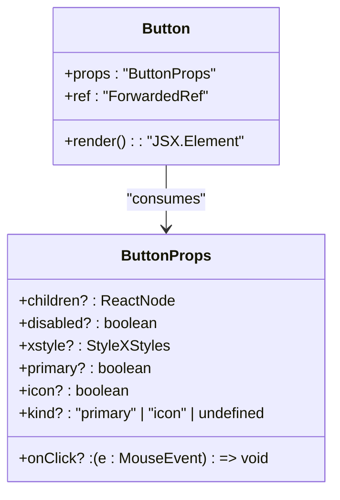
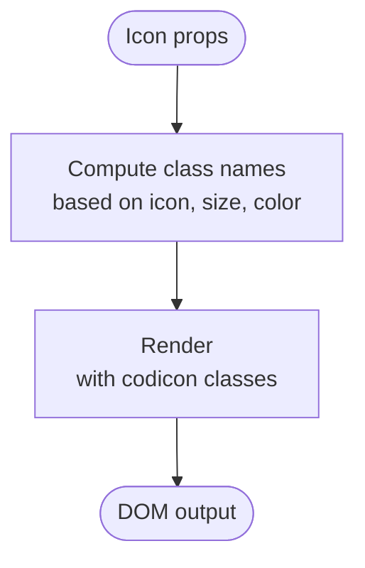
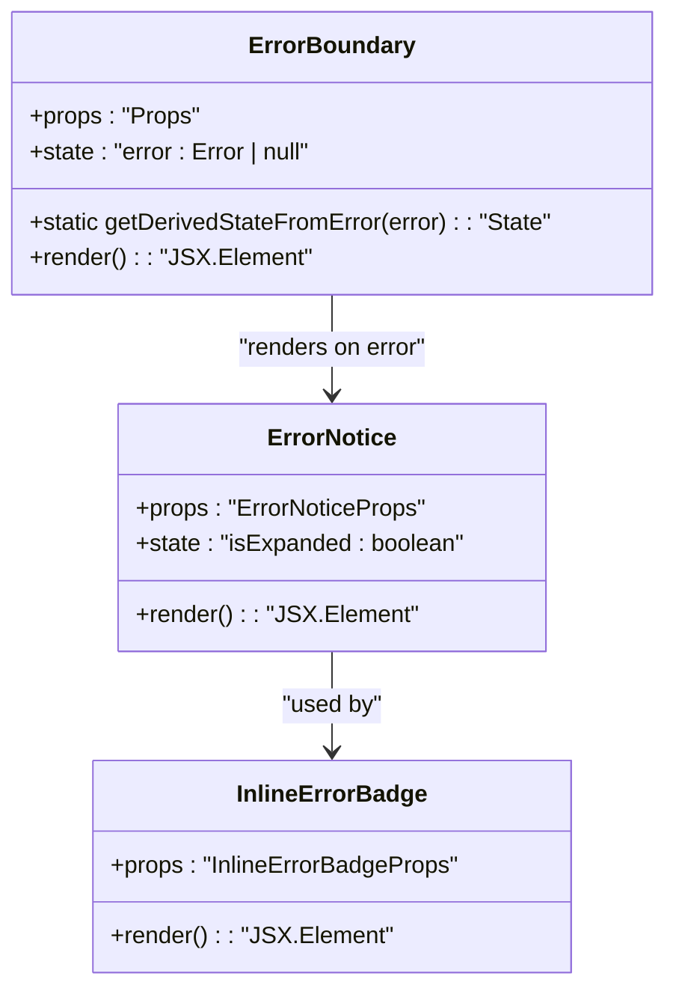
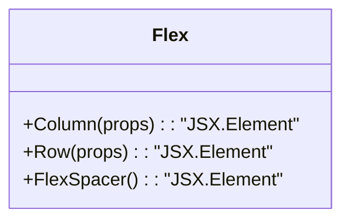
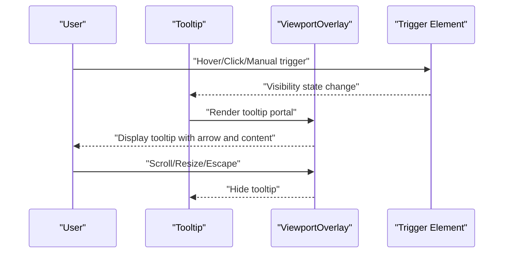
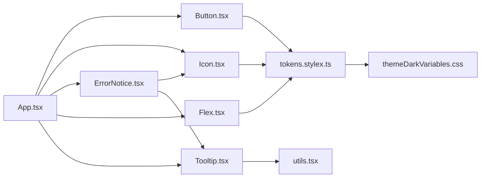

# Component Overview

<cite>
**Referenced Files in This Document**
- [index.tsx](file://addons/isl/src/index.tsx)
- [App.tsx](file://addons/isl/src/App.tsx)
- [Button.tsx](file://addons/components/Button.tsx)
- [Icon.tsx](file://addons/components/Icon.tsx)
- [ErrorNotice.tsx](file://addons/components/ErrorNotice.tsx)
- [Flex.tsx](file://addons/components/Flex.tsx)
- [Tooltip.tsx](file://addons/components/Tooltip.tsx)
- [tokens.stylex.ts](file://addons/components/theme/tokens.stylex.ts)
- [themeDarkVariables.css](file://addons/components/theme/themeDarkVariables.css)
- [utils.tsx](file://addons/components/utils.tsx)
- [Types.ts](file://addons/components/Types.ts)
- [README.md](file://addons/components/README.md)
- [basic.test.tsx](file://addons/components/__tests__/basic.test.tsx)
</cite>

## Table of Contents
1. [Introduction](#introduction)
2. [Project Structure](#project-structure)
3. [Core Components](#core-components)
4. [Architecture Overview](#architecture-overview)
5. [Detailed Component Analysis](#detailed-component-analysis)
6. [Dependency Analysis](#dependency-analysis)
7. [Performance Considerations](#performance-considerations)
8. [Testing Strategies](#testing-strategies)
9. [Accessibility Requirements](#accessibility-requirements)
10. [Integration Guidelines](#integration-guidelines)
11. [Conclusion](#conclusion)

## Introduction
This document provides a comprehensive overview of the ISL UI component architecture, focusing on design principles, organizational structure, component lifecycle, prop interfaces, state management patterns, composition guidelines, testing strategies, accessibility, and performance. It synthesizes the ISL application shell and the shared component library to explain how reusable UI elements are built, themed, and integrated into the broader ISL application.

## Project Structure
The ISL UI is composed of:
- An application shell that orchestrates rendering modes and providers.
- A shared component library that supplies foundational UI primitives and utilities.
- Theming and layout tokens that standardize visual behavior across environments.

**Diagram sources**
- [index.tsx:16-18](file://addons/isl/src/index.tsx#L16-L18)
- [App.tsx:10-37](file://addons/isl/src/App.tsx#L10-L37)
- [Button.tsx:12-16](file://addons/components/Button.tsx#L12-L16)
- [Icon.tsx:8-9](file://addons/components/Icon.tsx#L8-L9)
- [ErrorNotice.tsx:10-15](file://addons/components/ErrorNotice.tsx#L10-L15)
- [Flex.tsx:10-11](file://addons/components/Flex.tsx#L10-L11)
- [Tooltip.tsx:11-14](file://addons/components/Tooltip.tsx#L11-L14)
- [tokens.stylex.ts:14-52](file://addons/components/theme/tokens.stylex.ts#L14-L52)
- [themeDarkVariables.css:8-52](file://addons/components/theme/themeDarkVariables.css#L8-L52)

**Section sources**
- [index.tsx:1-19](file://addons/isl/src/index.tsx#L1-L19)
- [App.tsx:1-72](file://addons/isl/src/App.tsx#L1-L72)
- [README.md:1-55](file://addons/components/README.md#L1-L55)

## Core Components
This section outlines the principal UI building blocks and their roles:
- Button: A styled, accessible button supporting primary and icon variants with theme-aware tokens.
- Icon: A thin wrapper around codicon classes for scalable, colorized icons.
- ErrorNotice: A collapsible error display with optional tooltip-backed inline variant and an ErrorBoundary for graceful degradation.
- Flex: A set of flex utilities to simplify layout composition.
- Tooltip: A robust overlay component with hover/click/manual triggers, placement calculation, viewport-aware positioning, and interactivity.

Key characteristics:
- Prop interfaces are explicit and validated via TypeScript types.
- StyleX tokens centralize theme variables for consistent visuals.
- Utilities provide cross-cutting concerns like class merging and DOM traversal.

**Section sources**
- [Button.tsx:88-157](file://addons/components/Button.tsx#L88-L157)
- [Icon.tsx:11-34](file://addons/components/Icon.tsx#L11-L34)
- [ErrorNotice.tsx:17-121](file://addons/components/ErrorNotice.tsx#L17-L121)
- [Flex.tsx:58-89](file://addons/components/Flex.tsx#L58-L89)
- [Tooltip.tsx:123-313](file://addons/components/Tooltip.tsx#L123-L313)
- [tokens.stylex.ts:14-119](file://addons/components/theme/tokens.stylex.ts#L14-L119)

## Architecture Overview
The ISL application initializes the React root and renders the App, which selects between an interactive mode and a comparison-only mode. Providers supply theme and overlay contexts. Components are composed to form the main content area, drawers, and error/empty states.

**Diagram sources**
- [index.tsx:16-18](file://addons/isl/src/index.tsx#L16-L18)
- [App.tsx:60-72](file://addons/isl/src/App.tsx#L60-L72)

**Section sources**
- [index.tsx:16-18](file://addons/isl/src/index.tsx#L16-L18)
- [App.tsx:50-72](file://addons/isl/src/App.tsx#L50-L72)

## Detailed Component Analysis

### Button Component
Purpose:
- Provide a unified, theme-aware button with primary and icon variants.
- Enforce accessibility via focus styles and disabled handling.

Design patterns:
- StyleX-based style composition with theme tokens.
- Forwarded refs for imperative DOM access.
- Exclusive-or prop typing to enforce mutually exclusive kinds.

Lifecycle and state:
- Stateless functional component with controlled props.
- Uses stylex props to merge tokens and custom overrides.

Composition:
- Intended to be used within Flex layouts and grouped with ButtonGroup.

**Diagram sources**
- [Button.tsx:88-157](file://addons/components/Button.tsx#L88-L157)
- [types.stylex.ts:14-52](file://addons/components/theme/tokens.stylex.ts#L14-L52)

**Section sources**
- [Button.tsx:88-157](file://addons/components/Button.tsx#L88-L157)
- [utils.tsx:17-23](file://addons/components/utils.tsx#L17-L23)
- [Types.ts:44-46](file://addons/components/Types.ts#L44-L46)

### Icon Component
Purpose:
- Render scalable, colorized icons using codicon classes.

Design patterns:
- Minimal wrapper around a div with computed class names.
- Supports size and color variants.

Composition:
- Used within Button, Tooltip, and other components to convey meaning succinctly.

**Diagram sources**
- [Icon.tsx:11-34](file://addons/components/Icon.tsx#L11-L34)

**Section sources**
- [Icon.tsx:11-34](file://addons/components/Icon.tsx#L11-L34)

### ErrorNotice and ErrorBoundary
Purpose:
- Display structured error messages with expandable details and optional buttons.
- Provide an ErrorBoundary to catch and present errors gracefully.

Design patterns:
- Controlled expand/collapse state.
- Optional tooltip-backed inline badge for compact error presentation.

**Diagram sources**
- [ErrorNotice.tsx:17-121](file://addons/components/ErrorNotice.tsx#L17-L121)

**Section sources**
- [ErrorNotice.tsx:17-121](file://addons/components/ErrorNotice.tsx#L17-L121)

### Flex Layout Utilities
Purpose:
- Simplify common flex layouts (row/column) and alignment.

Design patterns:
- StyleX-based styles with spacing tokens.
- Utility functions for alignment and spacing.

**Diagram sources**
- [Flex.tsx:58-89](file://addons/components/Flex.tsx#L58-L89)

**Section sources**
- [Flex.tsx:58-89](file://addons/components/Flex.tsx#L58-L89)
- [tokens.stylex.ts:94-118](file://addons/components/theme/tokens.stylex.ts#L94-L118)

### Tooltip Component
Purpose:
- Provide contextual information overlays with multiple triggers and placements.

Design patterns:
- Overlay rendering via a viewport overlay root.
- Automatic placement and viewport adjustment.
- Grouping and event-driven toggling.

**Diagram sources**
- [Tooltip.tsx:123-313](file://addons/components/Tooltip.tsx#L123-L313)

**Section sources**
- [Tooltip.tsx:123-313](file://addons/components/Tooltip.tsx#L123-L313)
- [utils.tsx:25-38](file://addons/components/utils.tsx#L25-L38)

## Dependency Analysis
The component library relies on StyleX for styling and VS Code codicons for icons. Theming is centralized in tokens and CSS variables. The application composes components and manages state via Jotai atoms and React hooks.

**Diagram sources**
- [App.tsx:10-37](file://addons/isl/src/App.tsx#L10-L37)
- [Button.tsx:12-16](file://addons/components/Button.tsx#L12-L16)
- [Icon.tsx:8-9](file://addons/components/Icon.tsx#L8-L9)
- [ErrorNotice.tsx:10-15](file://addons/components/ErrorNotice.tsx#L10-L15)
- [Flex.tsx:10-11](file://addons/components/Flex.tsx#L10-L11)
- [Tooltip.tsx:11-14](file://addons/components/Tooltip.tsx#L11-L14)
- [tokens.stylex.ts:14-52](file://addons/components/theme/tokens.stylex.ts#L14-L52)
- [themeDarkVariables.css:8-52](file://addons/components/theme/themeDarkVariables.css#L8-L52)
- [utils.tsx:8-10](file://addons/components/utils.tsx#L8-L10)

**Section sources**
- [App.tsx:10-37](file://addons/isl/src/App.tsx#L10-L37)
- [Button.tsx:12-16](file://addons/components/Button.tsx#L12-L16)
- [Icon.tsx:8-9](file://addons/components/Icon.tsx#L8-L9)
- [ErrorNotice.tsx:10-15](file://addons/components/ErrorNotice.tsx#L10-L15)
- [Flex.tsx:10-11](file://addons/components/Flex.tsx#L10-L11)
- [Tooltip.tsx:11-14](file://addons/components/Tooltip.tsx#L11-L14)
- [tokens.stylex.ts:14-52](file://addons/components/theme/tokens.stylex.ts#L14-L52)
- [themeDarkVariables.css:8-52](file://addons/components/theme/themeDarkVariables.css#L8-L52)
- [utils.tsx:8-10](file://addons/components/utils.tsx#L8-L10)

## Performance Considerations
- Prefer lightweight wrappers and avoid unnecessary re-renders by keeping components stateless where possible.
- Use StyleX for efficient CSS generation and to minimize runtime style computation.
- Defer heavy work to effects and memoization; leverage throttled effects for analytics and diagnostics.
- Keep overlays and tooltips declarative; avoid excessive reflows by relying on measured dimensions and viewport adjustments.
- Use CSS variables for theme switching to reduce style recalculation overhead.

[No sources needed since this section provides general guidance]

## Testing Strategies
- Unit tests validate rendering and basic interactions using React Testing Library.
- The component explorer demonstrates live component usage and can be used for manual verification.
- Tests should assert presence of key elements and basic behavior (e.g., button text, explorer visibility).

Recommended practices:
- Wrap tests with theme roots to validate themed rendering.
- Test component variants (primary/icon) and state transitions (expanded/collapsed).
- Verify overlay behavior indirectly by asserting DOM structure and attributes.

**Section sources**
- [basic.test.tsx:13-27](file://addons/components/__tests__/basic.test.tsx#L13-L27)
- [README.md:12-14](file://addons/components/README.md#L12-L14)

## Accessibility Requirements
- Buttons must expose focus styles and keyboard operability; disabled states should prevent interaction.
- Tooltips must include accessible roles and handle Escape key dismissal.
- Icons should be accompanied by meaningful text or aria-labels when used alone.
- Color contrast must meet theme-defined thresholds; rely on theme tokens for compliant defaults.

**Section sources**
- [Button.tsx:140-151](file://addons/components/Button.tsx#L140-L151)
- [Tooltip.tsx:403-410](file://addons/components/Tooltip.tsx#L403-L410)
- [tokens.stylex.ts:14-52](file://addons/components/theme/tokens.stylex.ts#L14-L52)

## Integration Guidelines
- Import theme variables and overlay roots at the application boundary to ensure consistent styling and overlay rendering.
- Compose components using Flex utilities for predictable layouts.
- Use ErrorNotice and ErrorBoundary to surface actionable diagnostics and degrade gracefully.
- Leverage Tooltip for contextual help and inline error badges for compact feedback.
- Keep prop interfaces explicit and reuse shared types to maintain consistency.

**Section sources**
- [index.tsx:12-14](file://addons/isl/src/index.tsx#L12-L14)
- [App.tsx:60-72](file://addons/isl/src/App.tsx#L60-L72)
- [README.md:51-54](file://addons/components/README.md#L51-L54)

## Conclusion
The ISL UI component architecture emphasizes composability, theme consistency, and robustness. Components are designed with clear prop interfaces, centralized theming via StyleX tokens, and resilient overlays. By following the composition and integration guidelines, developers can build accessible, performant, and maintainable UI surfaces that align with the ISL application’s design system.