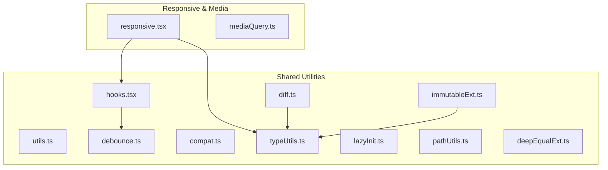
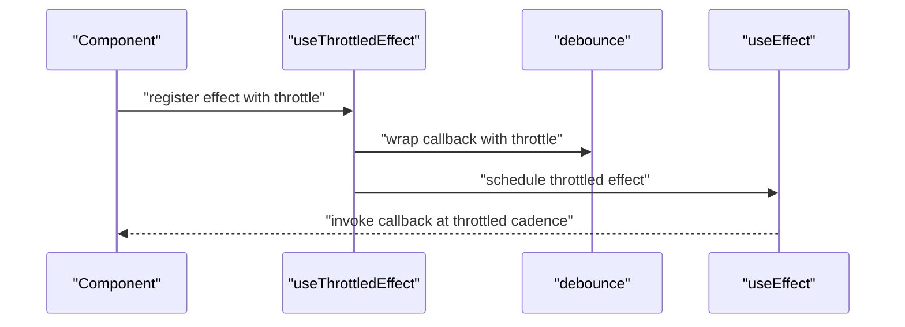
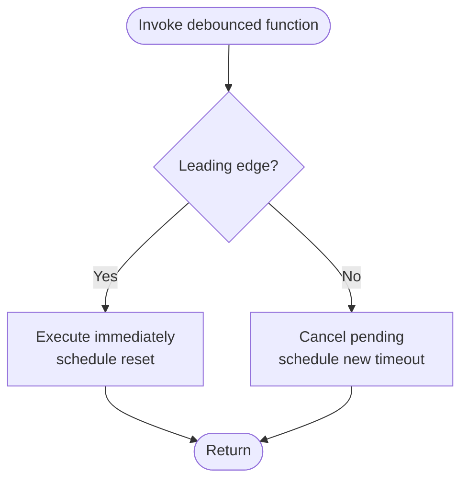
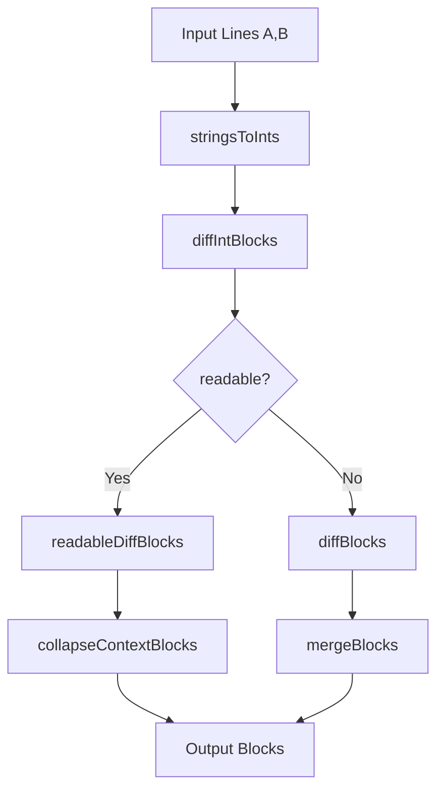
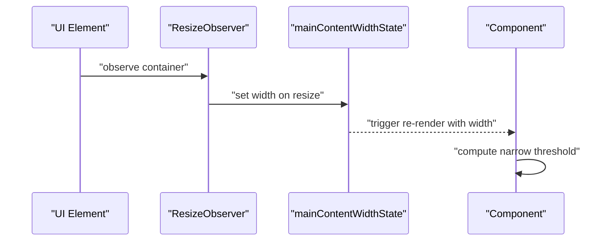
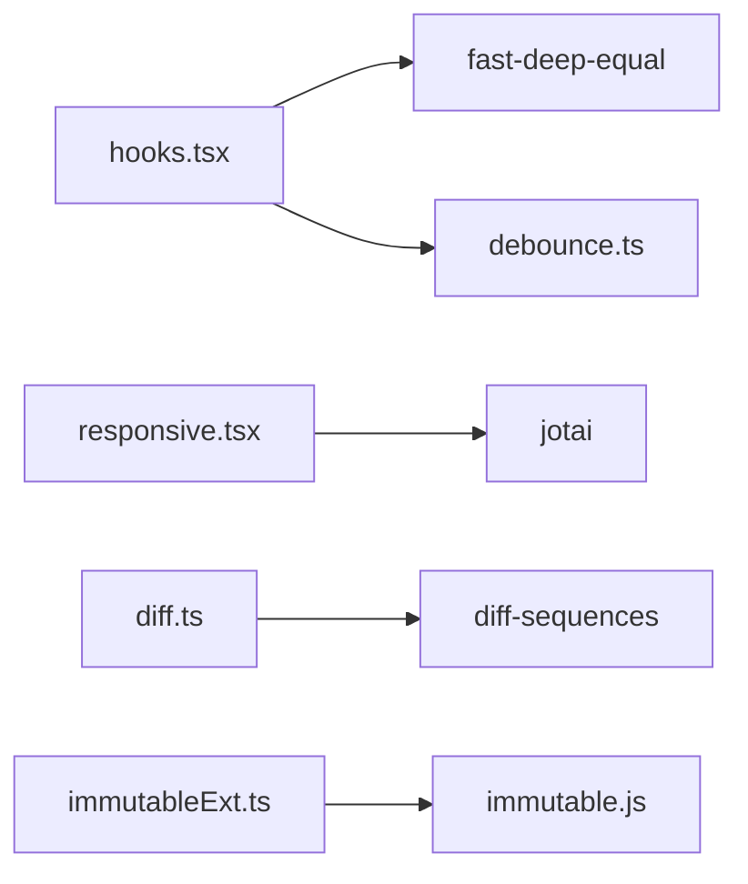

# Shared Utilities

<cite>
**Referenced Files in This Document**
- [utils.ts](file://addons/shared/utils.ts)
- [hooks.tsx](file://addons/shared/hooks.tsx)
- [debounce.ts](file://addons/shared/debounce.ts)
- [compat.ts](file://addons/shared/compat.ts)
- [typeUtils.ts](file://addons/shared/typeUtils.ts)
- [lazyInit.ts](file://addons/shared/lazyInit.ts)
- [immutableExt.ts](file://addons/shared/immutableExt.ts)
- [pathUtils.ts](file://addons/shared/pathUtils.ts)
- [diff.ts](file://addons/shared/diff.ts)
- [deepEqualExt.ts](file://addons/shared/deepEqualExt.ts)
- [responsive.tsx](file://addons/isl/src/responsive.tsx)
- [mediaQuery.ts](file://addons/isl/src/mediaQuery.ts)
</cite>

## Table of Contents
1. [Introduction](#introduction)
2. [Project Structure](#project-structure)
3. [Core Components](#core-components)
4. [Architecture Overview](#architecture-overview)
5. [Detailed Component Analysis](#detailed-component-analysis)
6. [Dependency Analysis](#dependency-analysis)
7. [Performance Considerations](#performance-considerations)
8. [Troubleshooting Guide](#troubleshooting-guide)
9. [Conclusion](#conclusion)
10. [Appendices](#appendices)

## Introduction
This document describes the shared utilities and helper functions used across the component library. It focuses on:
- Data manipulation helpers for arrays, objects, strings, and iterables
- DOM and layout helpers for responsive behavior and accessibility
- Component state and lifecycle helpers for React and Jotai
- Cross-platform compatibility helpers
- Custom hooks for performance-sensitive effects and memoization
- Examples of usage patterns, performance optimizations, and best practices for extending the utility library

## Project Structure
The shared utilities are organized primarily under addons/shared with additional responsive and media-query helpers under addons/isl/src. The key modules include:
- Data manipulation and iteration helpers
- React hooks for effects, memoization, refs, and previous values
- Debounce and throttling utilities
- Cross-platform compatibility helpers
- Type-level utilities for TypeScript
- Lazy initialization for async resources
- Immutable wrapper for self-updating records
- Path utilities for Node environments
- Diffing utilities for line-based content
- Deep equality and object reuse helpers

**Diagram sources**
- [utils.ts:1-208](file://addons/shared/utils.ts#L1-L208)
- [hooks.tsx:1-87](file://addons/shared/hooks.tsx#L1-L87)
- [debounce.ts:1-98](file://addons/shared/debounce.ts#L1-L98)
- [compat.ts:1-23](file://addons/shared/compat.ts#L1-L23)
- [typeUtils.ts:1-66](file://addons/shared/typeUtils.ts#L1-L66)
- [lazyInit.ts:1-37](file://addons/shared/lazyInit.ts#L1-L37)
- [immutableExt.ts:1-56](file://addons/shared/immutableExt.ts#L1-L56)
- [pathUtils.ts:1-29](file://addons/shared/pathUtils.ts#L1-L29)
- [diff.ts:1-403](file://addons/shared/diff.ts#L1-L403)
- [deepEqualExt.ts:1-23](file://addons/shared/deepEqualExt.ts#L1-L23)
- [responsive.tsx:1-70](file://addons/isl/src/responsive.tsx#L1-L70)
- [mediaQuery.ts:1-24](file://addons/isl/src/mediaQuery.ts#L1-L24)

**Section sources**
- [utils.ts:1-208](file://addons/shared/utils.ts#L1-L208)
- [hooks.tsx:1-87](file://addons/shared/hooks.tsx#L1-L87)
- [debounce.ts:1-98](file://addons/shared/debounce.ts#L1-L98)
- [compat.ts:1-23](file://addons/shared/compat.ts#L1-L23)
- [typeUtils.ts:1-66](file://addons/shared/typeUtils.ts#L1-L66)
- [lazyInit.ts:1-37](file://addons/shared/lazyInit.ts#L1-L37)
- [immutableExt.ts:1-56](file://addons/shared/immutableExt.ts#L1-L56)
- [pathUtils.ts:1-29](file://addons/shared/pathUtils.ts#L1-L29)
- [diff.ts:1-403](file://addons/shared/diff.ts#L1-L403)
- [deepEqualExt.ts:1-23](file://addons/shared/deepEqualExt.ts#L1-L23)
- [responsive.tsx:1-70](file://addons/isl/src/responsive.tsx#L1-L70)
- [mediaQuery.ts:1-24](file://addons/isl/src/mediaQuery.ts#L1-L24)

## Core Components
This section summarizes the primary categories of utilities and their responsibilities.

- Data manipulation and iteration
  - Filtering, partitioning, grouping, zipping, mapping, deduplication
  - String helpers (basename, firstLine, truncate, splitOnce)
  - Object mapping and JSON parsing helpers
  - Promise detection and deferred wrappers
- React hooks
  - Throttled effects, deep memoization, autofocus ref, previous value tracking
- Debounce and rate limiting
  - Configurable leading/trailing behavior, reset, dispose, pending state
- Cross-platform compatibility
  - AbortController polyfill for older Node versions
- Type-level utilities
  - ExclusiveOr, Without, AllUndefined, Writable, StrictUnion, UnionOmit
- Lazy initialization
  - Async initializer pattern with idempotent caching
- Immutable record wrapper
  - Self-update behavior with equality semantics
- Path utilities
  - Normalize path separators for Node environments
- Diffing utilities
  - Line diff, readable diff blocks, context collapsing, block merging
- Deep equality and reuse
  - Object reuse based on key and deep equality

**Section sources**
- [utils.ts:1-208](file://addons/shared/utils.ts#L1-L208)
- [hooks.tsx:1-87](file://addons/shared/hooks.tsx#L1-L87)
- [debounce.ts:1-98](file://addons/shared/debounce.ts#L1-L98)
- [compat.ts:1-23](file://addons/shared/compat.ts#L1-L23)
- [typeUtils.ts:1-66](file://addons/shared/typeUtils.ts#L1-L66)
- [lazyInit.ts:1-37](file://addons/shared/lazyInit.ts#L1-L37)
- [immutableExt.ts:1-56](file://addons/shared/immutableExt.ts#L1-L56)
- [pathUtils.ts:1-29](file://addons/shared/pathUtils.ts#L1-L29)
- [diff.ts:1-403](file://addons/shared/diff.ts#L1-L403)
- [deepEqualExt.ts:1-23](file://addons/shared/deepEqualExt.ts#L1-L23)

## Architecture Overview
The utilities are designed to be:
- Pure and composable
- Cross-platform compatible (Node and browser)
- Lightweight and dependency-minimized
- Strongly typed with TypeScript helpers

```mermaid
graph TB
A["Debounce<br/>debounce.ts"] --> B["Hooks<br/>hooks.tsx"]
B --> C["Throttled Effects<br/>useThrottledEffect"]
B --> D["Deep Memo<br/>useDeepMemo"]
B --> E["Autofocus Ref<br/>useAutofocusRef"]
B --> F["Previous Value<br/>usePrevious"]
G["Utilities<br/>utils.ts"] --> H["Data Helpers<br/>mapObject, partition, group, zip"]
G --> I["String Helpers<br/>basename, firstLine, truncate, splitOnce"]
G --> J["Iterators<br/>mapIterable, generatorContains"]
G --> K["Promises & Deferreds<br/>isPromise, defer"]
L["Compatibility<br/>compat.ts"] --> M["AbortController Polyfill<br/>newAbortController"]
N["Type Utils<br/>typeUtils.ts"] --> O["Strict Types<br/>ExclusiveOr, StrictUnion, Writable"]
P["Lazy Init<br/>lazyInit.ts"] --> Q["Async Resource Caching"]
R["Immutable Ext<br/>immutableExt.ts"] --> S["SelfUpdate Wrapper"]
T["Path Utils<br/>pathUtils.ts"] --> U["Node Path Normalization"]
V["Diff<br/>diff.ts"] --> W["Line Diff & Blocks"]
V --> X["Readable Diff & Collapse"]
V --> Y["Merge Blocks"]
Z["Deep Equal Ext<br/>deepEqualExt.ts"] --> AA["Reuse Equal Objects"]
```

**Diagram sources**
- [debounce.ts:1-98](file://addons/shared/debounce.ts#L1-L98)
- [hooks.tsx:1-87](file://addons/shared/hooks.tsx#L1-L87)
- [utils.ts:1-208](file://addons/shared/utils.ts#L1-L208)
- [compat.ts:1-23](file://addons/shared/compat.ts#L1-L23)
- [typeUtils.ts:1-66](file://addons/shared/typeUtils.ts#L1-L66)
- [lazyInit.ts:1-37](file://addons/shared/lazyInit.ts#L1-L37)
- [immutableExt.ts:1-56](file://addons/shared/immutableExt.ts#L1-L56)
- [pathUtils.ts:1-29](file://addons/shared/pathUtils.ts#L1-L29)
- [diff.ts:1-403](file://addons/shared/diff.ts#L1-L403)
- [deepEqualExt.ts:1-23](file://addons/shared/deepEqualExt.ts#L1-L23)

## Detailed Component Analysis

### Data Manipulation and Iteration Utilities
- Functions for transforming and filtering collections
  - mapObject: transforms key-value pairs into a new object
  - partition: splits arrays into two groups based on a predicate
  - group: buckets array items by a key function
  - zip: merges two iterables into pairs
  - mapIterable: lazy map over any iterable
  - generatorContains: checks if a generator yields a value (by equality or predicate)
  - dedup: removes duplicates from arrays
- String helpers
  - basename: extracts the last segment after a delimiter
  - firstLine: returns the first line of a multi-line string
  - truncate: shortens long strings with an ellipsis
  - splitOnce: splits a string at the first occurrence of a separator
- Object and JSON helpers
  - notEmpty: type guard for non-nullish values
  - nullthrows: throws if value is nullish
  - tryJsonParse: safely parses JSON with fallback
- Promise and deferred helpers
  - isPromise: detects Promise-like values
  - defer: returns a Deferred object with access to resolve/reject outside the executor

Usage examples (paths only):
- [mapObject usage:91-96](file://addons/shared/utils.ts#L91-L96)
- [partition usage:152-158](file://addons/shared/utils.ts#L152-L158)
- [group usage:164-176](file://addons/shared/utils.ts#L164-L176)
- [zip usage:118-129](file://addons/shared/utils.ts#L118-L129)
- [mapIterable usage:194-198](file://addons/shared/utils.ts#L194-L198)
- [generatorContains usage:102-113](file://addons/shared/utils.ts#L102-L113)
- [dedup usage:205-207](file://addons/shared/utils.ts#L205-L207)
- [basename usage:65-71](file://addons/shared/utils.ts#L65-L71)
- [firstLine usage:77-79](file://addons/shared/utils.ts#L77-L79)
- [truncate usage:132-134](file://addons/shared/utils.ts#L132-L134)
- [splitOnce usage:182-188](file://addons/shared/utils.ts#L182-L188)
- [notEmpty usage:10-12](file://addons/shared/utils.ts#L10-L12)
- [nullthrows usage:17-22](file://addons/shared/utils.ts#L17-L22)
- [tryJsonParse usage:140-146](file://addons/shared/utils.ts#L140-L146)
- [isPromise usage:136-138](file://addons/shared/utils.ts#L136-L138)
- [defer usage:41-52](file://addons/shared/utils.ts#L41-L52)

**Section sources**
- [utils.ts:1-208](file://addons/shared/utils.ts#L1-L208)

### React Hooks
- useThrottledEffect: runs an effect with throttling to avoid overfiring during render
- useDeepMemo: deep-equality memoization of computed values
- useAutofocusRef: returns a ref that focuses the element on mount
- usePrevious: tracks the previous value with optional equality comparator

**Diagram sources**
- [hooks.tsx:24-38](file://addons/shared/hooks.tsx#L24-L38)
- [debounce.ts:41-97](file://addons/shared/debounce.ts#L41-L97)

**Section sources**
- [hooks.tsx:1-87](file://addons/shared/hooks.tsx#L1-L87)
- [debounce.ts:1-98](file://addons/shared/debounce.ts#L1-L98)

### Debounce and Rate Limiting
- DebouncedFunction interface exposes reset, isPending, and dispose
- Leading-edge and trailing-edge modes supported
- Reset cancels pending invocations; dispose cleans up timers

**Diagram sources**
- [debounce.ts:41-97](file://addons/shared/debounce.ts#L41-L97)

**Section sources**
- [debounce.ts:1-98](file://addons/shared/debounce.ts#L1-L98)

### Cross-Platform Compatibility
- newAbortController: returns a modern AbortController when available, otherwise a Node polyfill

**Section sources**
- [compat.ts:1-23](file://addons/shared/compat.ts#L1-L23)

### Type-Level Utilities
- ExclusiveOr, Without, AllUndefined, Writable, StrictUnion, UnionOmit
- Json type alias for literal JSON-compatible structures

**Section sources**
- [typeUtils.ts:1-66](file://addons/shared/typeUtils.ts#L1-L66)

### Lazy Initialization
- lazyInit: wraps an async initializer to execute once and cache the Promise

**Section sources**
- [lazyInit.ts:1-37](file://addons/shared/lazyInit.ts#L1-L37)

### Immutable Record Wrapper
- SelfUpdate<T extends ValueObject>: self-updates inner record on equality and avoids deep-freezing by tricking Recoil

**Section sources**
- [immutableExt.ts:1-56](file://addons/shared/immutableExt.ts#L1-L56)

### Path Utilities
- ensureTrailingPathSep/removeLeadingPathSep: normalize path separators for Node environments

**Section sources**
- [pathUtils.ts:1-29](file://addons/shared/pathUtils.ts#L1-L29)

### Diffing Utilities
- diffLines: returns differing line ranges
- diffBlocks/readableDiffBlocks: compute block-level diffs with optional readability improvements
- collapseContextBlocks: collapses unchanged context around diffs
- mergeBlocks: combine diffs relative to a common base
- splitLines: splits text into lines preserving newline endings
- stringsToInts: maps lines to integers for efficient comparison

**Diagram sources**
- [diff.ts:49-244](file://addons/shared/diff.ts#L49-L244)

**Section sources**
- [diff.ts:1-403](file://addons/shared/diff.ts#L1-L403)

### Deep Equality and Object Reuse
- reuseEqualObjects: reuses objects from an old array when keys and deep equality match

**Section sources**
- [deepEqualExt.ts:1-23](file://addons/shared/deepEqualExt.ts#L1-L23)

### Responsive Utilities and Media Queries
- Zoom and compact rendering state atoms with shortcuts
- Main content width observation via ResizeObserver
- Narrow commit tree thresholds based on compact mode
- Reduced motion preference detection via matchMedia

**Diagram sources**
- [responsive.tsx:41-60](file://addons/isl/src/responsive.tsx#L41-L60)

**Section sources**
- [responsive.tsx:1-70](file://addons/isl/src/responsive.tsx#L1-L70)
- [mediaQuery.ts:1-24](file://addons/isl/src/mediaQuery.ts#L1-L24)

## Dependency Analysis
- Internal dependencies
  - hooks.tsx depends on debounce.ts and fast-deep-equal
  - responsive.tsx depends on jotai and local storage-backed atoms
  - diff.ts depends on diff-sequences
  - immutableExt.ts depends on immutable ValueObject
- External dependencies
  - fast-deep-equal, diff-sequences, immutable.js, jotai

**Diagram sources**
- [hooks.tsx:8-10](file://addons/shared/hooks.tsx#L8-L10)
- [debounce.ts:1-98](file://addons/shared/debounce.ts#L1-L98)
- [responsive.tsx:8-17](file://addons/isl/src/responsive.tsx#L8-L17)
- [diff.ts:33-33](file://addons/shared/diff.ts#L33-L33)
- [immutableExt.ts:8-8](file://addons/shared/immutableExt.ts#L8-L8)

**Section sources**
- [hooks.tsx:1-87](file://addons/shared/hooks.tsx#L1-L87)
- [debounce.ts:1-98](file://addons/shared/debounce.ts#L1-L98)
- [responsive.tsx:1-70](file://addons/isl/src/responsive.tsx#L1-L70)
- [diff.ts:1-403](file://addons/shared/diff.ts#L1-L403)
- [immutableExt.ts:1-56](file://addons/shared/immutableExt.ts#L1-L56)

## Performance Considerations
- Prefer lazyInit for expensive async resources to avoid redundant work
- Use useDeepMemo for heavy computations with complex dependency objects
- Use zip/mapIterable/generatorContains for memory-efficient iteration over large datasets
- Use debounce for frequent UI events (e.g., resize, scroll) to limit handler frequency
- Use partition/group to separate concerns early and reduce downstream branching
- Use reuseEqualObjects to preserve object identity when keys and deep equality match, reducing re-renders
- Use readableDiffBlocks for improved readability when significant lines dominate diffs
- Use collapseContextBlocks to minimize DOM updates by collapsing unchanged regions

[No sources needed since this section provides general guidance]

## Troubleshooting Guide
- useThrottledEffect double-firing in development
  - Expected behavior in strict/dev mode; do not use throttling to bypass this
  - Reserve for best-effort side-effects (logging, analytics)
- Debounce reset/dispose
  - Call reset to cancel pending invocations; call dispose to clean up timers
- SelfUpdate equality semantics
  - SelfUpdate updates inner reference on equality; ensure consumers rely on referential transparency
- Reduced motion support
  - prefersReducedMotion returns a cached value; ensure matchMedia is available in the environment

**Section sources**
- [hooks.tsx:12-38](file://addons/shared/hooks.tsx#L12-L38)
- [debounce.ts:81-96](file://addons/shared/debounce.ts#L81-L96)
- [immutableExt.ts:41-54](file://addons/shared/immutableExt.ts#L41-L54)
- [mediaQuery.ts:10-23](file://addons/isl/src/mediaQuery.ts#L10-L23)

## Conclusion
The shared utilities provide a robust foundation for data manipulation, React state and lifecycle management, responsive behavior, and cross-platform compatibility. By leveraging typed helpers, lazy initialization, and performance-conscious patterns, developers can build scalable and maintainable components with predictable behavior across environments.

[No sources needed since this section summarizes without analyzing specific files]

## Appendices

### Best Practices for Extending the Utility Library
- Keep functions pure and side-effect-free when possible
- Add TypeScript types for inputs and outputs
- Provide clear defaults and guard against nullish inputs
- Prefer lazy evaluation for heavy operations (e.g., iterators, debouncing)
- Use defensive guards (notEmpty/nullthrows) to fail fast
- Export only what is necessary; keep internal helpers private
- Document behavior and trade-offs (e.g., readableDiffBlocks vs diffBlocks)

[No sources needed since this section provides general guidance]