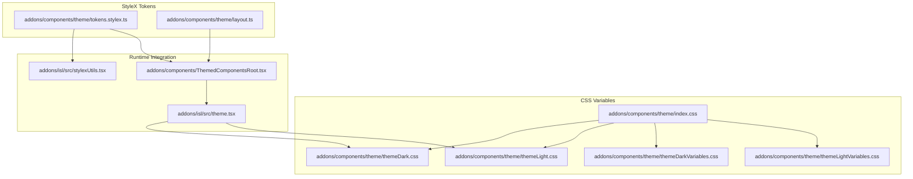
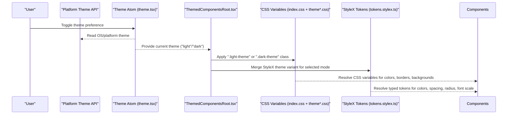
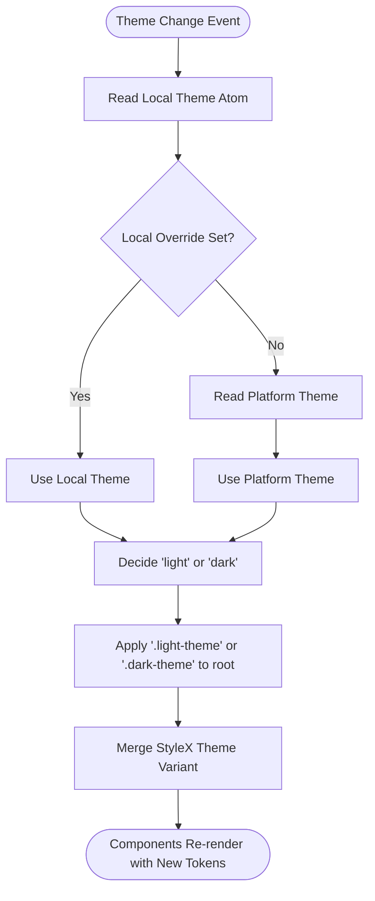
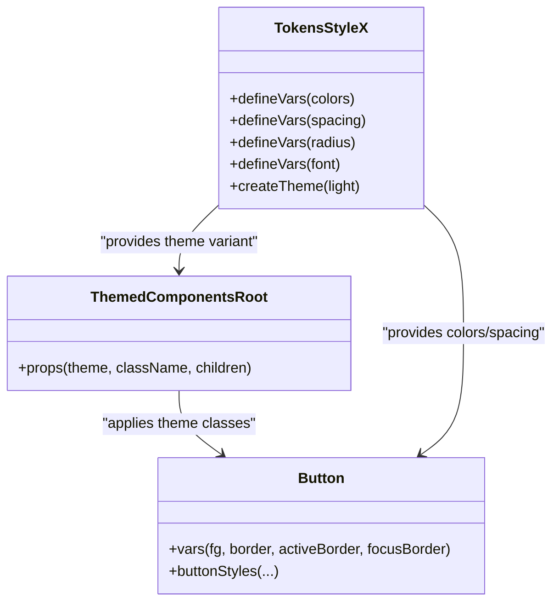
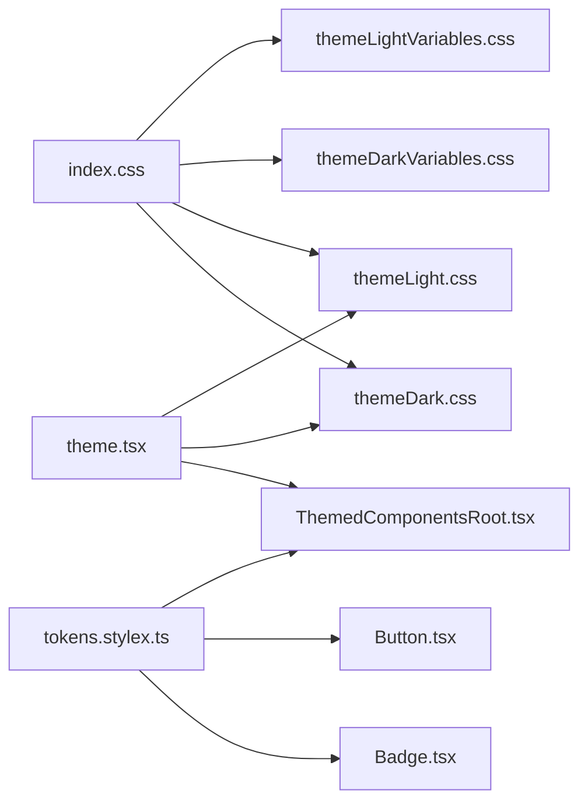

# Theming System

<cite>
**Referenced Files in This Document**
- [index.css](file://addons/components/theme/index.css)
- [themeLight.css](file://addons/components/theme/themeLight.css)
- [themeDark.css](file://addons/components/theme/themeDark.css)
- [themeLightVariables.css](file://addons/components/theme/themeLightVariables.css)
- [themeDarkVariables.css](file://addons/components/theme/themeDarkVariables.css)
- [tokens.stylex.ts](file://addons/components/theme/tokens.stylex.ts)
- [ThemedComponentsRoot.tsx](file://addons/components/ThemedComponentsRoot.tsx)
- [Button.tsx](file://addons/components/Button.tsx)
- [Badge.tsx](file://addons/components/Badge.tsx)
- [theme.tsx](file://addons/isl/src/theme.tsx)
- [stylexUtils.tsx](file://addons/isl/src/stylexUtils.tsx)
</cite>

## Table of Contents
1. [Introduction](#introduction)
2. [Project Structure](#project-structure)
3. [Core Components](#core-components)
4. [Architecture Overview](#architecture-overview)
5. [Detailed Component Analysis](#detailed-component-analysis)
6. [Dependency Analysis](#dependency-analysis)
7. [Performance Considerations](#performance-considerations)
8. [Troubleshooting Guide](#troubleshooting-guide)
9. [Conclusion](#conclusion)
10. [Appendices](#appendices)

## Introduction
This document explains the ISL theming system used across the component library. It covers the CSS variable architecture, dark/light mode implementation, and the StyleX-based theme token system. You will learn how to create custom themes, modify existing ones, and maintain design consistency across components. It also includes guidance on responsive design tokens, cross-platform styling considerations, and how StyleX integrates with CSS-in-JS patterns in the library.

## Project Structure
The theming system is organized around three pillars:
- CSS variable layers: base variables and theme-specific overrides
- StyleX token definitions: strongly-typed tokens for colors, spacing, radius, and font scales
- Root wrapper and runtime theme orchestration: applying themes to the app and switching modes

**Diagram sources**
- [index.css:1-45](file://addons/components/theme/index.css#L1-L45)
- [themeLightVariables.css:1-53](file://addons/components/theme/themeLightVariables.css#L1-L53)
- [themeDarkVariables.css:1-53](file://addons/components/theme/themeDarkVariables.css#L1-L53)
- [themeLight.css:1-78](file://addons/components/theme/themeLight.css#L1-L78)
- [themeDark.css:1-79](file://addons/components/theme/themeDark.css#L1-L79)
- [tokens.stylex.ts:1-119](file://addons/components/theme/tokens.stylex.ts#L1-L119)
- [ThemedComponentsRoot.tsx:1-28](file://addons/components/ThemedComponentsRoot.tsx#L1-L28)
- [theme.tsx:1-60](file://addons/isl/src/theme.tsx#L1-L60)
- [stylexUtils.tsx:1-46](file://addons/isl/src/stylexUtils.tsx#L1-L46)

**Section sources**
- [index.css:1-45](file://addons/components/theme/index.css#L1-L45)
- [themeLightVariables.css:1-53](file://addons/components/theme/themeLightVariables.css#L1-L53)
- [themeDarkVariables.css:1-53](file://addons/components/theme/themeDarkVariables.css#L1-L53)
- [themeLight.css:1-78](file://addons/components/theme/themeLight.css#L1-L78)
- [themeDark.css:1-79](file://addons/components/theme/themeDark.css#L1-L79)
- [tokens.stylex.ts:1-119](file://addons/components/theme/tokens.stylex.ts#L1-L119)
- [ThemedComponentsRoot.tsx:1-28](file://addons/components/ThemedComponentsRoot.tsx#L1-L28)
- [theme.tsx:1-60](file://addons/isl/src/theme.tsx#L1-L60)
- [stylexUtils.tsx:1-46](file://addons/isl/src/stylexUtils.tsx#L1-L46)

## Core Components
- CSS variable foundation: a shared base layer sets global variables and typography, while theme-specific files override colors and component-level tokens.
- StyleX token system: define theme-safe variables and create theme variants for light/dark modes. Components consume these tokens via StyleX’s create and props APIs.
- Runtime theme orchestration: a theme state atom controls whether the app prefers light or dark mode, with platform detection and user overrides.

Key responsibilities:
- Base CSS variables and typography: [index.css:1-45](file://addons/components/theme/index.css#L1-L45)
- VS Code toolkit parity variables (light/dark): [themeLightVariables.css:1-53](file://addons/components/theme/themeLightVariables.css#L1-L53), [themeDarkVariables.css:1-53](file://addons/components/theme/themeDarkVariables.css#L1-L53)
- Theme-specific overrides (UI tokens): [themeLight.css:1-78](file://addons/components/theme/themeLight.css#L1-L78), [themeDark.css:1-79](file://addons/components/theme/themeDark.css#L1-L79)
- StyleX tokens and theme variants: [tokens.stylex.ts:1-119](file://addons/components/theme/tokens.stylex.ts#L1-L119)
- Root wrapper applying theme classes and StyleX theme: [ThemedComponentsRoot.tsx:1-28](file://addons/components/ThemedComponentsRoot.tsx#L1-L28)
- Theme state and platform integration: [theme.tsx:1-60](file://addons/isl/src/theme.tsx#L1-L60)

**Section sources**
- [index.css:1-45](file://addons/components/theme/index.css#L1-L45)
- [themeLightVariables.css:1-53](file://addons/components/theme/themeLightVariables.css#L1-L53)
- [themeDarkVariables.css:1-53](file://addons/components/theme/themeDarkVariables.css#L1-L53)
- [themeLight.css:1-78](file://addons/components/theme/themeLight.css#L1-L78)
- [themeDark.css:1-79](file://addons/components/theme/themeDark.css#L1-L79)
- [tokens.stylex.ts:1-119](file://addons/components/theme/tokens.stylex.ts#L1-L119)
- [ThemedComponentsRoot.tsx:1-28](file://addons/components/ThemedComponentsRoot.tsx#L1-L28)
- [theme.tsx:1-60](file://addons/isl/src/theme.tsx#L1-L60)

## Architecture Overview
The theming pipeline connects CSS variables, StyleX tokens, and runtime theme state:

**Diagram sources**
- [theme.tsx:1-60](file://addons/isl/src/theme.tsx#L1-L60)
- [ThemedComponentsRoot.tsx:1-28](file://addons/components/ThemedComponentsRoot.tsx#L1-L28)
- [index.css:1-45](file://addons/components/theme/index.css#L1-L45)
- [themeLight.css:1-78](file://addons/components/theme/themeLight.css#L1-L78)
- [themeDark.css:1-79](file://addons/components/theme/themeDark.css#L1-L79)
- [tokens.stylex.ts:1-119](file://addons/components/theme/tokens.stylex.ts#L1-L119)

## Detailed Component Analysis

### CSS Variable Architecture
- Base layer: [index.css:1-45](file://addons/components/theme/index.css#L1-L45) defines foundational variables (e.g., background, foreground, fonts, zoom, paddings) and applies them to the root selector.
- VS Code toolkit parity: [themeLightVariables.css:1-53](file://addons/components/theme/themeLightVariables.css#L1-L53) and [themeDarkVariables.css:1-53](file://addons/components/theme/themeDarkVariables.css#L1-L53) mirror VS Code UI toolkit tokens for environments outside VS Code.
- Theme overrides: [themeLight.css:1-78](file://addons/components/theme/themeLight.css#L1-L78) and [themeDark.css:1-79](file://addons/components/theme/themeDark.css#L1-L79) set semantic tokens (e.g., SCM, tooltips, banners, signals) and editor-related variables.

How components consume CSS variables:
- Buttons and badges reference CSS variables directly for colors and borders, ensuring automatic adaptation to theme changes. See [Button.tsx:29-86](file://addons/components/Button.tsx#L29-L86) and [Badge.tsx:13-35](file://addons/components/Badge.tsx#L13-L35).

**Section sources**
- [index.css:1-45](file://addons/components/theme/index.css#L1-L45)
- [themeLightVariables.css:1-53](file://addons/components/theme/themeLightVariables.css#L1-L53)
- [themeDarkVariables.css:1-53](file://addons/components/theme/themeDarkVariables.css#L1-L53)
- [themeLight.css:1-78](file://addons/components/theme/themeLight.css#L1-L78)
- [themeDark.css:1-79](file://addons/components/theme/themeDark.css#L1-L79)
- [Button.tsx:29-86](file://addons/components/Button.tsx#L29-L86)
- [Badge.tsx:13-35](file://addons/components/Badge.tsx#L13-L35)

### Dark/Light Mode Implementation
- Runtime state: [theme.tsx:1-60](file://addons/isl/src/theme.tsx#L1-L60) manages a theme atom that resolves to either "light" or "dark", preferring user overrides, then platform theme, then defaults to "dark".
- DOM application: [ThemedComponentsRoot.tsx:1-28](file://addons/components/ThemedComponentsRoot.tsx#L1-L28) applies the appropriate theme class and merges the StyleX theme variant for the selected mode.
- CSS application: importing the theme files ensures the correct CSS variables are available for the page.

**Diagram sources**
- [theme.tsx:1-60](file://addons/isl/src/theme.tsx#L1-L60)
- [ThemedComponentsRoot.tsx:1-28](file://addons/components/ThemedComponentsRoot.tsx#L1-L28)

**Section sources**
- [theme.tsx:1-60](file://addons/isl/src/theme.tsx#L1-L60)
- [ThemedComponentsRoot.tsx:1-28](file://addons/components/ThemedComponentsRoot.tsx#L1-L28)

### StyleX Token System
- Tokens definition: [tokens.stylex.ts:1-119](file://addons/components/theme/tokens.stylex.ts#L1-L119) defines:
  - colors: base palette and semantic tokens (e.g., modified/added/removed/missing foregrounds, tooltips, signals, errors)
  - spacing: normalized spacing scale
  - radius: corner radii
  - font: relative font scaling
- Theme variants: a default dark theme is exported; a light theme variant is created and merged conditionally by the root wrapper.

How components consume tokens:
- Components import tokens and use them in StyleX styles. For example, [Button.tsx:14-15](file://addons/components/Button.tsx#L14-L15) imports colors and layout, and [Button.tsx](file://addons/components/Button.tsx#L62) uses a token for hover background.
- Layout utilities reuse spacing tokens via [stylexUtils.tsx:1-46](file://addons/isl/src/stylexUtils.tsx#L1-L46) and [layout.ts:1-46](file://addons/components/theme/layout.ts#L1-L46).

**Diagram sources**
- [tokens.stylex.ts:1-119](file://addons/components/theme/tokens.stylex.ts#L1-L119)
- [ThemedComponentsRoot.tsx:1-28](file://addons/components/ThemedComponentsRoot.tsx#L1-L28)
- [Button.tsx:14-15](file://addons/components/Button.tsx#L14-L15)

**Section sources**
- [tokens.stylex.ts:1-119](file://addons/components/theme/tokens.stylex.ts#L1-L119)
- [ThemedComponentsRoot.tsx:1-28](file://addons/components/ThemedComponentsRoot.tsx#L1-L28)
- [Button.tsx:14-15](file://addons/components/Button.tsx#L14-L15)
- [stylexUtils.tsx:1-46](file://addons/isl/src/stylexUtils.tsx#L1-L46)
- [layout.ts:1-46](file://addons/components/theme/layout.ts#L1-L46)

### Creating Custom Themes
Follow these steps to introduce a new theme variant:
1. Define new CSS variables in a dedicated theme file (e.g., a new theme file similar to [themeLight.css:1-78](file://addons/components/theme/themeLight.css#L1-L78) and [themeDark.css:1-79](file://addons/components/theme/themeDark.css#L1-L79)).
2. Add a StyleX theme variant in [tokens.stylex.ts:54-92](file://addons/components/theme/tokens.stylex.ts#L54-L92) mirroring the new CSS variables.
3. Update [ThemedComponentsRoot.tsx:23-25](file://addons/components/ThemedComponentsRoot.tsx#L23-L25) to merge the new variant when the theme prop equals the new value.
4. Import the new theme CSS file in the app entrypoint (similar to how [theme.tsx:14-15](file://addons/isl/src/theme.tsx#L14-L15) imports the existing theme files).

Guidelines:
- Keep semantic tokens consistent across themes (e.g., keep the same names for “tooltip background”).
- Prefer relative units and CSS variables for spacing and typography to preserve responsiveness.

**Section sources**
- [tokens.stylex.ts:54-92](file://addons/components/theme/tokens.stylex.ts#L54-L92)
- [ThemedComponentsRoot.tsx:23-25](file://addons/components/ThemedComponentsRoot.tsx#L23-L25)
- [theme.tsx:14-15](file://addons/isl/src/theme.tsx#L14-L15)

### Modifying Existing Themes
To adjust an existing theme:
- Update CSS variable values in [themeLightVariables.css:14-52](file://addons/components/theme/themeLightVariables.css#L14-L52) or [themeDarkVariables.css:14-52](file://addons/components/theme/themeDarkVariables.css#L14-L52) for base palette adjustments.
- Adjust semantic tokens in [themeLight.css:12-77](file://addons/components/theme/themeLight.css#L12-L77) or [themeDark.css:12-77](file://addons/components/theme/themeDark.css#L12-L77) for component-level colors.
- If changing tokens used by components, update [tokens.stylex.ts:15-52](file://addons/components/theme/tokens.stylex.ts#L15-L52) accordingly.

Validation tips:
- Verify that hover/focus states remain accessible by checking contrast against the new background tokens.
- Ensure that component visuals (e.g., buttons, badges) still resolve to the intended CSS variables after changes.

**Section sources**
- [themeLightVariables.css:14-52](file://addons/components/theme/themeLightVariables.css#L14-L52)
- [themeDarkVariables.css:14-52](file://addons/components/theme/themeDarkVariables.css#L14-L52)
- [themeLight.css:12-77](file://addons/components/theme/themeLight.css#L12-L77)
- [themeDark.css:12-77](file://addons/components/theme/themeDark.css#L12-L77)
- [tokens.stylex.ts:15-52](file://addons/components/theme/tokens.stylex.ts#L15-L52)

### Maintaining Design Consistency Across Components
- Centralize tokens: Use [tokens.stylex.ts:15-52](file://addons/components/theme/tokens.stylex.ts#L15-L52) for all color tokens and [layout.ts:11-45](file://addons/components/theme/layout.ts#L11-L45) for spacing.
- Prefer CSS variables for typography and component-level colors: [Button.tsx:30-52](file://addons/components/Button.tsx#L30-L52) and [Badge.tsx:13-35](file://addons/components/Badge.tsx#L13-L35) demonstrate this pattern.
- Keep StyleX tokens aligned with CSS variables: When adding a new semantic token, define it in both [tokens.stylex.ts:15-52](file://addons/components/theme/tokens.stylex.ts#L15-L52) and the appropriate theme CSS file.

**Section sources**
- [tokens.stylex.ts:15-52](file://addons/components/theme/tokens.stylex.ts#L15-L52)
- [layout.ts:11-45](file://addons/components/theme/layout.ts#L11-L45)
- [Button.tsx:30-52](file://addons/components/Button.tsx#L30-L52)
- [Badge.tsx:13-35](file://addons/components/Badge.tsx#L13-L35)

### Responsive Design Tokens
- Typography scaling: [tokens.stylex.ts:112-118](file://addons/components/theme/tokens.stylex.ts#L112-L118) provides relative font sizes to adapt text scaling across breakpoints.
- Spacing scale: [tokens.stylex.ts:94-103](file://addons/components/theme/tokens.stylex.ts#L94-L103) offers consistent spacing increments for padding/margins/gaps.
- Layout utilities: [layout.ts:11-45](file://addons/components/theme/layout.ts#L11-L45) and [stylexUtils.tsx:11-45](file://addons/isl/src/stylexUtils.tsx#L11-L45) apply spacing tokens across components.

Recommendations:
- Use relative font sizes for headings and body text to scale with viewport or zoom settings.
- Prefer spacing tokens for layout consistency; avoid hardcoding pixel values.

**Section sources**
- [tokens.stylex.ts:94-118](file://addons/components/theme/tokens.stylex.ts#L94-L118)
- [layout.ts:11-45](file://addons/components/theme/layout.ts#L11-L45)
- [stylexUtils.tsx:11-45](file://addons/isl/src/stylexUtils.tsx#L11-L45)

### Cross-Platform Styling Considerations
- Platform theme detection: [theme.tsx:25-36](file://addons/isl/src/theme.tsx#L25-L36) reads the platform theme and updates the theme state atom.
- Fallback behavior: [theme.tsx:42-44](file://addons/isl/src/theme.tsx#L42-L44) falls back to "dark" when no platform theme is available.
- VS Code parity: [index.css:10-13](file://addons/components/theme/index.css#L10-L13) references VS Code webview UI toolkit tokens to align with the IDE environment.

Best practices:
- Respect platform theme unless overridden by user preferences.
- Ensure contrast and accessibility across both light and dark themes.
- Test zoom and responsive breakpoints to confirm typography and spacing remain legible.

**Section sources**
- [theme.tsx:25-44](file://addons/isl/src/theme.tsx#L25-L44)
- [index.css:10-13](file://addons/components/theme/index.css#L10-L13)

## Dependency Analysis
The theming system exhibits low coupling and high cohesion:
- CSS variable files are independent and additive; they do not import each other.
- StyleX tokens are decoupled from CSS and can be consumed by components without importing CSS directly.
- Runtime theme state orchestrates CSS and StyleX without tight coupling to individual components.

**Diagram sources**
- [index.css:1-45](file://addons/components/theme/index.css#L1-L45)
- [themeLightVariables.css:1-53](file://addons/components/theme/themeLightVariables.css#L1-L53)
- [themeDarkVariables.css:1-53](file://addons/components/theme/themeDarkVariables.css#L1-L53)
- [themeLight.css:1-78](file://addons/components/theme/themeLight.css#L1-L78)
- [themeDark.css:1-79](file://addons/components/theme/themeDark.css#L1-L79)
- [tokens.stylex.ts:1-119](file://addons/components/theme/tokens.stylex.ts#L1-L119)
- [ThemedComponentsRoot.tsx:1-28](file://addons/components/ThemedComponentsRoot.tsx#L1-L28)
- [Button.tsx:1-157](file://addons/components/Button.tsx#L1-L157)
- [Badge.tsx:1-43](file://addons/components/Badge.tsx#L1-L43)
- [theme.tsx:1-60](file://addons/isl/src/theme.tsx#L1-L60)

**Section sources**
- [index.css:1-45](file://addons/components/theme/index.css#L1-L45)
- [themeLightVariables.css:1-53](file://addons/components/theme/themeLightVariables.css#L1-L53)
- [themeDarkVariables.css:1-53](file://addons/components/theme/themeDarkVariables.css#L1-L53)
- [themeLight.css:1-78](file://addons/components/theme/themeLight.css#L1-L78)
- [themeDark.css:1-79](file://addons/components/theme/themeDark.css#L1-L79)
- [tokens.stylex.ts:1-119](file://addons/components/theme/tokens.stylex.ts#L1-L119)
- [ThemedComponentsRoot.tsx:1-28](file://addons/components/ThemedComponentsRoot.tsx#L1-L28)
- [Button.tsx:1-157](file://addons/components/Button.tsx#L1-L157)
- [Badge.tsx:1-43](file://addons/components/Badge.tsx#L1-L43)
- [theme.tsx:1-60](file://addons/isl/src/theme.tsx#L1-L60)

## Performance Considerations
- CSS variables minimize re-renders: components rely on CSS variable resolution rather than recalculating values in JS.
- StyleX batching: StyleX composes styles statically, reducing runtime computation and enabling efficient class merging.
- Theme switching cost: Applying a theme class and merging a StyleX theme variant is inexpensive; prefer toggling the theme class and reusing tokens.

## Troubleshooting Guide
Common issues and resolutions:
- Theme not applying:
  - Ensure the root wrapper is rendering and merging the StyleX theme variant. See [ThemedComponentsRoot.tsx:23-25](file://addons/components/ThemedComponentsRoot.tsx#L23-L25).
  - Verify the correct theme CSS files are imported. See [theme.tsx:14-15](file://addons/isl/src/theme.tsx#L14-L15).
- Tokens not updating:
  - Confirm the theme prop passed to the root wrapper matches the intended variant. See [ThemedComponentsRoot.tsx:18-23](file://addons/components/ThemedComponentsRoot.tsx#L18-L23).
  - Check that the StyleX theme variant exists for the selected mode. See [tokens.stylex.ts:54-92](file://addons/components/theme/tokens.stylex.ts#L54-L92).
- Accessibility concerns:
  - Validate contrast ratios for new color tokens in [themeLight.css:12-77](file://addons/components/theme/themeLight.css#L12-L77) and [themeDark.css:12-77](file://addons/components/theme/themeDark.css#L12-L77).
  - Use tokens for hover/focus states to maintain consistency. See [Button.tsx:46-49](file://addons/components/Button.tsx#L46-L49).

**Section sources**
- [ThemedComponentsRoot.tsx:18-25](file://addons/components/ThemedComponentsRoot.tsx#L18-L25)
- [theme.tsx:14-15](file://addons/isl/src/theme.tsx#L14-L15)
- [tokens.stylex.ts:54-92](file://addons/components/theme/tokens.stylex.ts#L54-L92)
- [Button.tsx:46-49](file://addons/components/Button.tsx#L46-L49)
- [themeLight.css:12-77](file://addons/components/theme/themeLight.css#L12-L77)
- [themeDark.css:12-77](file://addons/components/theme/themeDark.css#L12-L77)

## Conclusion
The ISL theming system combines CSS variables and StyleX tokens to deliver a flexible, maintainable, and accessible theming solution. By centralizing tokens, leveraging CSS variables for component-level colors, and orchestrating theme state at runtime, the system supports easy customization, consistent design, and cross-platform alignment.

## Appendices
- Example references:
  - Button styles consuming CSS variables and StyleX tokens: [Button.tsx:29-86](file://addons/components/Button.tsx#L29-L86)
  - Badge styles consuming CSS variables: [Badge.tsx:13-35](file://addons/components/Badge.tsx#L13-L35)
  - Layout utilities using spacing tokens: [layout.ts:11-45](file://addons/components/theme/layout.ts#L11-L45), [stylexUtils.tsx:11-45](file://addons/isl/src/stylexUtils.tsx#L11-L45)