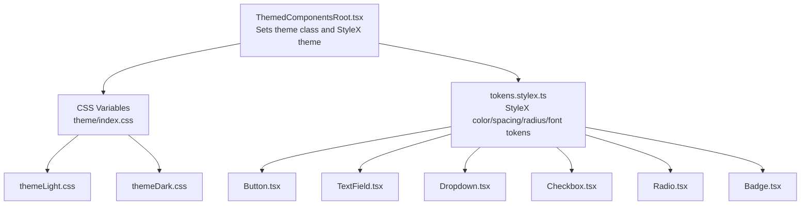
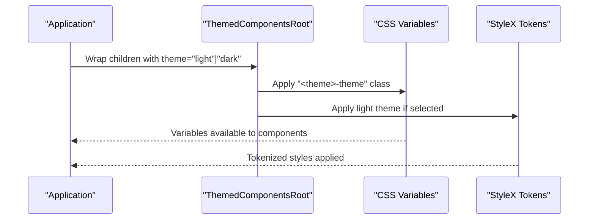
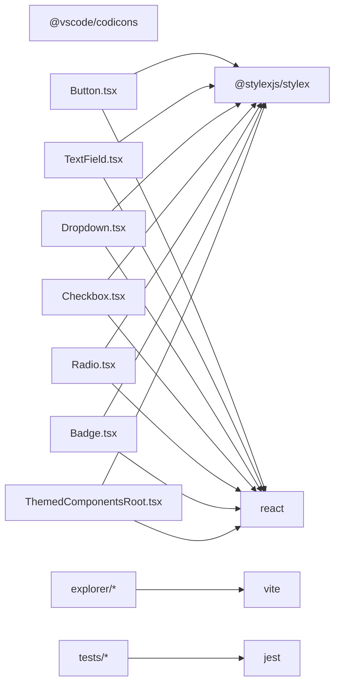
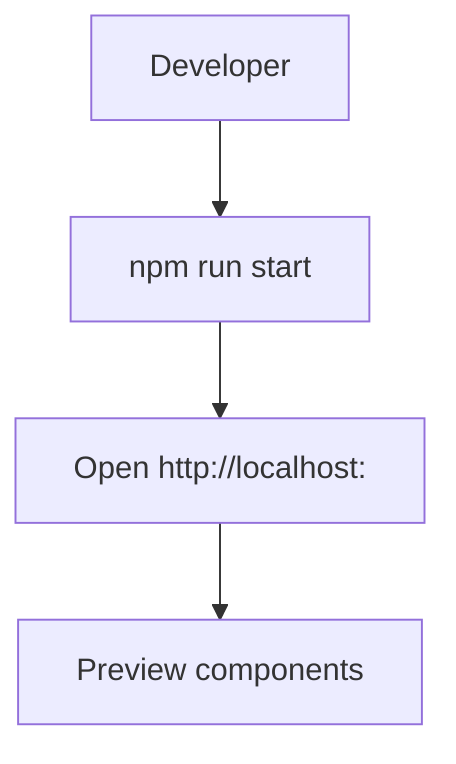

# UI Component Library

<cite>
**Referenced Files in This Document**
- [README.md](file://addons/components/README.md)
- [package.json](file://addons/components/package.json)
- [tsconfig.json](file://addons/components/tsconfig.json)
- [index.css](file://addons/components/theme/index.css)
- [themeLight.css](file://addons/components/theme/themeLight.css)
- [themeDark.css](file://addons/components/theme/themeDark.css)
- [tokens.stylex.ts](file://addons/components/theme/tokens.stylex.ts)
- [ThemedComponentsRoot.tsx](file://addons/components/ThemedComponentsRoot.tsx)
- [Types.ts](file://addons/components/Types.ts)
- [Button.tsx](file://addons/components/Button.tsx)
- [TextField.tsx](file://addons/components/TextField.tsx)
- [Dropdown.tsx](file://addons/components/Dropdown.tsx)
- [Checkbox.tsx](file://addons/components/Checkbox.tsx)
- [Radio.tsx](file://addons/components/Radio.tsx)
- [Badge.tsx](file://addons/components/Badge.tsx)
- [Flex.tsx](file://addons/components/Flex.tsx)
- [Icon.tsx](file://addons/components/Icon.tsx)
- [Tooltip.tsx](file://addons/components/Tooltip.tsx)
- [Panels.tsx](file://addons/components/Panels.tsx)
- [Banner.tsx](file://addons/components/Banner.tsx)
- [ErrorNotice.tsx](file://addons/components/ErrorNotice.tsx)
- [Typeahead.tsx](file://addons/components/Typeahead.tsx)
- [ViewportOverlay.tsx](file://addons/components/ViewportOverlay.tsx)
- [KeyboardShortcuts.tsx](file://addons/components/KeyboardShortcuts.tsx)
- [Kbd.tsx](file://addons/components/Kbd.tsx)
- [ActionLink.tsx](file://addons/components/ActionLink.tsx)
- [LinkButton.tsx](file://addons/components/LinkButton.tsx)
- [ButtonGroup.tsx](file://addons/components/ButtonGroup.tsx)
- [ButtonDropdown.tsx](file://addons/components/ButtonDropdown.tsx)
- [ButtonWithDropdownTooltip.tsx](file://addons/components/ButtonWithDropdownTooltip.tsx)
- [HorizontallyGrowingTextField.tsx](file://addons/components/HorizontallyGrowingTextField.tsx)
- [DatetimePicker.tsx](file://addons/components/DatetimePicker.tsx)
- [Divider.tsx](file://addons/components/Divider.tsx)
- [Subtle.tsx](file://addons/components/Subtle.tsx)
- [Tag.tsx](file://addons/components/Tag.tsx)
- [OperatingSystem.ts](file://addons/components/OperatingSystem.ts)
- [utils.tsx](file://addons/components/utils.tsx)
- [vite.config.ts](file://addons/components/vite.config.ts)
- [index.html](file://addons/components/explorer/index.html)
- [index.tsx](file://addons/components/explorer/index.tsx)
- [index.css](file://addons/components/explorer/index.css)
</cite>

## Table of Contents
1. [Introduction](#introduction)
2. [Project Structure](#project-structure)
3. [Core Components](#core-components)
4. [Architecture Overview](#architecture-overview)
5. [Detailed Component Analysis](#detailed-component-analysis)
6. [Dependency Analysis](#dependency-analysis)
7. [Performance Considerations](#performance-considerations)
8. [Troubleshooting Guide](#troubleshooting-guide)
9. [Conclusion](#conclusion)
10. [Appendices](#appendices)

## Introduction
This document describes the ISL UI component library used internally by ISL. It covers the component architecture, prop interfaces, usage patterns, theming system (CSS variables, light/dark modes, and custom theme creation), component composition, state management integration, accessibility compliance, and cross-platform styling considerations. It also provides guidance on extending the library, creating custom variants, and maintaining design consistency.

## Project Structure
The component library is organized as a standalone React + StyleX package with a dedicated theme system and a simple component explorer. Key areas:
- Components: individual UI elements (Button, TextField, Dropdown, Checkbox, Radio, Badge, etc.)
- Theme: CSS variable definitions, light/dark theme files, and StyleX token definitions
- Explorer: a Vite-based demo app to preview components
- Utilities: shared types and helpers

```mermaid
graph TB
subgraph "Package"
Pkg["package.json"]
TS["tsconfig.json"]
Vite["vite.config.ts"]
end
subgraph "Theme"
TIndex["theme/index.css"]
TLight["theme/themeLight.css"]
TDark["theme/themeDark.css"]
TTokens["theme/tokens.stylex.ts"]
TRoot["ThemedComponentsRoot.tsx"]
end
subgraph "Components"
Btn["Button.tsx"]
Txt["TextField.tsx"]
Drop["Dropdown.tsx"]
Check["Checkbox.tsx"]
Radio["Radio.tsx"]
Bad["Badge.tsx"]
Flex["Flex.tsx"]
Icon["Icon.tsx"]
Tip["Tooltip.tsx"]
Panels["Panels.tsx"]
Banner["Banner.tsx"]
Err["ErrorNotice.tsx"]
TA["Typeahead.tsx"]
VO["ViewportOverlay.tsx"]
KS["KeyboardShortcuts.tsx"]
Kbd["Kbd.tsx"]
Act["ActionLink.tsx"]
LBtn["LinkButton.tsx"]
BGroup["ButtonGroup.tsx"]
BDD["ButtonDropdown.tsx"]
BDTooltip["ButtonWithDropdownTooltip.tsx"]
HG["HorizontallyGrowingTextField.tsx"]
DT["DatetimePicker.tsx"]
Div["Divider.tsx"]
Sub["Subtle.tsx"]
Tag["Tag.tsx"]
end
subgraph "Explorer"
ExHtml["explorer/index.html"]
ExTs["explorer/index.tsx"]
ExCss["explorer/index.css"]
end
Pkg --> Btn
Pkg --> Txt
Pkg --> Drop
Pkg --> Check
Pkg --> Radio
Pkg --> Bad
Pkg --> Flex
Pkg --> Icon
Pkg --> Tip
Pkg --> Panels
Pkg --> Banner
Pkg --> Err
Pkg --> TA
Pkg --> VO
Pkg --> KS
Pkg --> Kbd
Pkg --> Act
Pkg --> LBtn
Pkg --> BGroup
Pkg --> BDD
Pkg --> BDTooltip
Pkg --> HG
Pkg --> DT
Pkg --> Div
Pkg --> Sub
Pkg --> Tag
TRoot --> Btn
TRoot --> Txt
TRoot --> Drop
TRoot --> Check
TRoot --> Radio
TRoot --> Bad
TRoot --> Flex
TRoot --> Icon
TRoot --> Tip
TRoot --> Panels
TRoot --> Banner
TRoot --> Err
TRoot --> TA
TRoot --> VO
TRoot --> KS
TRoot --> Kbd
TRoot --> Act
TRoot --> LBtn
TRoot --> BGroup
TRoot --> BDD
TRoot --> BDTooltip
TRoot --> HG
TRoot --> DT
TRoot --> Div
TRoot --> Sub
TRoot --> Tag
TIndex --> TLight
TIndex --> TDark
TTokens --> Btn
TTokens --> Txt
TTokens --> Drop
TTokens --> Check
TTokens --> Radio
TTokens --> Bad
```

**Diagram sources**
- [package.json:1-31](file://addons/components/package.json#L1-L31)
- [tsconfig.json:1-25](file://addons/components/tsconfig.json#L1-L25)
- [vite.config.ts](file://addons/components/vite.config.ts)
- [index.css:1-45](file://addons/components/theme/index.css#L1-L45)
- [themeLight.css:1-78](file://addons/components/theme/themeLight.css#L1-L78)
- [themeDark.css:1-79](file://addons/components/theme/themeDark.css#L1-L79)
- [tokens.stylex.ts:1-119](file://addons/components/theme/tokens.stylex.ts#L1-L119)
- [ThemedComponentsRoot.tsx:1-28](file://addons/components/ThemedComponentsRoot.tsx#L1-L28)
- [Button.tsx:1-157](file://addons/components/Button.tsx#L1-L157)
- [TextField.tsx:1-80](file://addons/components/TextField.tsx#L1-L80)
- [Dropdown.tsx:1-76](file://addons/components/Dropdown.tsx#L1-L76)
- [Checkbox.tsx:1-137](file://addons/components/Checkbox.tsx#L1-L137)
- [Radio.tsx:1-117](file://addons/components/Radio.tsx#L1-L117)
- [Badge.tsx:1-43](file://addons/components/Badge.tsx#L1-L43)
- [Flex.tsx](file://addons/components/Flex.tsx)
- [Icon.tsx](file://addons/components/Icon.tsx)
- [Tooltip.tsx](file://addons/components/Tooltip.tsx)
- [Panels.tsx](file://addons/components/Panels.tsx)
- [Banner.tsx](file://addons/components/Banner.tsx)
- [ErrorNotice.tsx](file://addons/components/ErrorNotice.tsx)
- [Typeahead.tsx](file://addons/components/Typeahead.tsx)
- [ViewportOverlay.tsx](file://addons/components/ViewportOverlay.tsx)
- [KeyboardShortcuts.tsx](file://addons/components/KeyboardShortcuts.tsx)
- [Kbd.tsx](file://addons/components/Kbd.tsx)
- [ActionLink.tsx](file://addons/components/ActionLink.tsx)
- [LinkButton.tsx](file://addons/components/LinkButton.tsx)
- [ButtonGroup.tsx](file://addons/components/ButtonGroup.tsx)
- [ButtonDropdown.tsx](file://addons/components/ButtonDropdown.tsx)
- [ButtonWithDropdownTooltip.tsx](file://addons/components/ButtonWithDropdownTooltip.tsx)
- [HorizontallyGrowingTextField.tsx](file://addons/components/HorizontallyGrowingTextField.tsx)
- [DatetimePicker.tsx](file://addons/components/DatetimePicker.tsx)
- [Divider.tsx](file://addons/components/Divider.tsx)
- [Subtle.tsx](file://addons/components/Subtle.tsx)
- [Tag.tsx](file://addons/components/Tag.tsx)
- [index.html](file://addons/components/explorer/index.html)
- [index.tsx](file://addons/components/explorer/index.tsx)
- [index.css](file://addons/components/explorer/index.css)

**Section sources**
- [README.md:1-55](file://addons/components/README.md#L1-L55)
- [package.json:1-31](file://addons/components/package.json#L1-L31)
- [tsconfig.json:1-25](file://addons/components/tsconfig.json#L1-L25)

## Core Components
This library provides a cohesive set of React UI primitives designed for reuse and composability. Highlights include:
- Buttons (primary, icon, disabled)
- Text inputs (single-line and growing)
- Dropdown/select controls
- Form controls (Checkbox, Radio)
- Feedback and metadata (Badge, Banner, ErrorNotice)
- Layout and composition (Flex, Panels)
- Interaction helpers (Tooltip, Icon, Kbd, KeyboardShortcuts)
- Navigation aids (ActionLink, LinkButton, ButtonGroup, ButtonDropdown, ButtonWithDropdownTooltip)
- Specialized inputs (Typeahead, DatetimePicker)
- Decorative and structural (Divider, Subtle, Tag)

Usage patterns emphasize:
- Prop-driven variants via kind, primary, icon, disabled
- StyleX integration via xstyle prop for easy overrides
- Accessibility-first defaults (labels, focus-visible outlines, aria-friendly markup)
- Composition with Flex and Panels for consistent layouts

**Section sources**
- [README.md:25-55](file://addons/components/README.md#L25-L55)
- [Button.tsx:88-157](file://addons/components/Button.tsx#L88-L157)
- [TextField.tsx:40-80](file://addons/components/TextField.tsx#L40-L80)
- [Dropdown.tsx:37-76](file://addons/components/Dropdown.tsx#L37-L76)
- [Checkbox.tsx:86-137](file://addons/components/Checkbox.tsx#L86-L137)
- [Radio.tsx:43-117](file://addons/components/Radio.tsx#L43-L117)
- [Badge.tsx:37-43](file://addons/components/Badge.tsx#L37-L43)
- [Flex.tsx](file://addons/components/Flex.tsx)
- [Icon.tsx](file://addons/components/Icon.tsx)
- [Tooltip.tsx](file://addons/components/Tooltip.tsx)
- [Panels.tsx](file://addons/components/Panels.tsx)
- [Banner.tsx](file://addons/components/Banner.tsx)
- [ErrorNotice.tsx](file://addons/components/ErrorNotice.tsx)
- [Typeahead.tsx](file://addons/components/Typeahead.tsx)
- [ViewportOverlay.tsx](file://addons/components/ViewportOverlay.tsx)
- [KeyboardShortcuts.tsx](file://addons/components/KeyboardShortcuts.tsx)
- [Kbd.tsx](file://addons/components/Kbd.tsx)
- [ActionLink.tsx](file://addons/components/ActionLink.tsx)
- [LinkButton.tsx](file://addons/components/LinkButton.tsx)
- [ButtonGroup.tsx](file://addons/components/ButtonGroup.tsx)
- [ButtonDropdown.tsx](file://addons/components/ButtonDropdown.tsx)
- [ButtonWithDropdownTooltip.tsx](file://addons/components/ButtonWithDropdownTooltip.tsx)
- [HorizontallyGrowingTextField.tsx](file://addons/components/HorizontallyGrowingTextField.tsx)
- [DatetimePicker.tsx](file://addons/components/DatetimePicker.tsx)
- [Divider.tsx](file://addons/components/Divider.tsx)
- [Subtle.tsx](file://addons/components/Subtle.tsx)
- [Tag.tsx](file://addons/components/Tag.tsx)

## Architecture Overview
The library is built around three pillars:
- StyleX-based styling for fast, composable styles
- CSS variable-based theming for light/dark modes and customization
- React component composition with consistent prop interfaces

**Diagram sources**
- [ThemedComponentsRoot.tsx:14-27](file://addons/components/ThemedComponentsRoot.tsx#L14-L27)
- [index.css:8-44](file://addons/components/theme/index.css#L8-L44)
- [themeLight.css:8-77](file://addons/components/theme/themeLight.css#L8-L77)
- [themeDark.css:8-78](file://addons/components/theme/themeDark.css#L8-L78)
- [tokens.stylex.ts:14-119](file://addons/components/theme/tokens.stylex.ts#L14-L119)
- [Button.tsx:29-86](file://addons/components/Button.tsx#L29-L86)
- [TextField.tsx:15-38](file://addons/components/TextField.tsx#L15-L38)
- [Dropdown.tsx:14-35](file://addons/components/Dropdown.tsx#L14-L35)
- [Checkbox.tsx:17-53](file://addons/components/Checkbox.tsx#L17-L53)
- [Radio.tsx:20-41](file://addons/components/Radio.tsx#L20-L41)
- [Badge.tsx:13-35](file://addons/components/Badge.tsx#L13-L35)

## Detailed Component Analysis

### Theming System
The theming system combines CSS variables and StyleX tokens:
- CSS variable base: global variables for fonts, backgrounds, borders, and component-specific tokens
- Light/dark themes: separate CSS files define theme-specific values and color palettes
- StyleX tokens: strongly-typed tokens for colors, spacing, radii, and font scales
- Root provider: ThemedComponentsRoot applies the theme class and StyleX theme to the subtree

Key behaviors:
- CSS variables cascade from theme/index.css and are overridden by themeLight.css or themeDark.css
- StyleX tokens are applied conditionally via ThemedComponentsRoot to switch between light and dark palettes
- Components consume CSS variables directly for visual consistency and fallbacks

**Diagram sources**
- [ThemedComponentsRoot.tsx:14-27](file://addons/components/ThemedComponentsRoot.tsx#L14-L27)
- [index.css:8-44](file://addons/components/theme/index.css#L8-L44)
- [themeLight.css:8-77](file://addons/components/theme/themeLight.css#L8-L77)
- [themeDark.css:8-78](file://addons/components/theme/themeDark.css#L8-L78)
- [tokens.stylex.ts:54-92](file://addons/components/theme/tokens.stylex.ts#L54-L92)

**Section sources**
- [index.css:8-44](file://addons/components/theme/index.css#L8-L44)
- [themeLight.css:8-77](file://addons/components/theme/themeLight.css#L8-L77)
- [themeDark.css:8-78](file://addons/components/theme/themeDark.css#L8-L78)
- [tokens.stylex.ts:14-119](file://addons/components/theme/tokens.stylex.ts#L14-L119)
- [ThemedComponentsRoot.tsx:14-27](file://addons/components/ThemedComponentsRoot.tsx#L14-L27)

### Component Composition Patterns
Common patterns across components:
- Props union types to enforce mutually exclusive variants (e.g., kind vs primary/icon)
- xstyle prop for StyleX overrides
- useId for accessible labels
- Conditional style application based on state (disabled, checked, focused)
- Composition with Flex and Panels for consistent layouts

Example: Button variant selection and disabled handling
- Uses ExclusiveOr to enforce kind or boolean flags
- Applies StyleX classes conditionally
- Prevents onClick when disabled

**Section sources**
- [Button.tsx:88-157](file://addons/components/Button.tsx#L88-L157)
- [Types.ts:36-47](file://addons/components/Types.ts#L36-L47)
- [TextField.tsx:40-80](file://addons/components/TextField.tsx#L40-L80)
- [Dropdown.tsx:37-76](file://addons/components/Dropdown.tsx#L37-L76)
- [Checkbox.tsx:86-137](file://addons/components/Checkbox.tsx#L86-L137)
- [Radio.tsx:43-117](file://addons/components/Radio.tsx#L43-L117)
- [Badge.tsx:37-43](file://addons/components/Badge.tsx#L37-L43)

### State Management Integration
- Components expose callbacks (onChange, onClick) for upstream state updates
- Controlled inputs (value, checked) accept props and callbacks to integrate with external state libraries
- No internal stateful hooks are used; components remain presentational and predictable

Recommended integration patterns:
- Use local state for ephemeral UI toggles
- Use external state (e.g., atom-based stores) for persistent selections and form data
- Compose ButtonGroup/ButtonDropdown/ButtonWithDropdownTooltip for coordinated actions

**Section sources**
- [Button.tsx:143-146](file://addons/components/Button.tsx#L143-L146)
- [Checkbox.tsx:103-137](file://addons/components/Checkbox.tsx#L103-L137)
- [Radio.tsx:43-117](file://addons/components/Radio.tsx#L43-L117)
- [Dropdown.tsx:37-76](file://addons/components/Dropdown.tsx#L37-L76)
- [TextField.tsx:40-80](file://addons/components/TextField.tsx#L40-L80)

### Accessibility Compliance
- Proper labeling via htmlFor and associated labels
- Focus-visible outlines for keyboard navigation
- Disabled states prevent interaction and adjust cursor
- Semantic HTML elements (fieldset/legend, label, input types)
- Tooltip and keyboard shortcut components provide accessible affordances

Recommendations:
- Always pair inputs with labels
- Prefer primary and icon buttons for distinct actions
- Use Tooltip sparingly and ensure alt/title text where applicable

**Section sources**
- [TextField.tsx:61-77](file://addons/components/TextField.tsx#L61-L77)
- [Dropdown.tsx:51-75](file://addons/components/Dropdown.tsx#L51-L75)
- [Checkbox.tsx:103-137](file://addons/components/Checkbox.tsx#L103-L137)
- [Radio.tsx:96-117](file://addons/components/Radio.tsx#L96-L117)
- [Button.tsx:142-151](file://addons/components/Button.tsx#L142-L151)

### Extending the Component Library
Guidelines for adding new components:
- Define StyleX styles and export a stylex.create block
- Accept an xstyle prop for overrides
- Support variant props (e.g., kind, size) with ExclusiveOr types
- Use CSS variables for theme-aware visuals
- Provide clear prop interfaces and TypeScript types
- Add tests and optionally update the explorer

Custom variant creation:
- Extend tokens.stylex.ts for new color/size tokens
- Add CSS variable overrides in themeLight.css or themeDark.css
- Update ThemedComponentsRoot if a new theme variant is introduced

**Section sources**
- [Button.tsx:29-86](file://addons/components/Button.tsx#L29-L86)
- [tokens.stylex.ts:14-119](file://addons/components/theme/tokens.stylex.ts#L14-L119)
- [themeLight.css:8-77](file://addons/components/theme/themeLight.css#L8-L77)
- [themeDark.css:8-78](file://addons/components/theme/themeDark.css#L8-L78)
- [ThemedComponentsRoot.tsx:14-27](file://addons/components/ThemedComponentsRoot.tsx#L14-L27)

### Creating Custom Variants
Examples:
- Button kinds: primary, icon, default
- Checkbox indeterminate state
- RadioGroup with tooltips
- TextField with container styling via containerXstyle

Integration tips:
- Use xstyle to layer additional styles atop base styles
- Leverage Flex and Panels for consistent spacing and alignment
- Keep variants orthogonal and documented

**Section sources**
- [Button.tsx:88-157](file://addons/components/Button.tsx#L88-L157)
- [Checkbox.tsx:86-137](file://addons/components/Checkbox.tsx#L86-L137)
- [Radio.tsx:43-117](file://addons/components/Radio.tsx#L43-L117)
- [TextField.tsx:40-80](file://addons/components/TextField.tsx#L40-L80)
- [Flex.tsx](file://addons/components/Flex.tsx)
- [Panels.tsx](file://addons/components/Panels.tsx)

### Maintaining Design Consistency
- Centralize tokens in tokens.stylex.ts and CSS variables in theme files
- Prefer CSS variables for component visuals to ensure uniform theming
- Use StyleX tokens for programmatic style generation
- Keep component APIs minimal and consistent across similar controls

**Section sources**
- [tokens.stylex.ts:14-119](file://addons/components/theme/tokens.stylex.ts#L14-L119)
- [index.css:8-44](file://addons/components/theme/index.css#L8-L44)
- [Button.tsx:29-86](file://addons/components/Button.tsx#L29-L86)

### Style System and Responsive Utilities
- StyleX: compile-time CSS generation with token support
- CSS variables: runtime theme switching and cross-component consistency
- Responsive utilities: use CSS media queries and viewport units where appropriate; components themselves are layout-agnostic

Cross-platform considerations:
- Font stacks and editor font sizes are defined via CSS variables
- Zoom factor is supported via CSS variable for scaling content
- Icons are provided via codicon library

**Section sources**
- [tokens.stylex.ts:94-119](file://addons/components/theme/tokens.stylex.ts#L94-L119)
- [index.css:27-44](file://addons/components/theme/index.css#L27-L44)
- [package.json:20-24](file://addons/components/package.json#L20-L24)

## Dependency Analysis
The component library depends on:
- React for component model and hooks
- StyleX for fast, composable styles
- VS Code codicons for icons
- Optional testing and build tooling (Vite, Jest) for development and demos

**Diagram sources**
- [package.json:20-24](file://addons/components/package.json#L20-L24)
- [Button.tsx:12-15](file://addons/components/Button.tsx#L12-L15)
- [ThemedComponentsRoot.tsx:10-11](file://addons/components/ThemedComponentsRoot.tsx#L10-L11)
- [vite.config.ts](file://addons/components/vite.config.ts)

**Section sources**
- [package.json:1-31](file://addons/components/package.json#L1-L31)

## Performance Considerations
- StyleX generates efficient CSS and avoids expensive reflows by batching style application
- CSS variables enable runtime theme switching without rebuilding styles
- Prefer controlled components to minimize unnecessary renders
- Use xstyle for targeted overrides instead of heavy wrappers

## Troubleshooting Guide
Common issues and resolutions:
- Theme not applying: ensure ThemedComponentsRoot wraps the component tree and theme class is present
- Styles not updating: verify CSS variables are defined in the active theme file and tokens are applied
- Focus outlines missing: confirm focus-visible styles are enabled and inputs receive focus
- Disabled state not working: ensure disabled prop is passed and onClick is guarded

**Section sources**
- [ThemedComponentsRoot.tsx:14-27](file://addons/components/ThemedComponentsRoot.tsx#L14-L27)
- [Button.tsx:142-151](file://addons/components/Button.tsx#L142-L151)
- [Dropdown.tsx:54-57](file://addons/components/Dropdown.tsx#L54-L57)

## Conclusion
The ISL UI component library offers a cohesive, theme-aware set of React components powered by StyleX and CSS variables. Its architecture emphasizes composability, accessibility, and maintainability, enabling consistent design across applications while supporting customization and extensibility.

## Appendices

### Component Explorer
The explorer demonstrates component usage and variants. To run:
- Install dependencies
- Start Vite dev server in the components directory

**Diagram sources**
- [package.json:25-28](file://addons/components/package.json#L25-L28)
- [index.html](file://addons/components/explorer/index.html)
- [index.tsx](file://addons/components/explorer/index.tsx)
- [index.css](file://addons/components/explorer/index.css)

**Section sources**
- [README.md:12-14](file://addons/components/README.md#L12-L14)
- [package.json:25-28](file://addons/components/package.json#L25-L28)