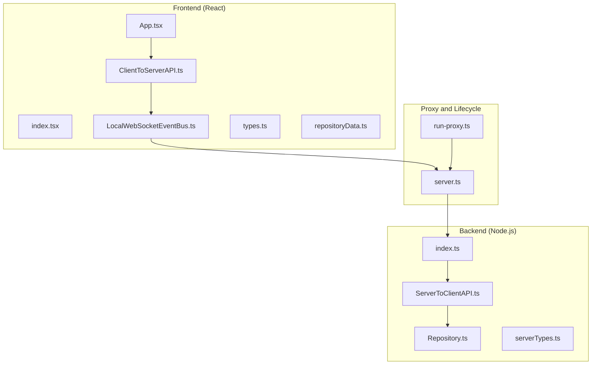
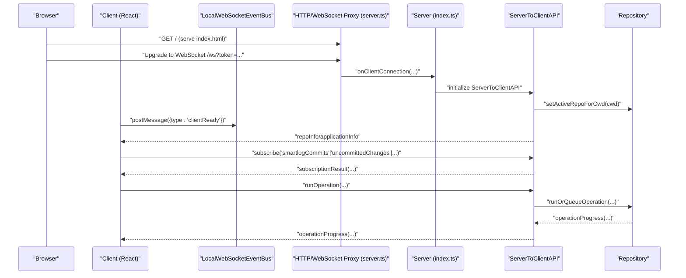
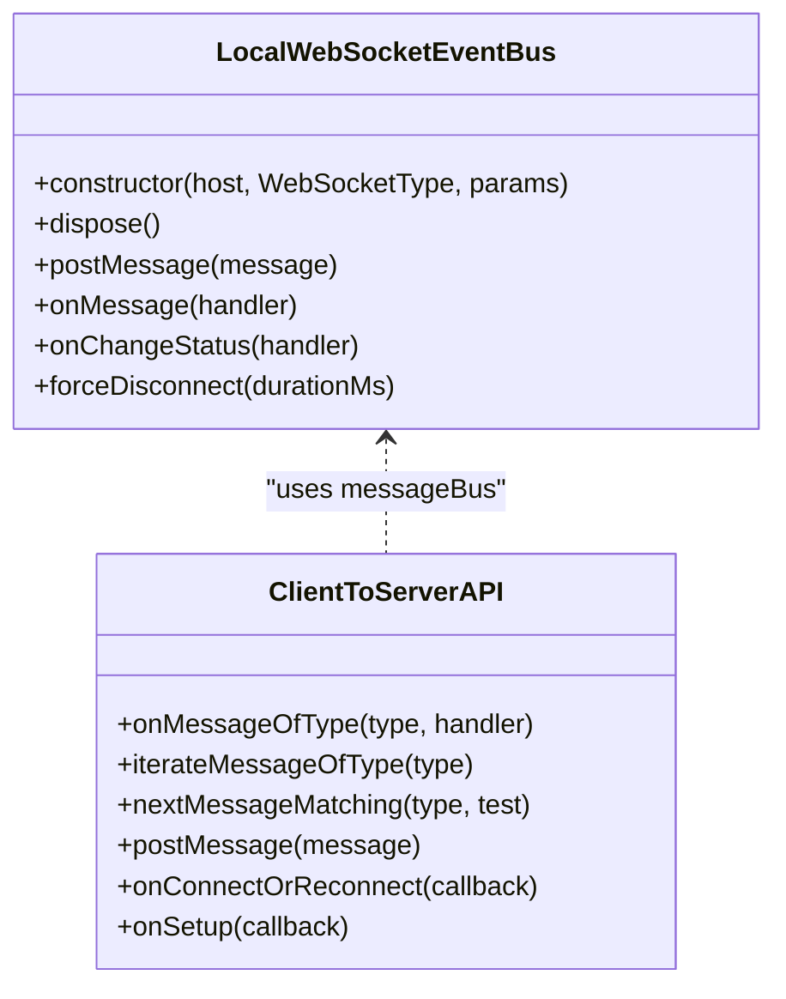
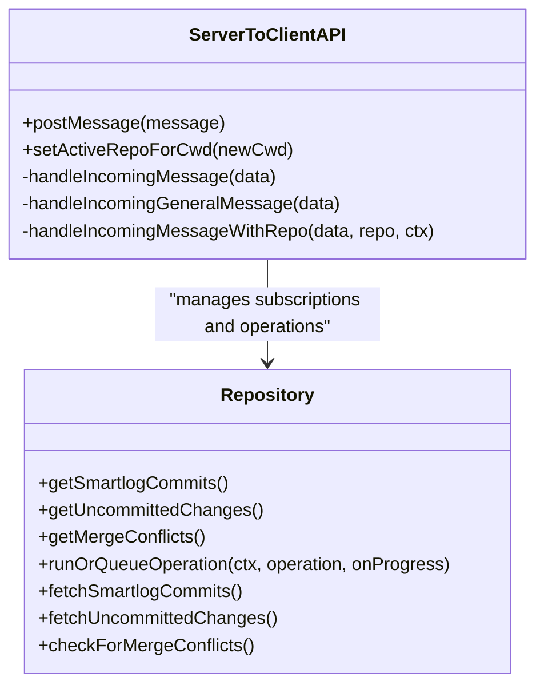
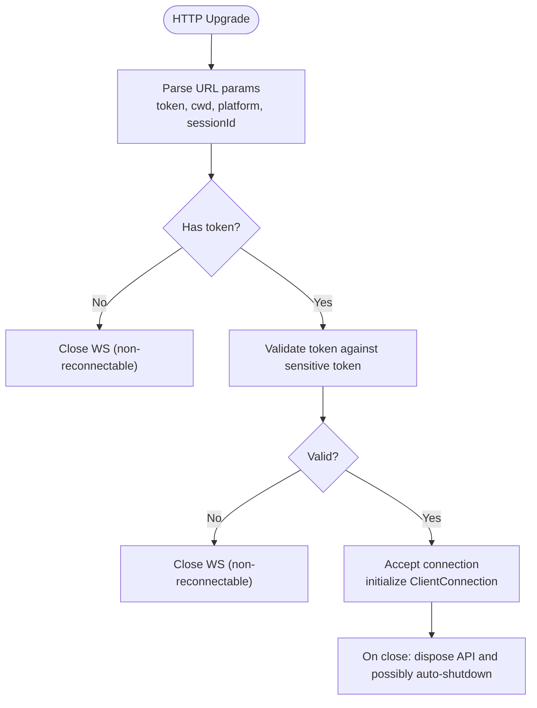
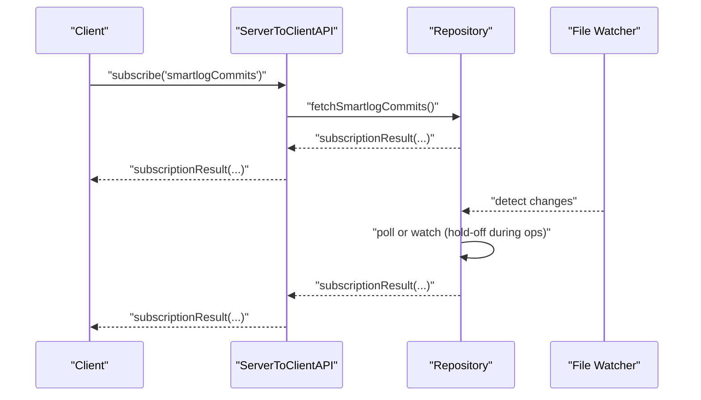
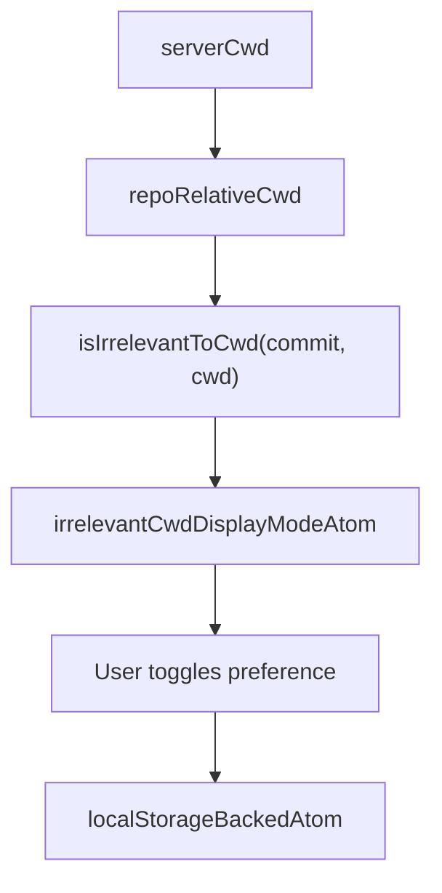
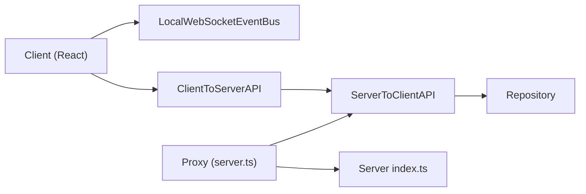

# Interactive Smartlog (ISL)

<cite>
**Referenced Files in This Document**
- [README.md](file://addons/isl/README.md)
- [README.md](file://addons/isl-server/README.md)
- [index.tsx](file://addons/isl/src/index.tsx)
- [App.tsx](file://addons/isl/src/App.tsx)
- [LocalWebSocketEventBus.ts](file://addons/isl/src/LocalWebSocketEventBus.ts)
- [ClientToServerAPI.ts](file://addons/isl/src/ClientToServerAPI.ts)
- [types.ts](file://addons/isl/src/types.ts)
- [repositoryData.ts](file://addons/isl/src/repositoryData.ts)
- [index.ts](file://addons/isl-server/src/index.ts)
- [ServerToClientAPI.ts](file://addons/isl-server/src/ServerToClientAPI.ts)
- [server.ts](file://addons/isl-server/proxy/server.ts)
- [run-proxy.ts](file://addons/isl-server/proxy/run-proxy.ts)
- [Repository.ts](file://addons/isl-server/src/Repository.ts)
- [serverTypes.ts](file://addons/isl-server/src/serverTypes.ts)
</cite>

## Table of Contents
1. [Introduction](#introduction)
2. [Project Structure](#project-structure)
3. [Core Components](#core-components)
4. [Architecture Overview](#architecture-overview)
5. [Detailed Component Analysis](#detailed-component-analysis)
6. [Dependency Analysis](#dependency-analysis)
7. [Performance Considerations](#performance-considerations)
8. [Troubleshooting Guide](#troubleshooting-guide)
9. [Conclusion](#conclusion)
10. [Appendices](#appendices)

## Introduction
Interactive Smartlog (ISL) is a web-based, embeddable repository visualization and navigation interface for the Sapling source control system. It provides an advanced commit graph exploration experience, file change tracking, and real-time updates powered by a React-based frontend and a Node.js backend server. The system integrates tightly with the broader SAPLING ecosystem, supports multiple embedding contexts (browser, VS Code webview, Android Studio, etc.), and offers robust WebSocket-based communication for live synchronization of repository state.

## Project Structure
The ISL project is organized into several key areas:
- Frontend (React + Jotai): The client-side UI and state management.
- Backend (Node.js server): The server that communicates with the repository, spawns commands, and streams updates.
- Proxy and server lifecycle: The entry point for launching and managing the server, including token-based authentication and WebSocket upgrade handling.
- Shared types and utilities: Cross-cutting types and utilities used by both client and server.

**Diagram sources**
- [index.tsx:1-19](file://addons/isl/src/index.tsx#L1-L19)
- [App.tsx:1-283](file://addons/isl/src/App.tsx#L1-L283)
- [LocalWebSocketEventBus.ts:1-178](file://addons/isl/src/LocalWebSocketEventBus.ts#L1-L178)
- [ClientToServerAPI.ts:1-245](file://addons/isl/src/ClientToServerAPI.ts#L1-L245)
- [types.ts:1-800](file://addons/isl/src/types.ts#L1-L800)
- [repositoryData.ts:1-126](file://addons/isl/src/repositoryData.ts#L1-L126)
- [index.ts:1-83](file://addons/isl-server/src/index.ts#L1-L83)
- [ServerToClientAPI.ts:1-800](file://addons/isl-server/src/ServerToClientAPI.ts#L1-L800)
- [Repository.ts:1-800](file://addons/isl-server/src/Repository.ts#L1-L800)
- [serverTypes.ts:1-36](file://addons/isl-server/src/serverTypes.ts#L1-L36)
- [server.ts:1-331](file://addons/isl-server/proxy/server.ts#L1-L331)
- [run-proxy.ts:1-11](file://addons/isl-server/proxy/run-proxy.ts#L1-L11)

**Section sources**
- [README.md:1-383](file://addons/isl/README.md#L1-L383)
- [README.md:1-17](file://addons/isl-server/README.md#L1-L17)

## Core Components
- Frontend entry and rendering:
  - The React app initializes and mounts the root component, wiring up providers and UI scaffolding.
- WebSocket event bus:
  - Provides resilient connection management, exponential backoff, and message queuing during reconnects.
- Client-to-server API:
  - Encapsulates typed message handling, event iteration, and connection lifecycle callbacks.
- Server lifecycle and connection:
  - Manages client connections, validates tokens, sets up repository contexts, and tracks analytics.
- Server-to-client API:
  - Handles subscriptions, operations, configuration, and real-time updates for commits, uncommitted changes, and merge conflicts.
- Repository abstraction:
  - Centralizes repository state, watches for changes, queues operations, and streams updates to clients.
- Types and state:
  - Defines the protocol, data models, and UI state atoms for repository context and filtering.

**Section sources**
- [index.tsx:1-19](file://addons/isl/src/index.tsx#L1-L19)
- [App.tsx:1-283](file://addons/isl/src/App.tsx#L1-L283)
- [LocalWebSocketEventBus.ts:1-178](file://addons/isl/src/LocalWebSocketEventBus.ts#L1-L178)
- [ClientToServerAPI.ts:1-245](file://addons/isl/src/ClientToServerAPI.ts#L1-L245)
- [index.ts:1-83](file://addons/isl-server/src/index.ts#L1-L83)
- [ServerToClientAPI.ts:1-800](file://addons/isl-server/src/ServerToClientAPI.ts#L1-L800)
- [Repository.ts:1-800](file://addons/isl-server/src/Repository.ts#L1-L800)
- [types.ts:1-800](file://addons/isl/src/types.ts#L1-L800)
- [repositoryData.ts:1-126](file://addons/isl/src/repositoryData.ts#L1-L126)

## Architecture Overview
ISL follows a client-server architecture with a React frontend and a Node.js server. The server serves static assets and upgrades HTTP requests to WebSocket connections. Clients authenticate via a token embedded in the WebSocket URL and exchange typed JSON messages for repository state, subscriptions, and operations.

**Diagram sources**
- [server.ts:160-280](file://addons/isl-server/proxy/server.ts#L160-L280)
- [index.ts:60-82](file://addons/isl-server/src/index.ts#L60-L82)
- [ServerToClientAPI.ts:267-343](file://addons/isl-server/src/ServerToClientAPI.ts#L267-L343)
- [Repository.ts:630-642](file://addons/isl-server/src/Repository.ts#L630-L642)
- [LocalWebSocketEventBus.ts:56-118](file://addons/isl/src/LocalWebSocketEventBus.ts#L56-L118)
- [ClientToServerAPI.ts:179-185](file://addons/isl/src/ClientToServerAPI.ts#L179-L185)

## Detailed Component Analysis

### Frontend: React App and WebSocket Communication
- App initialization:
  - The root component sets up providers and conditionally renders drawers and comparison views based on mode.
- WebSocket event bus:
  - Establishes and maintains a WebSocket connection with token, cwd, and platform parameters.
  - Implements exponential backoff and message queuing during reconnects.
  - Exposes status change listeners and message handlers for the rest of the app.
- Client-to-server API:
  - Wraps the message bus with typed event handling and async iteration helpers.
  - Provides convenience methods for iterating messages, waiting for next matching message, and reacting to connection state changes.

**Diagram sources**
- [LocalWebSocketEventBus.ts:13-178](file://addons/isl/src/LocalWebSocketEventBus.ts#L13-L178)
- [ClientToServerAPI.ts:35-233](file://addons/isl/src/ClientToServerAPI.ts#L35-L233)

**Section sources**
- [App.tsx:50-125](file://addons/isl/src/App.tsx#L50-L125)
- [LocalWebSocketEventBus.ts:39-177](file://addons/isl/src/LocalWebSocketEventBus.ts#L39-L177)
- [ClientToServerAPI.ts:35-233](file://addons/isl/src/ClientToServerAPI.ts#L35-L233)

### Backend: Server Lifecycle and Message Handling
- Client connection:
  - Validates tokens, sets up logging and analytics, and initializes ServerToClientAPI bound to a repository context.
- Server-to-client API:
  - Processes general messages (heartbeat, clientReady, changeCwd, etc.) and repository-bound messages (subscriptions, operations, config).
  - Queues messages until a repository is loaded and then dispatches them.
  - Streams updates for smartlog commits, uncommitted changes, merge conflicts, and other subscriptions.
- Repository:
  - Centralizes repository state, watches for changes (file system and focus), queues operations, and triggers refreshes.
  - Supports optimistic UI updates and preview appliers for smoother UX.

**Diagram sources**
- [ServerToClientAPI.ts:71-223](file://addons/isl-server/src/ServerToClientAPI.ts#L71-L223)
- [Repository.ts:113-364](file://addons/isl-server/src/Repository.ts#L113-L364)

**Section sources**
- [index.ts:60-82](file://addons/isl-server/src/index.ts#L60-L82)
- [ServerToClientAPI.ts:267-800](file://addons/isl-server/src/ServerToClientAPI.ts#L267-L800)
- [Repository.ts:399-468](file://addons/isl-server/src/Repository.ts#L399-L468)

### WebSocket Upgrade and Token Authentication
- Proxy server:
  - Serves static assets and upgrades HTTP requests to WebSocket connections.
  - Validates the sensitive token and optional challenge token for authenticity.
  - Supports platform-specific server platforms and session IDs.
- Token handling:
  - Tokens are passed via URL search parameters on the WebSocket path.
  - Invalid tokens result in immediate closure with a non-reconnectable code.

**Diagram sources**
- [server.ts:173-263](file://addons/isl-server/proxy/server.ts#L173-L263)

**Section sources**
- [server.ts:173-263](file://addons/isl-server/proxy/server.ts#L173-L263)

### Real-Time Updates and Subscriptions
- Subscriptions:
  - Clients can subscribe to streams of smartlog commits, uncommitted changes, merge conflicts, and other data.
  - Server emits subscriptionResult messages and beginsFetching events to inform clients.
- Change detection:
  - Uses Watchman when available; otherwise falls back to polling based on page focus.
  - Holds off refresh during long-running operations to avoid messy intermediate states.
- Operation lifecycle:
  - Operations are queued and executed with progress streaming.
  - Optimistic state is applied locally and reconciled when data refreshes.

**Diagram sources**
- [ServerToClientAPI.ts:361-430](file://addons/isl-server/src/ServerToClientAPI.ts#L361-L430)
- [Repository.ts:229-257](file://addons/isl-server/src/Repository.ts#L229-L257)

**Section sources**
- [ServerToClientAPI.ts:361-517](file://addons/isl-server/src/ServerToClientAPI.ts#L361-L517)
- [Repository.ts:229-257](file://addons/isl-server/src/Repository.ts#L229-L257)

### UI State, Filtering, and Customization
- Repository context:
  - Tracks current cwd, repo root, and derived atoms for relevance filtering and display modes.
- Filtering:
  - Determines whether commits are irrelevant to the current working directory and supports hiding or deemphasizing them.
- Persistence:
  - Uses local storage-backed atoms for user preferences like deemphasis and hiding irrelevant stacks.

**Diagram sources**
- [repositoryData.ts:51-114](file://addons/isl/src/repositoryData.ts#L51-L114)

**Section sources**
- [repositoryData.ts:17-126](file://addons/isl/src/repositoryData.ts#L17-L126)
- [types.ts:51-800](file://addons/isl/src/types.ts#L51-L800)

## Dependency Analysis
- Client depends on:
  - LocalWebSocketEventBus for transport and reconnection.
  - ClientToServerAPI for typed messaging and async iteration.
  - Types for protocol and data models.
  - repositoryData for repository context and filtering.
- Server depends on:
  - ServerToClientAPI for message routing and subscriptions.
  - Repository for state and change detection.
  - Proxy server for lifecycle and token validation.
- Cross-cutting concerns:
  - Analytics and logging are integrated at both ends.
  - Platform abstractions enable embedding in different contexts.

**Diagram sources**
- [LocalWebSocketEventBus.ts:1-178](file://addons/isl/src/LocalWebSocketEventBus.ts#L1-L178)
- [ClientToServerAPI.ts:1-245](file://addons/isl/src/ClientToServerAPI.ts#L1-L245)
- [ServerToClientAPI.ts:1-800](file://addons/isl-server/src/ServerToClientAPI.ts#L1-L800)
- [Repository.ts:1-800](file://addons/isl-server/src/Repository.ts#L1-L800)
- [server.ts:1-331](file://addons/isl-server/proxy/server.ts#L1-L331)
- [index.ts:1-83](file://addons/isl-server/src/index.ts#L1-L83)

**Section sources**
- [types.ts:1-800](file://addons/isl/src/types.ts#L1-L800)
- [serverTypes.ts:1-36](file://addons/isl-server/src/serverTypes.ts#L1-L36)

## Performance Considerations
- Real-time updates:
  - Use Watchman when available; otherwise rely on polling with focus-aware intervals to reduce unnecessary work.
  - Hold off refresh during long-running operations to avoid inconsistent UI states.
- Message traffic:
  - Enable debug logging selectively to diagnose issues without impacting production performance.
- Bundle optimization:
  - Use the provided bundling tools and analyzers to inspect and optimize client and server bundles.
- Operation batching:
  - Queue operations to minimize redundant refreshes and leverage optimistic updates.

[No sources needed since this section provides general guidance]

## Troubleshooting Guide
- Authentication failures:
  - Ensure the WebSocket URL includes a valid token; invalid tokens will close the connection immediately.
- Server reuse and stale state:
  - Use the provided options to kill or force fresh servers when reusing ports.
- Debugging:
  - Attach the server debugger and use source maps to decode production stack traces.
  - Inspect bundle sizes and dependencies using the documented tools.

**Section sources**
- [README.md:326-383](file://addons/isl/README.md#L326-L383)
- [server.ts:189-200](file://addons/isl-server/proxy/server.ts#L189-L200)

## Conclusion
ISL delivers a modern, embeddable interface for exploring and navigating Sapling repositories. Its architecture cleanly separates concerns between a React frontend and a Node.js server, with robust WebSocket communication, real-time updates, and strong integration with the broader SAPLING ecosystem. By leveraging subscriptions, optimistic UI, and careful change detection, ISL provides a responsive and reliable experience across multiple embedding contexts.

[No sources needed since this section summarizes without analyzing specific files]

## Appendices

### API Message Types (Overview)
- General:
  - heartbeat, clientReady, changeCwd, requestRepoInfo, requestApplicationInfo, fileBugReport, track
- Subscriptions:
  - subscribe/unsubscribe smartlogCommits, uncommittedChanges, mergeConflicts, submodules, subscribedFullRepoBranches
- Operations:
  - runOperation, abortRunningOperation, requestMissedOperationProgress
- Utilities:
  - getConfig, setConfig, setDebugLogging, refresh, pageVisibility, uploadFile, requestComparison, requestComparisonContextLines

**Section sources**
- [ServerToClientAPI.ts:52-800](file://addons/isl-server/src/ServerToClientAPI.ts#L52-L800)
- [types.ts:734-1354](file://addons/isl/src/types.ts#L734-L1354)