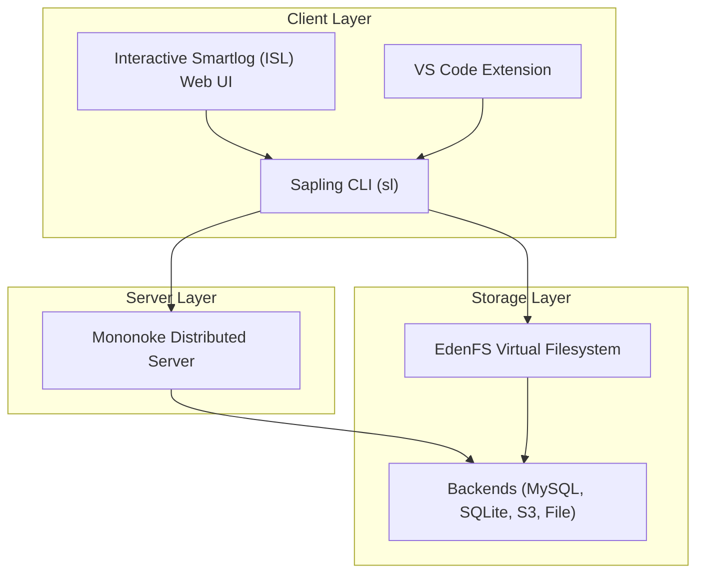
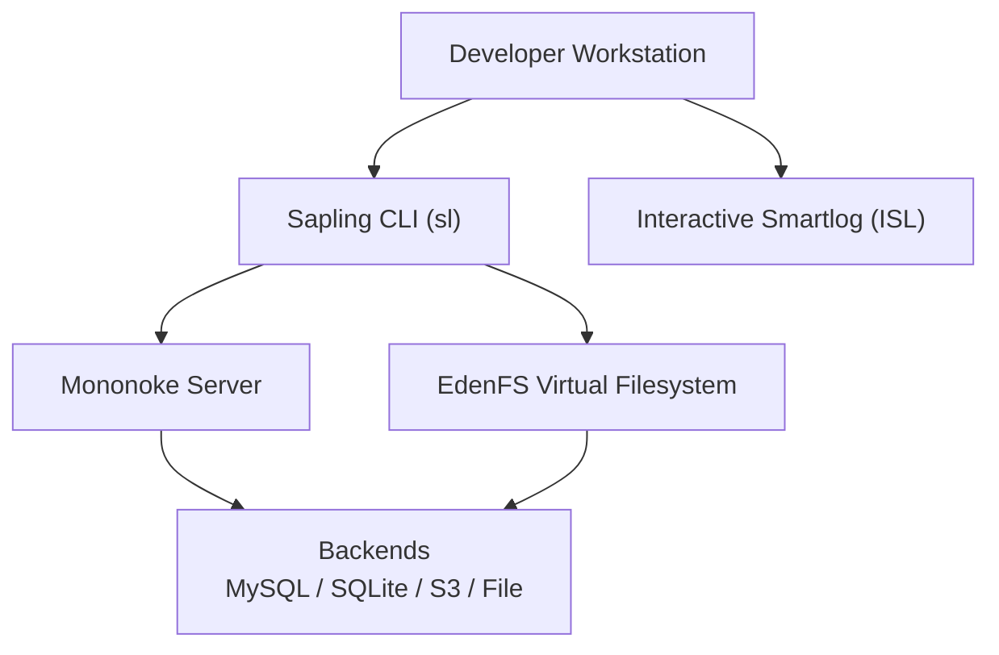
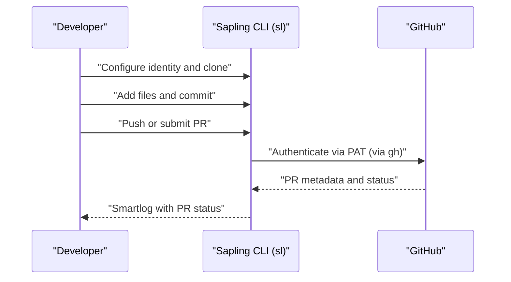
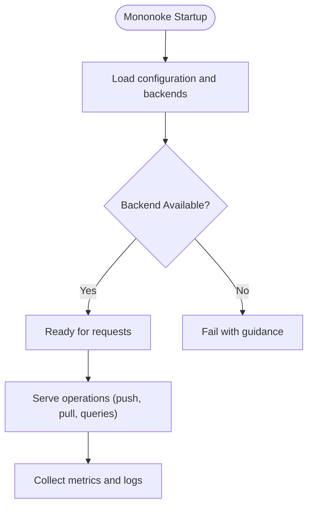
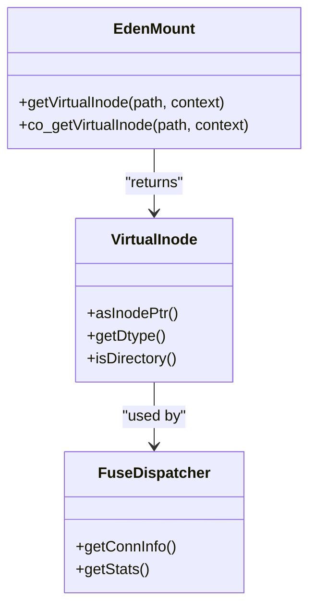
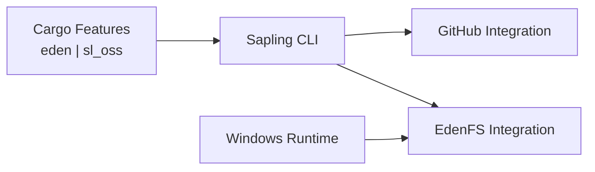

# Introduction and Overview

<cite>
**Referenced Files in This Document**
- [README.md](file://README.md)
- [Overview.md](file://eden/fs/docs/Overview.md)
- [README.md](file://eden/mononoke/README.md)
- [getting-started.md](file://website/docs/introduction/getting-started.md)
- [intro.md](file://website/docs/overview/intro.md)
- [github.md](file://website/docs/git/github.md)
- [Cargo.toml](file://eden/scm/exec/hgmain/Cargo.toml)
- [commit.rs](file://eden/fs/cli_rs/sapling-client/src/commit.rs)
- [FuseDispatcher.h](file://eden/fs/fuse/FuseDispatcher.h)
- [VirtualInode.cpp](file://eden/fs/inodes/VirtualInode.cpp)
- [EdenMount.cpp](file://eden/fs/inodes/EdenMount.cpp)
- [windows.rs](file://eden/scm/exec/hgmain/src/windows.rs)
- [git.py](file://eden/scm/sapling/git.py)
- [sapling_shell.py](file://eden/scm/ghstack/sapling_shell.py)
</cite>

## Table of Contents
1. [Introduction](#introduction)
2. [Project Structure](#project-structure)
3. [Core Components](#core-components)
4. [Architecture Overview](#architecture-overview)
5. [Detailed Component Analysis](#detailed-component-analysis)
6. [Dependency Analysis](#dependency-analysis)
7. [Performance Considerations](#performance-considerations)
8. [Troubleshooting Guide](#troubleshooting-guide)
9. [Conclusion](#conclusion)

## Introduction
SAPLING SCM is a cross-platform, highly scalable, Git-compatible source control system designed to serve repositories with millions of files and long commit histories. Its core philosophy is to scale operations with developer usage rather than repository size, ensuring fast, responsive developer workflows even in massive monorepos.

Key positioning differentiators:
- Developer-centric performance: Operations like status, checkout, and diffs scale with the number of files a developer actively uses, not the total repository size.
- Git compatibility: Provides a familiar Git-like UX while leveraging internal innovations for scale.
- Integrated tooling: Includes a CLI, a web UI (Interactive Smartlog), and IDE integrations for a cohesive workflow.

Practical advantages:
- Fast checkout and status operations in large repositories.
- Seamless GitHub integration for pull requests and reviews.
- Extensible architecture supporting distributed servers and virtualized filesystems.

**Section sources**
- [README.md:1-28](file://README.md#L1-L28)

## Project Structure
At a high level, SAPLING SCM comprises:
- A CLI client (sl) with a web UI and IDE integrations.
- A distributed server (Mononoke) for large-scale operations.
- A virtual filesystem (EdenFS) for efficient checkout and file access.

**Diagram sources**
- [README.md:14-28](file://README.md#L14-L28)
- [README.md:38-48](file://README.md#L38-L48)
- [README.md:44-57](file://README.md#L44-L57)

**Section sources**
- [README.md:14-28](file://README.md#L14-L28)

## Core Components
- Sapling CLI (sl): A Git-compatible command-line client with Mercurial roots. It powers day-to-day operations and integrates with GitHub workflows.
- Mononoke: A highly scalable distributed server for large repositories and high throughput. It supports multiple backends and is designed for production-scale environments.
- EdenFS: A virtual filesystem that lazily materializes files on demand, dramatically improving checkout and status performance in large repositories.

Scalability principle:
- Operations scale with the number of files a developer uses, not the total repository size. This ensures snappy developer experiences even with massive histories and file counts.

**Section sources**
- [README.md:16-28](file://README.md#L16-L28)
- [README.md:38-48](file://README.md#L38-L48)
- [README.md:44-57](file://README.md#L44-L57)

## Architecture Overview
The SAPLING ecosystem balances a powerful client, a scalable server, and a virtualized filesystem to achieve performance at scale.

**Diagram sources**
- [README.md:16-28](file://README.md#L16-L28)
- [README.md:38-48](file://README.md#L38-L48)
- [README.md:44-57](file://README.md#L44-L57)

## Detailed Component Analysis

### Sapling CLI (sl)
- Purpose: Git-compatible client with Mercurial-style UX and modern enhancements.
- Capabilities: Status, commit, smartlog, checkout, pull, push, and GitHub integration.
- Build and usage: Cross-platform build instructions and installation guidance are provided in the repository.

**Diagram sources**
- [getting-started.md:13-74](file://website/docs/introduction/getting-started.md#L13-L74)
- [github.md:7-27](file://website/docs/git/github.md#L7-L27)

**Section sources**
- [README.md:30-37](file://README.md#L30-L37)
- [getting-started.md:13-74](file://website/docs/introduction/getting-started.md#L13-L74)
- [github.md:7-27](file://website/docs/git/github.md#L7-L27)

### Mononoke Distributed Server
- Purpose: Highly scalable server for large repositories and high-throughput operations.
- Features: Multiple backends (MySQL, SQLite, S3, File), configurable limits, and production-grade performance characteristics.
- Availability: Open-source builds are available for experimentation; full production features are documented internally.

**Diagram sources**
- [README.md:38-48](file://README.md#L38-L48)
- [README.md:10-26](file://README.md#L10-L26)

**Section sources**
- [README.md:38-48](file://README.md#L38-L48)

### EdenFS Virtual Filesystem
- Purpose: Efficiently manage large repositories by lazily materializing files on demand.
- Benefits: Faster checkout, status, and diff operations; reduced memory footprint; improved responsiveness.
- Platforms: Linux (FUSE), macOS (FUSE/NFS), Windows (Projected File System).

**Diagram sources**
- [EdenMount.cpp:1456-1486](file://eden/fs/inodes/EdenMount.cpp#L1456-L1486)
- [VirtualInode.cpp:26-47](file://eden/fs/inodes/VirtualInode.cpp#L26-L47)
- [FuseDispatcher.h:40-52](file://eden/fs/fuse/FuseDispatcher.h#L40-L52)

**Section sources**
- [README.md:44-57](file://README.md#L44-L57)
- [Overview.md:1-81](file://eden/fs/docs/Overview.md#L1-L81)

## Dependency Analysis
- CLI features are controlled via build-time features, including eden and sl_oss toggles.
- The CLI integrates with GitHub workflows and can shell out to GitHub CLI for authentication.
- Windows-specific checks detect whether EdenFS is available.

**Diagram sources**
- [Cargo.toml:41-46](file://eden/scm/exec/hgmain/Cargo.toml#L41-L46)
- [sapling_shell.py:115-126](file://eden/scm/ghstack/sapling_shell.py#L115-L126)
- [windows.rs:77-91](file://eden/scm/exec/hgmain/src/windows.rs#L77-L91)

**Section sources**
- [Cargo.toml:41-46](file://eden/scm/exec/hgmain/Cargo.toml#L41-L46)
- [sapling_shell.py:115-126](file://eden/scm/ghstack/sapling_shell.py#L115-L126)
- [windows.rs:77-91](file://eden/scm/exec/hgmain/src/windows.rs#L77-L91)

## Performance Considerations
- Scale with usage, not repository size: Operations like status and checkout are optimized to reflect the files a developer interacts with rather than the entire repository.
- Lazy materialization: EdenFS reduces I/O overhead by loading files on demand.
- Backend choices: Mononoke supports multiple backends; selecting the right backend and tuning parameters can improve throughput and latency.

[No sources needed since this section provides general guidance]

## Troubleshooting Guide
Common scenarios and pointers:
- Authentication with GitHub: Use the GitHub CLI to cache credentials and ensure PAT-based operations work smoothly.
- Windows EdenFS availability: A runtime check determines if EdenFS is running; missing or disabled virtualization can cause directory enumeration failures.
- Commit verification: The CLI can verify commit existence and extract timestamps for diagnostics.

**Section sources**
- [github.md:7-27](file://website/docs/git/github.md#L7-L27)
- [windows.rs:77-91](file://eden/scm/exec/hgmain/src/windows.rs#L77-L91)
- [commit.rs:38-83](file://eden/fs/cli_rs/sapling-client/src/commit.rs#L38-L83)

## Conclusion
SAPLING SCM delivers a Git-compatible experience with a strong focus on scalability and developer productivity. By combining a powerful CLI, a distributed server, and a virtualized filesystem, it enables fast, reliable operations in repositories that would otherwise challenge traditional systems. Its architecture and design principles position it as a modern alternative for large-scale source control, especially in monorepo environments.

[No sources needed since this section summarizes without analyzing specific files]