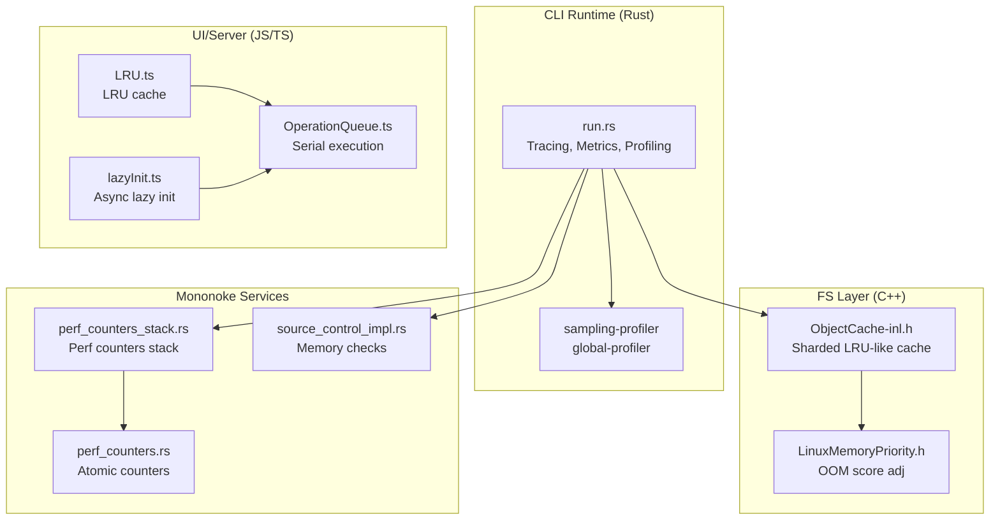
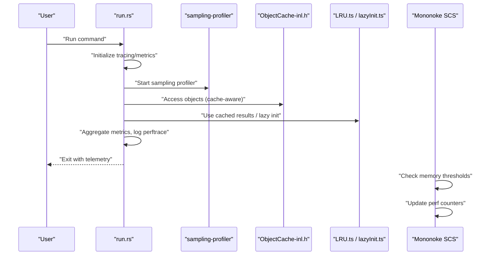
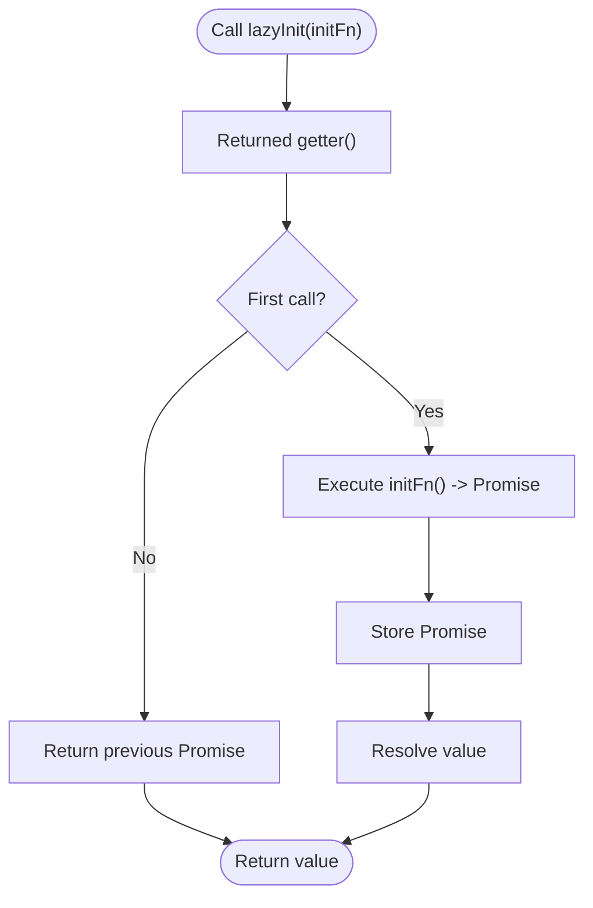
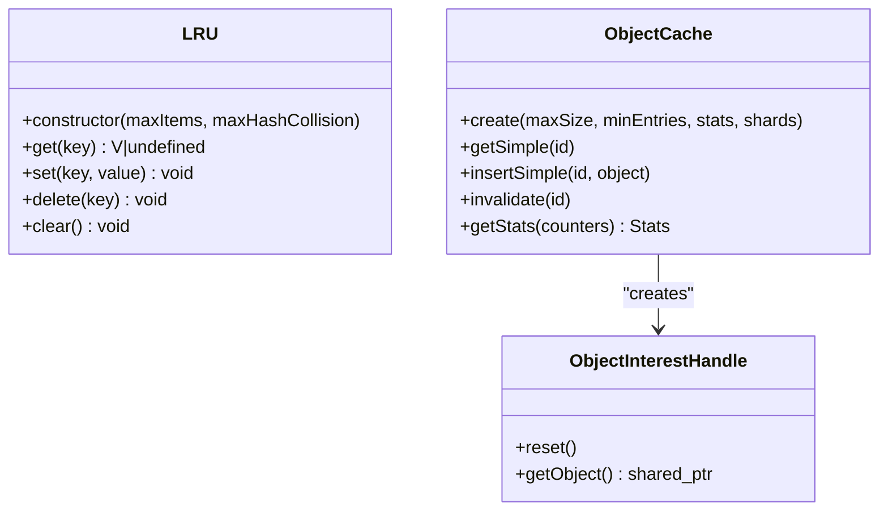
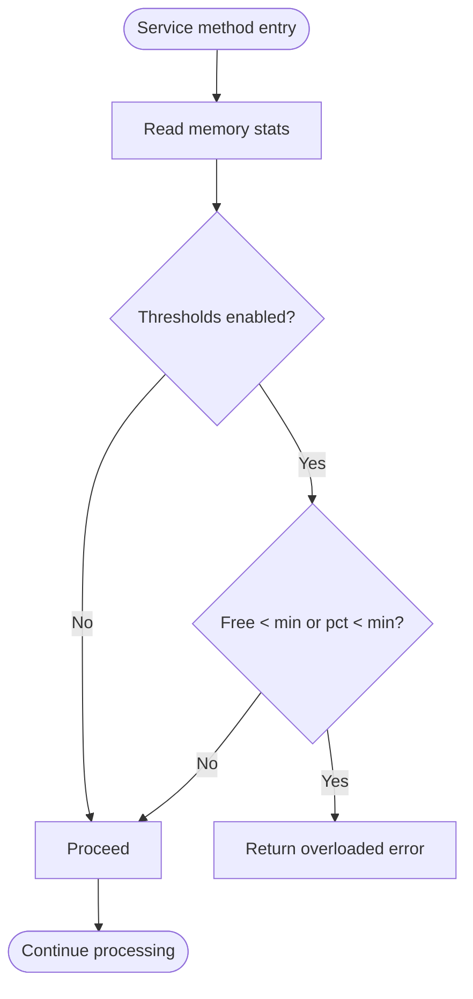
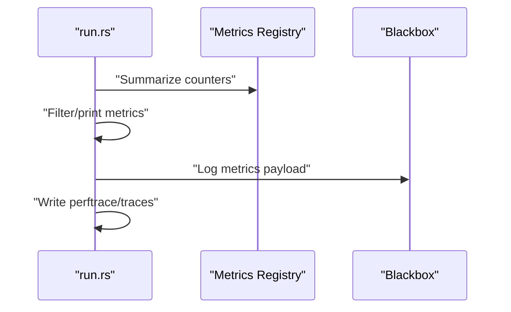
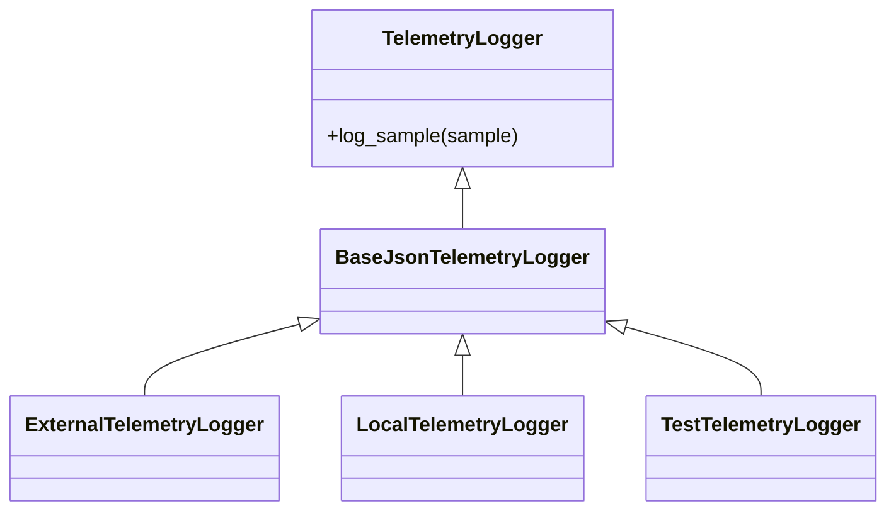
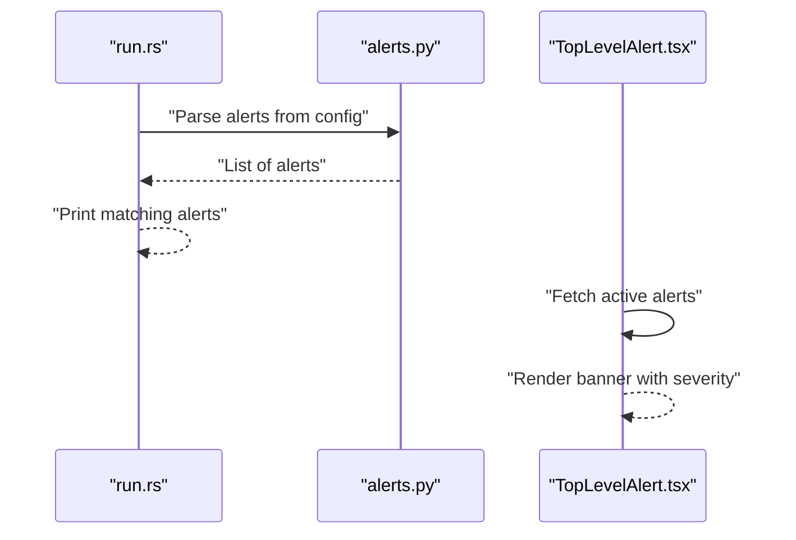
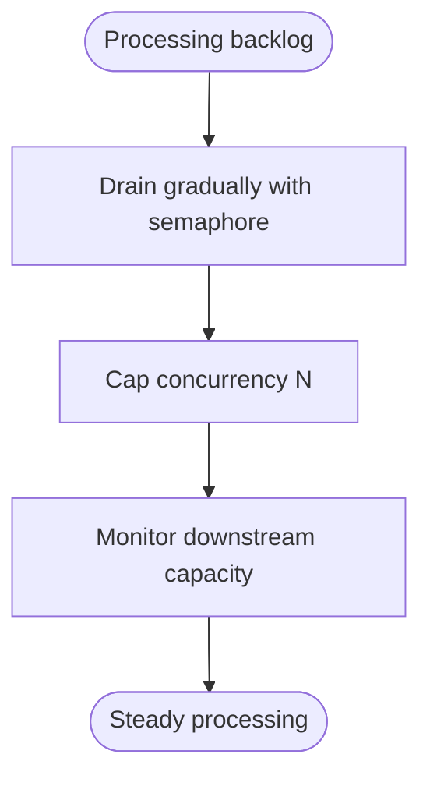
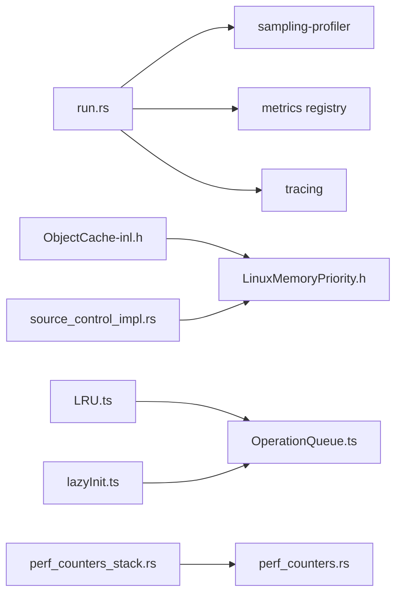

# Performance and Monitoring

<cite>
**Referenced Files in This Document**
- [ObjectCache-inl.h](file://eden/fs/store/ObjectCache-inl.h)
- [LRU.ts](file://addons/shared/LRU.ts)
- [lazyInit.ts](file://addons/shared/lazyInit.ts)
- [lazyInit.ts](file://eden/contrib/shared/lazyInit.ts)
- [run.rs](file://eden/scm/lib/commands/src/run.rs)
- [telemetry.py](file://eden/fs/cli/telemetry.py)
- [perf_counters_stack.rs](file://eden/mononoke/servers/slapi/slapi_server/context/src/perf_counters_stack.rs)
- [perf_counters.rs](file://eden/mononoke/servers/slapi/slapi_server/context/src/perf_counters.rs)
- [OperationQueue.ts](file://addons/isl-server/src/OperationQueue.ts)
- [alerts.py](file://eden/scm/sapling/alerts.py)
- [TopLevelAlert.tsx](file://addons/isl/src/TopLevelAlert.tsx)
- [source_control_impl.rs](file://eden/mononoke/servers/scs/scs_methods/src/source_control_impl.rs)
- [ACR_unbounded_concurrency.md](file://eden/.llms/rules/ACR_unbounded_concurrency.md)
- [LinuxMemoryPriority.h](file://eden/fs/privhelper/priority/LinuxMemoryPriority.h)
- [lib.rs](file://eden/scm/lib/sampling-profiler/global-profiler/src/lib.rs)
- [lib.rs](file://eden/scm/lib/sampling-profiler/src/lib.rs)
- [traceprofimpl.cpp](file://eden/scm/sapling/ext/extlib/traceprofimpl.cpp)
- [traceprof.py](file://eden/scm/sapling/ext/traceprof.py)
- [rss.rs](file://eden/scm/lib/procinfo/examples/rss.rs)
</cite>

## Table of Contents
1. [Introduction](#introduction)
2. [Project Structure](#project-structure)
3. [Core Components](#core-components)
4. [Architecture Overview](#architecture-overview)
5. [Detailed Component Analysis](#detailed-component-analysis)
6. [Dependency Analysis](#dependency-analysis)
7. [Performance Considerations](#performance-considerations)
8. [Troubleshooting Guide](#troubleshooting-guide)
9. [Conclusion](#conclusion)
10. [Appendices](#appendices)

## Introduction
This document explains how SAPLING SCM achieves performance and scalability through lazy loading, memory management, and caching. It also covers performance metrics collection, logging and tracing, diagnostics, monitoring and telemetry, alerting, and benchmarking. Guidance is provided for identifying bottlenecks, applying optimizations, and planning capacity for large repositories.

## Project Structure
The performance and monitoring capabilities span multiple subsystems:
- C++ object caching and memory management in the filesystem layer
- JavaScript/TypeScript caching utilities and lazy initialization in the UI and server
- Rust command runtime with tracing, metrics, and profiling
- Telemetry and alerting infrastructure
- Concurrency and memory pressure controls in Mononoke services

**Diagram sources**
- [run.rs:1-1154](file://eden/scm/lib/commands/src/run.rs#L1-L1154)
- [lib.rs:1-40](file://eden/scm/lib/sampling-profiler/src/lib.rs#L1-L40)
- [lib.rs:1-43](file://eden/scm/lib/sampling-profiler/global-profiler/src/lib.rs#L1-L43)
- [ObjectCache-inl.h:1-581](file://eden/fs/store/ObjectCache-inl.h#L1-L581)
- [LinuxMemoryPriority.h:1-31](file://eden/fs/privhelper/priority/LinuxMemoryPriority.h#L1-L31)
- [LRU.ts:1-344](file://addons/shared/LRU.ts#L1-L344)
- [lazyInit.ts:1-36](file://addons/shared/lazyInit.ts#L1-L36)
- [OperationQueue.ts:1-38](file://addons/isl-server/src/OperationQueue.ts#L1-L38)
- [perf_counters_stack.rs:1-98](file://eden/mononoke/servers/slapi/slapi_server/context/src/perf_counters_stack.rs#L1-L98)
- [perf_counters.rs:253-289](file://eden/mononoke/servers/slapi/slapi_server/context/src/perf_counters.rs#L253-L289)
- [source_control_impl.rs:1122-1156](file://eden/mononoke/servers/scs/scs_methods/src/source_control_impl.rs#L1122-L1156)

**Section sources**
- [run.rs:1-1154](file://eden/scm/lib/commands/src/run.rs#L1-L1154)
- [ObjectCache-inl.h:1-581](file://eden/fs/store/ObjectCache-inl.h#L1-L581)
- [LRU.ts:1-344](file://addons/shared/LRU.ts#L1-L344)
- [lazyInit.ts:1-36](file://addons/shared/lazyInit.ts#L1-L36)
- [OperationQueue.ts:1-38](file://addons/isl-server/src/OperationQueue.ts#L1-L38)
- [perf_counters_stack.rs:1-98](file://eden/mononoke/servers/slapi/slapi_server/context/src/perf_counters_stack.rs#L1-L98)
- [perf_counters.rs:253-289](file://eden/mononoke/servers/slapi/slapi_server/context/src/perf_counters.rs#L253-L289)
- [source_control_impl.rs:1122-1156](file://eden/mononoke/servers/scs/scs_methods/src/source_control_impl.rs#L1122-L1156)
- [LinuxMemoryPriority.h:1-31](file://eden/fs/privhelper/priority/LinuxMemoryPriority.h#L1-L31)
- [lib.rs:1-40](file://eden/scm/lib/sampling-profiler/src/lib.rs#L1-L40)
- [lib.rs:1-43](file://eden/scm/lib/sampling-profiler/global-profiler/src/lib.rs#L1-L43)

## Core Components
- Lazy loading and initialization:
  - Async lazy initializer to defer expensive work until first use and ensure idempotent execution.
  - UI/server caches with LRU eviction and optional auditing.
- Memory management:
  - Sharded object cache with eviction when size exceeds limits.
  - Linux OOM score adjustment to influence kill ordering under memory pressure.
- Performance telemetry and metrics:
  - Structured tracing, metrics aggregation, and periodic sampling.
  - Native and Python backtrace sampling profiler.
- Monitoring and alerting:
  - Runtime alerting surfaced in CLI and UI.
  - Per-operation performance counters and memory checks in services.

**Section sources**
- [lazyInit.ts:1-36](file://addons/shared/lazyInit.ts#L1-L36)
- [lazyInit.ts:1-36](file://eden/contrib/shared/lazyInit.ts#L1-L36)
- [LRU.ts:1-344](file://addons/shared/LRU.ts#L1-L344)
- [ObjectCache-inl.h:517-581](file://eden/fs/store/ObjectCache-inl.h#L517-L581)
- [LinuxMemoryPriority.h:1-31](file://eden/fs/privhelper/priority/LinuxMemoryPriority.h#L1-L31)
- [run.rs:942-1003](file://eden/scm/lib/commands/src/run.rs#L942-L1003)
- [lib.rs:1-40](file://eden/scm/lib/sampling-profiler/src/lib.rs#L1-L40)
- [lib.rs:1-43](file://eden/scm/lib/sampling-profiler/global-profiler/src/lib.rs#L1-L43)
- [alerts.py:52-131](file://eden/scm/sapling/alerts.py#L52-L131)
- [TopLevelAlert.tsx:37-152](file://addons/isl/src/TopLevelAlert.tsx#L37-L152)
- [perf_counters_stack.rs:1-98](file://eden/mononoke/servers/slapi/slapi_server/context/src/perf_counters_stack.rs#L1-L98)
- [perf_counters.rs:253-289](file://eden/mononoke/servers/slapi/slapi_server/context/src/perf_counters.rs#L253-L289)
- [source_control_impl.rs:1122-1156](file://eden/mononoke/servers/scs/scs_methods/src/source_control_impl.rs#L1122-L1156)

## Architecture Overview
The runtime collects performance signals across layers:
- CLI traces and metrics are emitted during command execution.
- Native sampling profiler captures backtraces at intervals.
- UI caches and lazy initialization reduce startup and idle costs.
- Mononoke services maintain counters and enforce memory thresholds.

**Diagram sources**
- [run.rs:1-1154](file://eden/scm/lib/commands/src/run.rs#L1-L1154)
- [lib.rs:1-40](file://eden/scm/lib/sampling-profiler/src/lib.rs#L1-L40)
- [lib.rs:1-43](file://eden/scm/lib/sampling-profiler/global-profiler/src/lib.rs#L1-L43)
- [ObjectCache-inl.h:1-581](file://eden/fs/store/ObjectCache-inl.h#L1-L581)
- [LRU.ts:1-344](file://addons/shared/LRU.ts#L1-L344)
- [lazyInit.ts:1-36](file://addons/shared/lazyInit.ts#L1-L36)
- [source_control_impl.rs:1122-1156](file://eden/mononoke/servers/scs/scs_methods/src/source_control_impl.rs#L1122-L1156)

## Detailed Component Analysis

### Lazy Loading and Initialization
- Async lazy initializer ensures expensive operations are executed once and only when needed.
- UI/server caching utilities provide LRU eviction and optional purity audits.

**Diagram sources**
- [lazyInit.ts:33-36](file://addons/shared/lazyInit.ts#L33-L36)
- [lazyInit.ts:33-36](file://eden/contrib/shared/lazyInit.ts#L33-L36)

**Section sources**
- [lazyInit.ts:1-36](file://addons/shared/lazyInit.ts#L1-L36)
- [lazyInit.ts:1-36](file://eden/contrib/shared/lazyInit.ts#L1-L36)

### Caching Mechanisms
- LRU cache in UI/server:
  - Uses immutable equality semantics and optional auditing.
  - Supports decorator and function wrappers with configurable sizes and extra keys.
- Object cache in FS layer:
  - Sharded cache with eviction queue and size tracking.
  - Interest handles to avoid premature eviction when objects are still needed.

**Diagram sources**
- [LRU.ts:29-99](file://addons/shared/LRU.ts#L29-L99)
- [ObjectCache-inl.h:67-112](file://eden/fs/store/ObjectCache-inl.h#L67-L112)
- [ObjectCache-inl.h:18-61](file://eden/fs/store/ObjectCache-inl.h#L18-L61)

**Section sources**
- [LRU.ts:1-344](file://addons/shared/LRU.ts#L1-L344)
- [ObjectCache-inl.h:1-581](file://eden/fs/store/ObjectCache-inl.h#L1-L581)

### Memory Management and Pressure Controls
- Linux OOM score adjustment influences which processes are killed under memory pressure.
- Mononoke services proactively check free memory against configured thresholds and overload when thresholds are not met.

**Diagram sources**
- [source_control_impl.rs:1122-1156](file://eden/mononoke/servers/scs/scs_methods/src/source_control_impl.rs#L1122-L1156)
- [LinuxMemoryPriority.h:1-31](file://eden/fs/privhelper/priority/LinuxMemoryPriority.h#L1-L31)

**Section sources**
- [LinuxMemoryPriority.h:1-31](file://eden/fs/privhelper/priority/LinuxMemoryPriority.h#L1-L31)
- [source_control_impl.rs:1122-1156](file://eden/mononoke/servers/scs/scs_methods/src/source_control_impl.rs#L1122-L1156)

### Performance Metrics Collection and Logging
- CLI runtime aggregates metrics, prints filtered subsets, and logs structured events.
- Tracing integrates with a reloadable environment filter and supports writing trace artifacts.

**Diagram sources**
- [run.rs:942-1003](file://eden/scm/lib/commands/src/run.rs#L942-L1003)
- [run.rs:717-845](file://eden/scm/lib/commands/src/run.rs#L717-L845)

**Section sources**
- [run.rs:942-1003](file://eden/scm/lib/commands/src/run.rs#L942-L1003)
- [run.rs:421-527](file://eden/scm/lib/commands/src/run.rs#L421-L527)

### Telemetry and Diagnostics
- Telemetry loggers support external processes, local files, and in-memory test recording.
- Sampling profiler captures backtraces and writes summaries, optionally persisted.

**Diagram sources**
- [telemetry.py:262-357](file://eden/fs/cli/telemetry.py#L262-L357)

**Section sources**
- [telemetry.py:255-379](file://eden/fs/cli/telemetry.py#L255-L379)
- [lib.rs:1-40](file://eden/scm/lib/sampling-profiler/src/lib.rs#L1-L40)
- [lib.rs:1-43](file://eden/scm/lib/sampling-profiler/global-profiler/src/lib.rs#L1-L43)

### Monitoring and Alerting
- Runtime alerts are parsed from configuration and printed in CLI; shown in UI with severity badges and dismissal.
- Mononoke services can enforce memory thresholds and return overload errors.

**Diagram sources**
- [alerts.py:52-131](file://eden/scm/sapling/alerts.py#L52-L131)
- [TopLevelAlert.tsx:37-152](file://addons/isl/src/TopLevelAlert.tsx#L37-L152)

**Section sources**
- [alerts.py:52-131](file://eden/scm/sapling/alerts.py#L52-L131)
- [TopLevelAlert.tsx:37-152](file://addons/isl/src/TopLevelAlert.tsx#L37-L152)
- [source_control_impl.rs:1122-1156](file://eden/mononoke/servers/scs/scs_methods/src/source_control_impl.rs#L1122-L1156)

### Concurrency and Backlog Control
- Guidance to cap concurrency and drain backlogs gradually to avoid “backlog stampede” and “rate limit bypass” anti-patterns.

**Diagram sources**
- [ACR_unbounded_concurrency.md:46-87](file://eden/.llms/rules/ACR_unbounded_concurrency.md#L46-L87)

**Section sources**
- [ACR_unbounded_concurrency.md:46-87](file://eden/.llms/rules/ACR_unbounded_concurrency.md#L46-L87)

## Dependency Analysis
- CLI runtime depends on tracing, metrics, and sampling profiler crates.
- FS layer depends on sharded cache and eviction utilities.
- UI/server depends on LRU and lazy initialization utilities.
- Mononoke services depend on memory stats and perf counters.

**Diagram sources**
- [run.rs:1-1154](file://eden/scm/lib/commands/src/run.rs#L1-L1154)
- [lib.rs:1-40](file://eden/scm/lib/sampling-profiler/src/lib.rs#L1-L40)
- [ObjectCache-inl.h:1-581](file://eden/fs/store/ObjectCache-inl.h#L1-L581)
- [LinuxMemoryPriority.h:1-31](file://eden/fs/privhelper/priority/LinuxMemoryPriority.h#L1-L31)
- [LRU.ts:1-344](file://addons/shared/LRU.ts#L1-L344)
- [lazyInit.ts:1-36](file://addons/shared/lazyInit.ts#L1-L36)
- [OperationQueue.ts:1-38](file://addons/isl-server/src/OperationQueue.ts#L1-L38)
- [perf_counters_stack.rs:1-98](file://eden/mononoke/servers/slapi/slapi_server/context/src/perf_counters_stack.rs#L1-L98)
- [perf_counters.rs:253-289](file://eden/mononoke/servers/slapi/slapi_server/context/src/perf_counters.rs#L253-L289)
- [source_control_impl.rs:1122-1156](file://eden/mononoke/servers/scs/scs_methods/src/source_control_impl.rs#L1122-L1156)

**Section sources**
- [run.rs:1-1154](file://eden/scm/lib/commands/src/run.rs#L1-L1154)
- [ObjectCache-inl.h:1-581](file://eden/fs/store/ObjectCache-inl.h#L1-L581)
- [LRU.ts:1-344](file://addons/shared/LRU.ts#L1-L344)
- [lazyInit.ts:1-36](file://addons/shared/lazyInit.ts#L1-L36)
- [OperationQueue.ts:1-38](file://addons/isl-server/src/OperationQueue.ts#L1-L38)
- [perf_counters_stack.rs:1-98](file://eden/mononoke/servers/slapi/slapi_server/context/src/perf_counters_stack.rs#L1-L98)
- [perf_counters.rs:253-289](file://eden/mononoke/servers/slapi/slapi_server/context/src/perf_counters.rs#L253-L289)
- [source_control_impl.rs:1122-1156](file://eden/mononoke/servers/scs/scs_methods/src/source_control_impl.rs#L1122-L1156)
- [LinuxMemoryPriority.h:1-31](file://eden/fs/privhelper/priority/LinuxMemoryPriority.h#L1-L31)

## Performance Considerations
- Prefer lazy initialization for expensive resources to reduce cold-start latency and memory footprint.
- Use LRU caches with appropriate sizes and auditing to balance hit rates and memory usage.
- Employ sharded caches and bounded concurrency to avoid hot shard contention and backlog stampedes.
- Monitor memory pressure and proactively reject or throttle requests when thresholds are exceeded.
- Capture periodic traces and metrics to detect regressions and locate hot paths.
- Use sampling profilers to resolve backtraces and correlate CPU time with high-level operations.

[No sources needed since this section provides general guidance]

## Troubleshooting Guide
- Use CLI tracing and perftrace outputs to diagnose slow commands and blocked I/O.
- Inspect metrics filtered by prefixes and skip lists to focus on relevant counters.
- Review telemetry logs and external telemetry sinks for operational visibility.
- Check runtime alerts in CLI and UI banners for ongoing issues.
- Verify memory thresholds and OOM score adjustments when encountering instability under load.

**Section sources**
- [run.rs:897-940](file://eden/scm/lib/commands/src/run.rs#L897-L940)
- [run.rs:942-1003](file://eden/scm/lib/commands/src/run.rs#L942-L1003)
- [telemetry.py:271-312](file://eden/fs/cli/telemetry.py#L271-L312)
- [alerts.py:52-131](file://eden/scm/sapling/alerts.py#L52-L131)
- [TopLevelAlert.tsx:37-152](file://addons/isl/src/TopLevelAlert.tsx#L37-L152)
- [source_control_impl.rs:1122-1156](file://eden/mononoke/servers/scs/scs_methods/src/source_control_impl.rs#L1122-L1156)

## Conclusion
SAPLING SCM’s performance and monitoring stack combines lazy initialization, robust caching, memory pressure controls, and comprehensive telemetry. By leveraging these mechanisms—alongside careful concurrency and capacity planning—teams can sustain performance in large repositories and quickly diagnose issues in production.

[No sources needed since this section summarizes without analyzing specific files]

## Appendices

### Benchmarking and Memory Measurement Utilities
- Example program to measure RSS growth and verify memory accounting.
- Sampling profiler APIs and backtrace collector for CPU profiling.

**Section sources**
- [rss.rs:1-22](file://eden/scm/lib/procinfo/examples/rss.rs#L1-L22)
- [lib.rs:1-40](file://eden/scm/lib/sampling-profiler/src/lib.rs#L1-L40)
- [lib.rs:1-43](file://eden/scm/lib/sampling-profiler/global-profiler/src/lib.rs#L1-L43)
- [traceprofimpl.cpp:195-474](file://eden/scm/sapling/ext/extlib/traceprofimpl.cpp#L195-L474)
- [traceprof.py:1-18](file://eden/scm/sapling/ext/traceprof.py#L1-L18)