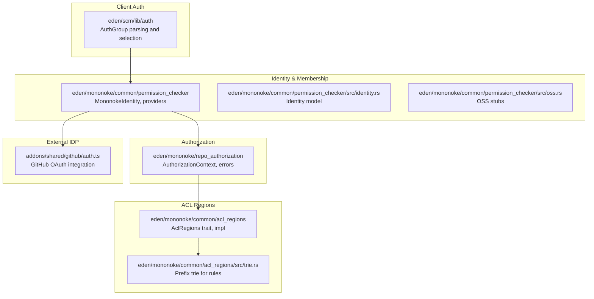
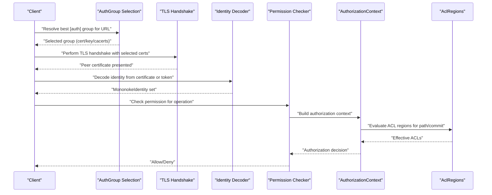
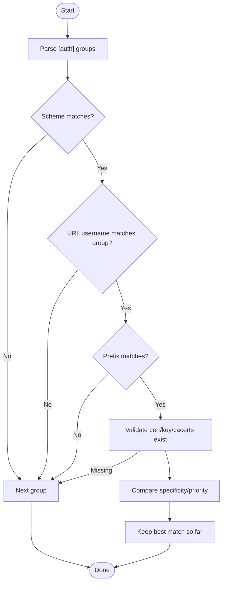
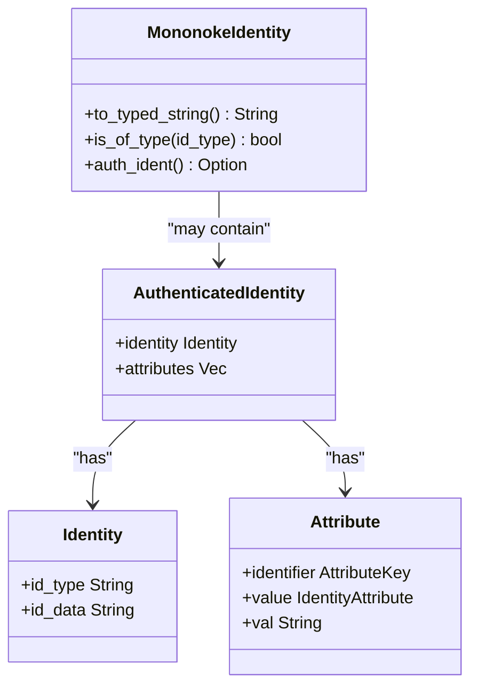
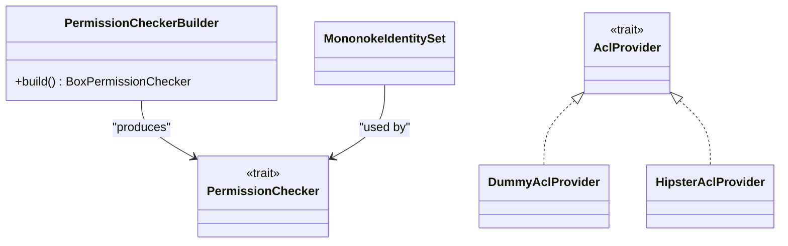
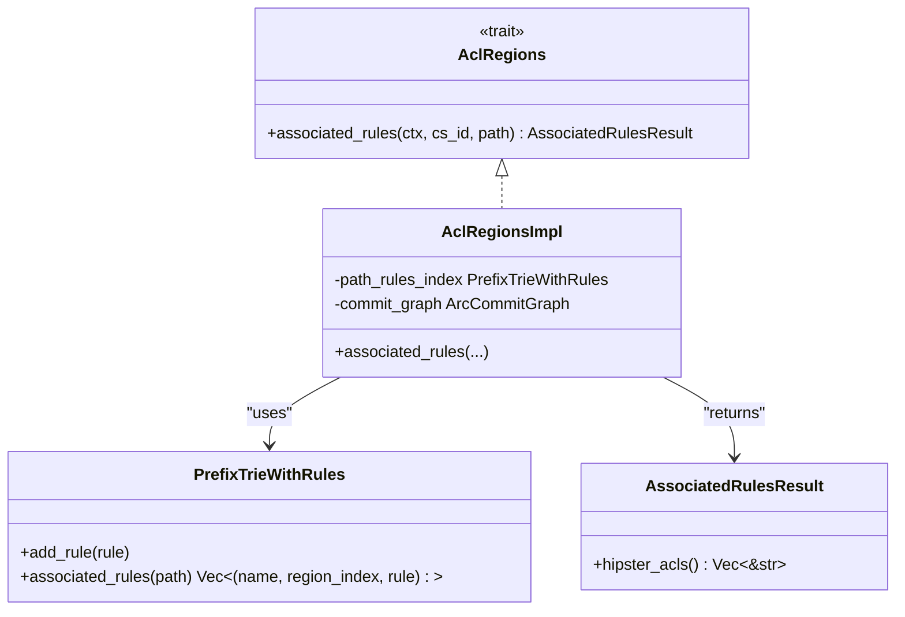
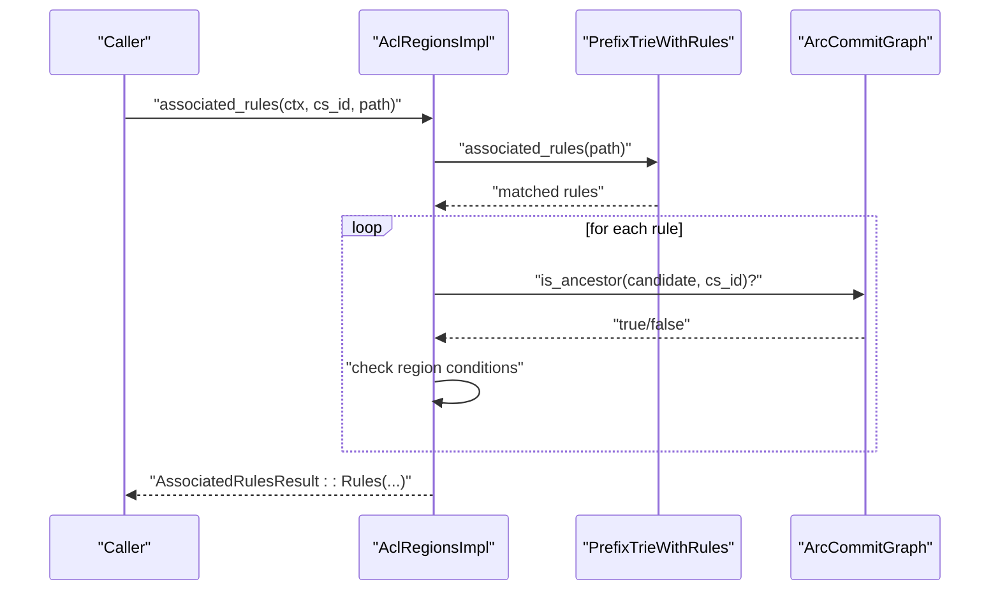
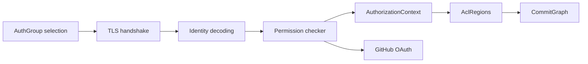

# Authentication & Authorization

<cite>
**Referenced Files in This Document**
- [lib.rs](file://eden/scm/lib/auth/src/lib.rs)
- [lib.rs](file://eden/mononoke/common/permission_checker/src/lib.rs)
- [identity.rs](file://eden/mononoke/common/permission_checker/src/identity.rs)
- [oss.rs](file://eden/mononoke/common/permission_checker/src/oss.rs)
- [lib.rs](file://eden/mononoke/repo_authorization/src/lib.rs)
- [lib.rs](file://eden/mononoke/common/acl_regions/src/lib.rs)
- [trie.rs](file://eden/mononoke/common/acl_regions/src/trie.rs)
- [main.rs](file://eden/mononoke/common/acl_regions/test/main.rs)
- [auth.ts](file://addons/shared/github/auth.ts)
</cite>

## Table of Contents
1. [Introduction](#introduction)
2. [Project Structure](#project-structure)
3. [Core Components](#core-components)
4. [Architecture Overview](#architecture-overview)
5. [Detailed Component Analysis](#detailed-component-analysis)
6. [Dependency Analysis](#dependency-analysis)
7. [Performance Considerations](#performance-considerations)
8. [Troubleshooting Guide](#troubleshooting-guide)
9. [Conclusion](#conclusion)
10. [Appendices](#appendices)

## Introduction
This document explains the authentication and authorization systems in SAPLING SCM. It covers client-side TLS-based authentication, identity representation and decoding, repository-level authorization checks, ACL region-based policy evaluation, and integration points with external identity providers. It also provides best practices, audit and compliance considerations, and guidance for user and group administration along with troubleshooting.

## Project Structure
The authentication and authorization logic spans multiple crates:
- Client-side authentication configuration and selection for TLS client certificates and credentials.
- Identity modeling and decoding for authenticated identities.
- Permission checking abstractions and providers.
- Repository authorization context and errors.
- ACL region system for path-based policy association and evaluation.
- GitHub OAuth integration for external identity provider flows.

**Diagram sources**
- [lib.rs:1-455](file://eden/scm/lib/auth/src/lib.rs#L1-L455)
- [lib.rs:1-42](file://eden/mononoke/common/permission_checker/src/lib.rs#L1-L42)
- [identity.rs:88-243](file://eden/mononoke/common/permission_checker/src/identity.rs#L88-L243)
- [oss.rs:1-144](file://eden/mononoke/common/permission_checker/src/oss.rs#L1-L144)
- [lib.rs:1-16](file://eden/mononoke/repo_authorization/src/lib.rs#L1-L16)
- [lib.rs:1-182](file://eden/mononoke/common/acl_regions/src/lib.rs#L1-L182)
- [trie.rs:39-120](file://eden/mononoke/common/acl_regions/src/trie.rs#L39-L120)
- [auth.ts](file://addons/shared/github/auth.ts)

**Section sources**
- [lib.rs:1-455](file://eden/scm/lib/auth/src/lib.rs#L1-L455)
- [lib.rs:1-42](file://eden/mononoke/common/permission_checker/src/lib.rs#L1-L42)
- [lib.rs:1-16](file://eden/mononoke/repo_authorization/src/lib.rs#L1-L16)
- [lib.rs:1-182](file://eden/mononoke/common/acl_regions/src/lib.rs#L1-L182)
- [trie.rs:39-120](file://eden/mononoke/common/acl_regions/src/trie.rs#L39-L120)
- [auth.ts](file://addons/shared/github/auth.ts)

## Core Components
- Client TLS authentication configuration and selection:
  - Parses Mercurial-style [auth] groups, resolves best matching group for a URL, validates presence of required certificate/key bundles, and supports scheme-specific and priority-based selection.
- Identity representation and decoding:
  - Provides a unified identity model with typed identity data and optional authenticated attributes; includes OSS stubs for decoding X509 subjects and JSON-encoded identities.
- Permission checking and ACL providers:
  - Exposes permission checker traits and providers, with default provider selection depending on build mode.
- Repository authorization context:
  - Defines authorization context and error types for repository write operations.
- ACL region system:
  - Associates path prefixes with region rules and evaluates whether a commit is within a region to derive effective ACLs.
- External identity provider integration:
  - GitHub OAuth integration for external identity flows.

**Section sources**
- [lib.rs:37-114](file://eden/scm/lib/auth/src/lib.rs#L37-L114)
- [lib.rs:122-255](file://eden/scm/lib/auth/src/lib.rs#L122-L255)
- [lib.rs:19-42](file://eden/mononoke/common/permission_checker/src/lib.rs#L19-L42)
- [identity.rs:88-243](file://eden/mononoke/common/permission_checker/src/identity.rs#L88-L243)
- [oss.rs:53-102](file://eden/mononoke/common/permission_checker/src/oss.rs#L53-L102)
- [lib.rs:13-16](file://eden/mononoke/repo_authorization/src/lib.rs#L13-L16)
- [lib.rs:27-58](file://eden/mononoke/common/acl_regions/src/lib.rs#L27-L58)
- [auth.ts](file://addons/shared/github/auth.ts)

## Architecture Overview
The system combines client TLS authentication with identity modeling and repository authorization checks. Policy enforcement can be augmented by ACL regions that associate path prefixes with region rules evaluated against commit ancestry.

**Diagram sources**
- [lib.rs:160-255](file://eden/scm/lib/auth/src/lib.rs#L160-L255)
- [oss.rs:66-83](file://eden/mononoke/common/permission_checker/src/oss.rs#L66-L83)
- [lib.rs:19-42](file://eden/mononoke/common/permission_checker/src/lib.rs#L19-L42)
- [lib.rs:13-16](file://eden/mononoke/repo_authorization/src/lib.rs#L13-L16)
- [lib.rs:114-153](file://eden/mononoke/common/acl_regions/src/lib.rs#L114-L153)

## Detailed Component Analysis

### Client TLS Authentication and Credential Resolution
- Parses [auth] groups with fields for prefix, cert, key, cacerts, username, schemes, priority, and arbitrary extras.
- Resolves the best matching group for a given URL by comparing scheme, username, and prefix specificity, with tie-breakers based on priority and presence of username.
- Validates existence of certificate files and reports missing files via a structured error.
- Falls back to global CA bundle if configured.

**Diagram sources**
- [lib.rs:160-255](file://eden/scm/lib/auth/src/lib.rs#L160-L255)

**Section sources**
- [lib.rs:37-114](file://eden/scm/lib/auth/src/lib.rs#L37-L114)
- [lib.rs:122-255](file://eden/scm/lib/auth/src/lib.rs#L122-L255)

### Identity Modeling and Decoding
- Identity model supports typed identity data and optional authenticated attributes.
- Provides decoding from X509 certificates (subject name) and stubbed support for JSON/SSH encodings in OSS builds.
- Offers convenience methods to convert identities to typed strings and to filter/concatenate identity types.

**Diagram sources**
- [identity.rs:88-243](file://eden/mononoke/common/permission_checker/src/identity.rs#L88-L243)
- [oss.rs:23-102](file://eden/mononoke/common/permission_checker/src/oss.rs#L23-L102)

**Section sources**
- [identity.rs:88-243](file://eden/mononoke/common/permission_checker/src/identity.rs#L88-L243)
- [oss.rs:53-102](file://eden/mononoke/common/permission_checker/src/oss.rs#L53-L102)

### Permission Checking and ACL Providers
- Exposes permission checker builder and traits for pluggable permission evaluation.
- Default ACL provider selection depends on build mode (Facebook vs OSS).
- Includes membership checkers and dummy providers for OSS builds.

**Diagram sources**
- [lib.rs:19-42](file://eden/mononoke/common/permission_checker/src/lib.rs#L19-L42)

**Section sources**
- [lib.rs:1-42](file://eden/mononoke/common/permission_checker/src/lib.rs#L1-L42)

### Repository Authorization Context
- Defines authorization context and error types for repository write operations.
- Forms the bridge between permission checks and repository-level decisions.

**Section sources**
- [lib.rs:13-16](file://eden/mononoke/repo_authorization/src/lib.rs#L13-L16)

### ACL Region System
- Associates path prefixes with region rules and evaluates whether a commit is within a region using ancestor/descendant checks against roots and heads.
- Uses a prefix trie to efficiently discover applicable rules for a given path.
- Supports disabled mode when no configuration is provided.

**Diagram sources**
- [lib.rs:27-58](file://eden/mononoke/common/acl_regions/src/lib.rs#L27-L58)
- [lib.rs:60-153](file://eden/mononoke/common/acl_regions/src/lib.rs#L60-L153)
- [trie.rs:39-120](file://eden/mononoke/common/acl_regions/src/trie.rs#L39-L120)

**Diagram sources**
- [lib.rs:114-153](file://eden/mononoke/common/acl_regions/src/lib.rs#L114-L153)
- [trie.rs:64-89](file://eden/mononoke/common/acl_regions/src/trie.rs#L64-L89)

**Section sources**
- [lib.rs:27-58](file://eden/mononoke/common/acl_regions/src/lib.rs#L27-L58)
- [lib.rs:60-153](file://eden/mononoke/common/acl_regions/src/lib.rs#L60-L153)
- [trie.rs:39-120](file://eden/mononoke/common/acl_regions/src/trie.rs#L39-L120)
- [main.rs:110-147](file://eden/mononoke/common/acl_regions/test/main.rs#L110-L147)

### External Identity Provider Integration (GitHub OAuth)
- Provides GitHub OAuth integration for external identity flows, enabling user authentication and group membership resolution outside the local system.

**Section sources**
- [auth.ts](file://addons/shared/github/auth.ts)

## Dependency Analysis
- Client TLS auth depends on URL parsing and filesystem checks for certificate presence.
- Identity decoding integrates with TLS certificate handling and is used by permission checking.
- Permission checking relies on authorization context and ACL providers.
- ACL regions depend on commit graph traversal and path prefix matching.

**Diagram sources**
- [lib.rs:160-255](file://eden/scm/lib/auth/src/lib.rs#L160-L255)
- [oss.rs:66-83](file://eden/mononoke/common/permission_checker/src/oss.rs#L66-L83)
- [lib.rs:19-42](file://eden/mononoke/common/permission_checker/src/lib.rs#L19-L42)
- [lib.rs:13-16](file://eden/mononoke/repo_authorization/src/lib.rs#L13-L16)
- [lib.rs:60-153](file://eden/mononoke/common/acl_regions/src/lib.rs#L60-L153)

**Section sources**
- [lib.rs:160-255](file://eden/scm/lib/auth/src/lib.rs#L160-L255)
- [oss.rs:66-83](file://eden/mononoke/common/permission_checker/src/oss.rs#L66-L83)
- [lib.rs:19-42](file://eden/mononoke/common/permission_checker/src/lib.rs#L19-L42)
- [lib.rs:13-16](file://eden/mononoke/repo_authorization/src/lib.rs#L13-L16)
- [lib.rs:60-153](file://eden/mononoke/common/acl_regions/src/lib.rs#L60-L153)

## Performance Considerations
- ACL region evaluation uses buffered ancestor checks against candidate roots/heads; tuning the buffer size can balance throughput and resource usage.
- Prefix trie lookup for region rules is efficient for large rule sets; ensure rule cardinality and path depth are reasonable.
- Certificate file existence checks occur during auth group selection; caching resolved groups can reduce repeated filesystem checks.

[No sources needed since this section provides general guidance]

## Troubleshooting Guide
- Missing TLS certificates or keys:
  - Symptom: Best match selection fails with a structured error indicating missing files.
  - Action: Verify paths for cert, key, and cacerts; ensure they exist and are readable; confirm scheme and prefix match expectations.
- Ambiguous auth group selection:
  - Symptom: Unexpected group chosen when multiple entries match.
  - Action: Adjust prefix specificity, priority, or username presence to disambiguate; validate precedence rules.
- Identity decoding failures:
  - Symptom: OSS builds report unsupported decoding paths; X509 decoding requires valid certificate subject.
  - Action: Ensure proper certificate chain and subject; for OSS builds, use supported identity types.
- ACL regions disabled:
  - Symptom: No region rules returned.
  - Action: Enable ACL region configuration; verify allow rules and commit graph availability.
- Authorization denied:
  - Symptom: Operation blocked by authorization context.
  - Action: Review effective ACLs derived from ACL regions and identity/membership; confirm permission checker configuration.

**Section sources**
- [lib.rs:244-254](file://eden/scm/lib/auth/src/lib.rs#L244-L254)
- [oss.rs:58-64](file://eden/mononoke/common/permission_checker/src/oss.rs#L58-L64)
- [lib.rs:155-167](file://eden/mononoke/common/acl_regions/src/lib.rs#L155-L167)
- [lib.rs:15-16](file://eden/mononoke/repo_authorization/src/lib.rs#L15-L16)

## Conclusion
SAPLING SCM’s authentication and authorization system combines robust client TLS credential resolution with flexible identity modeling and repository-level authorization checks. ACL regions enable precise, path-scoped policy evaluation, while external identity provider integration supports modern identity flows. By understanding the components and their interactions, administrators can configure secure and maintainable access controls aligned with organizational policies.

[No sources needed since this section summarizes without analyzing specific files]

## Appendices

### Security Best Practices
- Prefer HTTPS with validated CA bundles and strong certificate chains.
- Use least-privilege identities and limit certificate/key lifetimes.
- Regularly audit [auth] group configurations and remove unused entries.
- Monitor ACL region rule coverage and ensure commit graph integrity for accurate policy evaluation.

[No sources needed since this section provides general guidance]

### Audit Logging and Compliance
- Log TLS handshake outcomes, identity decoding results, and authorization decisions for audit trails.
- Retain logs for compliance periods and protect log storage with appropriate access controls.
- Periodically review effective ACLs and region rule applicability for regulatory adherence.

[No sources needed since this section provides general guidance]

### User Management and Group Administration
- Define [auth] groups per environment or tenant with distinct prefixes and priorities.
- Use external identity providers (e.g., GitHub) to manage group memberships and propagate roles to ACLs.
- Maintain separation of duties by assigning administrative privileges to dedicated identities and limiting direct certificate issuance.

[No sources needed since this section provides general guidance]