# Blob Store Architecture

<cite>
**Referenced Files in This Document**
- [2.4-storage-architecture.md](file://eden/mononoke/docs/2.4-storage-architecture.md)
- [lib.rs](file://eden/mononoke/blobstore/src/lib.rs)
- [Cargo.toml](file://eden/mononoke/blobstore/Cargo.toml)
- [lib.rs](file://eden/mononoke/blobstore/cacheblob/src/lib.rs)
- [lib.rs](file://eden/mononoke/blobstore/fileblob/src/lib.rs)
- [lib.rs](file://eden/mononoke/blobstore/sqlblob/src/lib.rs)
- [lib.rs](file://eden/mononoke/blobstore/s3blob/src/lib.rs)
- [lib.rs](file://eden/mononoke/blobstore/multiplexedblob/src/lib.rs)
- [lib.rs](file://eden/mononoke/blobstore/prefixblob/src/lib.rs)
- [lib.rs](file://eden/mononoke/blobstore/packblob/src/lib.rs)
- [lib.rs](file://eden/mononoke/blobstore/redactedblobstore/src/lib.rs)
- [lib.rs](file://eden/mononoke/blobstore/throttledblob/src/lib.rs)
- [lib.rs](file://eden/mononoke/blobstore/logblob/src/lib.rs)
- [lib.rs](file://eden/mononoke/blobstore/readonlyblob/src/lib.rs)
- [lib.rs](file://eden/mononoke/blobstore/ephemeral_blobstore/src/lib.rs)
- [lib.rs](file://eden/mononoke/blobstore/virtually_sharded_blobstore/src/lib.rs)
- [lib.rs](file://eden/mononoke/blobstore/factory/src/lib.rs)
- [dummy.rs](file://eden/mononoke/jobs/blobstore_healer/src/dummy.rs)
- [failing_blobstore.rs](file://eden/mononoke/repo_attributes/filestore/src/test/failing_blobstore.rs)
</cite>

## Table of Contents
1. [Introduction](#introduction)
2. [Project Structure](#project-structure)
3. [Core Components](#core-components)
4. [Architecture Overview](#architecture-overview)
5. [Detailed Component Analysis](#detailed-component-analysis)
6. [Dependency Analysis](#dependency-analysis)
7. [Performance Considerations](#performance-considerations)
8. [Troubleshooting Guide](#troubleshooting-guide)
9. [Conclusion](#conclusion)

## Introduction
This document explains the blob store architecture used by SAPLING SCM (Mononoke). It covers the content-addressable storage model, blob identification and addressing, storage abstraction layers, and the composition of concrete implementations such as cacheblob, multiplexedblob, prefixblob, and specialized stores like s3blob and sqlblob. It also documents the blob store factory pattern, configuration options, backend selection strategies, lifecycle management, garbage collection, and operational decorators. Finally, it outlines performance characteristics, scalability considerations, and integration patterns with the broader storage system.

## Project Structure
The blob store system is implemented as a set of Rust crates under the Mononoke codebase. The central abstraction lives in the blobstore crate, with numerous backend and decorator implementations organized as sibling crates. The storage architecture documentation provides a high-level overview of the system and the intended stack composition.

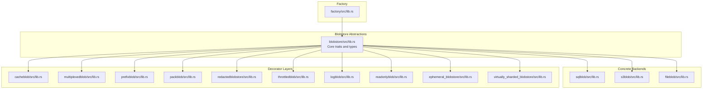

**Diagram sources**
- [lib.rs:327-406](file://eden/mononoke/blobstore/src/lib.rs#L327-L406)
- [Cargo.toml:14-44](file://eden/mononoke/blobstore/Cargo.toml#L14-L44)
- [lib.rs:1-31](file://eden/mononoke/blobstore/cacheblob/src/lib.rs#L1-L31)
- [lib.rs:1-200](file://eden/mononoke/blobstore/multiplexedblob/src/lib.rs#L1-L200)
- [lib.rs:1-200](file://eden/mononoke/blobstore/prefixblob/src/lib.rs#L1-L200)
- [lib.rs:1-200](file://eden/mononoke/blobstore/packblob/src/lib.rs#L1-L200)
- [lib.rs:1-200](file://eden/mononoke/blobstore/redactedblobstore/src/lib.rs#L1-L200)
- [lib.rs:1-200](file://eden/mononoke/blobstore/throttledblob/src/lib.rs#L1-L200)
- [lib.rs:1-200](file://eden/mononoke/blobstore/logblob/src/lib.rs#L1-L200)
- [lib.rs:1-200](file://eden/mononoke/blobstore/readonlyblob/src/lib.rs#L1-L200)
- [lib.rs:1-200](file://eden/mononoke/blobstore/ephemeral_blobstore/src/lib.rs#L1-L200)
- [lib.rs:1-200](file://eden/mononoke/blobstore/virtually_sharded_blobstore/src/lib.rs#L1-L200)
- [lib.rs:1-200](file://eden/mononoke/blobstore/factory/src/lib.rs#L1-L200)

**Section sources**
- [2.4-storage-architecture.md:1-207](file://eden/mononoke/docs/2.4-storage-architecture.md#L1-L207)
- [Cargo.toml:1-44](file://eden/mononoke/blobstore/Cargo.toml#L1-L44)

## Core Components
The blob store system centers around a small set of core traits and types that define the contract for all blob storage implementations. These include the primary Blobstore trait, a keyed variant, and supporting types for metadata, presence checks, and enumeration.

- Blobstore trait: Defines asynchronous get, put, is_present, copy, and unlink operations with strong durability guarantees.
- KeyedBlobstore trait: A variant that focuses on key-based operations.
- BlobstoreBytes and BlobstoreGetData: Encapsulation of stored bytes and optional metadata.
- BlobstoreMetadata and SizeMetadata: Optional metadata for timestamps and size accounting.
- BlobstoreIsPresent: Presence result with three outcomes (present, absent, possibly not present).
- BlobstoreKeySource and enumeration: Optional enumeration of keys with range support.
- PutBehaviour and OverwriteStatus: Controls write semantics and reports overwrite outcomes.

These abstractions enable uniform behavior across diverse backends and decorators, allowing stacks to be composed predictably.

**Section sources**
- [lib.rs:327-406](file://eden/mononoke/blobstore/src/lib.rs#L327-L406)
- [lib.rs:408-451](file://eden/mononoke/blobstore/src/lib.rs#L408-L451)
- [lib.rs:67-131](file://eden/mononoke/blobstore/src/lib.rs#L67-L131)
- [lib.rs:176-197](file://eden/mononoke/blobstore/src/lib.rs#L176-L197)
- [lib.rs:273-300](file://eden/mononoke/blobstore/src/lib.rs#L273-L300)
- [lib.rs:515-547](file://eden/mononoke/blobstore/src/lib.rs#L515-L547)
- [lib.rs:453-499](file://eden/mononoke/blobstore/src/lib.rs#L453-L499)
- [lib.rs:501-513](file://eden/mononoke/blobstore/src/lib.rs#L501-L513)

## Architecture Overview
The blob store architecture is content-addressable and immutable. Blobs are addressed by unique keys and are never modified after creation. The system separates immutable blob data from mutable metadata, enabling different optimization strategies for each.

- Immutable Blobstore: Stores core and derived data using content-addressed keys, often hashed with Blake2b, enabling deduplication and integrity verification.
- Production Backends: Manifoldblob (distributed storage), SQLblob (MySQL/SQLite), S3blob (AWS S3).
- Operational Decorators: Redactedblobstore, Samplingblob, Throttledblob, Logblob, Readonlyblob.
- Specialized Storage: Ephemeral blobstore for temporary objects, Virtually Sharded Blobstore for request deduplication.
- Factory Pattern: Composes decorator stacks based on configuration.

A typical production stack composes decorators in a specific order to achieve availability, caching, and robustness.

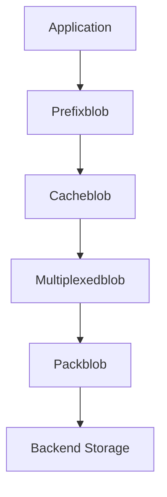

**Diagram sources**
- [2.4-storage-architecture.md:109-136](file://eden/mononoke/docs/2.4-storage-architecture.md#L109-L136)

**Section sources**
- [2.4-storage-architecture.md:23-136](file://eden/mononoke/docs/2.4-storage-architecture.md#L23-L136)

## Detailed Component Analysis

### Blobstore Abstraction Layer
The core traits define a uniform interface for all blob stores, ensuring atomicity, durability, and consistent semantics across implementations. The presence-checking mechanism avoids unnecessary data transfer, and copy operations can be optimized by backends that support server-side duplication.

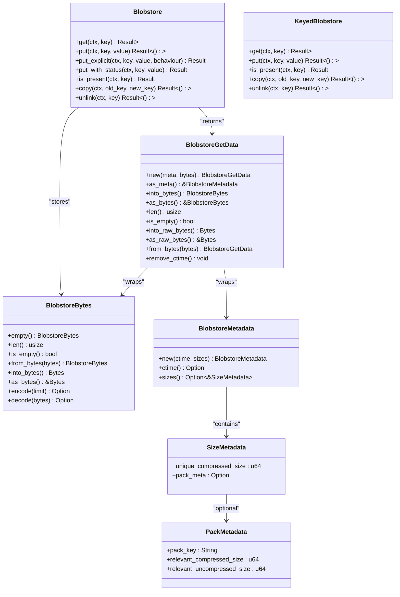

**Diagram sources**
- [lib.rs:327-406](file://eden/mononoke/blobstore/src/lib.rs#L327-L406)
- [lib.rs:408-451](file://eden/mononoke/blobstore/src/lib.rs#L408-L451)
- [lib.rs:67-131](file://eden/mononoke/blobstore/src/lib.rs#L67-L131)
- [lib.rs:176-197](file://eden/mononoke/blobstore/src/lib.rs#L176-L197)
- [lib.rs:154-174](file://eden/mononoke/blobstore/src/lib.rs#L154-L174)

**Section sources**
- [lib.rs:327-406](file://eden/mononoke/blobstore/src/lib.rs#L327-L406)
- [lib.rs:408-451](file://eden/mononoke/blobstore/src/lib.rs#L408-L451)
- [lib.rs:67-131](file://eden/mononoke/blobstore/src/lib.rs#L67-L131)
- [lib.rs:154-197](file://eden/mononoke/blobstore/src/lib.rs#L154-L197)

### Cacheblob
Cacheblob provides layered caching using cachelib and memcache. It exposes options for constructing caches, in-process lease management, and memory-backed write buffering. This decorator sits early in the stack to accelerate frequent reads and batch writes.

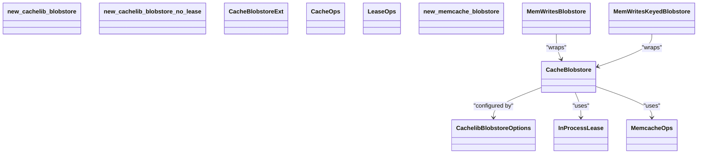

**Diagram sources**
- [lib.rs:1-31](file://eden/mononoke/blobstore/cacheblob/src/lib.rs#L1-L31)

**Section sources**
- [lib.rs:1-31](file://eden/mononoke/blobstore/cacheblob/src/lib.rs#L1-L31)

### Multiplexedblob
Multiplexedblob coordinates writes across multiple backends atomically and reads from any available backend. It implements a write-all, read-any strategy to improve availability and resilience.

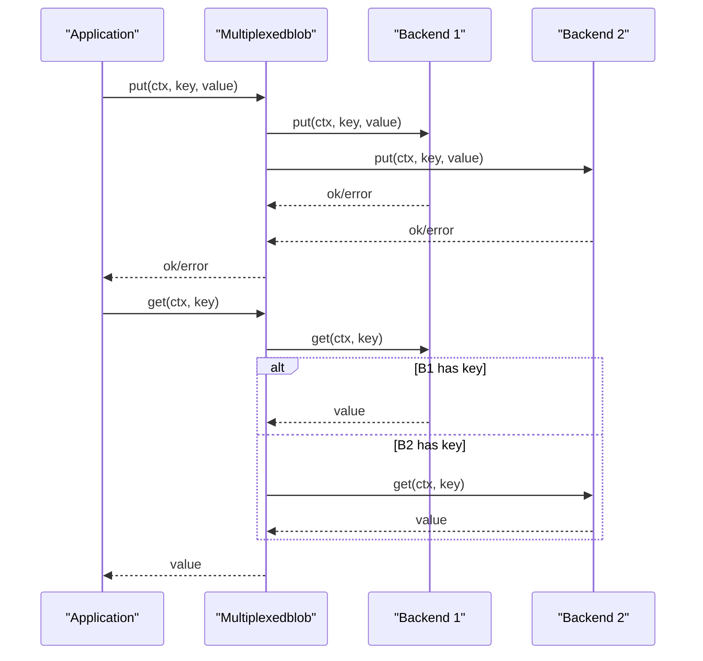

**Diagram sources**
- [2.4-storage-architecture.md:138-177](file://eden/mononoke/docs/2.4-storage-architecture.md#L138-L177)
- [lib.rs:1-200](file://eden/mononoke/blobstore/multiplexedblob/src/lib.rs#L1-L200)

**Section sources**
- [2.4-storage-architecture.md:138-177](file://eden/mononoke/docs/2.4-storage-architecture.md#L138-L177)
- [lib.rs:1-200](file://eden/mononoke/blobstore/multiplexedblob/src/lib.rs#L1-L200)

### Prefixblob
Prefixblob namespaces keys with repository identifiers, ensuring isolation across repositories. It transforms keys before delegating to the underlying store.

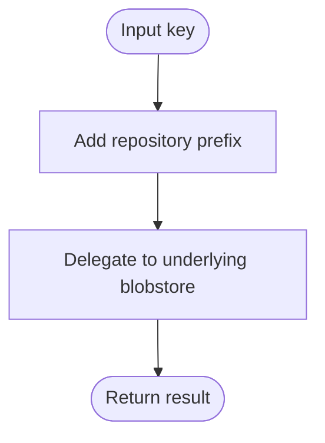

**Diagram sources**
- [2.4-storage-architecture.md:109-136](file://eden/mononoke/docs/2.4-storage-architecture.md#L109-L136)
- [lib.rs:1-200](file://eden/mononoke/blobstore/prefixblob/src/lib.rs#L1-L200)

**Section sources**
- [2.4-storage-architecture.md:109-136](file://eden/mononoke/docs/2.4-storage-architecture.md#L109-L136)
- [lib.rs:1-200](file://eden/mononoke/blobstore/prefixblob/src/lib.rs#L1-L200)

### Packblob
Packblob compresses and packs related blobs using Zstd with delta compression. It wraps blobs in a storage envelope indicating whether they are standalone or packed, enabling efficient retrieval and reduced storage footprint.

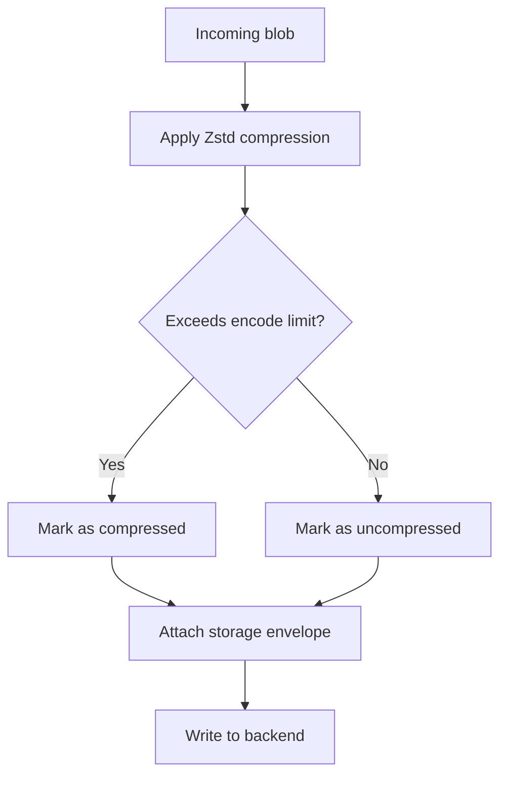

**Diagram sources**
- [2.4-storage-architecture.md:177-199](file://eden/mononoke/docs/2.4-storage-architecture.md#L177-L199)
- [lib.rs:1-200](file://eden/mononoke/blobstore/packblob/src/lib.rs#L1-L200)

**Section sources**
- [2.4-storage-architecture.md:177-199](file://eden/mononoke/docs/2.4-storage-architecture.md#L177-L199)
- [lib.rs:1-200](file://eden/mononoke/blobstore/packblob/src/lib.rs#L1-L200)

### SQLblob
SQLblob persists blobs as rows in a SQL table with the key as the primary key and blob bytes as a column. It supports both MySQL (production) and SQLite (development), enabling local development and testing environments.

**Diagram sources**
- [2.4-storage-architecture.md:57-58](file://eden/mononoke/docs/2.4-storage-architecture.md#L57-L58)
- [lib.rs:1-200](file://eden/mononoke/blobstore/sqlblob/src/lib.rs#L1-L200)

**Section sources**
- [2.4-storage-architecture.md:57-58](file://eden/mononoke/docs/2.4-storage-architecture.md#L57-L58)
- [lib.rs:1-200](file://eden/mononoke/blobstore/sqlblob/src/lib.rs#L1-L200)

### S3blob
S3blob integrates with Amazon S3 for deployments using AWS infrastructure. It provides a blob store backend compatible with S3 APIs and IAM-based access controls.

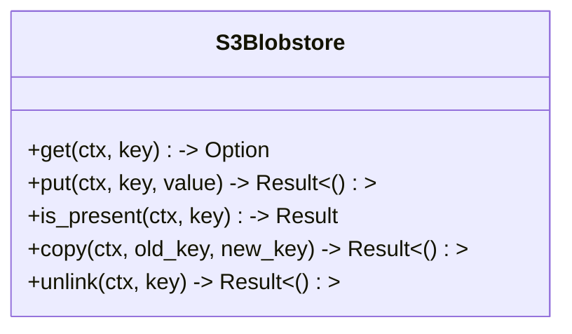

**Diagram sources**
- [2.4-storage-architecture.md:59-60](file://eden/mononoke/docs/2.4-storage-architecture.md#L59-L60)
- [lib.rs:1-200](file://eden/mononoke/blobstore/s3blob/src/lib.rs#L1-L200)

**Section sources**
- [2.4-storage-architecture.md:59-60](file://eden/mononoke/docs/2.4-storage-architecture.md#L59-L60)
- [lib.rs:1-200](file://eden/mononoke/blobstore/s3blob/src/lib.rs#L1-L200)

### Fileblob
Fileblob stores blobs as files on a filesystem, using directory traversal and key-based filenames. It supports enumerating keys within a range and provides copy/unlink semantics via filesystem operations.

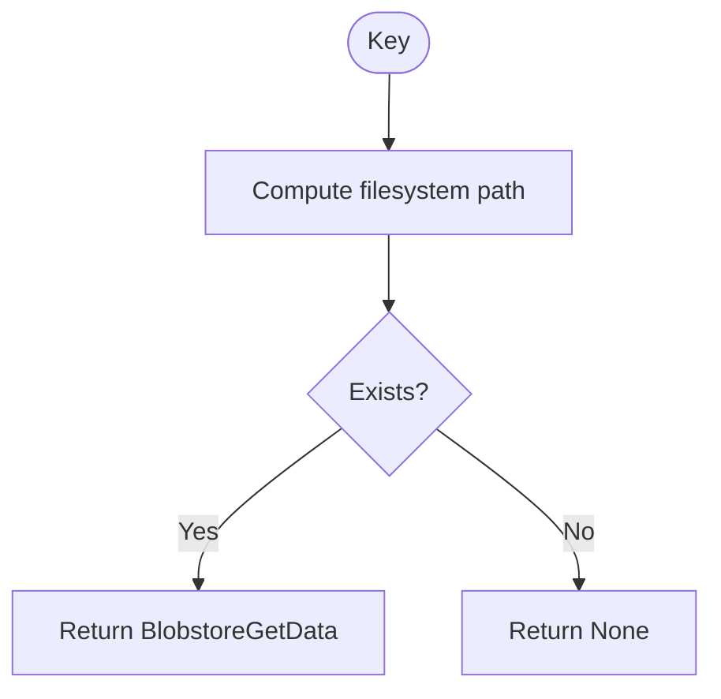

**Diagram sources**
- [lib.rs:193-266](file://eden/mononoke/blobstore/fileblob/src/lib.rs#L193-L266)

**Section sources**
- [lib.rs:193-266](file://eden/mononoke/blobstore/fileblob/src/lib.rs#L193-L266)

### Ephemeral Blobstore
Ephemeral blobstore provides temporary storage for snapshots and draft commits that are not yet permanent. It uses a separate SQL table with time-based expiration and grouping into “bubbles” that expire together.

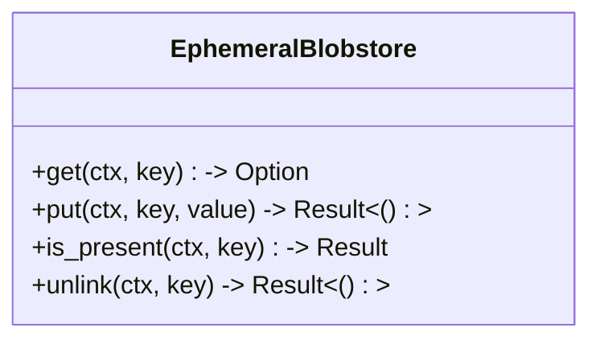

**Diagram sources**
- [2.4-storage-architecture.md:101-103](file://eden/mononoke/docs/2.4-storage-architecture.md#L101-L103)
- [lib.rs:1-200](file://eden/mononoke/blobstore/ephemeral_blobstore/src/lib.rs#L1-L200)

**Section sources**
- [2.4-storage-architecture.md:101-103](file://eden/mononoke/docs/2.4-storage-architecture.md#L101-L103)
- [lib.rs:1-200](file://eden/mononoke/blobstore/ephemeral_blobstore/src/lib.rs#L1-L200)

### Virtually Sharded Blobstore
Virtually sharded blobstore groups blob keys into virtual shards to deduplicate in-flight requests and improve concurrency. It acts as a caching decorator that reduces redundant backend calls.

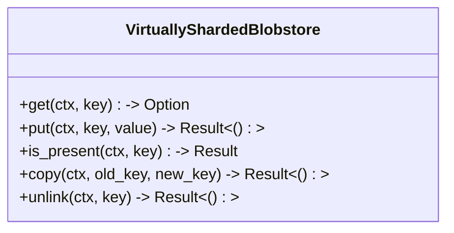

**Diagram sources**
- [2.4-storage-architecture.md:105-106](file://eden/mononoke/docs/2.4-storage-architecture.md#L105-L106)
- [lib.rs:1-200](file://eden/mononoke/blobstore/virtually_sharded_blobstore/src/lib.rs#L1-L200)

**Section sources**
- [2.4-storage-architecture.md:105-106](file://eden/mononoke/docs/2.4-storage-architecture.md#L105-L106)
- [lib.rs:1-200](file://eden/mononoke/blobstore/virtually_sharded_blobstore/src/lib.rs#L1-L200)

### Operational Decorators
- Redactedblobstore: Enforces content redaction policies to prevent access to redacted blobs.
- Samplingblob: Samples operations for observability, logging a configurable fraction of all blobstore operations.
- Throttledblob: Applies rate limiting to blobstore operations to control load on downstream storage.
- Logblob: Logs all blobstore operations for debugging and auditing.
- Readonlyblob: Wraps a blobstore to make it read-only, preventing writes.

**Diagram sources**
- [2.4-storage-architecture.md:83-94](file://eden/mononoke/docs/2.4-storage-architecture.md#L83-L94)
- [lib.rs:1-200](file://eden/mononoke/blobstore/redactedblobstore/src/lib.rs#L1-L200)
- [lib.rs:1-200](file://eden/mononoke/blobstore/throttledblob/src/lib.rs#L1-L200)
- [lib.rs:1-200](file://eden/mononoke/blobstore/logblob/src/lib.rs#L1-L200)
- [lib.rs:1-200](file://eden/mononoke/blobstore/readonlyblob/src/lib.rs#L1-L200)

**Section sources**
- [2.4-storage-architecture.md:83-94](file://eden/mononoke/docs/2.4-storage-architecture.md#L83-L94)
- [lib.rs:1-200](file://eden/mononoke/blobstore/redactedblobstore/src/lib.rs#L1-L200)
- [lib.rs:1-200](file://eden/mononoke/blobstore/throttledblob/src/lib.rs#L1-L200)
- [lib.rs:1-200](file://eden/mononoke/blobstore/logblob/src/lib.rs#L1-L200)
- [lib.rs:1-200](file://eden/mononoke/blobstore/readonlyblob/src/lib.rs#L1-L200)

### Blob Lifecycle Management and Garbage Collection
- Immutability: Blobs are immutable after creation, enabling aggressive caching and replication.
- Redaction: Controlled removal of sensitive content through redaction policies enforced by decorators.
- Ephemeral storage: Temporary objects expire automatically, reducing long-term storage needs.
- Enumeration and healing: Key enumeration capabilities enable maintenance tasks such as garbage collection and repair.

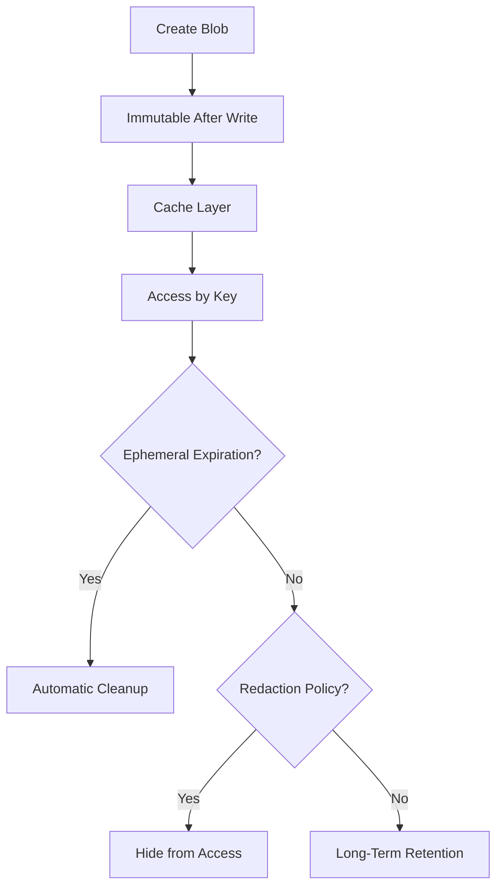

**Diagram sources**
- [2.4-storage-architecture.md:9-21](file://eden/mononoke/docs/2.4-storage-architecture.md#L9-L21)
- [lib.rs:515-547](file://eden/mononoke/blobstore/src/lib.rs#L515-L547)

**Section sources**
- [2.4-storage-architecture.md:9-21](file://eden/mononoke/docs/2.4-storage-architecture.md#L9-L21)
- [lib.rs:515-547](file://eden/mononoke/blobstore/src/lib.rs#L515-L547)

### Blob Store Factory Pattern and Backend Selection
The factory constructs appropriate decorator stacks based on configuration. It composes decorators such as prefixblob, cacheblob, multiplexedblob, packblob, and backend-specific implementations. Backend selection strategies consider availability, locality, and cost.

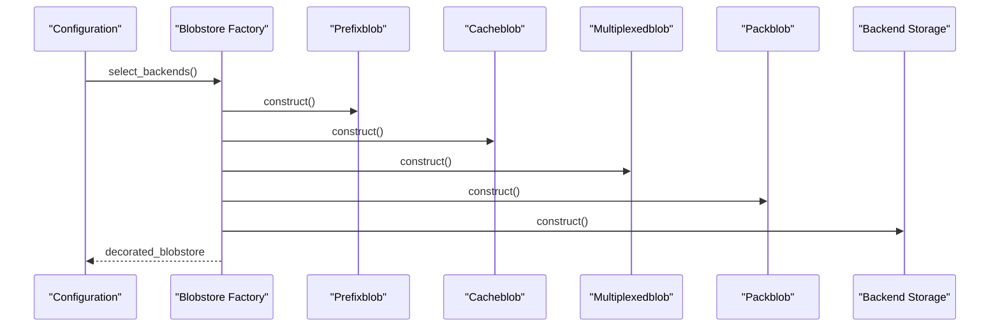

**Diagram sources**
- [2.4-storage-architecture.md:107-136](file://eden/mononoke/docs/2.4-storage-architecture.md#L107-L136)
- [lib.rs:1-200](file://eden/mononoke/blobstore/factory/src/lib.rs#L1-L200)

**Section sources**
- [2.4-storage-architecture.md:107-136](file://eden/mononoke/docs/2.4-storage-architecture.md#L107-L136)
- [lib.rs:1-200](file://eden/mononoke/blobstore/factory/src/lib.rs#L1-L200)

## Dependency Analysis
The blobstore crate depends on shared Mononoke components and optional third-party libraries for compression and serialization. Concrete implementations are separate crates that depend on the core abstractions.

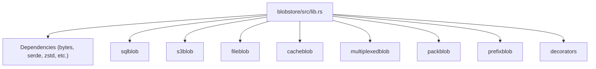

**Diagram sources**
- [Cargo.toml:14-44](file://eden/mononoke/blobstore/Cargo.toml#L14-L44)
- [lib.rs:1-757](file://eden/mononoke/blobstore/src/lib.rs#L1-L757)

**Section sources**
- [Cargo.toml:14-44](file://eden/mononoke/blobstore/Cargo.toml#L14-L44)
- [lib.rs:1-757](file://eden/mononoke/blobstore/src/lib.rs#L1-L757)

## Performance Considerations
- Compression and Packing: Packblob reduces bandwidth and storage costs using Zstd with delta compression and storage envelopes.
- Caching: Cacheblob leverages cachelib and memcache to minimize backend calls and improve latency.
- Multiplexing: Multiplexedblob improves availability and throughput by writing to multiple backends and reading from any.
- Enumeration: Efficient key enumeration enables maintenance tasks without external metadata.
- Durability: Strong durability guarantees ensure data safety across replicas.

[No sources needed since this section provides general guidance]

## Troubleshooting Guide
- Presence Checks: Use is_present to avoid data transfer when verifying existence.
- Overwrite Behavior: Control put behavior with PutBehaviour to handle conflicts and logging.
- Decorator Order: Misordering decorators can impact performance or correctness; follow recommended stack ordering.
- Testing Utilities: Use failing_blobstore to simulate backend failures and validate error handling.
- Healing Tools: DummyBlobstore and healer jobs assist in diagnosing and validating blobstore stacks.

**Section sources**
- [lib.rs:453-499](file://eden/mononoke/blobstore/src/lib.rs#L453-L499)
- [failing_blobstore.rs:48-105](file://eden/mononoke/repo_attributes/filestore/src/test/failing_blobstore.rs#L48-L105)
- [dummy.rs:45-97](file://eden/mononoke/jobs/blobstore_healer/src/dummy.rs#L45-L97)

## Conclusion
SAPLING SCM’s blob store architecture provides a robust, extensible foundation for content-addressable storage. Through a unified abstraction, layered decorators, and pluggable backends, it achieves immutability, durability, scalability, and operational flexibility. The factory-driven composition and comprehensive testing utilities enable safe evolution and deployment across diverse environments.