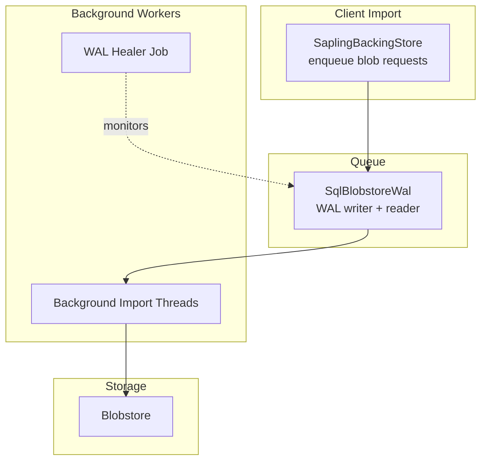
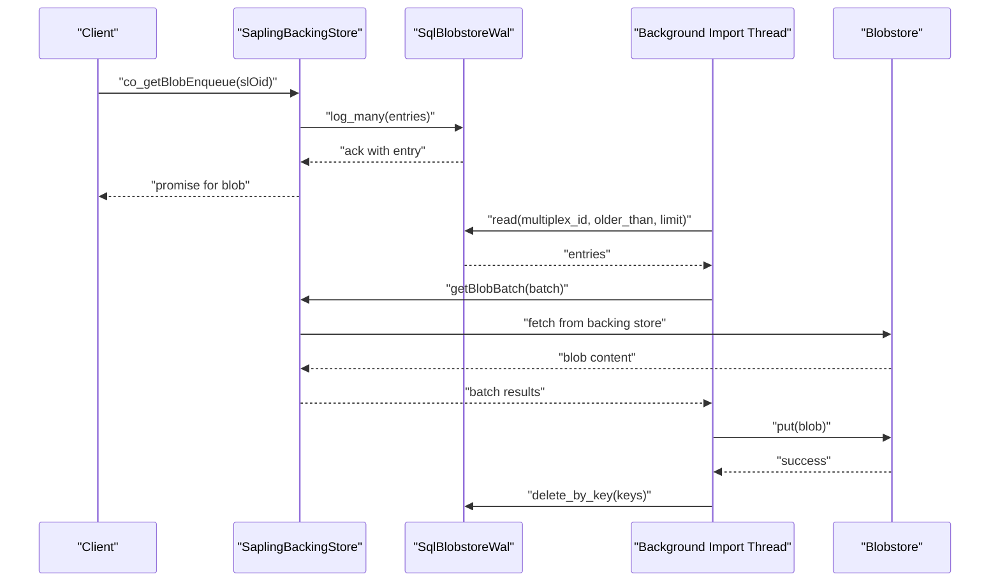
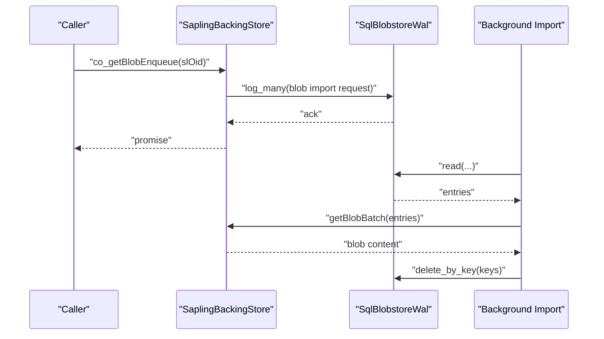
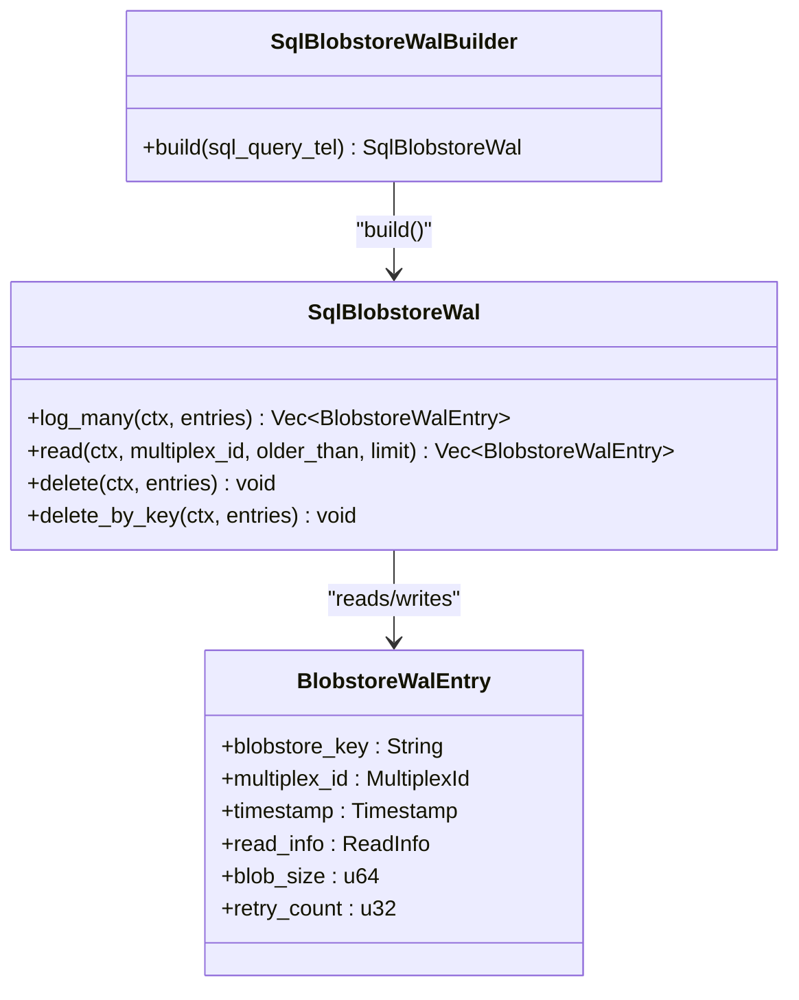
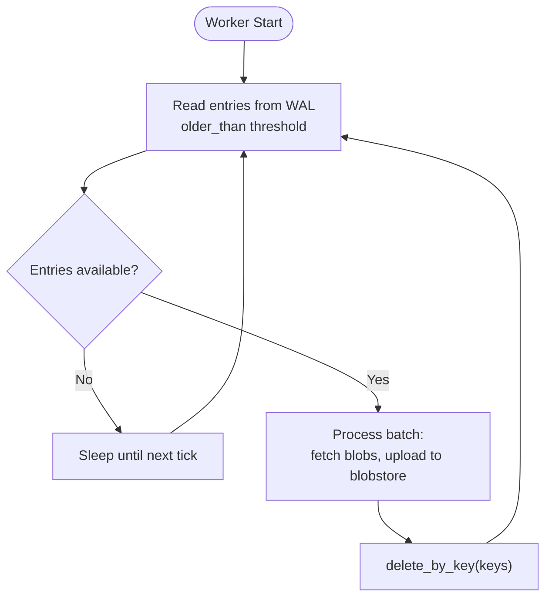
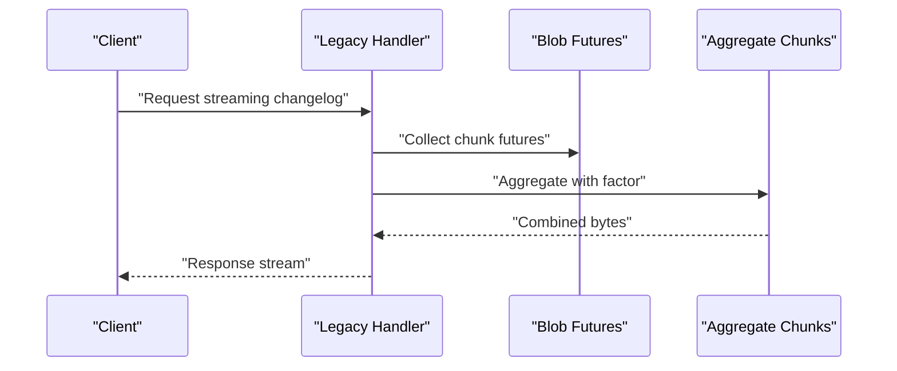
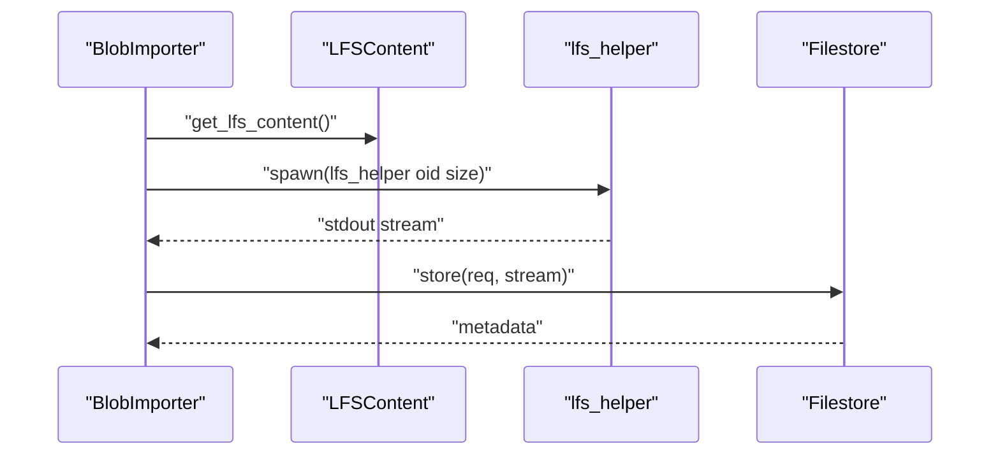
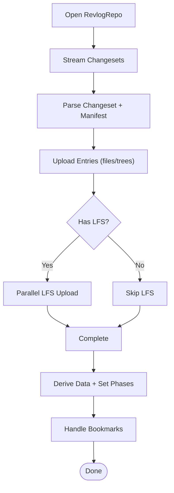
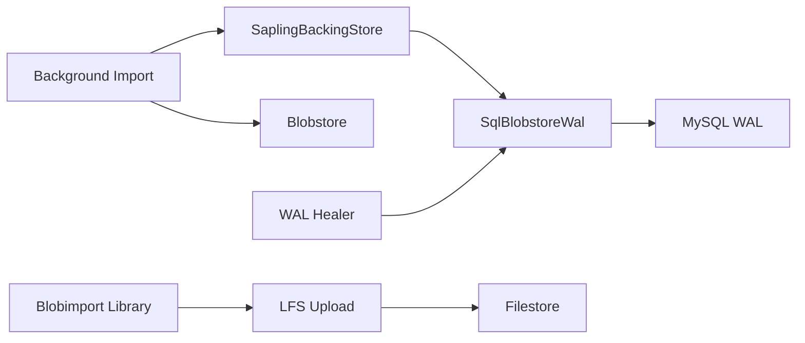

# Blob Synchronization

<cite>
**Referenced Files in This Document**
- [SaplingBackingStore.cpp](file://eden/fs/store/sl/SaplingBackingStore.cpp)
- [lib.rs](file://eden/mononoke/blobstore_sync_queue/src/lib.rs)
- [write_ahead_log.rs](file://eden/mononoke/blobstore_sync_queue/src/write_ahead_log.rs)
- [lib.rs](file://eden/mononoke/lfs_import_lib/src/lib.rs)
- [lib.rs](file://eden/mononoke/blobimport_lib/src/lib.rs)
- [changeset.rs](file://eden/mononoke/blobimport_lib/src/changeset.rs)
- [wal_healer.rs](file://eden/mononoke/jobs/blobstore_healer/src/wal_healer.rs)
- [legacy.rs](file://eden/mononoke/servers/slapi/slapi_service/src/handlers/legacy.rs)
- [lib.rs](file://eden/mononoke/tools/import/src/commands/lfs.rs)
</cite>

## Table of Contents
1. [Introduction](#introduction)
2. [Project Structure](#project-structure)
3. [Core Components](#core-components)
4. [Architecture Overview](#architecture-overview)
5. [Detailed Component Analysis](#detailed-component-analysis)
6. [Dependency Analysis](#dependency-analysis)
7. [Performance Considerations](#performance-considerations)
8. [Troubleshooting Guide](#troubleshooting-guide)
9. [Conclusion](#conclusion)
10. [Appendices](#appendices)

## Introduction
This document explains the blob synchronization mechanisms in SAPLING SCM. It covers the blob import pipeline, the blob synchronization queue backed by a write-ahead log, background processing workflows, asynchronous data transfer protocols, LFS integration, and blob migration strategies. It also documents synchronization algorithms, conflict resolution, consistency guarantees, performance tuning, monitoring, and error recovery.

## Project Structure
The blob synchronization system spans several subsystems:
- Frontend client-side import orchestration and enqueueing
- Backend blobstore write-ahead log (WAL) queue
- Background workers and healers
- LFS upload helper integration
- Streaming and chunk aggregation for large data transfers

**Diagram sources**
- [SaplingBackingStore.cpp:1511-1569](file://eden/fs/store/sl/SaplingBackingStore.cpp#L1511-L1569)
- [write_ahead_log.rs:185-236](file://eden/mononoke/blobstore_sync_queue/src/write_ahead_log.rs#L185-L236)
- [wal_healer.rs:412-450](file://eden/mononoke/jobs/blobstore_healer/src/wal_healer.rs#L412-L450)

**Section sources**
- [SaplingBackingStore.cpp:110-241](file://eden/fs/store/sl/SaplingBackingStore.cpp#L110-L241)
- [lib.rs:1-15](file://eden/mononoke/blobstore_sync_queue/src/lib.rs#L1-L15)

## Core Components
- Blob import request enqueueing and tracing
- Blob synchronization queue with write-ahead logging
- Background import workers and batch processing
- LFS upload integration and retries
- Streaming chunk aggregation for large transfers
- WAL healer for recovery and requeue

**Section sources**
- [SaplingBackingStore.cpp:355-377](file://eden/fs/store/sl/SaplingBackingStore.cpp#L355-L377)
- [write_ahead_log.rs:144-183](file://eden/mononoke/blobstore_sync_queue/src/write_ahead_log.rs#L144-L183)
- [lib.rs:99-118](file://eden/mononoke/lfs_import_lib/src/lib.rs#L99-L118)
- [legacy.rs:57-78](file://eden/mononoke/servers/slapi/slapi_service/src/handlers/legacy.rs#L57-L78)

## Architecture Overview
The system uses a queue-backed write-ahead log to reliably persist blob import requests and coordinate background processing. Requests are enqueued asynchronously and later processed by background workers that fetch blobs from the backing store and upload them to the blobstore. A healer job periodically requeues failed or stuck entries to maintain consistency.

**Diagram sources**
- [SaplingBackingStore.cpp:1511-1569](file://eden/fs/store/sl/SaplingBackingStore.cpp#L1511-L1569)
- [write_ahead_log.rs:337-459](file://eden/mononoke/blobstore_sync_queue/src/write_ahead_log.rs#L337-L459)

## Detailed Component Analysis

### Blob Import Pipeline and Request Enqueueing
- The client triggers blob import via an enqueue method that creates a request, publishes trace events, and enqueues it into the queue. The enqueue returns a promise fulfilled when the import finishes.
- The queue tracks pending imports and marks completion upon success or error.

**Diagram sources**
- [SaplingBackingStore.cpp:1511-1569](file://eden/fs/store/sl/SaplingBackingStore.cpp#L1511-L1569)
- [write_ahead_log.rs:337-459](file://eden/mononoke/blobstore_sync_queue/src/write_ahead_log.rs#L337-L459)

**Section sources**
- [SaplingBackingStore.cpp:1511-1569](file://eden/fs/store/sl/SaplingBackingStore.cpp#L1511-L1569)

### Blob Synchronization Queue (Write-Ahead Log)
- The queue persists import requests in a sharded MySQL WAL with batching and rendezvous-based deletion.
- It supports:
  - Enqueue with ack via oneshot channels
  - Read with pagination across shards
  - Delete by key (optimized removal after successful writes)
  - Delete by id (exact rows)
- The builder sets weak isolation for reads to avoid deadlocks and configures rendezvous thresholds for efficient batching.

**Diagram sources**
- [write_ahead_log.rs:144-183](file://eden/mononoke/blobstore_sync_queue/src/write_ahead_log.rs#L144-L183)
- [write_ahead_log.rs:296-335](file://eden/mononoke/blobstore_sync_queue/src/write_ahead_log.rs#L296-L335)
- [write_ahead_log.rs:70-136](file://eden/mononoke/blobstore_sync_queue/src/write_ahead_log.rs#L70-L136)

**Section sources**
- [write_ahead_log.rs:185-236](file://eden/mononoke/blobstore_sync_queue/src/write_ahead_log.rs#L185-L236)
- [write_ahead_log.rs:337-459](file://eden/mononoke/blobstore_sync_queue/src/write_ahead_log.rs#L337-L459)

### Background Processing Workflows
- Background threads read entries older than a threshold and process them in batches.
- After successful uploads, keys are removed via delete_by_key to minimize redundant work.
- The worker schedules itself to process ready chunks and cycles through shards for writes.

**Diagram sources**
- [write_ahead_log.rs:374-405](file://eden/mononoke/blobstore_sync_queue/src/write_ahead_log.rs#L374-L405)
- [write_ahead_log.rs:445-458](file://eden/mononoke/blobstore_sync_queue/src/write_ahead_log.rs#L445-L458)

**Section sources**
- [write_ahead_log.rs:202-230](file://eden/mononoke/blobstore_sync_queue/src/write_ahead_log.rs#L202-L230)
- [write_ahead_log.rs:445-458](file://eden/mononoke/blobstore_sync_queue/src/write_ahead_log.rs#L445-L458)

### Asynchronous Data Transfer Protocols and Streaming
- Streaming APIs deliver changelog data as chunks that are aggregated into larger blobs for efficient transport.
- Chunk aggregation groups futures by a configurable factor, executes them in parallel, and concatenates results.

**Diagram sources**
- [legacy.rs:57-78](file://eden/mononoke/servers/slapi/slapi_service/src/handlers/legacy.rs#L57-L78)

**Section sources**
- [legacy.rs:57-78](file://eden/mononoke/servers/slapi/slapi_service/src/handlers/legacy.rs#L57-L78)

### LFS Integration and Upload
- LFS content is detected and uploaded via an external helper, streaming content to the filestore.
- The uploader checks for existing metadata to reuse blobs and retries uploads with bounded attempts.

**Diagram sources**
- [changeset.rs:271-296](file://eden/mononoke/blobimport_lib/src/changeset.rs#L271-L296)
- [lib.rs:34-56](file://eden/mononoke/lfs_import_lib/src/lib.rs#L34-L56)
- [lib.rs:79-92](file://eden/mononoke/lfs_import_lib/src/lib.rs#L79-L92)

**Section sources**
- [lib.rs:99-118](file://eden/mononoke/lfs_import_lib/src/lib.rs#L99-L118)
- [changeset.rs:340-358](file://eden/mononoke/blobimport_lib/src/changeset.rs#L340-L358)

### Blob Migration Strategies
- The blobimport library orchestrates migration of Mercurial revlog data into Mononoke, including:
  - Parsing changesets and manifest roots
  - Parallel upload of files and trees
  - Optional LFS upload via helper
  - Derived data population and phase updates
  - Bookmark handling and optional prefixing

**Diagram sources**
- [lib.rs:123-137](file://eden/mononoke/blobimport_lib/src/lib.rs#L123-L137)
- [changeset.rs:314-370](file://eden/mononoke/blobimport_lib/src/changeset.rs#L314-L370)
- [changeset.rs:498-521](file://eden/mononoke/blobimport_lib/src/changeset.rs#L498-L521)

**Section sources**
- [lib.rs:91-297](file://eden/mononoke/blobimport_lib/src/lib.rs#L91-L297)
- [changeset.rs:303-527](file://eden/mononoke/blobimport_lib/src/changeset.rs#L303-L527)

### Synchronization Algorithms and Consistency Guarantees
- FIFO ordering per key is ensured by WAL timestamps and read ordering.
- Distinct keys are removed efficiently via delete_by_key after successful writes.
- Weak read isolation avoids deadlocks while maintaining eventual consistency.
- Retry loops and bounded attempts improve resilience for transient failures.

**Section sources**
- [write_ahead_log.rs:511-529](file://eden/mononoke/blobstore_sync_queue/src/write_ahead_log.rs#L511-L529)
- [lib.rs:105-117](file://eden/mononoke/lfs_import_lib/src/lib.rs#L105-L117)

### Conflict Resolution and Incremental Synchronization
- The system relies on monotonic timestamps and multiplex ids to order operations.
- Incremental synchronization is achieved by reading only entries older than a threshold and limiting batch sizes.
- Parent order enforcement ensures consistent changeset creation when required.

**Section sources**
- [write_ahead_log.rs:374-405](file://eden/mononoke/blobstore_sync_queue/src/write_ahead_log.rs#L374-L405)
- [changeset.rs:427-447](file://eden/mononoke/blobimport_lib/src/changeset.rs#L427-L447)

### Monitoring and Progress Tracking
- Trace bus events track queue, start, and finish of import operations.
- Metrics counters track success/failure rates and durations for prefetch and fetch operations.
- Scuba logging records presence checks and queue statistics.

**Section sources**
- [SaplingBackingStore.cpp:264-280](file://eden/fs/store/sl/SaplingBackingStore.cpp#L264-L280)
- [SaplingBackingStore.cpp:282-335](file://eden/fs/store/sl/SaplingBackingStore.cpp#L282-L335)
- [lib.rs:10-15](file://eden/mononoke/blobstore_sync_queue/src/lib.rs#L10-L15)

### Error Recovery Mechanisms
- WAL healer requeues entries with updated timestamps and deletes successfully actioned entries.
- On enqueue failures, the system marks import finished and propagates exceptions.
- LFS uploads retry up to a maximum number of attempts.

**Section sources**
- [wal_healer.rs:412-450](file://eden/mononoke/jobs/blobstore_healer/src/wal_healer.rs#L412-L450)
- [SaplingBackingStore.cpp:1555-1568](file://eden/fs/store/sl/SaplingBackingStore.cpp#L1555-L1568)
- [lib.rs:105-117](file://eden/mononoke/lfs_import_lib/src/lib.rs#L105-L117)

## Dependency Analysis

**Diagram sources**
- [SaplingBackingStore.cpp:1511-1569](file://eden/fs/store/sl/SaplingBackingStore.cpp#L1511-L1569)
- [write_ahead_log.rs:337-459](file://eden/mononoke/blobstore_sync_queue/src/write_ahead_log.rs#L337-L459)
- [wal_healer.rs:412-450](file://eden/mononoke/jobs/blobstore_healer/src/wal_healer.rs#L412-L450)
- [changeset.rs:340-358](file://eden/mononoke/blobimport_lib/src/changeset.rs#L340-L358)

**Section sources**
- [lib.rs:10-15](file://eden/mononoke/blobstore_sync_queue/src/lib.rs#L10-L15)
- [lib.rs:99-118](file://eden/mononoke/lfs_import_lib/src/lib.rs#L99-L118)
- [lib.rs:139-149](file://eden/mononoke/blobimport_lib/src/lib.rs#L139-L149)

## Performance Considerations
- Concurrency tuning:
  - Adjust parallelism for changesets, blobs, and LFS uploads to balance throughput and resource usage.
  - Use batch sizes appropriate for workload characteristics.
- Queue performance:
  - Tune WAL write buffer size and read limits to reduce latency.
  - Configure rendezvous thresholds for deletion batching.
- Streaming:
  - Use aggregation factors to balance parallelism and memory usage when combining chunks.
- Monitoring:
  - Track success/failure counters and latency histograms to identify bottlenecks.

[No sources needed since this section provides general guidance]

## Troubleshooting Guide
- Symptom: Imports stall or fail intermittently
  - Cause: Transient backend failures or contention
  - Action: Inspect trace logs around queue and finish events; verify WAL healer activity and retry counts
- Symptom: High latency for blob fetches
  - Cause: Backing store or blobstore throttling
  - Action: Review metrics counters for prefetch/fetch success and duration; adjust concurrency settings
- Symptom: LFS uploads failing
  - Cause: Helper invocation or validation errors
  - Action: Verify helper availability and permissions; check retry logs and metadata reuse behavior
- Symptom: Duplicate or inconsistent parent order
  - Cause: Imported changeset parent mismatch
  - Action: Enable enforced parent order and validate expected vs actual parents

**Section sources**
- [SaplingBackingStore.cpp:264-280](file://eden/fs/store/sl/SaplingBackingStore.cpp#L264-L280)
- [lib.rs:105-117](file://eden/mononoke/lfs_import_lib/src/lib.rs#L105-L117)
- [changeset.rs:427-447](file://eden/mononoke/blobimport_lib/src/changeset.rs#L427-L447)

## Conclusion
SAPLING SCM’s blob synchronization combines a reliable write-ahead log queue, background workers, and robust LFS integration to support scalable, asynchronous blob import and migration. The design emphasizes FIFO ordering, efficient deduplication, and resilient retries, with monitoring and healing to maintain consistency and recover from failures.

## Appendices
- Example command-line LFS import tool usage is available in the import tool module.

**Section sources**
- [lib.rs:49-56](file://eden/mononoke/tools/import/src/commands/lfs.rs#L49-L56)