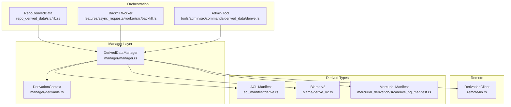
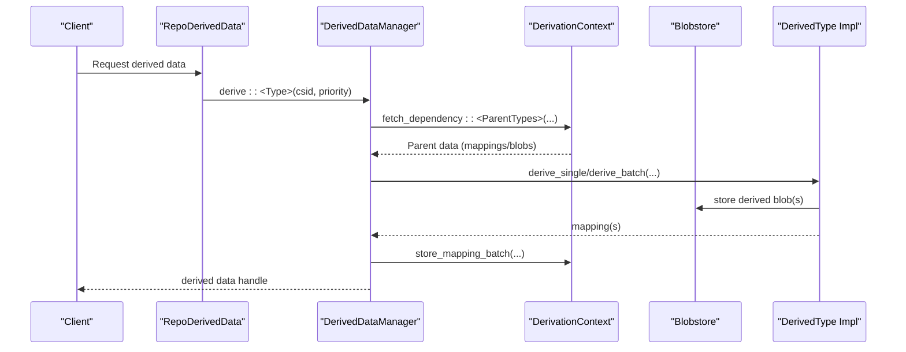
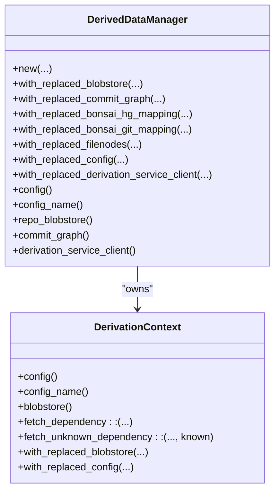
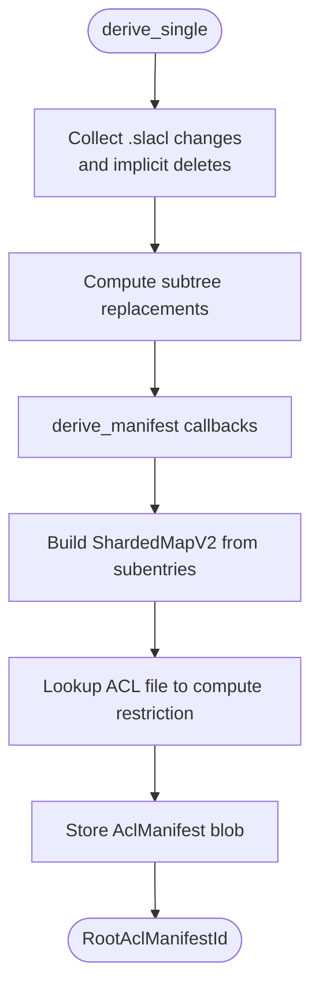
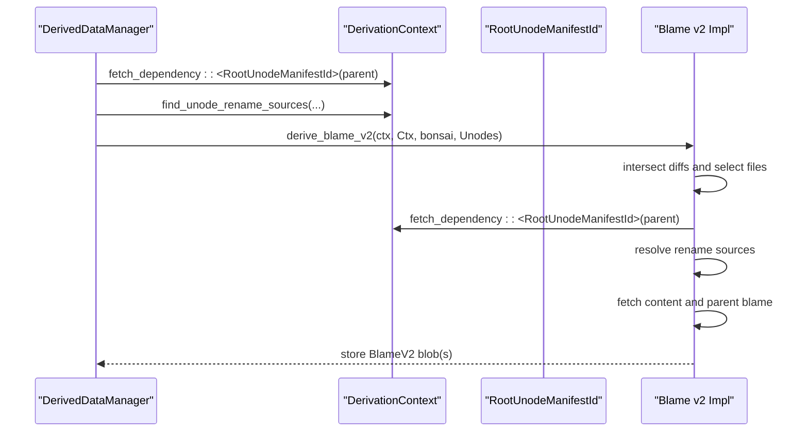
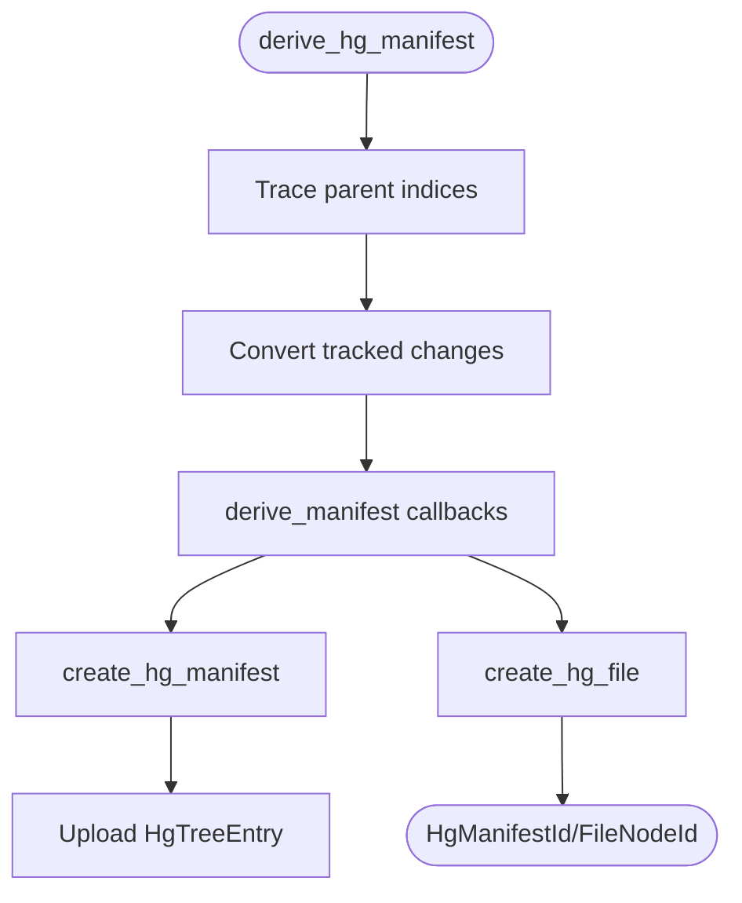
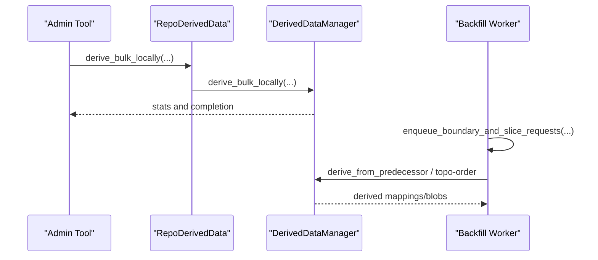
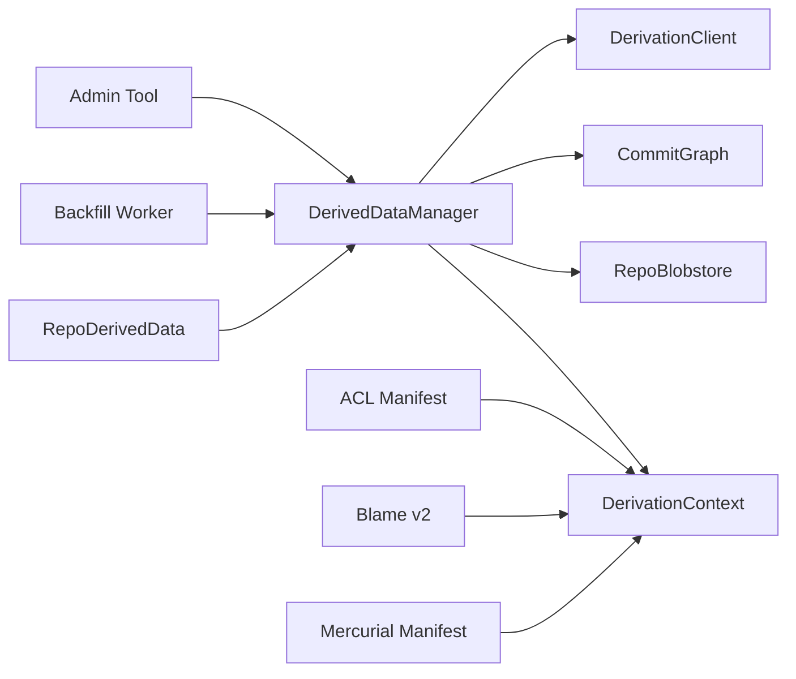

# Derived Data System

<cite>
**Referenced Files in This Document**
- [manager/lib.rs](file://eden/mononoke/derived_data/manager/lib.rs)
- [manager/manager.rs](file://eden/mononoke/derived_data/manager/manager.rs)
- [manager/derivable.rs](file://eden/mononoke/derived_data/manager/derivable.rs)
- [remote/lib.rs](file://eden/mononoke/derived_data/remote/lib.rs)
- [repo_derived_data/src/lib.rs](file://eden/mononoke/repo_attributes/repo_derived_data/src/lib.rs)
- [features/async_requests/worker/src/backfill.rs](file://eden/mononoke/features/async_requests/worker/src/backfill.rs)
- [tools/admin/src/commands/derived_data/derive.rs](file://eden/mononoke/tools/admin/src/commands/derived_data/derive.rs)
- [docs/2.3-derived-data.md](file://eden/mononoke/docs/2.3-derived-data.md)
- [acl_manifest/lib.rs](file://eden/mononoke/derived_data/acl_manifest/lib.rs)
- [acl_manifest/derive.rs](file://eden/mononoke/derived_data/acl_manifest/derive.rs)
- [blame/lib.rs](file://eden/mononoke/derived_data/blame/lib.rs)
- [blame/derive_v2.rs](file://eden/mononoke/derived_data/blame/derive_v2.rs)
- [mercurial_derivation/src/lib.rs](file://eden/mononoke/derived_data/mercurial_derivation/src/lib.rs)
- [mercurial_derivation/src/derive_hg_manifest.rs](file://eden/mononoke/derived_data/mercurial_derivation/src/derive_hg_manifest.rs)
</cite>

## Table of Contents
1. [Introduction](#introduction)
2. [Project Structure](#project-structure)
3. [Core Components](#core-components)
4. [Architecture Overview](#architecture-overview)
5. [Detailed Component Analysis](#detailed-component-analysis)
6. [Dependency Analysis](#dependency-analysis)
7. [Performance Considerations](#performance-considerations)
8. [Troubleshooting Guide](#troubleshooting-guide)
9. [Conclusion](#conclusion)

## Introduction
This document explains the derived data system in SAPLING SCM. It covers the data derivation pipeline, computed data generation, caching strategies, the derived data manager, derivation queues, and background processing workflows. It documents specific derived data types (ACL manifests, blame data, Mercurial derivations), derivation triggers, invalidation mechanisms, cache management, performance optimization, storage efficiency, data freshness guarantees, and practical debugging and troubleshooting guidance.

## Project Structure
The derived data system spans multiple modules:
- Manager and primitives for orchestration and derivation contracts
- Remote derivation client and options
- Specific derived data implementations (ACL manifests, blame, Mercurial)
- Background backfill and async request orchestration
- Administrative tools for triggering derivation

**Diagram sources**
- [manager/manager.rs:40-127](file://eden/mononoke/derived_data/manager/manager.rs#L40-L127)
- [manager/derivable.rs:97-163](file://eden/mononoke/derived_data/manager/derivable.rs#L97-L163)
- [remote/lib.rs:48-61](file://eden/mononoke/derived_data/remote/lib.rs#L48-L61)
- [repo_derived_data/src/lib.rs:40-77](file://eden/mononoke/repo_attributes/repo_derived_data/src/lib.rs#L40-L77)
- [features/async_requests/worker/src/backfill.rs:94-120](file://eden/mononoke/features/async_requests/worker/src/backfill.rs#L94-L120)
- [tools/admin/src/commands/derived_data/derive.rs:82-108](file://eden/mononoke/tools/admin/src/commands/derived_data/derive.rs#L82-L108)
- [acl_manifest/derive.rs:83-130](file://eden/mononoke/derived_data/acl_manifest/derive.rs#L83-L130)
- [blame/derive_v2.rs:44-103](file://eden/mononoke/derived_data/blame/derive_v2.rs#L44-L103)
- [mercurial_derivation/src/derive_hg_manifest.rs:140-203](file://eden/mononoke/derived_data/mercurial_derivation/src/derive_hg_manifest.rs#L140-L203)

**Section sources**
- [manager/lib.rs:10-26](file://eden/mononoke/derived_data/manager/lib.rs#L10-L26)
- [manager/manager.rs:40-127](file://eden/mononoke/derived_data/manager/manager.rs#L40-L127)
- [remote/lib.rs:48-61](file://eden/mononoke/derived_data/remote/lib.rs#L48-L61)
- [repo_derived_data/src/lib.rs:40-77](file://eden/mononoke/repo_attributes/repo_derived_data/src/lib.rs#L40-L77)
- [features/async_requests/worker/src/backfill.rs:94-120](file://eden/mononoke/features/async_requests/worker/src/backfill.rs#L94-L120)
- [tools/admin/src/commands/derived_data/derive.rs:82-108](file://eden/mononoke/tools/admin/src/commands/derived_data/derive.rs#L82-L108)

## Core Components
- DerivedDataManager: central orchestrator for derivation, mapping, and storage. Provides configuration, blobstore, commit graph, and optional remote derivation client.
- DerivationContext: holds configuration, mapping providers, and blobstore; exposes dependency fetching and mapping storage.
- BonsaiDerivable/DerivableUntopologically: traits defining how derived data is computed per changeset and how to backfill from predecessors.
- RemoteDerivationOptions/DerivationClient: command-line options and client interface for remote derivation via a derived data service.
- RepoDerivedData: repository facet aggregating managers per configuration and enabling per-config derivation.

Key responsibilities:
- Ordering derivations respecting dependency graphs and types
- Persisting mappings and blobs
- Enforcing freshness and invalidation via mapping lookups
- Supporting local and remote derivation modes

**Section sources**
- [manager/manager.rs:40-127](file://eden/mononoke/derived_data/manager/manager.rs#L40-L127)
- [manager/derivable.rs:97-163](file://eden/mononoke/derived_data/manager/derivable.rs#L97-L163)
- [remote/lib.rs:48-61](file://eden/mononoke/derived_data/remote/lib.rs#L48-L61)
- [repo_derived_data/src/lib.rs:40-77](file://eden/mononoke/repo_attributes/repo_derived_data/src/lib.rs#L40-L77)

## Architecture Overview
The derived data system computes and persists derived artifacts keyed by changeset and type. It supports:
- On-demand derivation when a client requests data not yet present
- Batch derivation for bulk operations and backfills
- Backfilling across repository history with dependency-aware scheduling
- Optional remote derivation via a derived data service

**Diagram sources**
- [manager/derivable.rs:97-163](file://eden/mononoke/derived_data/manager/derivable.rs#L97-L163)
- [manager/manager.rs:40-127](file://eden/mononoke/derived_data/manager/manager.rs#L40-L127)
- [docs/2.3-derived-data.md:96-129](file://eden/mononoke/docs/2.3-derived-data.md#L96-L129)

**Section sources**
- [docs/2.3-derived-data.md:96-129](file://eden/mononoke/docs/2.3-derived-data.md#L96-L129)

## Detailed Component Analysis

### DerivedDataManager and DerivationContext
- Construction initializes a DerivationContext with mapping providers, blobstore, and configuration.
- Provides mutation helpers to replace blobstore, commit graph, mappings, and derivation service client for testing or specialized environments.
- Exposes configuration and repo-scoped resources (commit graph, blobstore, repo config).

**Diagram sources**
- [manager/manager.rs:85-293](file://eden/mononoke/derived_data/manager/manager.rs#L85-L293)
- [manager/derivable.rs:97-163](file://eden/mononoke/derived_data/manager/derivable.rs#L97-L163)

**Section sources**
- [manager/manager.rs:85-293](file://eden/mononoke/derived_data/manager/manager.rs#L85-L293)

### ACL Manifests
ACL manifests represent directory-level access restrictions derived from `.slacl` files. The derivation pipeline:
- Collects explicit and implicit ACL file changes (deletes when non-ACL additions replace directories containing ACL files)
- Supports subtree copy/merge replacements
- Uses a manifest derivation primitive to build directory trees with rollup flags for restricted descendants
- Stores AclManifestEntryBlob entries and the resulting manifest blob

**Diagram sources**
- [acl_manifest/derive.rs:83-130](file://eden/mononoke/derived_data/acl_manifest/derive.rs#L83-L130)
- [acl_manifest/derive.rs:213-263](file://eden/mononoke/derived_data/acl_manifest/derive.rs#L213-L263)
- [acl_manifest/derive.rs:278-348](file://eden/mononoke/derived_data/acl_manifest/derive.rs#L278-L348)

**Section sources**
- [acl_manifest/lib.rs:8-16](file://eden/mononoke/derived_data/acl_manifest/lib.rs#L8-L16)
- [acl_manifest/derive.rs:83-130](file://eden/mononoke/derived_data/acl_manifest/derive.rs#L83-L130)
- [acl_manifest/derive.rs:213-263](file://eden/mononoke/derived_data/acl_manifest/derive.rs#L213-L263)
- [acl_manifest/derive.rs:278-348](file://eden/mononoke/derived_data/acl_manifest/derive.rs#L278-L348)

### Blame Data (v2)
Blame v2 computes per-file blame information by intersecting diffs across children and parents, resolving rename sources, and constructing blame entries with parent contributions. It:
- Computes intersection of unode diffs to identify modified files
- Resolves rename sources (copy/subtree operations) and merges
- Loads parent blame and content, constructs blame entries, and stores per-file blame blobs
- Enforces a configurable file size limit

**Diagram sources**
- [blame/derive_v2.rs:44-103](file://eden/mononoke/derived_data/blame/derive_v2.rs#L44-L103)
- [blame/derive_v2.rs:105-195](file://eden/mononoke/derived_data/blame/derive_v2.rs#L105-L195)
- [blame/lib.rs:74-97](file://eden/mononoke/derived_data/blame/lib.rs#L74-L97)

**Section sources**
- [blame/lib.rs:74-97](file://eden/mononoke/derived_data/blame/lib.rs#L74-L97)
- [blame/derive_v2.rs:44-103](file://eden/mononoke/derived_data/blame/derive_v2.rs#L44-L103)
- [blame/derive_v2.rs:105-195](file://eden/mononoke/derived_data/blame/derive_v2.rs#L105-L195)

### Mercurial Derivations
Mercurial derivations produce Mercurial-compatible manifests and file entries from Bonsai changesets. The pipeline:
- Converts tracked file changes into manifest updates
- Uses derive_manifest to construct trees and leaves
- Resolves conflicts by reusing parent entries when content and type match
- Optionally tracks restricted path manifest IDs

**Diagram sources**
- [mercurial_derivation/src/derive_hg_manifest.rs:140-203](file://eden/mononoke/derived_data/mercurial_derivation/src/derive_hg_manifest.rs#L140-L203)
- [mercurial_derivation/src/derive_hg_manifest.rs:207-352](file://eden/mononoke/derived_data/mercurial_derivation/src/derive_hg_manifest.rs#L207-L352)
- [mercurial_derivation/src/derive_hg_manifest.rs:356-378](file://eden/mononoke/derived_data/mercurial_derivation/src/derive_hg_manifest.rs#L356-L378)

**Section sources**
- [mercurial_derivation/src/lib.rs:8-19](file://eden/mononoke/derived_data/mercurial_derivation/src/lib.rs#L8-L19)
- [mercurial_derivation/src/derive_hg_manifest.rs:140-203](file://eden/mononoke/derived_data/mercurial_derivation/src/derive_hg_manifest.rs#L140-L203)
- [mercurial_derivation/src/derive_hg_manifest.rs:207-352](file://eden/mononoke/derived_data/mercurial_derivation/src/derive_hg_manifest.rs#L207-L352)

### Derived Data Manager, Derivation Queues, and Background Processing
- RepoDerivedData manages multiple DerivedDataManager instances per configuration and resolves the active manager for a request.
- Backfill worker enqueues boundary and slice requests for parallelizable types and serial slices for others, coordinating dependencies across workers.
- Admin tool supports on-demand and bulk derivation, optionally forcing re-derivation and batching.

**Diagram sources**
- [repo_derived_data/src/lib.rs:40-77](file://eden/mononoke/repo_attributes/repo_derived_data/src/lib.rs#L40-L77)
- [features/async_requests/worker/src/backfill.rs:560-576](file://eden/mononoke/features/async_requests/worker/src/backfill.rs#L560-L576)
- [tools/admin/src/commands/derived_data/derive.rs:82-108](file://eden/mononoke/tools/admin/src/commands/derived_data/derive.rs#L82-L108)

**Section sources**
- [repo_derived_data/src/lib.rs:40-77](file://eden/mononoke/repo_attributes/repo_derived_data/src/lib.rs#L40-L77)
- [features/async_requests/worker/src/backfill.rs:560-576](file://eden/mononoke/features/async_requests/worker/src/backfill.rs#L560-L576)
- [tools/admin/src/commands/derived_data/derive.rs:82-108](file://eden/mononoke/tools/admin/src/commands/derived_data/derive.rs#L82-L108)

## Dependency Analysis
- Manager-layer dependencies: DerivedDataManager depends on DerivationContext, blobstore, commit graph, and optional remote client.
- Derived types depend on DerivationContext for dependency resolution and blobstore for storage.
- Backfill worker depends on manager configuration and async request queue to schedule work.
- RepoDerivedData composes managers and selects the appropriate one based on configuration.

**Diagram sources**
- [manager/manager.rs:40-127](file://eden/mononoke/derived_data/manager/manager.rs#L40-L127)
- [repo_derived_data/src/lib.rs:40-77](file://eden/mononoke/repo_attributes/repo_derived_data/src/lib.rs#L40-L77)
- [features/async_requests/worker/src/backfill.rs:94-120](file://eden/mononoke/features/async_requests/worker/src/backfill.rs#L94-L120)
- [tools/admin/src/commands/derived_data/derive.rs:82-108](file://eden/mononoke/tools/admin/src/commands/derived_data/derive.rs#L82-L108)

**Section sources**
- [manager/manager.rs:40-127](file://eden/mononoke/derived_data/manager/manager.rs#L40-L127)
- [repo_derived_data/src/lib.rs:40-77](file://eden/mononoke/repo_attributes/repo_derived_data/src/lib.rs#L40-L77)

## Performance Considerations
- Parallelization
  - Batch derivation and mapping storage use buffered streams and unordered concurrency to maximize throughput while respecting dependencies.
  - Blame derivation buffers tasks and spawns work per file intersection.
- Reuse and caching
  - Manifest reuse checks compare parent content to avoid recomputation when possible.
  - Mappings and blobs are content-addressed; repeated derivations yield cache hits.
- Concurrency controls
  - Buffered streams and bounded concurrency prevent resource saturation during heavy derivations.
- Size limits
  - Blame v2 enforces a configurable file size limit to avoid expensive operations on very large files.

[No sources needed since this section provides general guidance]

## Troubleshooting Guide
Common issues and remedies:
- Missing or stale derived data
  - Trigger on-demand or bulk derivation via admin tool; verify manager configuration and enabled types.
- Conflicts in Mercurial derivations
  - Inspect conflict resolution logic and ensure file types/content consistency across parents.
- ACL manifest inconsistencies
  - Verify .slacl file presence and implicit delete detection for replaced directories.
- Blame computation failures
  - Check rename source resolution and parent blame availability; confirm file size limits are appropriate.
- Remote derivation errors
  - Validate remote client configuration and polling behavior; ensure derived data service availability.

Operational tips:
- Use administrative commands to force re-derivation and batch processing.
- Monitor backfill progress and adjust concurrency and batch sizes.
- Review logs and metrics around derivation timing and blobstore operations.

**Section sources**
- [tools/admin/src/commands/derived_data/derive.rs:82-135](file://eden/mononoke/tools/admin/src/commands/derived_data/derive.rs#L82-L135)
- [mercurial_derivation/src/derive_hg_manifest.rs:380-435](file://eden/mononoke/derived_data/mercurial_derivation/src/derive_hg_manifest.rs#L380-L435)
- [blame/derive_v2.rs:105-195](file://eden/mononoke/derived_data/blame/derive_v2.rs#L105-L195)
- [acl_manifest/derive.rs:397-465](file://eden/mononoke/derived_data/acl_manifest/derive.rs#L397-L465)

## Conclusion
The derived data system in SAPLING SCM provides a robust, extensible framework for computing, caching, and serving derived artifacts. Through a centralized manager, dependency-aware derivation, and efficient storage, it ensures data freshness and performance. The system supports on-demand, batch, and backfill workflows, with optional remote derivation and strong caching semantics. By leveraging the documented components and patterns, operators can maintain reliable derived data across repositories and troubleshoot issues effectively.