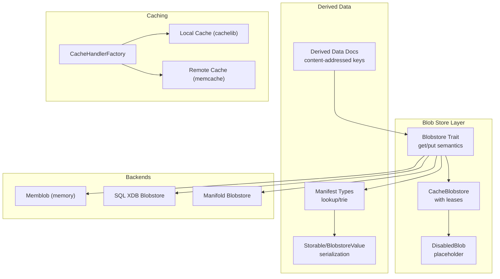
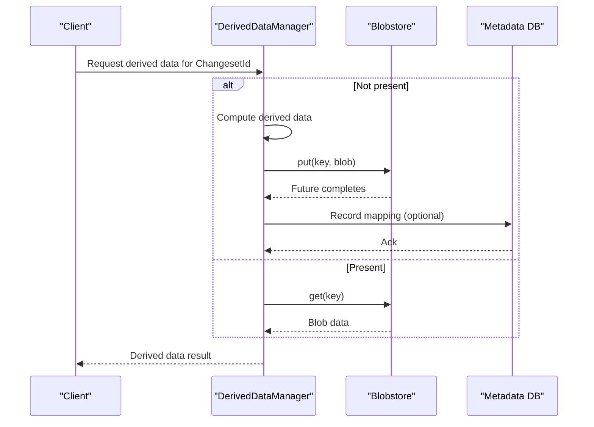
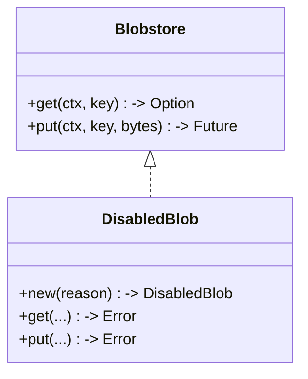
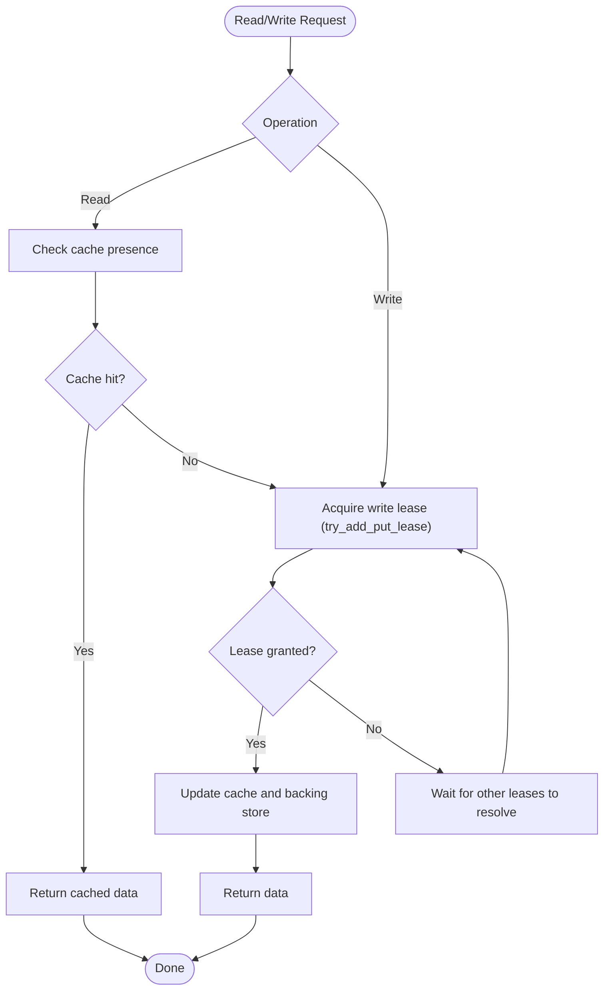
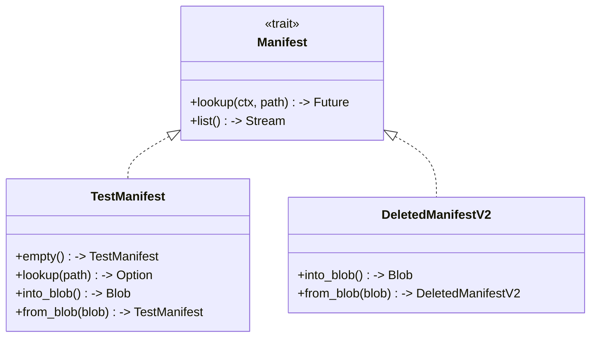
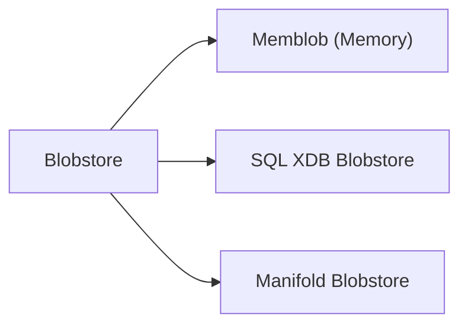
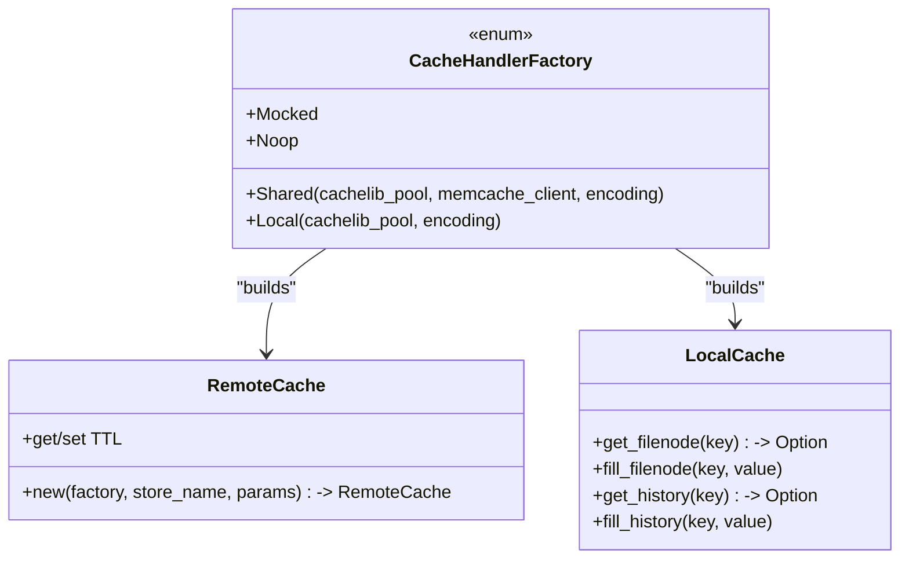
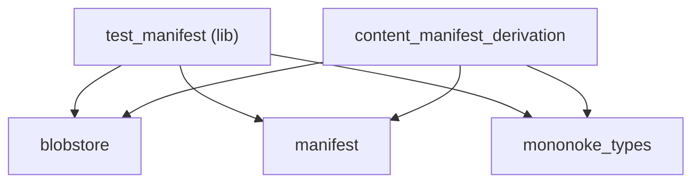

# Distributed Storage

<cite>
**Referenced Files in This Document**
- [lib.rs](file://eden/mononoke/blobstore/src/lib.rs)
- [disabled.rs](file://eden/mononoke/blobstore/src/disabled.rs)
- [locking_cache.rs](file://eden/mononoke/blobstore/cacheblob/src/locking_cache.rs)
- [types.rs](file://eden/mononoke/manifest/src/types.rs)
- [lib.rs](file://eden/scm/lib/manifest/src/lib.rs)
- [2.3-derived-data.md](file://eden/mononoke/docs/2.3-derived-data.md)
- [deleted_manifest_v2.rs](file://eden/mononoke/mononoke_types/src/deleted_manifest_v2.rs)
- [test_manifest.rs](file://eden/mononoke/mononoke_types/src/test_manifest.rs)
- [benchmark_filestore.rs](file://eden/mononoke/benchmarks/filestore/benchmark_filestore.rs)
- [ObjectCache.h](file://eden/fs/store/ObjectCache.h)
- [factory.rs](file://eden/mononoke/common/rust/caching_ext/src/factory.rs)
- [remote_cache.rs](file://eden/mononoke/repo_attributes/newfilenodes/src/remote_cache.rs)
- [local_cache.rs](file://eden/mononoke/repo_attributes/newfilenodes/src/local_cache.rs)
- [Cargo.toml](file://eden/mononoke/derived_data/test_manifest/Cargo.toml)
- [Cargo.toml](file://eden/mononoke/derived_data/content_manifest_derivation/Cargo.toml)
- [ACR_cache_key_invalidation.md](file://eden/.llms/rules/ACR_cache_key_invalidation.md)
</cite>

## Table of Contents
1. [Introduction](#introduction)
2. [Project Structure](#project-structure)
3. [Core Components](#core-components)
4. [Architecture Overview](#architecture-overview)
5. [Detailed Component Analysis](#detailed-component-analysis)
6. [Dependency Analysis](#dependency-analysis)
7. [Performance Considerations](#performance-considerations)
8. [Troubleshooting Guide](#troubleshooting-guide)
9. [Conclusion](#conclusion)
10. [Appendices](#appendices)

## Introduction
This document describes the distributed storage architecture in SAPLING SCM with a focus on the blob store, content-addressable storage, distributed data management, synchronization, caching, replication, derived data, manifests, and storage backends. It synthesizes implementation details from Rust modules and documentation to present a practical guide for operators and developers.

## Project Structure
The distributed storage system spans multiple layers:
- Blob store abstraction and implementations
- Derived data pipeline and manifest types
- Caching layers (local and remote)
- Benchmarks and storage backends
- Manifest interfaces and content-addressable storage

**Diagram sources**
- [lib.rs:51-109](file://eden/mononoke/blobstore/src/lib.rs#L51-L109)
- [disabled.rs:19-53](file://eden/mononoke/blobstore/src/disabled.rs#L19-L53)
- [locking_cache.rs:90-193](file://eden/mononoke/blobstore/cacheblob/src/locking_cache.rs#L90-L193)
- [2.3-derived-data.md:96-129](file://eden/mononoke/docs/2.3-derived-data.md#L96-L129)
- [types.rs:40-49](file://eden/mononoke/manifest/src/types.rs#L40-L49)
- [deleted_manifest_v2.rs:216-244](file://eden/mononoke/mononoke_types/src/deleted_manifest_v2.rs#L216-L244)
- [benchmark_filestore.rs:221-255](file://eden/mononoke/benchmarks/filestore/benchmark_filestore.rs#L221-L255)
- [factory.rs:14-50](file://eden/mononoke/common/rust/caching_ext/src/factory.rs#L14-L50)

**Section sources**
- [lib.rs:51-109](file://eden/mononoke/blobstore/src/lib.rs#L51-L109)
- [2.3-derived-data.md:96-129](file://eden/mononoke/docs/2.3-derived-data.md#L96-L129)

## Core Components
- Blob store abstraction: Defines get/put semantics, metadata, and content-addressed keys. Guarantees strong consistency post-put and atomicity for equal keys.
- Derived data: Stored content-addressedly; key formats include changeset-scoped prefixes. Mappings to derived data are maintained in metadata databases for fast lookups.
- Manifests: Hierarchical file system metadata with lookup and trie-like traversal; various manifest types convert to and from storage formats.
- Caching: Factory supports shared (local + remote) or local-only caching; remote cache integrates memcache with TTL and key generation.
- Backends: Memory-backed, SQL-backed XDB, and Manifold-backed blobstores are supported in benchmarks.

**Section sources**
- [lib.rs:308-327](file://eden/mononoke/blobstore/src/lib.rs#L308-L327)
- [2.3-derived-data.md:96-129](file://eden/mononoke/docs/2.3-derived-data.md#L96-L129)
- [types.rs:40-49](file://eden/mononoke/manifest/src/types.rs#L40-L49)
- [deleted_manifest_v2.rs:216-244](file://eden/mononoke/mononoke_types/src/deleted_manifest_v2.rs#L216-L244)
- [benchmark_filestore.rs:221-255](file://eden/mononoke/benchmarks/filestore/benchmark_filestore.rs#L221-L255)
- [factory.rs:14-50](file://eden/mononoke/common/rust/caching_ext/src/factory.rs#L14-L50)

## Architecture Overview
The system uses content-addressable storage for both raw blobs and derived data. Put operations are strongly consistent with respect to retrieval across instances. Derived data types define their own key formats and are stored in the blobstore. Manifests provide hierarchical file metadata and are backed by blobstore storage.

**Diagram sources**
- [2.3-derived-data.md:96-129](file://eden/mononoke/docs/2.3-derived-data.md#L96-L129)
- [lib.rs:308-327](file://eden/mononoke/blobstore/src/lib.rs#L308-L327)

## Detailed Component Analysis

### Blob Store Abstraction and Contracts
- Content-addressed keys: Keys are globally unique identifiers; equal keys imply equal values.
- Consistency guarantees: After a put completes, any process can retrieve the stored data.
- Atomicity: Overwrites for equal keys are implementation-defined but must preserve atomicity.

**Diagram sources**
- [lib.rs:308-327](file://eden/mononoke/blobstore/src/lib.rs#L308-L327)
- [disabled.rs:19-53](file://eden/mononoke/blobstore/src/disabled.rs#L19-L53)

**Section sources**
- [lib.rs:308-327](file://eden/mononoke/blobstore/src/lib.rs#L308-L327)
- [disabled.rs:19-53](file://eden/mononoke/blobstore/src/disabled.rs#L19-L53)

### Cache Blobstore with Lease Protocol
- LeaseOps: Exclusive write gating via atomic test-and-set to reduce thundering herd.
- CacheOps: Presence checks and cache interactions; lazy cache puts supported.
- Combined behavior: Reads hit cache; writes acquire a lease before backing store updates.

**Diagram sources**
- [locking_cache.rs:90-193](file://eden/mononoke/blobstore/cacheblob/src/locking_cache.rs#L90-L193)

**Section sources**
- [locking_cache.rs:90-193](file://eden/mononoke/blobstore/cacheblob/src/locking_cache.rs#L90-L193)

### Derived Data and Manifest Management
- Derived data is stored content-addressedly; key patterns include changeset-scoped prefixes.
- Manifests define lookup and tree traversal; types implement conversion to/from storage blobs.
- Storable and BlobstoreValue traits unify serialization and storage.

**Diagram sources**
- [types.rs:40-49](file://eden/mononoke/manifest/src/types.rs#L40-L49)
- [test_manifest.rs:135-171](file://eden/mononoke/mononoke_types/src/test_manifest.rs#L135-L171)
- [deleted_manifest_v2.rs:216-244](file://eden/mononoke/mononoke_types/src/deleted_manifest_v2.rs#L216-L244)

**Section sources**
- [2.3-derived-data.md:96-129](file://eden/mononoke/docs/2.3-derived-data.md#L96-L129)
- [test_manifest.rs:135-171](file://eden/mononoke/mononoke_types/src/test_manifest.rs#L135-L171)
- [deleted_manifest_v2.rs:216-244](file://eden/mononoke/mononoke_types/src/deleted_manifest_v2.rs#L216-L244)

### Storage Backends and Provisioning
- Memory-backed: Suitable for testing and ephemeral scenarios.
- SQL-backed XDB: Configured via shard map and tier name; supports read-only modes.
- Manifold-backed: Benchmarks demonstrate initialization with bucket and TTL.

**Diagram sources**
- [benchmark_filestore.rs:221-255](file://eden/mononoke/benchmarks/filestore/benchmark_filestore.rs#L221-L255)

**Section sources**
- [benchmark_filestore.rs:221-255](file://eden/mononoke/benchmarks/filestore/benchmark_filestore.rs#L221-L255)

### Caching Strategies and Remote Cache
- CacheHandlerFactory: Supports shared (local + memcache), local-only, mocked, and no-op modes.
- Remote cache: Integrates memcache with TTL and key generation; tracks hits/misses and latency.
- Local cache: Provides get/fill APIs for filenode and history ranges.

**Diagram sources**
- [factory.rs:14-50](file://eden/mononoke/common/rust/caching_ext/src/factory.rs#L14-L50)
- [remote_cache.rs:56-72](file://eden/mononoke/repo_attributes/newfilenodes/src/remote_cache.rs#L56-L72)
- [local_cache.rs:46-81](file://eden/mononoke/repo_attributes/newfilenodes/src/local_cache.rs#L46-L81)

**Section sources**
- [factory.rs:14-50](file://eden/mononoke/common/rust/caching_ext/src/factory.rs#L14-L50)
- [remote_cache.rs:56-72](file://eden/mononoke/repo_attributes/newfilenodes/src/remote_cache.rs#L56-L72)
- [local_cache.rs:46-81](file://eden/mononoke/repo_attributes/newfilenodes/src/local_cache.rs#L46-L81)

### Local Object Cache (EdenFS)
- Template-based cache supporting Simple and InterestHandle flavors.
- Eviction policy considers maximum size and minimum retained entries.
- Thread-safe access with flavor-specific APIs.

**Section sources**
- [ObjectCache.h:94-120](file://eden/fs/store/ObjectCache.h#L94-L120)

### Manifest Interfaces and Content-Addressable Storage
- Manifest trait defines lookup and streaming traversal.
- Manifest implementations serialize to/from blobs and derive content-addressed keys.

**Section sources**
- [lib.rs:42-63](file://eden/scm/lib/manifest/src/lib.rs#L42-L63)
- [types.rs:40-49](file://eden/mononoke/manifest/src/types.rs#L40-L49)

## Dependency Analysis
- Derived data packages declare explicit dependencies on blobstore, manifest, and mononoke types.
- Derived data relies on blobstore for persistence and on manifest types for hierarchical metadata.

**Diagram sources**
- [Cargo.toml:13-24](file://eden/mononoke/derived_data/test_manifest/Cargo.toml#L13-L24)
- [Cargo.toml:10-27](file://eden/mononoke/derived_data/content_manifest_derivation/Cargo.toml#L10-L27)

**Section sources**
- [Cargo.toml:13-24](file://eden/mononoke/derived_data/test_manifest/Cargo.toml#L13-L24)
- [Cargo.toml:10-27](file://eden/mononoke/derived_data/content_manifest_derivation/Cargo.toml#L10-L27)

## Performance Considerations
- Cache key versioning: Include a version component in cache keys; bump on format changes to avoid stale reads.
- Persistent caches: Validate schema version on read; treat mismatches as misses and re-derive.
- Shard/routing caches: Prefer event-based invalidation over polling; return retriable errors when shards are not loaded.
- Large object retention: Maintain minimum entry counts to avoid reloading frequently accessed large objects.

**Section sources**
- [ACR_cache_key_invalidation.md:82-90](file://eden/.llms/rules/ACR_cache_key_invalidation.md#L82-L90)
- [ObjectCache.h:94-120](file://eden/fs/store/ObjectCache.h#L94-L120)

## Troubleshooting Guide
- Disabled blobstore: Operations fail with a configured reason; used as an administrative placeholder.
- Lease contention: If write throughput is high, monitor lease acquisition retries and consider tuning cache and backend configurations.
- Cache misses: Evaluate remote cache TTL and key generation; confirm hit/miss metrics and latency histograms.

**Section sources**
- [disabled.rs:19-53](file://eden/mononoke/blobstore/src/disabled.rs#L19-L53)
- [locking_cache.rs:90-193](file://eden/mononoke/blobstore/cacheblob/src/locking_cache.rs#L90-L193)
- [remote_cache.rs:40-72](file://eden/mononoke/repo_attributes/newfilenodes/src/remote_cache.rs#L40-L72)

## Conclusion
SAPLING SCM’s distributed storage leverages a robust blob store abstraction with content-addressable storage, strong consistency guarantees, and a flexible derived data pipeline. Caching layers (local and remote) improve performance, while multiple backends support varied deployment needs. Adhering to cache key versioning and using lease-based write coordination helps maintain correctness under load.

## Appendices

### Storage Backends Reference
- Memory-backed: For testing and ephemeral environments.
- SQL-backed XDB: Requires shard map and tier configuration; supports read-only modes.
- Manifold-backed: Benchmarks show initialization with bucket, TTL, and options.

**Section sources**
- [benchmark_filestore.rs:221-255](file://eden/mononoke/benchmarks/filestore/benchmark_filestore.rs#L221-L255)