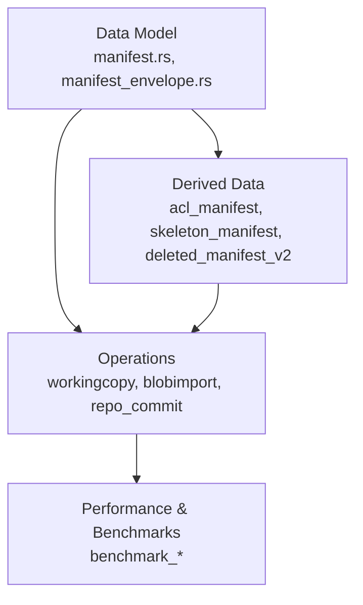
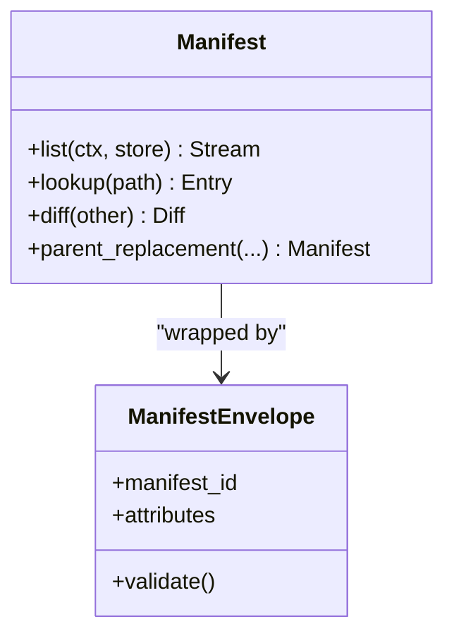
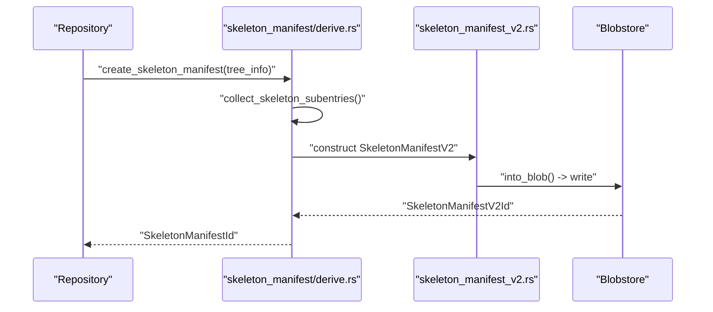
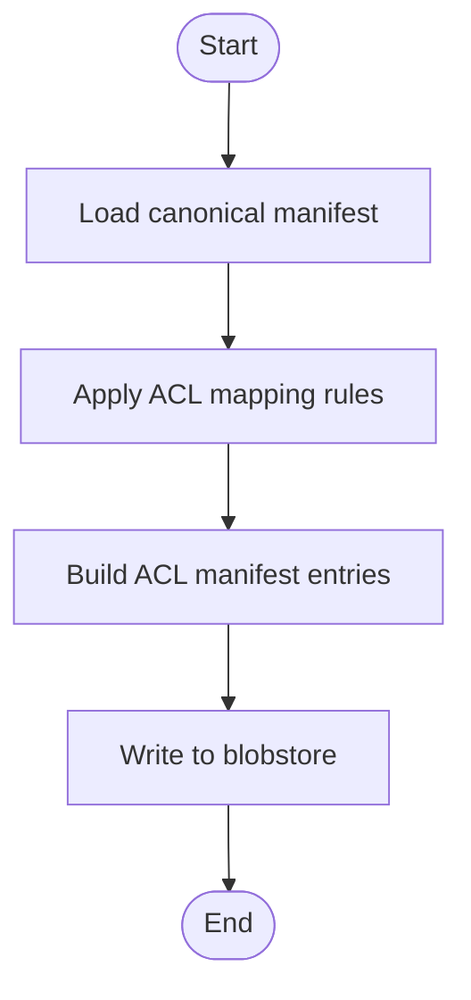
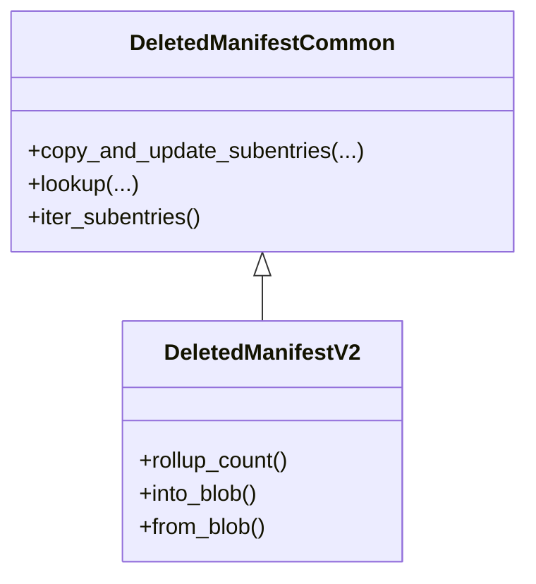
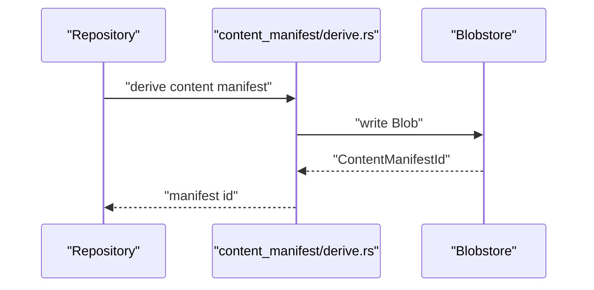
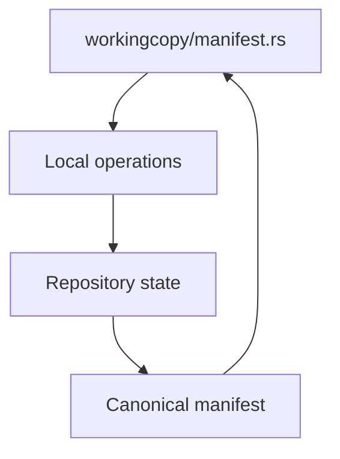
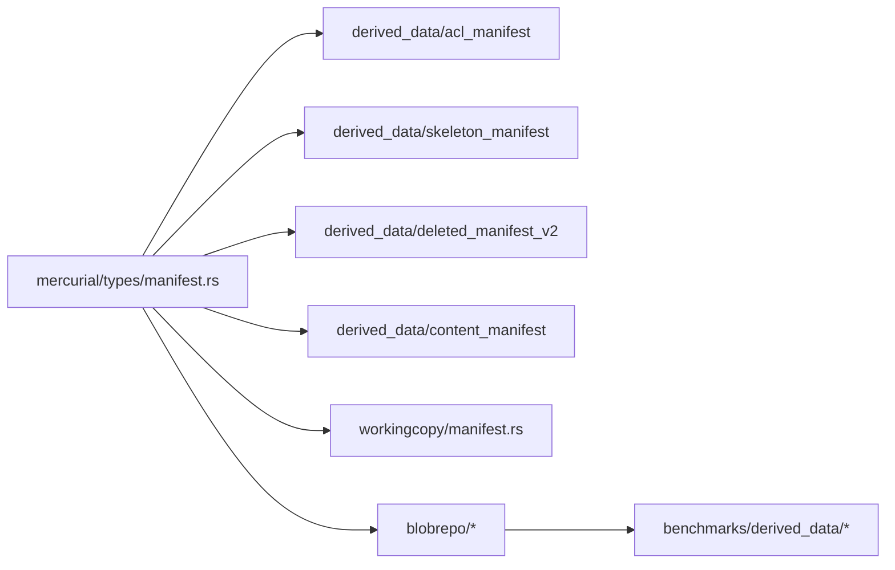

# Manifest Management

<cite>
**Referenced Files in This Document**
- [manifest.rs](file://eden/mononoke/mercurial/types/src/manifest.rs)
- [manifest_envelope.rs](file://eden/mononoke/mercurial/types/src/envelope/manifest_envelope.rs)
- [manifest_utils.rs](file://eden/mononoke/mercurial/revlog/manifest/manifest_utils.rs)
- [manifest.rs](file://eden/mononoke/mercurial/revlog/manifest.rs)
- [manifest.rs](file://eden/scm/lib/workingcopy/src/manifest.rs)
- [deleted_manifest_common.rs](file://eden/mononoke/mononoke_types/src/deleted_manifest_common.rs)
- [skeleton_manifest_v2.rs](file://eden/mononoke/mononoke_types/src/skeleton_manifest_v2.rs)
- [derive.rs](file://eden/mononoke/derived_data/skeleton_manifest/derive.rs)
- [skeleton_manifests.rs](file://eden/mononoke/manifest/src/types/skeleton_manifests.rs)
- [walk.rs](file://eden/mononoke/jobs/walker/src/detail/walk.rs)
- [derive.rs](file://eden/mononoke/derived_data/acl_manifest/derive.rs)
- [lib.rs](file://eden/mononoke/derived_data/acl_manifest/lib.rs)
- [mapping.rs](file://eden/mononoke/derived_data/acl_manifest/mapping.rs)
- [deleted_manifest_v2.rs](file://eden/mononoke/mononoke_types/src/deleted_manifest_v2.rs)
- [deleted_manifest_v2_ops.rs](file://eden/mononoke/derived_data/deleted_manifest_v2/ops.rs)
- [deleted_manifest_v2_mapping.rs](file://eden/mononoke/derived_data/deleted_manifest_v2/mapping.rs)
- [content_manifest_derivation.rs](file://eden/mononoke/derived_data/content_manifest/derive.rs)
- [hg_augmented_manifest_batch.rs](file://eden/mononoke/benchmarks/derived_data/benchmark_hg_augmented_manifest_batch.rs)
- [hg_manifest.rs](file://eden/mononoke/benchmarks/derived_data/benchmark_hg_manifest.rs)
- [benchmark_large_directory.rs](file://eden/mononoke/benchmarks/derived_data/benchmark_large_directory.rs)
- [changeset.rs](file://eden/mononoke/blobimport_lib/src/changeset.rs)
- [create_changeset.rs](file://eden/mononoke/blobrepo/blobrepo_hg/src/create_changeset.rs)
- [repo_commit.rs](file://eden/mononoke/blobrepo/blobrepo_hg/src/repo_commit.rs)
- [changed_files.rs](file://eden/mononoke/blobrepo/common/src/changed_files.rs)
- [bonsai_generation.rs](file://eden/mononoke/blobrepo/blobrepo_hg/src/bonsai_generation.rs)
- [manifest_id_store.rs](file://eden/mononoke/repo_attributes/restricted_paths_common/src/manifest_id_store.rs)
</cite>

## Table of Contents
1. [Introduction](#introduction)
2. [Project Structure](#project-structure)
3. [Core Components](#core-components)
4. [Architecture Overview](#architecture-overview)
5. [Detailed Component Analysis](#detailed-component-analysis)
6. [Dependency Analysis](#dependency-analysis)
7. [Performance Considerations](#performance-considerations)
8. [Troubleshooting Guide](#troubleshooting-guide)
9. [Conclusion](#conclusion)
10. [Appendices](#appendices)

## Introduction
This document explains manifest management in SAPLING SCM. It covers manifest data structures, versioning, storage formats, and specialized forms such as skeleton manifests and ACL manifests. It also documents creation, updates, validation, indexing, lookup optimization, migration, compatibility, upgrade strategies, corruption detection, recovery, and integration with derived data and repository operations.

## Project Structure
Manifest-related code spans several subsystems:
- Mercurial types and envelopes define the canonical manifest representation and envelope metadata.
- Derived data modules produce specialized manifests (ACL, skeleton, deleted) and integrate with repository operations.
- Benchmarks demonstrate performance characteristics and reuse patterns.
- Working-copy and blobimport utilities interact with manifests during commit and repository operations.

```mermaid
graph TB
subgraph "Mercurial Types"
MTypes["manifest.rs"]
MEnv["manifest_envelope.rs"]
MUtils["manifest_utils.rs"]
end
subgraph "Derived Data"
ACL["acl_manifest/derive.rs"]
SKEL["skeleton_manifest/derive.rs"]
DEL["deleted_manifest_v2/*"]
CONTENT["content_manifest/derive.rs"]
end
subgraph "Repository Ops"
WC["workingcopy/manifest.rs"]
CHG["blobimport_lib/changeset.rs"]
CC["blobrepo_hg/create_changeset.rs"]
RC["blobrepo_hg/repo_commit.rs"]
CF["blobrepo/common/changed_files.rs"]
BG["blobrepo_hg/bonsai_generation.rs"]
end
subgraph "Benchmarks"
BM1["benchmark_hg_manifest.rs"]
BM2["benchmark_hg_augmented_manifest_batch.rs"]
BM3["benchmark_large_directory.rs"]
end
MTypes --> ACL
MTypes --> SKEL
MTypes --> DEL
MTypes --> CONTENT
MTypes --> WC
MTypes --> CHG
MTypes --> CC
MTypes --> RC
MTypes --> CF
MTypes --> BG
MTypes --> BM1
MTypes --> BM2
MTypes --> BM3
```



**Diagram sources**
- [manifest.rs](file://eden/mononoke/mercurial/types/src/manifest.rs)
- [manifest_envelope.rs](file://eden/mononoke/mercurial/types/src/envelope/manifest_envelope.rs)
- [manifest_utils.rs](file://eden/mononoke/mercurial/revlog/manifest/manifest_utils.rs)
- [derive.rs](file://eden/mononoke/derived_data/acl_manifest/derive.rs)
- [derive.rs](file://eden/mononoke/derived_data/skeleton_manifest/derive.rs)
- [deleted_manifest_v2.rs](file://eden/mononoke/mononoke_types/src/deleted_manifest_v2.rs)
- [deleted_manifest_v2_ops.rs](file://eden/mononoke/derived_data/deleted_manifest_v2/ops.rs)
- [deleted_manifest_v2_mapping.rs](file://eden/mononoke/derived_data/deleted_manifest_v2/mapping.rs)
- [content_manifest_derivation.rs](file://eden/mononoke/derived_data/content_manifest/derive.rs)
- [manifest.rs](file://eden/scm/lib/workingcopy/src/manifest.rs)
- [changeset.rs](file://eden/mononoke/blobimport_lib/src/changeset.rs)
- [create_changeset.rs](file://eden/mononoke/blobrepo/blobrepo_hg/src/create_changeset.rs)
- [repo_commit.rs](file://eden/mononoke/blobrepo/blobrepo_hg/src/repo_commit.rs)
- [changed_files.rs](file://eden/mononoke/blobrepo/common/src/changed_files.rs)
- [bonsai_generation.rs](file://eden/mononoke/blobrepo/blobrepo_hg/src/bonsai_generation.rs)
- [hg_manifest.rs](file://eden/mononoke/benchmarks/derived_data/benchmark_hg_manifest.rs)
- [hg_augmented_manifest_batch.rs](file://eden/mononoke/benchmarks/derived_data/benchmark_hg_augmented_manifest_batch.rs)
- [benchmark_large_directory.rs](file://eden/mononoke/benchmarks/derived_data/benchmark_large_directory.rs)

**Section sources**
- [manifest.rs](file://eden/mononoke/mercurial/types/src/manifest.rs)
- [manifest_envelope.rs](file://eden/mononoke/mercurial/types/src/envelope/manifest_envelope.rs)
- [manifest_utils.rs](file://eden/mononoke/mercurial/revlog/manifest/manifest_utils.rs)
- [manifest.rs](file://eden/mononoke/mercurial/revlog/manifest.rs)
- [manifest.rs](file://eden/scm/lib/workingcopy/src/manifest.rs)

## Core Components
- Canonical manifest types and operations define the core data model and behaviors used across the system.
- Envelope metadata encapsulates manifest provenance and auxiliary attributes.
- Working-copy manifest integrates with local repository state.
- Derived data manifests (ACL, skeleton, deleted) optimize repository operations and storage.

Key responsibilities:
- Define manifest entry types, ordering, and traversal.
- Provide operations for diffing, lookup, and parent replacement.
- Support specialized manifest variants for access control, directory skeletons, and deletions.
- Enable efficient indexing and lookup via weighted traversal and rollup counts.

**Section sources**
- [manifest.rs](file://eden/mononoke/mercurial/types/src/manifest.rs)
- [manifest_envelope.rs](file://eden/mononoke/mercurial/types/src/envelope/manifest_envelope.rs)
- [manifest.rs](file://eden/mononoke/mercurial/revlog/manifest.rs)
- [manifest.rs](file://eden/scm/lib/workingcopy/src/manifest.rs)

## Architecture Overview
The manifest architecture separates concerns across three layers:
- Data model: canonical manifest types and envelopes.
- Derived data: specialized manifests for ACL, skeleton, and deleted entries.
- Operations: repository integration, derivation, and benchmarking.



**Diagram sources**
- [manifest.rs](file://eden/mononoke/mercurial/types/src/manifest.rs)
- [manifest_envelope.rs](file://eden/mononoke/mercurial/types/src/envelope/manifest_envelope.rs)
- [derive.rs](file://eden/mononoke/derived_data/acl_manifest/derive.rs)
- [derive.rs](file://eden/mononoke/derived_data/skeleton_manifest/derive.rs)
- [deleted_manifest_v2.rs](file://eden/mononoke/mononoke_types/src/deleted_manifest_v2.rs)
- [manifest.rs](file://eden/scm/lib/workingcopy/src/manifest.rs)
- [changeset.rs](file://eden/mononoke/blobimport_lib/src/changeset.rs)
- [repo_commit.rs](file://eden/mononoke/blobrepo/blobrepo_hg/src/repo_commit.rs)
- [hg_manifest.rs](file://eden/mononoke/benchmarks/derived_data/benchmark_hg_manifest.rs)

## Detailed Component Analysis

### Canonical Manifest Types and Envelope
- Manifest types define entries (files, directories), ordering, and traversal semantics.
- Envelope metadata carries auxiliary information for manifest retrieval and validation.
- Utilities support manifest parsing, diffing, and parent replacement.



**Diagram sources**
- [manifest.rs](file://eden/mononoke/mercurial/types/src/manifest.rs)
- [manifest_envelope.rs](file://eden/mononoke/mercurial/types/src/envelope/manifest_envelope.rs)
- [manifest_utils.rs](file://eden/mononoke/mercurial/revlog/manifest/manifest_utils.rs)

**Section sources**
- [manifest.rs](file://eden/mononoke/mercurial/types/src/manifest.rs)
- [manifest_envelope.rs](file://eden/mononoke/mercurial/types/src/envelope/manifest_envelope.rs)
- [manifest_utils.rs](file://eden/mononoke/mercurial/revlog/manifest/manifest_utils.rs)

### Skeleton Manifests
Skeleton manifests represent directory structures without full file content, enabling efficient traversal and storage.

- Creation process builds directory trees from parent manifests and subentries.
- Weighted traversal supports optimized enumeration and rollup counting.
- V2 introduces rollup counts for performance tuning.



**Diagram sources**
- [derive.rs](file://eden/mononoke/derived_data/skeleton_manifest/derive.rs)
- [skeleton_manifest_v2.rs](file://eden/mononoke/mononoke_types/src/skeleton_manifest_v2.rs)
- [skeleton_manifests.rs](file://eden/mononoke/manifest/src/types/skeleton_manifests.rs)

**Section sources**
- [derive.rs](file://eden/mononoke/derived_data/skeleton_manifest/derive.rs)
- [skeleton_manifest_v2.rs](file://eden/mononoke/mononoke_types/src/skeleton_manifest_v2.rs)
- [skeleton_manifests.rs](file://eden/mononoke/manifest/src/types/skeleton_manifests.rs)

### ACL Manifests
ACL manifests restrict visibility and access to repository content, derived from canonical manifests and mapping rules.



**Diagram sources**
- [derive.rs](file://eden/mononoke/derived_data/acl_manifest/derive.rs)
- [lib.rs](file://eden/mononoke/derived_data/acl_manifest/lib.rs)
- [mapping.rs](file://eden/mononoke/derived_data/acl_manifest/mapping.rs)

**Section sources**
- [derive.rs](file://eden/mononoke/derived_data/acl_manifest/derive.rs)
- [lib.rs](file://eden/mononoke/derived_data/acl_manifest/lib.rs)
- [mapping.rs](file://eden/mononoke/derived_data/acl_manifest/mapping.rs)

### Deleted Manifests
Deleted manifests track removed paths efficiently, supporting fast lookup and updates.



**Diagram sources**
- [deleted_manifest_common.rs](file://eden/mononoke/mononoke_types/src/deleted_manifest_common.rs)
- [deleted_manifest_v2.rs](file://eden/mononoke/mononoke_types/src/deleted_manifest_v2.rs)
- [deleted_manifest_v2_ops.rs](file://eden/mononoke/derived_data/deleted_manifest_v2/ops.rs)
- [deleted_manifest_v2_mapping.rs](file://eden/mononoke/derived_data/deleted_manifest_v2/mapping.rs)

**Section sources**
- [deleted_manifest_common.rs](file://eden/mononoke/mononoke_types/src/deleted_manifest_common.rs)
- [deleted_manifest_v2.rs](file://eden/mononoke/mononoke_types/src/deleted_manifest_v2.rs)
- [deleted_manifest_v2_ops.rs](file://eden/mononoke/derived_data/deleted_manifest_v2/ops.rs)
- [deleted_manifest_v2_mapping.rs](file://eden/mononoke/derived_data/deleted_manifest_v2/mapping.rs)

### Content Manifests
Content manifests represent file content mappings and are derived from repository state for efficient lookup and caching.



**Diagram sources**
- [content_manifest_derivation.rs](file://eden/mononoke/derived_data/content_manifest/derive.rs)

**Section sources**
- [content_manifest_derivation.rs](file://eden/mononoke/derived_data/content_manifest/derive.rs)

### Working-Copy Manifest Integration
Working-copy manifests bridge local state with repository manifests, enabling operations like diffs and commits.



**Diagram sources**
- [manifest.rs](file://eden/scm/lib/workingcopy/src/manifest.rs)

**Section sources**
- [manifest.rs](file://eden/scm/lib/workingcopy/src/manifest.rs)

### Repository Operations and Manifests
Manifests integrate with repository operations such as changeset creation, commit generation, and changed-files computation.

```mermaid
sequenceDiagram
participant Repo as "Repository"
participant Changeset as "blobimport_lib/changeset.rs"
participant Create as "blobrepo_hg/create_changeset.rs"
participant Commit as "blobrepo_hg/repo_commit.rs"
participant Diff as "blobrepo/common/changed_files.rs"
participant BG as "blobrepo_hg/bonsai_generation.rs"
Repo->>Changeset : "parse changeset"
Changeset->>Create : "build manifest deltas"
Create->>Commit : "commit changes"
Commit->>Diff : "compute changed files"
Diff->>BG : "generate bonsai"
BG-->>Repo : "updated manifest ids"
```

**Diagram sources**
- [changeset.rs](file://eden/mononoke/blobimport_lib/src/changeset.rs)
- [create_changeset.rs](file://eden/mononoke/blobrepo/blobrepo_hg/src/create_changeset.rs)
- [repo_commit.rs](file://eden/mononoke/blobrepo/blobrepo_hg/src/repo_commit.rs)
- [changed_files.rs](file://eden/mononoke/blobrepo/common/src/changed_files.rs)
- [bonsai_generation.rs](file://eden/mononoke/blobrepo/blobrepo_hg/src/bonsai_generation.rs)

**Section sources**
- [changeset.rs](file://eden/mononoke/blobimport_lib/src/changeset.rs)
- [create_changeset.rs](file://eden/mononoke/blobrepo/blobrepo_hg/src/create_changeset.rs)
- [repo_commit.rs](file://eden/mononoke/blobrepo/blobrepo_hg/src/repo_commit.rs)
- [changed_files.rs](file://eden/mononoke/blobrepo/common/src/changed_files.rs)
- [bonsai_generation.rs](file://eden/mononoke/blobrepo/blobrepo_hg/src/bonsai_generation.rs)

## Dependency Analysis
Manifests depend on derived data modules for specialized views and on repository operations for updates. Benchmarks quantify performance characteristics and reuse benefits.



**Diagram sources**
- [manifest.rs](file://eden/mononoke/mercurial/types/src/manifest.rs)
- [derive.rs](file://eden/mononoke/derived_data/acl_manifest/derive.rs)
- [derive.rs](file://eden/mononoke/derived_data/skeleton_manifest/derive.rs)
- [deleted_manifest_v2.rs](file://eden/mononoke/mononoke_types/src/deleted_manifest_v2.rs)
- [content_manifest_derivation.rs](file://eden/mononoke/derived_data/content_manifest/derive.rs)
- [manifest.rs](file://eden/scm/lib/workingcopy/src/manifest.rs)
- [create_changeset.rs](file://eden/mononoke/blobrepo/blobrepo_hg/src/create_changeset.rs)
- [hg_augmented_manifest_batch.rs](file://eden/mononoke/benchmarks/derived_data/benchmark_hg_augmented_manifest_batch.rs)

**Section sources**
- [manifest.rs](file://eden/mononoke/mercurial/types/src/manifest.rs)
- [hg_augmented_manifest_batch.rs](file://eden/mononoke/benchmarks/derived_data/benchmark_hg_augmented_manifest_batch.rs)

## Performance Considerations
- Skeleton manifests leverage weighted traversal and rollup counts to minimize IO and improve enumeration speed.
- Batch benchmarks demonstrate significant overhead reduction when reusing unchanged manifest subtrees.
- Large-directory benchmarks highlight the value of skeleton and deleted manifests for handling extensive directory structures.

Optimization techniques:
- Prefer skeleton manifests for directory-heavy trees.
- Use rollup counts to guide traversal order.
- Reuse derived manifests across commits when possible.

**Section sources**
- [skeleton_manifests.rs](file://eden/mononoke/manifest/src/types/skeleton_manifests.rs)
- [skeleton_manifest_v2.rs](file://eden/mononoke/mononoke_types/src/skeleton_manifest_v2.rs)
- [hg_augmented_manifest_batch.rs](file://eden/mononoke/benchmarks/derived_data/benchmark_hg_augmented_manifest_batch.rs)
- [benchmark_large_directory.rs](file://eden/mononoke/benchmarks/derived_data/benchmark_large_directory.rs)

## Troubleshooting Guide
- Manifest validation failures: check envelope metadata and manifest integrity using envelope validation routines.
- Corruption detection: rely on envelope checksums and blobstore integrity checks; re-derive manifests from known-good commits.
- Recovery mechanisms: rebuild ACL, skeleton, and deleted manifests from upstream canonical manifests; use repository walk to reconstruct missing nodes.
- Consistency verification: compare derived manifests against canonical manifests; ensure IDs align with manifest ID stores.

Common checks:
- Verify manifest IDs in manifest ID store for consistency.
- Validate derived manifest rollup counts and subtree references.
- Confirm envelope attributes match expected manifest versions.

**Section sources**
- [manifest_envelope.rs](file://eden/mononoke/mercurial/types/src/envelope/manifest_envelope.rs)
- [deleted_manifest_common.rs](file://eden/mononoke/mononoke_types/src/deleted_manifest_common.rs)
- [manifest_id_store.rs](file://eden/mononoke/repo_attributes/restricted_paths_common/src/manifest_id_store.rs)

## Conclusion
Manifest management in SAPLING SCM centers on robust canonical types, specialized derived manifests, and tight integration with repository operations. Skeleton and ACL manifests enable scalable traversal and access control, while deleted manifests streamline change tracking. Benchmarks guide optimization, and envelope metadata ensures integrity. Migration and compatibility are handled through versioned manifest types and derived data layers.

## Appendices

### Manifest Storage Formats
- Envelope-based storage: manifests are serialized with metadata for integrity and provenance.
- Blobstore-backed: derived manifests are stored as blobs keyed by stable identifiers.
- Rollup-aware: V2 skeleton manifests include rollup counts to accelerate traversal.

**Section sources**
- [manifest_envelope.rs](file://eden/mononoke/mercurial/types/src/envelope/manifest_envelope.rs)
- [skeleton_manifest_v2.rs](file://eden/mononoke/mononoke_types/src/skeleton_manifest_v2.rs)

### Versioning and Compatibility
- Manifest types evolve with versioned envelopes and derived data structures.
- Backward-compatible upgrades maintain stable IDs and layered derivation.
- Parent replacement and diff operations remain consistent across versions.

**Section sources**
- [manifest.rs](file://eden/mononoke/mercurial/types/src/manifest.rs)
- [manifest_utils.rs](file://eden/mononoke/mercurial/revlog/manifest/manifest_utils.rs)

### Indexing and Lookup Optimization
- Weighted traversal prioritizes heavy subtrees via rollup counts.
- Directory mapping and edge construction optimize graph walks.
- Batch benchmarks illustrate reuse benefits for unchanged subtrees.

**Section sources**
- [skeleton_manifests.rs](file://eden/mononoke/manifest/src/types/skeleton_manifests.rs)
- [walk.rs](file://eden/mononoke/jobs/walker/src/detail/walk.rs)
- [hg_augmented_manifest_batch.rs](file://eden/mononoke/benchmarks/derived_data/benchmark_hg_augmented_manifest_batch.rs)

### Migration Procedures
- Re-derive ACL, skeleton, and deleted manifests from canonical manifests after schema changes.
- Validate rollup counts and subtree IDs post-migration.
- Use repository walk to detect and repair missing nodes.

**Section sources**
- [derive.rs](file://eden/mononoke/derived_data/acl_manifest/derive.rs)
- [derive.rs](file://eden/mononoke/derived_data/skeleton_manifest/derive.rs)
- [deleted_manifest_v2_ops.rs](file://eden/mononoke/derived_data/deleted_manifest_v2/ops.rs)