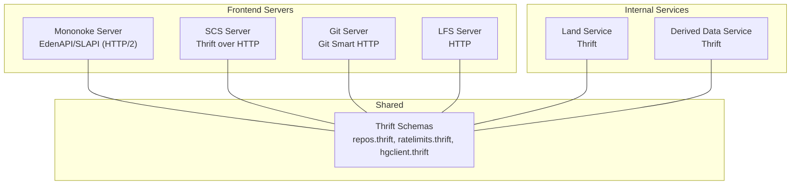
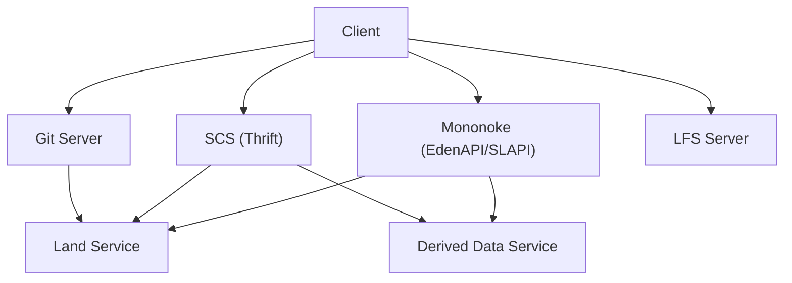
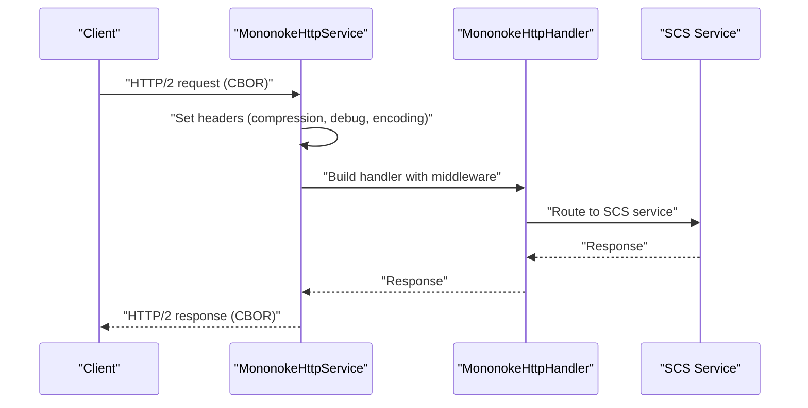
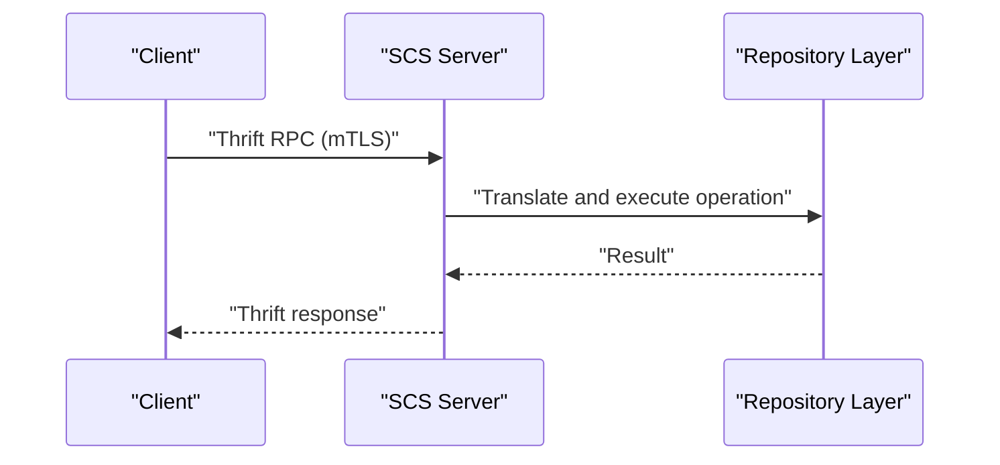
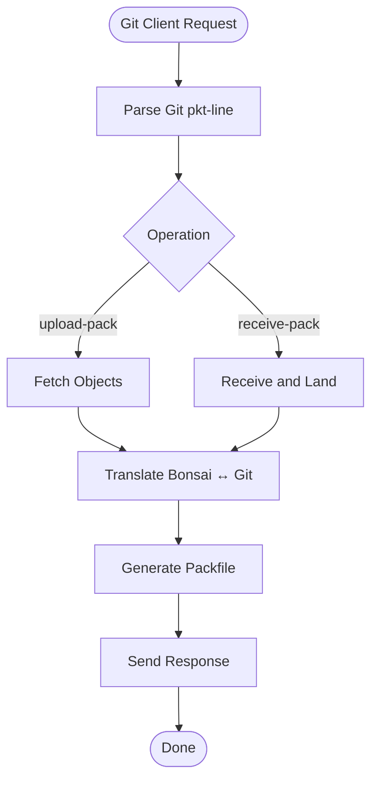
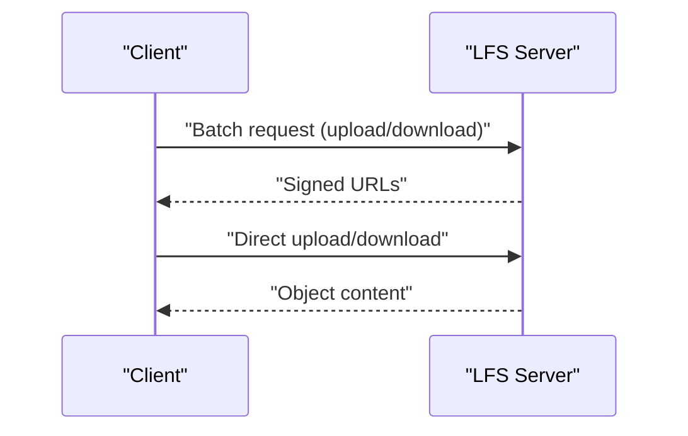
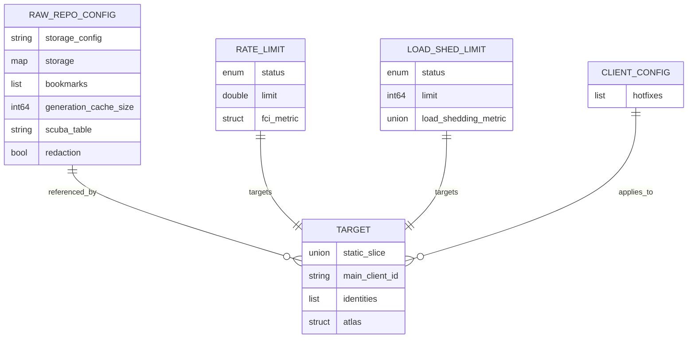
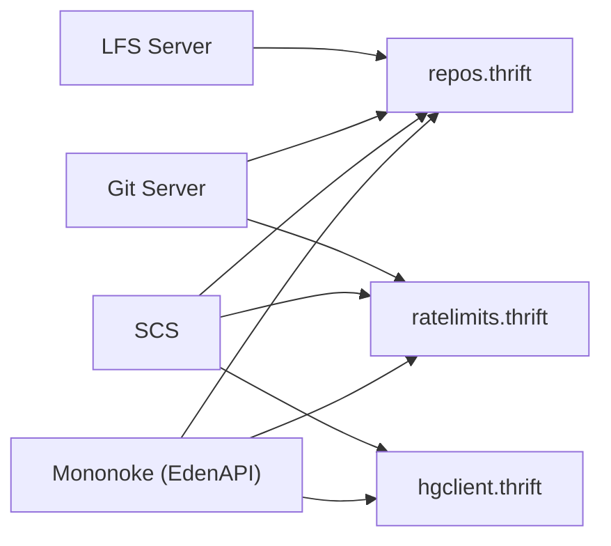

# API Interfaces and Protocols

<cite>
**Referenced Files in This Document**
- [3.1-servers-and-services.md](file://eden/mononoke/docs/3.1-servers-and-services.md)
- [5.1-git-support.md](file://eden/mononoke/docs/5.1-git-support.md)
- [http_service.rs](file://eden/mononoke/servers/slapi/slapi_server/repo_listener/src/http_service.rs)
- [handler.rs](file://eden/mononoke/common/gotham_ext/src/handler.rs)
- [repos.thrift](file://configerator/structs/scm/mononoke/repos/repos.thrift)
- [ratelimits.thrift](file://configerator/structs/scm/mononoke/ratelimiting/ratelimits.thrift)
- [hgclient.thrift](file://configerator/structs/scm/hg/hgclientconf/hgclient.thrift)
- [mononoke.py](file://eden/scm/sapling/testing/ext/mononoke.py)
</cite>

## Table of Contents
1. [Introduction](#introduction)
2. [Project Structure](#project-structure)
3. [Core Components](#core-components)
4. [Architecture Overview](#architecture-overview)
5. [Detailed Component Analysis](#detailed-component-analysis)
6. [Dependency Analysis](#dependency-analysis)
7. [Performance Considerations](#performance-considerations)
8. [Troubleshooting Guide](#troubleshooting-guide)
9. [Conclusion](#conclusion)
10. [Appendices](#appendices)

## Introduction
This document describes the Mononoke Server API interfaces and communication protocols. It focuses on:
- Thrift-based API definitions and schemas
- HTTP-based EdenAPI (SLAPI) protocol for Sapling/EdenFS
- Git protocol integration and LFS support
- SCS (Source Control Service) Thrift interface
- API versioning, backward compatibility, and migration
- Authentication headers, request validation, and error responses
- Usage examples, client integration patterns, and performance/security considerations

## Project Structure
Mononoke is organized as a distributed service architecture with frontend protocol servers and internal microservices. The key areas relevant to APIs and protocols:
- Frontend servers: Mononoke (EdenAPI/SLAPI), SCS (Thrift), Git server (smart HTTP), LFS server (HTTP)
- Internal services: Land Service, Derived Data Service
- Shared configuration and schemas: Thrift definitions for repositories, rate limits, and client configuration

**Diagram sources**
- [3.1-servers-and-services.md:26-113](file://eden/mononoke/docs/3.1-servers-and-services.md#L26-L113)
- [repos.thrift:1-120](file://configerator/structs/scm/mononoke/repos/repos.thrift#L1-L120)
- [ratelimits.thrift:1-184](file://configerator/structs/scm/mononoke/ratelimiting/ratelimits.thrift#L1-L184)
- [hgclient.thrift:1-131](file://configerator/structs/scm/hg/hgclientconf/hgclient.thrift#L1-L131)

**Section sources**
- [3.1-servers-and-services.md:1-388](file://eden/mononoke/docs/3.1-servers-and-services.md#L1-L388)

## Core Components
- Mononoke Server (EdenAPI/SLAPI): Implements HTTP/2 with CBOR-encoded requests/responses; integrates with repo listener and Gotham middleware; supports authentication via TLS identities and headers.
- SCS Server: Thrift API over HTTP with mTLS; supports multiple commit identity schemes and repository operations.
- Git Server: Implements Git smart HTTP protocol; translates between Git and Bonsai formats.
- LFS Server: Implements Git LFS HTTP endpoints for upload/download.
- Thrift Schemas: Define repository configuration, rate-limiting policies, and client configuration structures.

**Section sources**
- [3.1-servers-and-services.md:26-113](file://eden/mononoke/docs/3.1-servers-and-services.md#L26-L113)
- [http_service.rs:66-91](file://eden/mononoke/servers/slapi/slapi_server/repo_listener/src/http_service.rs#L66-L91)
- [handler.rs:146-188](file://eden/mononoke/common/gotham_ext/src/handler.rs#L146-L188)

## Architecture Overview
Mononoke servers communicate using HTTP and Thrift. The architecture emphasizes statelessness, with persistent state stored externally (blobstore and metadata database). Frontend servers implement diverse protocols for different clients; internal services coordinate expensive operations.

**Diagram sources**
- [3.1-servers-and-services.md:242-294](file://eden/mononoke/docs/3.1-servers-and-services.md#L242-L294)

**Section sources**
- [3.1-servers-and-services.md:242-294](file://eden/mononoke/docs/3.1-servers-and-services.md#L242-L294)

## Detailed Component Analysis

### EdenAPI/SLAPI HTTP Protocol
- Transport: HTTP/2
- Encoding: CBOR
- Purpose: Serve Sapling CLI and EdenFS; supports clone, pull, push, and on-demand file fetches
- Authentication: TLS identities and headers; request routing handled by repo listener and Gotham middleware
- Headers of interest:
  - Compression and debug hints
  - Mononoke-specific encoding and host headers
  - WebSocket handshake headers (when applicable)
- Error responses: Standard HTTP status codes with structured errors surfaced via middleware

**Diagram sources**
- [http_service.rs:66-91](file://eden/mononoke/servers/slapi/slapi_server/repo_listener/src/http_service.rs#L66-L91)
- [http_service.rs:417-437](file://eden/mononoke/servers/slapi/slapi_server/repo_listener/src/http_service.rs#L417-L437)
- [handler.rs:146-188](file://eden/mononoke/common/gotham_ext/src/handler.rs#L146-L188)

**Section sources**
- [3.1-servers-and-services.md:246-257](file://eden/mononoke/docs/3.1-servers-and-services.md#L246-L257)
- [http_service.rs:66-91](file://eden/mononoke/servers/slapi/slapi_server/repo_listener/src/http_service.rs#L66-L91)
- [http_service.rs:417-437](file://eden/mononoke/servers/slapi/slapi_server/repo_listener/src/http_service.rs#L417-L437)
- [handler.rs:146-188](file://eden/mononoke/common/gotham_ext/src/handler.rs#L146-L188)

### SCS (Source Control Service) Thrift API
- Transport: Thrift over HTTP with mTLS
- Methods: ~80 methods for repository operations (commit lookup, history, blame, file content, diffs, write operations)
- Identity schemes: Supports multiple commit identity schemes (Bonsai, Git, Mercurial, Globalrev, SVN)
- Security: mTLS and authorization checks via repository permission checker

**Diagram sources**
- [3.1-servers-and-services.md:48-69](file://eden/mononoke/docs/3.1-servers-and-services.md#L48-L69)

**Section sources**
- [3.1-servers-and-services.md:48-69](file://eden/mononoke/docs/3.1-servers-and-services.md#L48-L69)

### Git Protocol Integration
- Transport: Git smart HTTP
- Operations: upload-pack (fetch), receive-pack (push)
- Translation: Bonsai ↔ Git commit mapping, Git trees derived from Bonsai file changes
- References: symbolic refs for branches/tags
- LFS: Integrated with LFS server for large files

**Diagram sources**
- [3.1-servers-and-services.md:71-92](file://eden/mononoke/docs/3.1-servers-and-services.md#L71-L92)
- [5.1-git-support.md:18-34](file://eden/mononoke/docs/5.1-git-support.md#L18-L34)

**Section sources**
- [3.1-servers-and-services.md:71-92](file://eden/mononoke/docs/3.1-servers-and-services.md#L71-L92)
- [5.1-git-support.md:18-34](file://eden/mononoke/docs/5.1-git-support.md#L18-L34)

### LFS Protocol
- Transport: HTTP
- Endpoints: Batch API for upload/download URLs; direct upload/download endpoints
- Storage: Blobstore via filestore facet; chunking for large files
- Federation: Standalone or upstream LFS server

**Diagram sources**
- [3.1-servers-and-services.md:93-113](file://eden/mononoke/docs/3.1-servers-and-services.md#L93-L113)

**Section sources**
- [3.1-servers-and-services.md:93-113](file://eden/mononoke/docs/3.1-servers-and-services.md#L93-L113)

### Thrift Schemas and Data Models
- Repository configuration and identity schemes
- Rate limiting and load shedding policies
- Client configuration structures (Mercurial/Hg client config)

**Diagram sources**
- [repos.thrift:286-415](file://configerator/structs/scm/mononoke/repos/repos.thrift#L286-L415)
- [ratelimits.thrift:175-184](file://configerator/structs/scm/mononoke/ratelimiting/ratelimits.thrift#L175-L184)
- [ratelimits.thrift:19-40](file://configerator/structs/scm/mononoke/ratelimiting/ratelimits.thrift#L19-L40)
- [hgclient.thrift:107-131](file://configerator/structs/scm/hg/hgclientconf/hgclient.thrift#L107-L131)

**Section sources**
- [repos.thrift:286-415](file://configerator/structs/scm/mononoke/repos/repos.thrift#L286-L415)
- [ratelimits.thrift:175-184](file://configerator/structs/scm/mononoke/ratelimiting/ratelimits.thrift#L175-L184)
- [ratelimits.thrift:19-40](file://configerator/structs/scm/mononoke/ratelimiting/ratelimits.thrift#L19-L40)
- [hgclient.thrift:107-131](file://configerator/structs/scm/hg/hgclientconf/hgclient.thrift#L107-L131)

## Dependency Analysis
- Protocol servers depend on shared Thrift schemas for configuration and policies
- Authentication and authorization are enforced at the server boundaries (mTLS for SCS; TLS identities for Mononoke)
- Rate limiting and load shedding are defined centrally via Thrift structures and applied at the server layer

**Diagram sources**
- [repos.thrift:1-120](file://configerator/structs/scm/mononoke/repos/repos.thrift#L1-L120)
- [ratelimits.thrift:1-184](file://configerator/structs/scm/mononoke/ratelimiting/ratelimits.thrift#L1-L184)
- [hgclient.thrift:1-131](file://configerator/structs/scm/hg/hgclientconf/hgclient.thrift#L1-L131)

**Section sources**
- [repos.thrift:1-120](file://configerator/structs/scm/mononoke/repos/repos.thrift#L1-L120)
- [ratelimits.thrift:1-184](file://configerator/structs/scm/mononoke/ratelimiting/ratelimits.thrift#L1-L184)
- [hgclient.thrift:1-131](file://configerator/structs/scm/hg/hgclientconf/hgclient.thrift#L1-L131)

## Performance Considerations
- Stateless design enables horizontal scaling; add instances to increase capacity
- Efficient serialization: CBOR for EdenAPI; Thrift for SCS; Git packfiles for Git
- Streaming and multiplexing reduce memory footprint and improve throughput
- Derived data and caching minimize repeated computation
- Sharding (shallow/deep) optimizes resource utilization across repositories

[No sources needed since this section provides general guidance]

## Troubleshooting Guide
- Authentication failures: Verify mTLS trust chain and TLS identities; inspect headers for client identity and debug info
- Protocol errors: Check HTTP status codes and structured error responses; validate CBOR encoding and header values
- Rate limiting: Review rate limit and load shedding configurations; confirm target identities and metrics
- Git/LFS issues: Validate packfile generation and upload/download URLs; ensure LFS server connectivity

**Section sources**
- [http_service.rs:77-91](file://eden/mononoke/servers/slapi/slapi_server/repo_listener/src/http_service.rs#L77-L91)
- [3.1-servers-and-services.md:242-294](file://eden/mononoke/docs/3.1-servers-and-services.md#L242-L294)
- [ratelimits.thrift:175-184](file://configerator/structs/scm/mononoke/ratelimiting/ratelimits.thrift#L175-L184)

## Conclusion
Mononoke’s API ecosystem combines HTTP-based EdenAPI/SLAPI, Thrift-based SCS, and Git/LFS protocols to serve diverse clients. Centralized Thrift schemas define repository configuration, identity schemes, and rate-limiting policies. The stateless, facet-driven architecture enables scalable, secure, and maintainable services.

[No sources needed since this section summarizes without analyzing specific files]

## Appendices

### API Usage Examples and Client Integration Patterns
- Configure client schemes and URLs for Mononoke and EdenAPI
- Use mTLS for SCS; ensure proper certificate trust
- Integrate Git clients with smart HTTP endpoints; leverage LFS batch endpoints for large files

**Section sources**
- [mononoke.py:217-232](file://eden/scm/sapling/testing/ext/mononoke.py#L217-L232)
- [3.1-servers-and-services.md:26-113](file://eden/mononoke/docs/3.1-servers-and-services.md#L26-L113)

### Authentication Headers and Request Validation
- Headers observed in Mononoke HTTP service:
  - Compression and debug hints
  - Mononoke-specific encoding and host headers
  - WebSocket handshake headers when applicable
- Validation: Middleware and handlers validate requests and propagate structured errors

**Section sources**
- [http_service.rs:66-76](file://eden/mononoke/servers/slapi/slapi_server/repo_listener/src/http_service.rs#L66-L76)
- [http_service.rs:77-91](file://eden/mononoke/servers/slapi/slapi_server/repo_listener/src/http_service.rs#L77-L91)

### Error Response Formats
- HTTP status codes represent high-level errors (bad request, forbidden, not found, method not allowed, internal server error)
- Structured errors are surfaced via middleware and handlers

**Section sources**
- [http_service.rs:77-91](file://eden/mononoke/servers/slapi/slapi_server/repo_listener/src/http_service.rs#L77-L91)

### API Versioning, Backward Compatibility, and Migration
- Thrift schemas are generated and synchronized; changes are propagated via automated updates
- Repository identity schemes (Bonsai, Git, Mercurial) enable cross-format compatibility
- Migration guidance:
  - Align client identity schemes with repository configuration
  - Validate packfile and LFS behaviors during transitions
  - Monitor derived data availability and caching

**Section sources**
- [repos.thrift:272-284](file://configerator/structs/scm/mononoke/repos/repos.thrift#L272-L284)
- [3.1-servers-and-services.md:54-65](file://eden/mononoke/docs/3.1-servers-and-services.md#L54-L65)

### Rate Limiting, Request Throttling, and Security Measures
- Centralized rate limits and load shedding policies defined in Thrift
- Apply to targeted clients and metrics; enforce globally or per region
- Security:
  - mTLS for SCS
  - TLS identities for Mononoke
  - Authorization via repository permission checker
  - Stateless design prevents session-based attacks

**Section sources**
- [ratelimits.thrift:175-184](file://configerator/structs/scm/mononoke/ratelimiting/ratelimits.thrift#L175-L184)
- [3.1-servers-and-services.md:66-69](file://eden/mononoke/docs/3.1-servers-and-services.md#L66-L69)