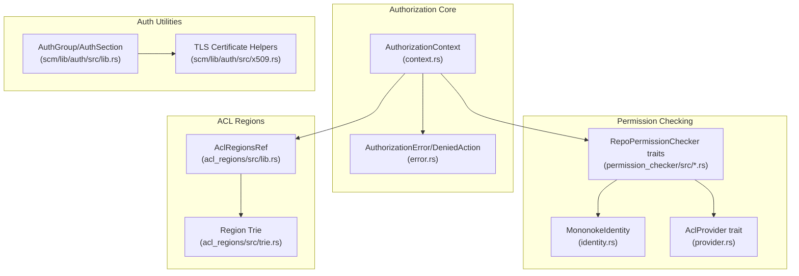
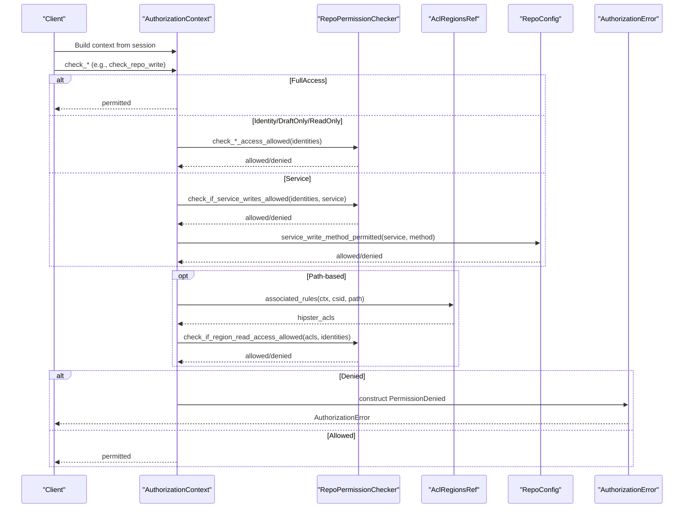
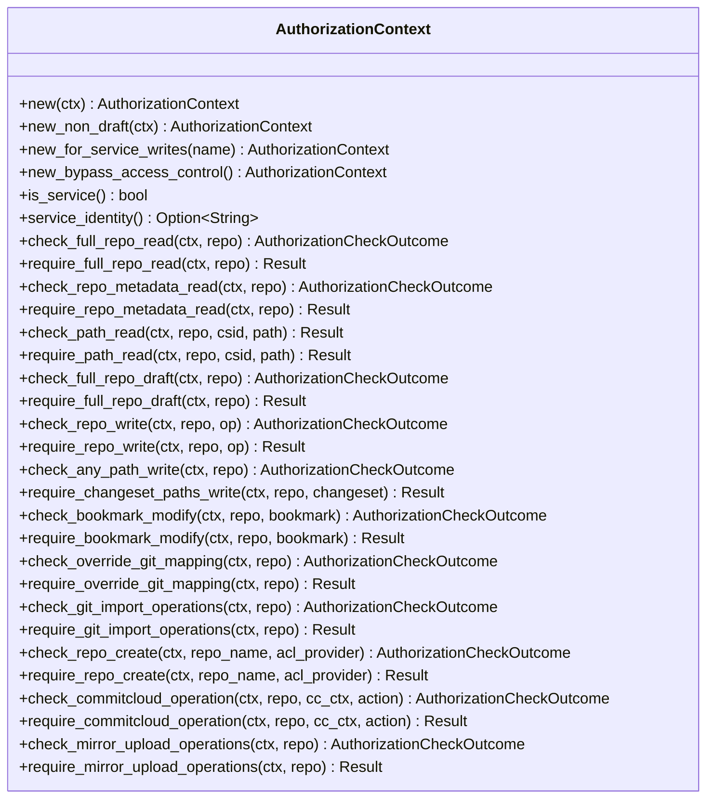
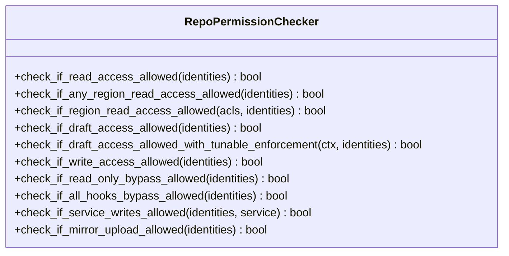
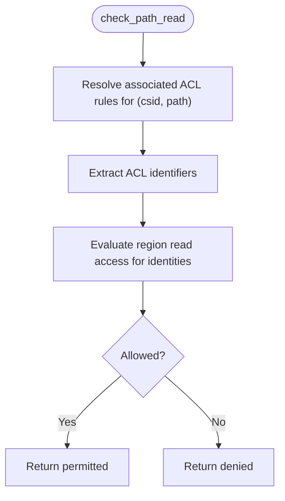
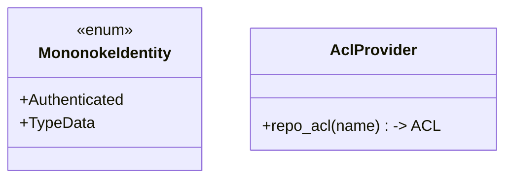
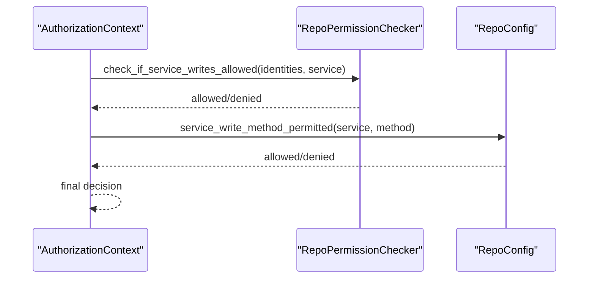
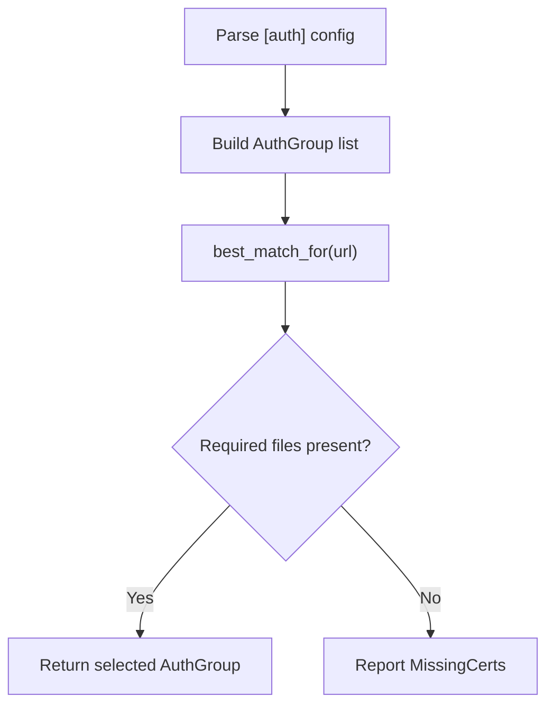
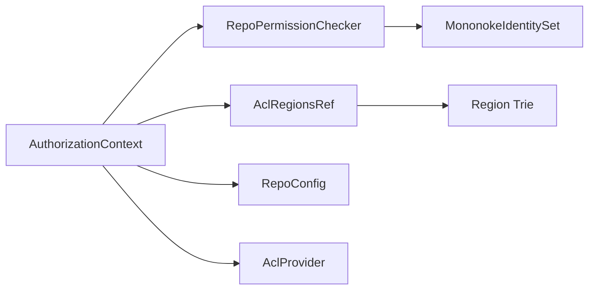

# Authentication and Authorization

<cite>
**Referenced Files in This Document**
- [context.rs](file://eden/mononoke/repo_authorization/src/context.rs)
- [error.rs](file://eden/mononoke/repo_authorization/src/error.rs)
- [lib.rs](file://eden/mononoke/repo_authorization/src/lib.rs)
- [tests.rs](file://eden/mononoke/repo_authorization/src/tests.rs)
- [lib.rs](file://eden/mononoke/common/permission_checker/src/lib.rs)
- [checker.rs](file://eden/mononoke/common/permission_checker/src/checker.rs)
- [identity.rs](file://eden/mononoke/common/permission_checker/src/identity.rs)
- [provider.rs](file://eden/mononoke/common/permission_checker/src/provider.rs)
- [lib.rs](file://eden/mononoke/common/acl_regions/src/lib.rs)
- [trie.rs](file://eden/mononoke/common/acl_regions/src/trie.rs)
- [lib.rs](file://eden/mononoke/repo_attributes/repo_permission_checker/src/lib.rs)
- [lib.rs](file://eden/scm/lib/auth/src/lib.rs)
- [x509.rs](file://eden/scm/lib/auth/src/x509.rs)
</cite>

## Table of Contents
1. [Introduction](#introduction)
2. [Project Structure](#project-structure)
3. [Core Components](#core-components)
4. [Architecture Overview](#architecture-overview)
5. [Detailed Component Analysis](#detailed-component-analysis)
6. [Dependency Analysis](#dependency-analysis)
7. [Performance Considerations](#performance-considerations)
8. [Troubleshooting Guide](#troubleshooting-guide)
9. [Conclusion](#conclusion)
10. [Appendices](#appendices)

## Introduction
This document explains the Mononoke Server authentication and authorization systems. It focuses on how user identity is resolved, how permissions are evaluated, and how access control is enforced across repositories and regions. It covers:
- Authorization contexts and permission evaluation logic
- ACL region management and path-based access checks
- Repository-level access controls and service-based authorizations
- Integration with external authentication systems and TLS client certificates
- Configuration patterns for different authorization scenarios
- Troubleshooting common permission issues and security best practices

## Project Structure
The authentication and authorization logic is primarily implemented in the repository authorization module and integrates with permission checking, ACL regions, and identity providers. Supporting modules include:
- Authorization context and error reporting
- Permission checker interfaces and implementations
- ACL regions for path-scoped access
- Authentication utilities for TLS client certificates

**Diagram sources**
- [context.rs:1-885](file://eden/mononoke/repo_authorization/src/context.rs#L1-L885)
- [error.rs:1-110](file://eden/mononoke/repo_authorization/src/error.rs#L1-L110)
- [lib.rs](file://eden/mononoke/common/permission_checker/src/lib.rs)
- [checker.rs](file://eden/mononoke/common/permission_checker/src/checker.rs)
- [identity.rs](file://eden/mononoke/common/permission_checker/src/identity.rs)
- [provider.rs](file://eden/mononoke/common/permission_checker/src/provider.rs)
- [lib.rs](file://eden/mononoke/common/acl_regions/src/lib.rs)
- [trie.rs](file://eden/mononoke/common/acl_regions/src/trie.rs)
- [lib.rs](file://eden/scm/lib/auth/src/lib.rs)
- [x509.rs](file://eden/scm/lib/auth/src/x509.rs)

**Section sources**
- [lib.rs](file://eden/mononoke/repo_authorization/src/lib.rs)
- [context.rs:1-885](file://eden/mononoke/repo_authorization/src/context.rs#L1-L885)
- [error.rs:1-110](file://eden/mononoke/repo_authorization/src/error.rs#L1-L110)

## Core Components
- AuthorizationContext: Encapsulates the effective authorization mode for a request (full access, identity-based, read-only identity, draft-only identity, or service). It derives from session trust level and read-only flags and evaluates permissions against repository permission checkers and ACL regions.
- Permission checker traits: Define capabilities such as read, draft, write, mirror upload, and service write allowances. Implementations vary by deployment (e.g., Facebook-specific).
- ACL regions: Provide path-scoped access rules associated with a changeset and resolved via region trie structures.
- Identity and provider: Represent identities and provide ACL lookup via an AclProvider interface.
- Auth utilities: Manage TLS client certificate-based authentication and group-based auth configuration.

**Section sources**
- [context.rs:35-112](file://eden/mononoke/repo_authorization/src/context.rs#L35-L112)
- [lib.rs](file://eden/mononoke/common/permission_checker/src/lib.rs)
- [checker.rs](file://eden/mononoke/common/permission_checker/src/checker.rs)
- [identity.rs](file://eden/mononoke/common/permission_checker/src/identity.rs)
- [provider.rs](file://eden/mononoke/common/permission_checker/src/provider.rs)
- [lib.rs](file://eden/mononoke/common/acl_regions/src/lib.rs)
- [trie.rs](file://eden/mononoke/common/acl_regions/src/trie.rs)
- [lib.rs](file://eden/scm/lib/auth/src/lib.rs)

## Architecture Overview
The authorization workflow proceeds as follows:
- Resolve the AuthorizationContext from the request session (trust, read-only, and service identity).
- Evaluate repository-wide permissions (read, draft, write) using the permission checker.
- For path-based access, resolve associated ACL regions for the changeset and path, then evaluate region ACLs.
- Enforce service-level restrictions from repository configuration.
- Report denials with structured errors indicating the denied action, repository, context, and identities.

**Diagram sources**
- [context.rs:140-372](file://eden/mononoke/repo_authorization/src/context.rs#L140-L372)
- [context.rs:215-244](file://eden/mononoke/repo_authorization/src/context.rs#L215-L244)
- [context.rs:307-372](file://eden/mononoke/repo_authorization/src/context.rs#L307-L372)
- [error.rs:21-110](file://eden/mononoke/repo_authorization/src/error.rs#L21-L110)

## Detailed Component Analysis

### AuthorizationContext and Permission Evaluation
AuthorizationContext determines the effective permission scope for a request:
- FullAccess: bypasses checks (internal tools/tests).
- Identity: standard identity-based checks.
- ReadOnlyIdentity: read-only access; no write/draft operations.
- DraftOnlyIdentity: read-only plus draft operations off VPN; public writes forbidden.
- Service: acts as a named service with narrow, configured permissions.

It exposes methods to check and require:
- Full repository read and metadata read
- Path read using ACL regions
- Full repository draft and general write
- Any path write and changeset path write
- Bookmark modification
- Override Git mapping and Git import operations
- Repository creation via ACL provider
- Commit Cloud workspace operations
- Mirror upload operations

**Diagram sources**
- [context.rs:35-112](file://eden/mononoke/repo_authorization/src/context.rs#L35-L112)
- [context.rs:140-794](file://eden/mononoke/repo_authorization/src/context.rs#L140-L794)

**Section sources**
- [context.rs:55-112](file://eden/mononoke/repo_authorization/src/context.rs#L55-L112)
- [context.rs:140-794](file://eden/mononoke/repo_authorization/src/context.rs#L140-L794)

### Permission Checking Interfaces and Implementations
The permission checker defines capability checks used by AuthorizationContext:
- Read access allowed
- Any region read access allowed
- Region read access allowed given ACL sets
- Draft access allowed (with tunable enforcement)
- Write access allowed
- Read-only bypass and all-hooks bypass
- Service writes allowed
- Mirror upload allowed

Implementations differ by environment (e.g., Facebook-specific vs OSS), but the interfaces remain consistent.

**Diagram sources**
- [checker.rs](file://eden/mononoke/common/permission_checker/src/checker.rs)

**Section sources**
- [checker.rs](file://eden/mononoke/common/permission_checker/src/checker.rs)

### ACL Regions and Path-Based Access
ACL regions associate path scopes with access rules for a given changeset:
- Resolve associated rules for a changeset and path
- Extract ACL identifiers (e.g., Hipster ACLs)
- Evaluate region read access against identities

**Diagram sources**
- [context.rs:215-244](file://eden/mononoke/repo_authorization/src/context.rs#L215-L244)
- [lib.rs](file://eden/mononoke/common/acl_regions/src/lib.rs)
- [trie.rs](file://eden/mononoke/common/acl_regions/src/trie.rs)

**Section sources**
- [context.rs:215-244](file://eden/mononoke/repo_authorization/src/context.rs#L215-L244)
- [lib.rs](file://eden/mononoke/common/acl_regions/src/lib.rs)
- [trie.rs](file://eden/mononoke/common/acl_regions/src/trie.rs)

### Identity Resolution and Provider
- Identities represent authenticated or type-data identities used in permission checks.
- An AclProvider supplies ACL sets for repository-level checks (e.g., repository creation).

**Diagram sources**
- [identity.rs](file://eden/mononoke/common/permission_checker/src/identity.rs)
- [provider.rs](file://eden/mononoke/common/permission_checker/src/provider.rs)

**Section sources**
- [identity.rs](file://eden/mononoke/common/permission_checker/src/identity.rs)
- [provider.rs](file://eden/mononoke/common/permission_checker/src/provider.rs)

### Service-Based Authorization and Repository Configuration
- Service identity allows scoped write operations governed by repository configuration.
- Methods and path/bookmark restrictions are enforced per service.

**Diagram sources**
- [context.rs:341-352](file://eden/mononoke/repo_authorization/src/context.rs#L341-L352)
- [context.rs:375-426](file://eden/mononoke/repo_authorization/src/context.rs#L375-L426)

**Section sources**
- [context.rs:341-352](file://eden/mononoke/repo_authorization/src/context.rs#L341-L352)
- [context.rs:375-426](file://eden/mononoke/repo_authorization/src/context.rs#L375-L426)

### External Authentication and TLS Client Certificates
- AuthGroup and AuthSection parse Mercurial-style [auth] configuration to select appropriate TLS credentials for a given URL.
- TLS certificate helpers support certificate verification and validation.

**Diagram sources**
- [lib.rs](file://eden/scm/lib/auth/src/lib.rs)
- [x509.rs](file://eden/scm/lib/auth/src/x509.rs)

**Section sources**
- [lib.rs](file://eden/scm/lib/auth/src/lib.rs)
- [x509.rs](file://eden/scm/lib/auth/src/x509.rs)

## Dependency Analysis
- AuthorizationContext depends on:
  - Session metadata for trust/read-only flags
  - RepoPermissionChecker for capability checks
  - AclRegionsRef for path-based ACLs
  - RepoConfig for service write restrictions
  - AclProvider for repository-level ACLs (e.g., repo creation)
- Permission checker implementations depend on identity sets and environment-specific backends.
- ACL regions rely on trie-based structures to map paths to ACL identifiers.

**Diagram sources**
- [context.rs:140-794](file://eden/mononoke/repo_authorization/src/context.rs#L140-L794)
- [checker.rs](file://eden/mononoke/common/permission_checker/src/checker.rs)
- [lib.rs](file://eden/mononoke/common/acl_regions/src/lib.rs)
- [trie.rs](file://eden/mononoke/common/acl_regions/src/trie.rs)
- [provider.rs](file://eden/mononoke/common/permission_checker/src/provider.rs)

**Section sources**
- [context.rs:140-794](file://eden/mononoke/repo_authorization/src/context.rs#L140-L794)
- [checker.rs](file://eden/mononoke/common/permission_checker/src/checker.rs)
- [lib.rs](file://eden/mononoke/common/acl_regions/src/lib.rs)
- [trie.rs](file://eden/mononoke/common/acl_regions/src/trie.rs)
- [provider.rs](file://eden/mononoke/common/permission_checker/src/provider.rs)

## Performance Considerations
- Minimize repeated identity evaluations by caching identity sets where feasible.
- Use region ACL lookups judiciously; leverage trie-based structures for efficient path-to-ACL mapping.
- Tune draft ACL enforcement knobs to balance security and operational overhead.
- Prefer early exits in permission checks (e.g., FullAccess) to reduce downstream computation.

## Troubleshooting Guide
Common permission issues and resolutions:
- Full repository read denied: Verify read access capability for identities and ensure session trust level permits read access.
- Metadata read denied: Confirm either global read access or at least one region read ACL matches identities.
- Path read denied: Ensure associated ACL rules for the changeset and path are configured and that identities satisfy the region ACLs.
- Draft access denied: Check draft capability and tunable enforcement settings; note that ReadOnlyIdentity contexts never grant draft access.
- Write access denied: For non-draft writes, ensure write capability; for draft writes, ensure draft capability or implied draft via write capability.
- Service write denied: Confirm service identity is allowed and the specific method is permitted; verify service write restrictions for bookmarks and path prefixes.
- Bookmark modification denied: Validate user permissions or service permissions for the target bookmark.
- Git import or override Git mapping denied: These operations are restricted; confirm service permissions and repository configuration.
- Repository creation denied: Ensure repository ACLs permit creation for the requested repository name and identities.
- Commit Cloud workspace operations denied: Verify workspace ACLs and allow lists; ensure identities match owners when applicable.
- Mirror upload denied: Confirm mirror upload capability for identities.

Diagnostic tips:
- Inspect DeniedAction messages to identify the exact operation that failed.
- Review identities captured in the PermissionDenied context to ensure correct identity propagation.
- Validate repository configuration for service write restrictions and ACL names.

**Section sources**
- [error.rs:21-110](file://eden/mononoke/repo_authorization/src/error.rs#L21-L110)
- [context.rs:114-138](file://eden/mononoke/repo_authorization/src/context.rs#L114-L138)
- [tests.rs:52-463](file://eden/mononoke/repo_authorization/src/tests.rs#L52-L463)

## Conclusion
Mononoke’s authorization system combines identity-based checks, ACL regions for path-scoped access, and service-level restrictions to enforce fine-grained repository access control. AuthorizationContext orchestrates these checks, while permission checker traits and ACL regions provide extensible backends. TLS client certificates integrate with authentication configuration to support secure client identification. Proper configuration of identities, ACLs, and service restrictions ensures robust security posture aligned with operational needs.

## Appendices

### Configuration Examples for Authorization Scenarios
- Identity-based read/write:
  - Ensure identities are populated and read/write capabilities are enabled in the permission checker.
- Draft-only off-VPN access:
  - Use DraftOnlyIdentity context; enable draft capability for identities and tune enforcement knobs accordingly.
- Service-based writes:
  - Configure service identity and repository service write restrictions for methods, bookmarks, and path prefixes.
- Repository creation:
  - Configure repository ACLs and use AclProvider to authorize creation requests.
- Commit Cloud workspace:
  - Set up workspace ACLs and allow lists; ensure identities match owners when inferring workspace ownership.

[No sources needed since this section provides general guidance]