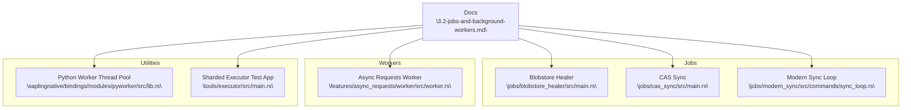
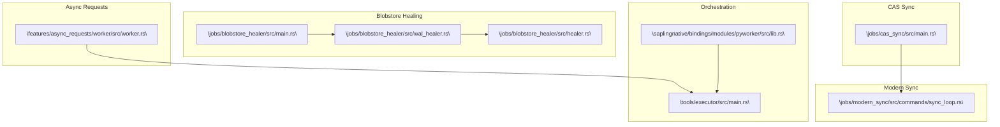
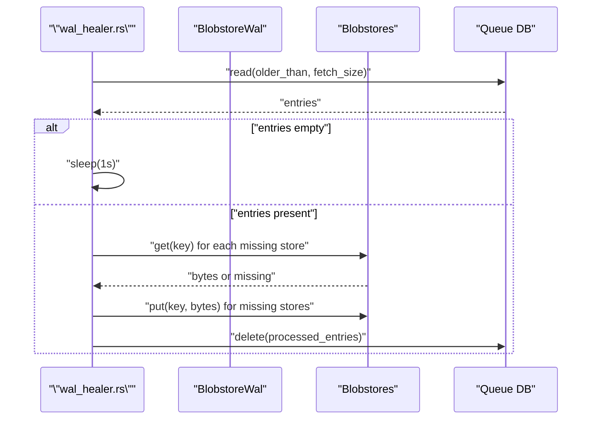
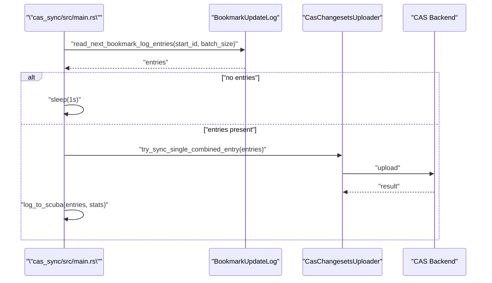
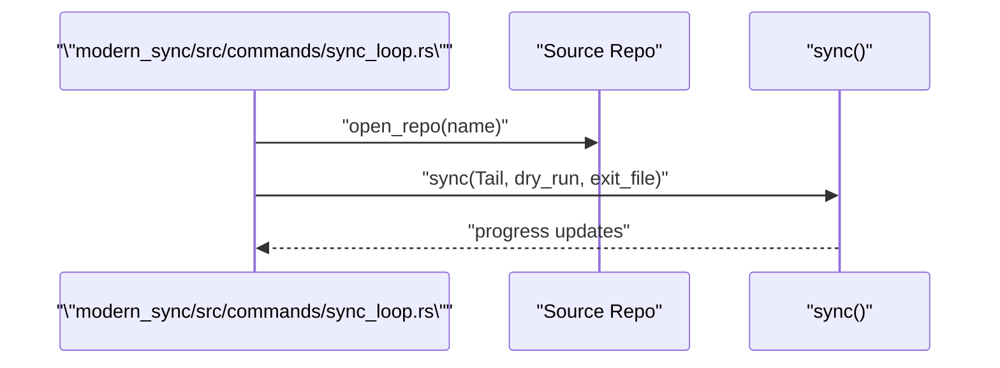
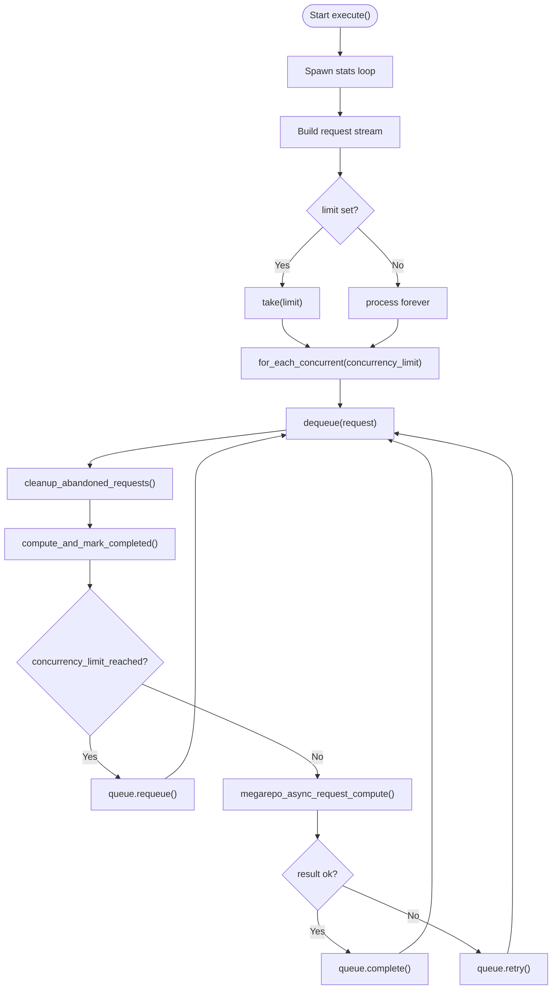
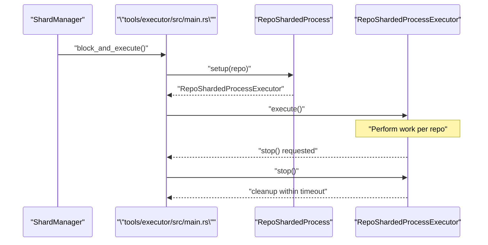
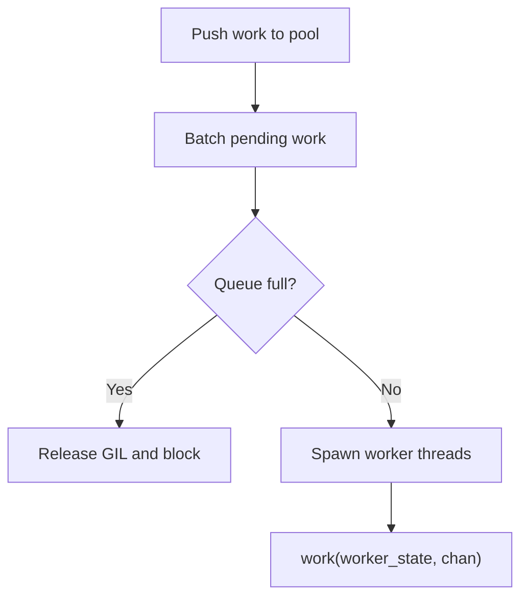
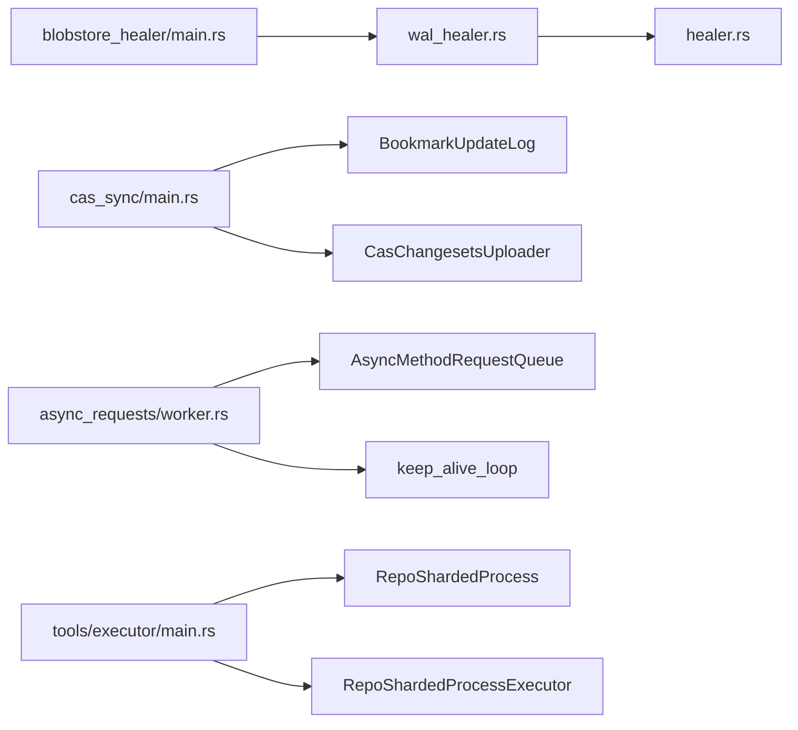

# Background Workers and Jobs

<cite>
**Referenced Files in This Document**
- [3.2-jobs-and-background-workers.md](file://eden/mononoke/docs/3.2-jobs-and-background-workers.md)
- [main.rs](file://eden/mononoke/jobs/blobstore_healer/src/main.rs)
- [healer.rs](file://eden/mononoke/jobs/blobstore_healer/src/healer.rs)
- [wal_healer.rs](file://eden/mononoke/jobs/blobstore_healer/src/wal_healer.rs)
- [main.rs](file://eden/mononoke/jobs/cas_sync/src/main.rs)
- [sync_loop.rs](file://eden/mononoke/jobs/modern_sync/src/commands/sync_loop.rs)
- [worker.rs](file://eden/mononoke/features/async_requests/worker/src/worker.rs)
- [main.rs](file://eden/scm/saplingnative/bindings/modules/pyworker/src/lib.rs)
- [main.rs](file://eden/mononoke/tools/executor/src/main.rs)
</cite>

## Table of Contents
1. [Introduction](#introduction)
2. [Project Structure](#project-structure)
3. [Core Components](#core-components)
4. [Architecture Overview](#architecture-overview)
5. [Detailed Component Analysis](#detailed-component-analysis)
6. [Dependency Analysis](#dependency-analysis)
7. [Performance Considerations](#performance-considerations)
8. [Troubleshooting Guide](#troubleshooting-guide)
9. [Conclusion](#conclusion)
10. [Appendices](#appendices)

## Introduction
This document explains Mononoke’s background workers and job processing system. It covers the job queue architecture, worker pool management, and scheduling mechanisms. It also documents the assembly line pattern for sequential processing, async limiting for resource control, and job prioritization strategies. Specific job types discussed include blobstore healing, CAS synchronization, and statistics collection. Monitoring, failure handling, retry mechanisms, and performance metrics are covered alongside configuration options for worker scaling, resource limits, and job timeouts. Guidance is included for debugging failed jobs and optimizing worker performance.

## Project Structure
Mononoke organizes background jobs as independent binaries or services that run outside the request-serving servers. The documentation describes the overall layering and job categories, while specific implementations live under dedicated crates for each job type.

**Diagram sources**
- [3.2-jobs-and-background-workers.md:1-220](file://eden/mononoke/docs/3.2-jobs-and-background-workers.md#L1-L220)
- [main.rs:1-402](file://eden/mononoke/jobs/blobstore_healer/src/main.rs#L1-L402)
- [main.rs:1-429](file://eden/mononoke/jobs/cas_sync/src/main.rs#L1-L429)
- [sync_loop.rs:1-75](file://eden/mononoke/jobs/modern_sync/src/commands/sync_loop.rs#L1-L75)
- [worker.rs:1-571](file://eden/mononoke/features/async_requests/worker/src/worker.rs#L1-L571)
- [main.rs:77-108](file://eden/scm/saplingnative/bindings/modules/pyworker/src/lib.rs#L77-L108)
- [main.rs:1-247](file://eden/mononoke/tools/executor/src/main.rs#L1-L247)

**Section sources**
- [3.2-jobs-and-background-workers.md:1-220](file://eden/mononoke/docs/3.2-jobs-and-background-workers.md#L1-L220)

## Core Components
- Blobstore Healer: Continuously heals multiplexed blobstores by reading from a write-ahead log, detecting missing blobs, and copying them across backends. It supports dry-run, drain-only, concurrency limits, and shard ranges.
- CAS Sync: Synchronizes commits and file contents to external CAS storage by consuming bookmark update log entries, batching, and uploading with retry and leader-only execution options.
- Modern Sync: Replicates repository data to remote endpoints using EdenAPI, supporting batching, progress tracking, and sharded execution.
- Async Requests Worker: Processes asynchronous method requests from a queue with concurrency limits, keep-alive tracking, and retry/failure handling.
- Sharded Executor: Provides a framework for sharded execution across repositories with cleanup timeouts and stop signaling.
- Python Worker Thread Pool: Manages a thread pool to push work in batches, releasing the GIL to avoid contention.

**Section sources**
- [3.2-jobs-and-background-workers.md:46-220](file://eden/mononoke/docs/3.2-jobs-and-background-workers.md#L46-L220)
- [main.rs:1-402](file://eden/mononoke/jobs/blobstore_healer/src/main.rs#L1-L402)
- [main.rs:1-429](file://eden/mononoke/jobs/cas_sync/src/main.rs#L1-L429)
- [sync_loop.rs:1-75](file://eden/mononoke/jobs/modern_sync/src/commands/sync_loop.rs#L1-L75)
- [worker.rs:1-571](file://eden/mononoke/features/async_requests/worker/src/worker.rs#L1-L571)
- [main.rs:1-247](file://eden/mononoke/tools/executor/src/main.rs#L1-L247)
- [main.rs:77-108](file://eden/scm/saplingnative/bindings/modules/pyworker/src/lib.rs#L77-L108)

## Architecture Overview
The background workers follow a continuous polling model for long-running jobs, with explicit controls for batching, concurrency, and resource limits. Jobs integrate with Mononoke’s monitoring and logging infrastructure and can be orchestrated via sharding or leadership constraints.

**Diagram sources**
- [main.rs:1-402](file://eden/mononoke/jobs/blobstore_healer/src/main.rs#L1-L402)
- [healer.rs:1-29](file://eden/mononoke/jobs/blobstore_healer/src/healer.rs#L1-L29)
- [wal_healer.rs:1-451](file://eden/mononoke/jobs/blobstore_healer/src/wal_healer.rs#L1-L451)
- [main.rs:1-429](file://eden/mononoke/jobs/cas_sync/src/main.rs#L1-L429)
- [sync_loop.rs:1-75](file://eden/mononoke/jobs/modern_sync/src/commands/sync_loop.rs#L1-L75)
- [worker.rs:1-571](file://eden/mononoke/features/async_requests/worker/src/worker.rs#L1-L571)
- [main.rs:1-247](file://eden/mononoke/tools/executor/src/main.rs#L1-L247)
- [main.rs:77-108](file://eden/scm/saplingnative/bindings/modules/pyworker/src/lib.rs#L77-L108)

## Detailed Component Analysis

### Blobstore Healer
- Purpose: Detect and heal missing blobs across multiplexed blobstores by reading the write-ahead log and copying missing data.
- Continuous operation: Polls the WAL, processes batches, and sleeps when no work is available.
- Resource control: Uses buffered concurrency with weight limits and per-blob size estimates to cap memory and bandwidth.
- Configuration: Batch size, concurrency, byte limits, shard range, dry-run, drain-only, and minimum age thresholds.
- Failure handling: On read failures, reduces fetch size and retries with jitter; missing blobs are re-enqueued with capped retries.

**Diagram sources**
- [wal_healer.rs:92-141](file://eden/mononoke/jobs/blobstore_healer/src/wal_healer.rs#L92-L141)
- [wal_healer.rs:143-277](file://eden/mononoke/jobs/blobstore_healer/src/wal_healer.rs#L143-L277)
- [wal_healer.rs:412-450](file://eden/mononoke/jobs/blobstore_healer/src/wal_healer.rs#L412-L450)

**Section sources**
- [main.rs:61-94](file://eden/mononoke/jobs/blobstore_healer/src/main.rs#L61-L94)
- [main.rs:288-337](file://eden/mononoke/jobs/blobstore_healer/src/main.rs#L288-L337)
- [wal_healer.rs:54-90](file://eden/mononoke/jobs/blobstore_healer/src/wal_healer.rs#L54-L90)
- [wal_healer.rs:143-277](file://eden/mononoke/jobs/blobstore_healer/src/wal_healer.rs#L143-L277)
- [healer.rs:19-28](file://eden/mononoke/jobs/blobstore_healer/src/healer.rs#L19-L28)

### CAS Sync
- Purpose: Upload commits and file contents to external CAS storage upon bookmark updates.
- Pipeline: Streams bookmark update log entries, batches them, and uploads changesets with retry and leader-only execution.
- Metrics and logging: Tracks queue depth, durations, and attempts; logs Scuba events per entry.
- Resumption: Uses mutable counters to track the latest replayed request ID.

**Diagram sources**
- [main.rs:344-392](file://eden/mononoke/jobs/cas_sync/src/main.rs#L344-L392)
- [main.rs:270-286](file://eden/mononoke/jobs/cas_sync/src/main.rs#L270-L286)
- [main.rs:288-342](file://eden/mononoke/jobs/cas_sync/src/main.rs#L288-L342)

**Section sources**
- [main.rs:103-131](file://eden/mononoke/jobs/cas_sync/src/main.rs#L103-L131)
- [main.rs:344-392](file://eden/mononoke/jobs/cas_sync/src/main.rs#L344-L392)
- [main.rs:394-415](file://eden/mononoke/jobs/cas_sync/src/main.rs#L394-L415)

### Modern Sync
- Purpose: Synchronize repository data to remote endpoints using EdenAPI.
- Operation: Runs a continuous sync loop, tailing bookmark updates, batching, and sending data to targets with optional dry-run.

**Diagram sources**
- [sync_loop.rs:32-74](file://eden/mononoke/jobs/modern_sync/src/commands/sync_loop.rs#L32-L74)

**Section sources**
- [sync_loop.rs:20-74](file://eden/mononoke/jobs/modern_sync/src/commands/sync_loop.rs#L20-L74)

### Async Requests Worker
- Purpose: Process asynchronous method requests from a queue with concurrency limits and keep-alive tracking.
- Concurrency control: Enforces per-request-type concurrency limits; requeues when limits are reached.
- Retry and failure: Attempts work, saves successful results, retries on failure with retry caps, and cascades failures to dependents when retries are exhausted.
- Monitoring: Emits stats and logs for dequeue attempts, errors, and processing outcomes.

**Diagram sources**
- [worker.rs:128-186](file://eden/mononoke/features/async_requests/worker/src/worker.rs#L128-L186)
- [worker.rs:188-454](file://eden/mononoke/features/async_requests/worker/src/worker.rs#L188-L454)

**Section sources**
- [worker.rs:69-77](file://eden/mononoke/features/async_requests/worker/src/worker.rs#L69-L77)
- [worker.rs:188-454](file://eden/mononoke/features/async_requests/worker/src/worker.rs#L188-L454)

### Assembly Line Pattern and Sharded Execution
- Assembly line: Jobs process streams of work in ordered batches (e.g., bookmark update log entries), applying a pipeline of steps (read, transform, upload, record).
- Sharded execution: The sharded executor framework distributes repositories across worker instances, supports stop signaling with cleanup timeouts, and integrates with monitoring.

**Diagram sources**
- [main.rs:211-234](file://eden/mononoke/tools/executor/src/main.rs#L211-L234)
- [main.rs:48-62](file://eden/mononoke/tools/executor/src/main.rs#L48-L62)
- [main.rs:144-167](file://eden/mononoke/tools/executor/src/main.rs#L144-L167)

**Section sources**
- [3.2-jobs-and-background-workers.md:185-193](file://eden/mononoke/docs/3.2-jobs-and-background-workers.md#L185-L193)
- [main.rs:211-234](file://eden/mononoke/tools/executor/src/main.rs#L211-L234)
- [main.rs:144-167](file://eden/mononoke/tools/executor/src/main.rs#L144-L167)

### Python Worker Thread Pool
- Purpose: Push work to workers in batches, releasing the Python GIL to reduce contention and improve throughput.
- Behavior: Maintains a thread pool, batches pending work, and blocks when the queue is full to avoid lock contention.

**Diagram sources**
- [main.rs:77-108](file://eden/scm/saplingnative/bindings/modules/pyworker/src/lib.rs#L77-L108)

**Section sources**
- [main.rs:77-108](file://eden/scm/saplingnative/bindings/modules/pyworker/src/lib.rs#L77-L108)

## Dependency Analysis
- Blobstore Healer depends on:
  - Blobstore WAL for queue reads
  - Multiple blobstores for heal operations
  - Buffered concurrency utilities for resource control
- CAS Sync depends on:
  - Bookmark update log for input
  - CAS client uploader for outbound transfers
  - Mutable counters for progress tracking
- Async Requests Worker depends on:
  - Async queue abstraction for dequeue/requeue/complete
  - Keep-alive loop to maintain progress
  - Per-request-type concurrency checks
- Sharded Executor ties together orchestration, stop signaling, and cleanup timeouts.

**Diagram sources**
- [main.rs:1-402](file://eden/mononoke/jobs/blobstore_healer/src/main.rs#L1-L402)
- [wal_healer.rs:1-451](file://eden/mononoke/jobs/blobstore_healer/src/wal_healer.rs#L1-L451)
- [healer.rs:1-29](file://eden/mononoke/jobs/blobstore_healer/src/healer.rs#L1-L29)
- [main.rs:1-429](file://eden/mononoke/jobs/cas_sync/src/main.rs#L1-L429)
- [worker.rs:1-571](file://eden/mononoke/features/async_requests/worker/src/worker.rs#L1-L571)
- [main.rs:1-247](file://eden/mononoke/tools/executor/src/main.rs#L1-L247)

**Section sources**
- [main.rs:1-402](file://eden/mononoke/jobs/blobstore_healer/src/main.rs#L1-L402)
- [main.rs:1-429](file://eden/mononoke/jobs/cas_sync/src/main.rs#L1-L429)
- [worker.rs:1-571](file://eden/mononoke/features/async_requests/worker/src/worker.rs#L1-L571)
- [main.rs:1-247](file://eden/mononoke/tools/executor/src/main.rs#L1-L247)

## Performance Considerations
- Concurrency and batching:
  - Blobstore Healer uses buffered concurrency with weight limits and dynamic fetch sizing to adapt to failures.
  - Async Requests Worker enforces per-request-type concurrency limits and processes requests concurrently up to a configured cap.
- Resource control:
  - Blobstore Healer limits total bytes and number of blobs concurrently.
  - CAS Sync supports leader-only execution to avoid duplicate work.
- Backoff and resilience:
  - Blobstore Healer reduces fetch size on failures and sleeps with jitter.
  - Async Requests Worker requeues when limits are hit and retries on failure with retry caps.
- Monitoring:
  - Jobs emit metrics and Scuba logs for queue depths, durations, and error rates.

[No sources needed since this section provides general guidance]

## Troubleshooting Guide
- Blobstore Healer
  - Symptoms: Frequent requeue of entries, slow progress, or missing blobs.
  - Actions: Increase heal_concurrency and heal_max_bytes; adjust shard_range; use dry-run to inspect; verify backend availability.
  - References: [main.rs:61-94](file://eden/mononoke/jobs/blobstore_healer/src/main.rs#L61-L94), [wal_healer.rs:92-141](file://eden/mononoke/jobs/blobstore_healer/src/wal_healer.rs#L92-L141)
- CAS Sync
  - Symptoms: High queue depth, repeated failures, or stalled progress.
  - Actions: Enable leader-only mode; tune base_retry_delay_ms and retry_num; verify CAS connectivity; check mutable counters for latest replayed request.
  - References: [main.rs:103-131](file://eden/mononoke/jobs/cas_sync/src/main.rs#L103-L131), [main.rs:394-415](file://eden/mononoke/jobs/cas_sync/src/main.rs#L394-L415)
- Async Requests Worker
  - Symptoms: Excessive requeues, abandoned requests, or slow throughput.
  - Actions: Raise jobs concurrency; adjust per-type limits; monitor keep-alive timestamps; inspect Scuba logs for retriable errors.
  - References: [worker.rs:188-454](file://eden/mononoke/features/async_requests/worker/src/worker.rs#L188-L454)
- Sharded Execution
  - Symptoms: Uneven repo distribution or premature stop.
  - Actions: Validate shard ranges and cleanup timeouts; confirm stop signaling and cleanup within allowed window.
  - References: [main.rs:211-234](file://eden/mononoke/tools/executor/src/main.rs#L211-L234)

**Section sources**
- [main.rs:61-94](file://eden/mononoke/jobs/blobstore_healer/src/main.rs#L61-L94)
- [wal_healer.rs:92-141](file://eden/mononoke/jobs/blobstore_healer/src/wal_healer.rs#L92-L141)
- [main.rs:103-131](file://eden/mononoke/jobs/cas_sync/src/main.rs#L103-L131)
- [main.rs:394-415](file://eden/mononoke/jobs/cas_sync/src/main.rs#L394-L415)
- [worker.rs:188-454](file://eden/mononoke/features/async_requests/worker/src/worker.rs#L188-L454)
- [main.rs:211-234](file://eden/mononoke/tools/executor/src/main.rs#L211-L234)

## Conclusion
Mononoke’s background workers implement robust, continuous processing with strong resource controls and observability. Blobstore healing, CAS synchronization, and async request processing demonstrate consistent patterns: streaming inputs, batching, concurrency limits, retries, and comprehensive logging/metrics. Sharded execution and thread pooling further enhance scalability and throughput. Operators can tune concurrency, limits, and scheduling to meet workload demands while maintaining reliability.

[No sources needed since this section summarizes without analyzing specific files]

## Appendices

### Configuration Options by Job
- Blobstore Healer
  - sync_queue_limit: maximum entries to process per iteration
  - dry_run: preview without changes
  - drain_only: clear queue without healing
  - storage_id: target storage group
  - heal_concurrency: number of blobs to heal concurrently
  - heal_max_bytes: approximate total bytes to heal concurrently
  - shard_range: shard range for parallel operation
  - heal_min_age_secs: minimum age threshold for healing
  - iteration_limit: optional maximum iterations
  - quiet: reduce logging verbosity
  - References: [main.rs:61-94](file://eden/mononoke/jobs/blobstore_healer/src/main.rs#L61-L94)
- CAS Sync
  - log_to_scuba: log individual bundle sync states
  - base_retry_delay_ms: initial delay for retries
  - retry_num: maximum retry attempts
  - leader_only: restrict to a single leader instance per repo
  - sharded_executor_args: sharding configuration
  - repo: repository selection
  - References: [main.rs:103-131](file://eden/mononoke/jobs/cas_sync/src/main.rs#L103-L131)
- Async Requests Worker
  - request_limit: optional total request limit
  - jobs: concurrency limit for processing
  - References: [worker.rs:91-125](file://eden/mononoke/features/async_requests/worker/src/worker.rs#L91-L125)

**Section sources**
- [main.rs:61-94](file://eden/mononoke/jobs/blobstore_healer/src/main.rs#L61-L94)
- [main.rs:103-131](file://eden/mononoke/jobs/cas_sync/src/main.rs#L103-L131)
- [worker.rs:91-125](file://eden/mononoke/features/async_requests/worker/src/worker.rs#L91-L125)