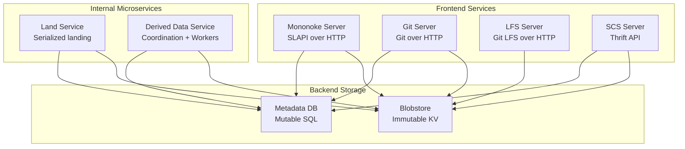
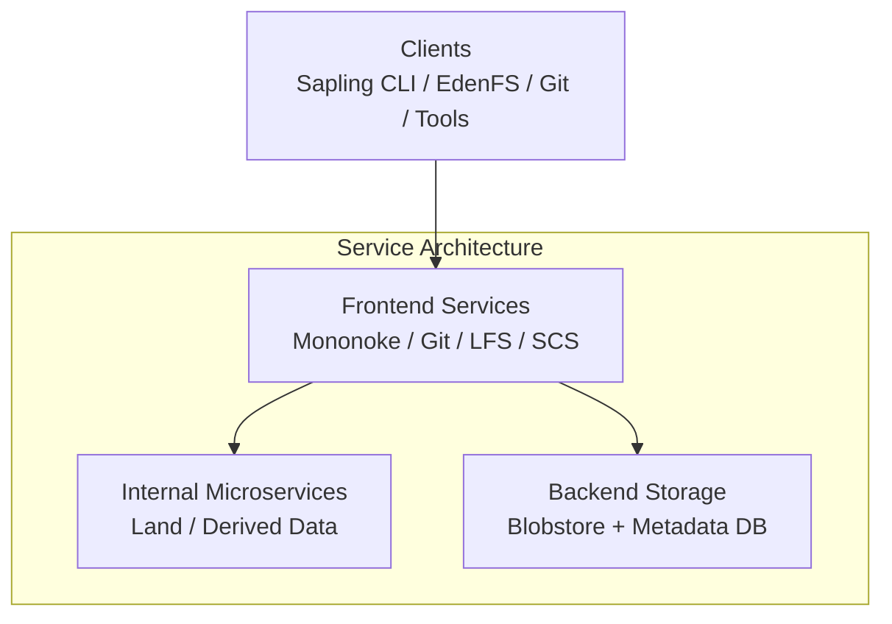
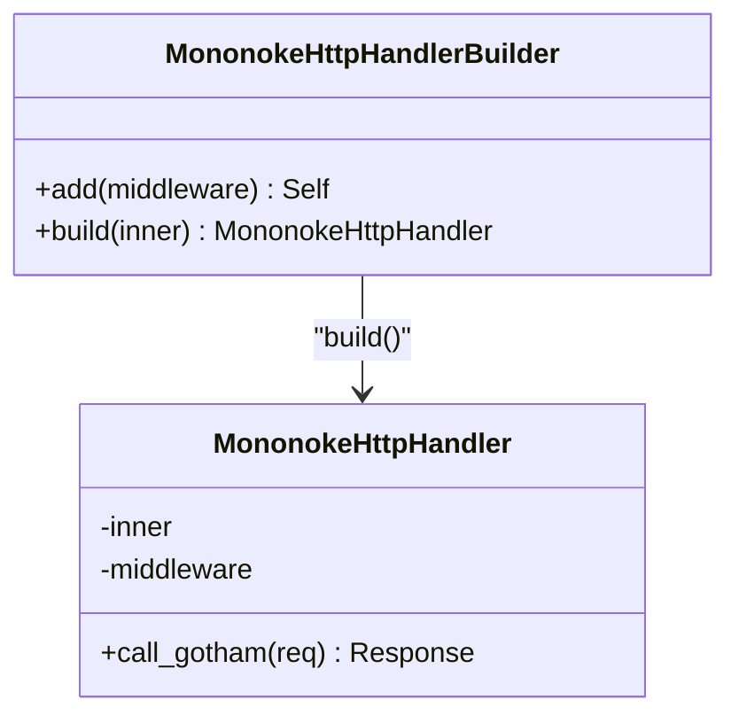
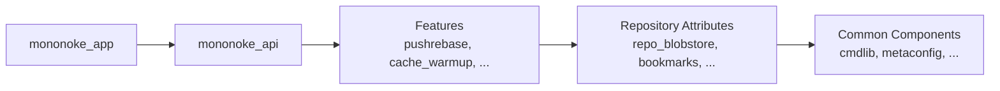
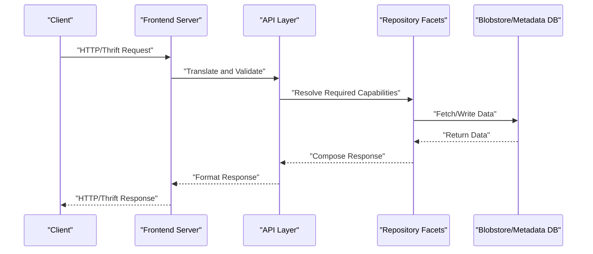

# Mononoke Server

<cite>
**Referenced Files in This Document**
- [README.md](file://eden/mononoke/README.md)
- [1.3-architecture-overview.md](file://eden/mononoke/docs/1.3-architecture-overview.md)
- [3.1-servers-and-services.md](file://eden/mononoke/docs/3.1-servers-and-services.md)
- [Cargo.toml (mononoke)](file://eden/mononoke/servers/slapi/slapi_server/Cargo.toml)
- [Cargo.toml (git_server)](file://eden/mononoke/servers/git/git_server/Cargo.toml)
- [Cargo.toml (lfs_server)](file://eden/mononoke/servers/lfs/lfs_server/Cargo.toml)
- [handler.rs](file://eden/mononoke/common/gotham_ext/src/handler.rs)
</cite>

## Table of Contents
1. [Introduction](#introduction)
2. [Project Structure](#project-structure)
3. [Core Components](#core-components)
4. [Architecture Overview](#architecture-overview)
5. [Detailed Component Analysis](#detailed-component-analysis)
6. [Dependency Analysis](#dependency-analysis)
7. [Performance Considerations](#performance-considerations)
8. [Troubleshooting Guide](#troubleshooting-guide)
9. [Conclusion](#conclusion)
10. [Appendices](#appendices)

## Introduction
Mononoke is the server component of the Sapling Source Control System, designed to scale across high commit rates, large repositories, and many files and branches. It is primarily implemented in Rust and provides a distributed architecture with:
- Stateless frontend protocol servers (Mononoke SLAPI, Git, LFS, SCS)
- Internal microservices (Land, Derived Data, Diff, Bookmark)
- Shared backend storage (immutable blobstore and mutable metadata database)
- A consistent internal code architecture built from composable facets and features

The server acts as the central hub for repository operations, user authentication, and data synchronization across clients and services.

**Section sources**
- [README.md:1-35](file://eden/mononoke/README.md#L1-L35)

## Project Structure
The repository organizes Mononoke’s servers and services under a layered code architecture:
- Application binaries (servers, tools, jobs) built on the mononoke_app framework
- API layer (mononoke_api) for high-level abstractions
- Features (pushrebase, cross_repo_sync, etc.) orchestrating repository operations
- Repository attributes (repo_attributes) providing composable capabilities (facets)
- Common components (blobstore, mononoke_types, cmdlib, etc.) forming the foundation

Frontend services and microservices are documented in the Servers and Services guide, with each service’s responsibilities and integration points clearly outlined.

**Diagram sources**
- [3.1-servers-and-services.md:23-92](file://eden/mononoke/docs/3.1-servers-and-services.md#L23-L92)
- [3.1-servers-and-services.md:114-177](file://eden/mononoke/docs/3.1-servers-and-services.md#L114-L177)
- [3.1-servers-and-services.md:371-426](file://eden/mononoke/docs/3.1-servers-and-services.md#L371-L426)

**Section sources**
- [3.1-servers-and-services.md:525-558](file://eden/mononoke/docs/3.1-servers-and-services.md#L525-L558)
- [1.3-architecture-overview.md:118-294](file://eden/mononoke/docs/1.3-architecture-overview.md#L118-L294)

## Core Components
- Mononoke Server (SLAPI): Implements the Sapling remote API over HTTP, handling clone, pull, push, and on-demand file fetches for Sapling and EdenFS clients. It uses repo_listener for connection handling and routes to protocol handlers.
- Git Server: Implements Git protocol over HTTP, translating Git objects and references to Bonsai and vice versa.
- LFS Server: Implements Git LFS protocol for large file storage, leveraging filestore and blobstore.
- SCS Server: Provides a Thrift API for programmatic repository access with multiple identity schemes.
- Internal Microservices:
  - Land Service: Serialized commit landing via pushrebase to prevent conflicts.
  - Derived Data Service: Coordinates asynchronous derivation of derived data across workers.
- Shared Storage:
  - Blobstore: Immutable KV for file contents, commit metadata, derived data, and VCS-specific formats.
  - Metadata DB: Mutable SQL for bookmarks, VCS mappings, commit graph, and repository state.

**Section sources**
- [3.1-servers-and-services.md:26-113](file://eden/mononoke/docs/3.1-servers-and-services.md#L26-L113)
- [3.1-servers-and-services.md:120-177](file://eden/mononoke/docs/3.1-servers-and-services.md#L120-L177)
- [3.1-servers-and-services.md:371-426](file://eden/mononoke/docs/3.1-servers-and-services.md#L371-L426)

## Architecture Overview
Mononoke’s architecture is service-oriented and code-oriented:
- Service architecture separates frontend protocol servers from internal microservices and shared storage, enabling independent scaling and workload isolation.
- Code architecture composes libraries into applications using layers: Application → API → Features → Repository Attributes → Common Components.

Key characteristics:
- Stateless servers with persistent state in external storage
- Horizontal scalability per service tier
- VCS independence via Bonsai data model
- Separation of write path (minimal critical section) and read path (derived data computed asynchronously)
- Modular composition via facets and features

**Diagram sources**
- [1.3-architecture-overview.md:19-107](file://eden/mononoke/docs/1.3-architecture-overview.md#L19-L107)
- [1.3-architecture-overview.md:458-480](file://eden/mononoke/docs/1.3-architecture-overview.md#L458-L480)

**Section sources**
- [1.3-architecture-overview.md:7-18](file://eden/mononoke/docs/1.3-architecture-overview.md#L7-L18)
- [1.3-architecture-overview.md:295-353](file://eden/mononoke/docs/1.3-architecture-overview.md#L295-L353)

## Detailed Component Analysis

### Mononoke Server (SLAPI)
Responsibilities:
- Serve Sapling CLI and EdenFS clients over HTTP using SLAPI protocol
- Translate requests to repository operations via API layer and facets
- Support repository sharding and cache warmup at startup

Implementation highlights:
- Uses repo_listener for TCP/TLS and routing
- Integrates with mononoke_app framework for configuration and observability
- Supports CBOR encoding and HTTP/2 streaming semantics

Operational notes:
- Stateless design enables horizontal scaling
- Authentication handled at the protocol layer; authorization via repository permission checker facets

**Section sources**
- [3.1-servers-and-services.md:26-47](file://eden/mononoke/docs/3.1-servers-and-services.md#L26-L47)
- [Cargo.toml (mononoke):10-34](file://eden/mononoke/servers/slapi/slapi_server/Cargo.toml#L10-L34)

### Git Server
Responsibilities:
- Implement Git protocol over HTTP (smart HTTP)
- Translate Git objects (commits, trees, blobs) to Bonsai and back
- Handle upload-pack and receive-pack operations

Implementation highlights:
- Uses Git libraries for packetline and transport
- Integrates Bonsai-Git mapping facets and derived data types
- Supports symbolic refs and packfile generation

**Section sources**
- [3.1-servers-and-services.md:71-92](file://eden/mononoke/docs/3.1-servers-and-services.md#L71-L92)
- [Cargo.toml (git_server):10-87](file://eden/mononoke/servers/git/git_server/Cargo.toml#L10-L87)

### LFS Server
Responsibilities:
- Implement Git LFS protocol for large file uploads/downloads
- Store LFS objects in blobstore via filestore facet
- Support batch API for multiple object requests

Implementation highlights:
- Uses lfs_protocol module and integrates with blobstore/filestore
- Supports streaming downloads and configurable upload sizes

**Section sources**
- [3.1-servers-and-services.md:93-113](file://eden/mononoke/docs/3.1-servers-and-services.md#L93-L113)
- [Cargo.toml (lfs_server):10-79](file://eden/mononoke/servers/lfs/lfs_server/Cargo.toml#L10-L79)

### SCS Server (Thrift)
Responsibilities:
- Provide a Thrift API for programmatic repository access
- Support multiple commit identity schemes and authorization
- Handle authentication via mTLS

Implementation highlights:
- Thrift interface defines repository operations
- Uses permission checker and repository authorization facets

**Section sources**
- [3.1-servers-and-services.md:48-70](file://eden/mononoke/docs/3.1-servers-and-services.md#L48-L70)

### Land Service
Responsibilities:
- Serialize commit landing to public bookmarks via pushrebase
- Prevent race conditions by queuing and processing landing requests per bookmark

Implementation highlights:
- Single Thrift method for landing changesets
- Returns rebased commit mappings and error details

**Section sources**
- [3.1-servers-and-services.md:120-140](file://eden/mononoke/docs/3.1-servers-and-services.md#L120-L140)

### Derived Data Service
Responsibilities:
- Coordinate asynchronous derivation of derived data types
- Manage dependency-aware queues and poll workers for completion

Implementation highlights:
- Asynchronous Thrift API with token-based polling
- Reduces redundant computation and enables horizontal scaling

**Section sources**
- [3.1-servers-and-services.md:141-161](file://eden/mononoke/docs/3.1-servers-and-services.md#L141-L161)

### HTTP Handler Abstraction
The HTTP handler abstraction supports middleware composition and service integration:
- MononokeHttpHandlerBuilder enables chaining middleware
- MononokeHttpHandler wraps a Handler with middleware and supports Gotham/Hyper integration

**Diagram sources**
- [handler.rs:146-188](file://eden/mononoke/common/gotham_ext/src/handler.rs#L146-L188)

**Section sources**
- [handler.rs:146-188](file://eden/mononoke/common/gotham_ext/src/handler.rs#L146-L188)

## Dependency Analysis
The server binaries depend on shared libraries reflecting the internal code architecture:
- Application layer: mononoke_app, mononoke_api
- Features: pushrebase, cache_warmup, repo_update_logger
- Repository attributes: repo_blobstore, bookmarks, bonsai_git_mapping, filestore, etc.
- Common components: cmdlib, metaconfig, permission_checker, rate_limiting, scuba_ext, etc.

**Diagram sources**
- [1.3-architecture-overview.md:118-294](file://eden/mononoke/docs/1.3-architecture-overview.md#L118-L294)
- [Cargo.toml (mononoke):22-27](file://eden/mononoke/servers/slapi/slapi_server/Cargo.toml#L22-L27)
- [Cargo.toml (git_server):51-66](file://eden/mononoke/servers/git/git_server/Cargo.toml#L51-L66)
- [Cargo.toml (lfs_server):41-58](file://eden/mononoke/servers/lfs/lfs_server/Cargo.toml#L41-L58)

**Section sources**
- [Cargo.toml (mononoke):10-34](file://eden/mononoke/servers/slapi/slapi_server/Cargo.toml#L10-L34)
- [Cargo.toml (git_server):10-87](file://eden/mononoke/servers/git/git_server/Cargo.toml#L10-L87)
- [Cargo.toml (lfs_server):10-79](file://eden/mononoke/servers/lfs/lfs_server/Cargo.toml#L10-L79)

## Performance Considerations
- Stateless design enables horizontal scaling; add instances to increase capacity
- Multi-level caching (Cachelib, Memcache, warm bookmark cache) reduces storage load
- Asynchronous derivation offloads expensive computations from the write/read paths
- Decorator-based blobstore stack (prefixblob, cacheblob, multiplexedblob, packblob) optimizes storage efficiency and availability
- Sharding strategies (shallow/deep) allow scaling to many repositories
- Protocol optimizations: HTTP/2, CBOR encoding, streaming responses minimize latency and memory footprint

**Section sources**
- [3.1-servers-and-services.md:281-294](file://eden/mononoke/docs/3.1-servers-and-services.md#L281-L294)
- [1.3-architecture-overview.md:428-437](file://eden/mononoke/docs/1.3-architecture-overview.md#L428-L437)
- [3.1-servers-and-services.md:315-335](file://eden/mononoke/docs/3.1-servers-and-services.md#L315-L335)

## Troubleshooting Guide
Operational procedures and diagnostics:
- Health checks: servers expose health endpoints and readiness flags for load balancers and orchestration
- Logging: Scuba logging captures request details (repository, operation type, client identity, duration, outcome) with configurable sampling
- Metrics: ODS counters and histograms track QPS, latency (P50/P90/P99), error rates, and resource usage per endpoint/method
- Tracing: Distributed tracing propagates request context across service calls for end-to-end latency analysis
- Monitoring initialization: integrated via mononoke_app framework into request handling middleware

**Section sources**
- [3.1-servers-and-services.md:337-356](file://eden/mononoke/docs/3.1-servers-and-services.md#L337-L356)
- [1.3-architecture-overview.md:337-356](file://eden/mononoke/docs/1.3-architecture-overview.md#L337-L356)

## Conclusion
Mononoke’s architecture balances scalability, modularity, and operational simplicity. Its service-oriented design separates heavy workloads into microservices while maintaining a consistent internal codebase built from composable facets and features. The shared storage model and stateless servers enable independent scaling and robust deployments. The Servers and Services documentation provides operational guidance for configuration, monitoring, and troubleshooting.

**Section sources**
- [3.1-servers-and-services.md:358-378](file://eden/mononoke/docs/3.1-servers-and-services.md#L358-L378)
- [1.3-architecture-overview.md:454-457](file://eden/mononoke/docs/1.3-architecture-overview.md#L454-L457)

## Appendices

### API Surface Area and Request Processing Pipeline
- HTTP-based protocols:
  - SLAPI (Mononoke): CBOR-encoded requests/responses over HTTP/2; streaming semantics
  - Git: Smart HTTP upload-pack/receive-pack with Git packfiles
  - LFS: JSON batch endpoints and binary upload/download endpoints
- Thrift-based services:
  - SCS: Synchronous and streaming methods over HTTP with mTLS
  - Land Service: Single method for landing changesets
  - Derived Data Service: Asynchronous token-based polling

**Diagram sources**
- [3.1-servers-and-services.md:242-294](file://eden/mononoke/docs/3.1-servers-and-services.md#L242-L294)
- [1.3-architecture-overview.md:355-369](file://eden/mononoke/docs/1.3-architecture-overview.md#L355-L369)

### Configuration Options and Deployment Scenarios
- Common configuration via mononoke_app:
  - Repository configs, TLS certificates, Scuba logging, caching settings, monitoring
- Service-specific configuration:
  - Mononoke: listen address, ALPN, cache warmup
  - SCS: Thrift worker pools, queue settings, async request settings
  - Git: upstream LFS URL, rate limiting
  - LFS: self URLs, upstream server, max upload size
- Sharding:
  - Shallow: all repositories loaded at startup
  - Deep: on-demand loading based on external shard assignment

**Section sources**
- [3.1-servers-and-services.md:315-335](file://eden/mononoke/docs/3.1-servers-and-services.md#L315-L335)
- [3.1-servers-and-services.md:295-314](file://eden/mononoke/docs/3.1-servers-and-services.md#L295-L314)