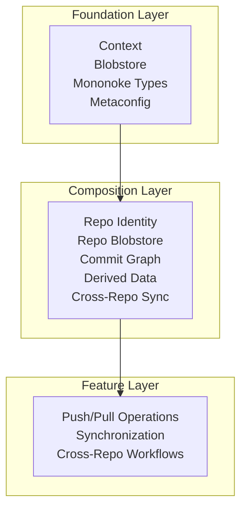
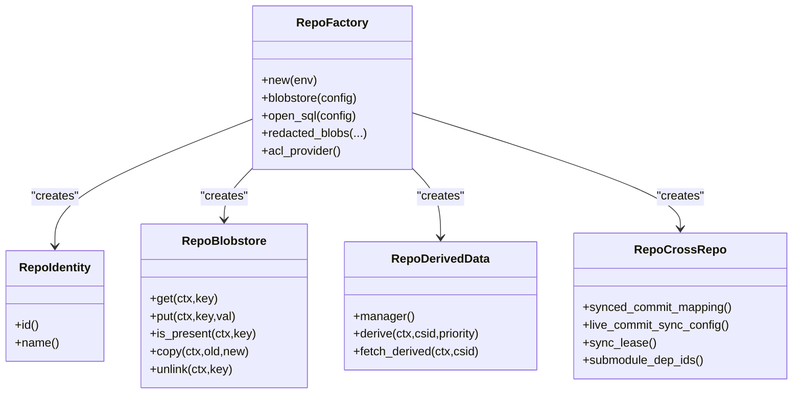
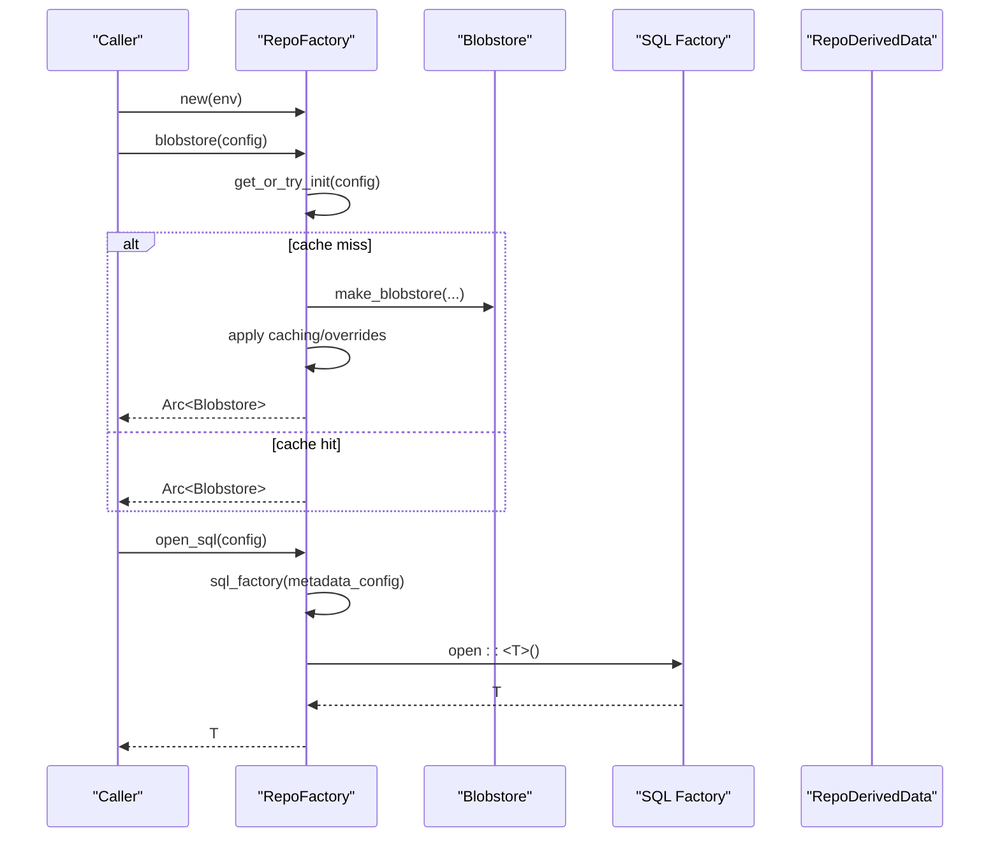
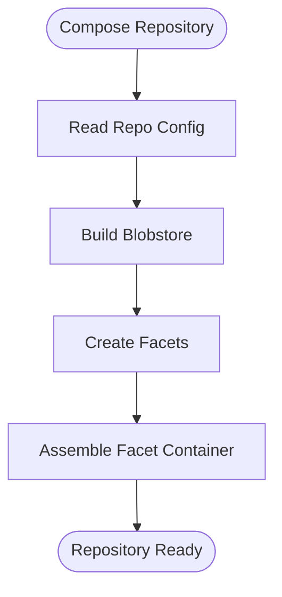
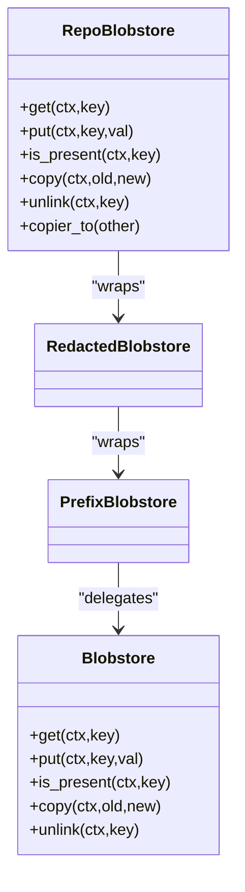
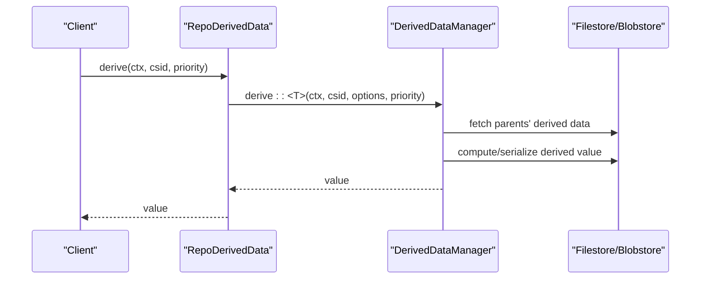
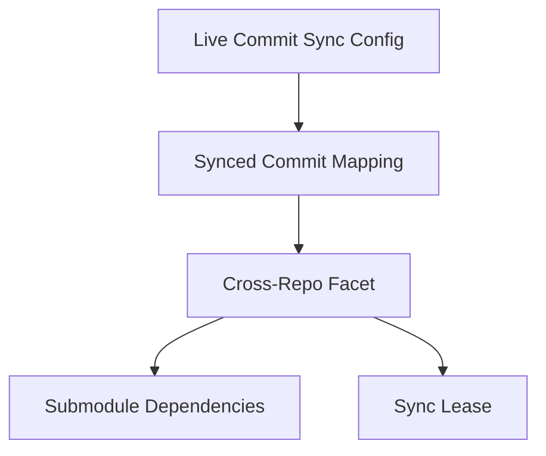
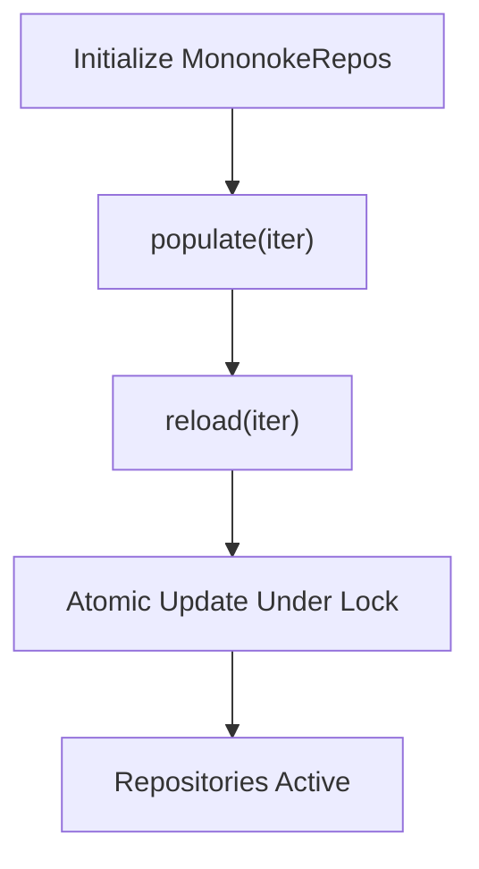
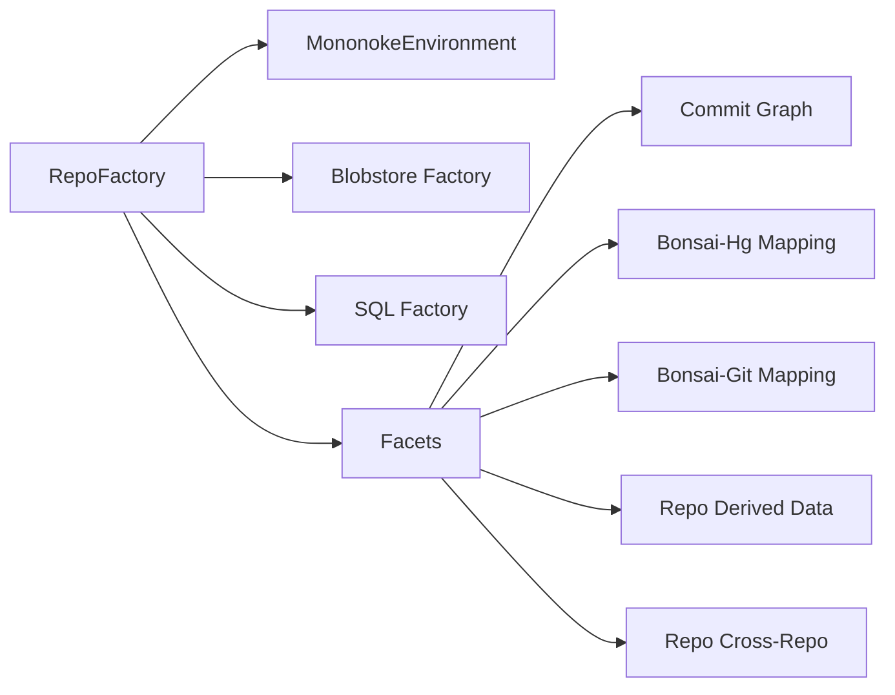

# Repository Management

<cite>
**Referenced Files in This Document**
- [2.2-repository-facets.md](file://eden/mononoke/docs/2.2-repository-facets.md)
- [1.3-architecture-overview.md](file://eden/mononoke/docs/1.3-architecture-overview.md)
- [lib.rs (repo_factory)](file://eden/mononoke/repo_factory/src/lib.rs)
- [lib.rs (blobstore)](file://eden/mononoke/blobstore/src/lib.rs)
- [lib.rs (repo_identity)](file://eden/mononoke/repo_attributes/repo_identity/src/lib.rs)
- [lib.rs (repo_blobstore)](file://eden/mononoke/repo_attributes/repo_blobstore/src/lib.rs)
- [lib.rs (repo_derived_data)](file://eden/mononoke/repo_attributes/repo_derived_data/src/lib.rs)
- [lib.rs (repo_cross_repo)](file://eden/mononoke/repo_attributes/repo_cross_repo/src/lib.rs)
- [lib.rs (derived_data)](file://eden/mononoke/derived_data/src/lib.rs)
- [lib.rs (mononoke_repos)](file://eden/mononoke/common/mononoke_repos/src/lib.rs)
</cite>

## Table of Contents
1. [Introduction](#introduction)
2. [Project Structure](#project-structure)
3. [Core Components](#core-components)
4. [Architecture Overview](#architecture-overview)
5. [Detailed Component Analysis](#detailed-component-analysis)
6. [Dependency Analysis](#dependency-analysis)
7. [Performance Considerations](#performance-considerations)
8. [Troubleshooting Guide](#troubleshooting-guide)
9. [Conclusion](#conclusion)
10. [Appendices](#appendices)

## Introduction
This document explains Mononoke Server’s repository management capabilities with a focus on repository creation, configuration, lifecycle management, and operational workflows. It covers the repository factory pattern, repository attribute management, blobstore integration for content addressing, derived data management, and cross-repository operations. It also outlines configuration options, storage backends, performance optimization techniques, and maintenance, backup, and recovery procedures.

## Project Structure
Mononoke organizes repository functionality around a facet-based composition model:
- Foundation layer: common primitives (context, blobstore, types, configuration).
- Composition layer: repository attributes (facets) that compose into repositories.
- Feature layer: higher-level operations orchestrated across facets.

**Section sources**
- [1.3-architecture-overview.md: 158-216:158-216](file://eden/mononoke/docs/1.3-architecture-overview.md#L158-L216)

## Core Components
- Repository Identity: identifies repositories by ID and name.
- Repository Blobstore: provides secure, prefixed, redacted access to immutable content.
- Derived Data Manager: orchestrates derivation and fetching of derived data types.
- Cross-Repo Sync: coordinates synchronized operations across repositories.
- Repository Factory: constructs repositories from configuration and composes facets.

**Section sources**
- [lib.rs (repo_identity): 15-42:15-42](file://eden/mononoke/repo_attributes/repo_identity/src/lib.rs#L15-L42)
- [lib.rs (repo_blobstore): 52-186:52-186](file://eden/mononoke/repo_attributes/repo_blobstore/src/lib.rs#L52-L186)
- [lib.rs (repo_derived_data): 39-348:39-348](file://eden/mononoke/repo_attributes/repo_derived_data/src/lib.rs#L39-L348)
- [lib.rs (repo_cross_repo): 22-85:22-85](file://eden/mononoke/repo_attributes/repo_cross_repo/src/lib.rs#L22-L85)
- [2.2-repository-facets.md: 13-333:13-333](file://eden/mononoke/docs/2.2-repository-facets.md#L13-L333)

## Architecture Overview
Mononoke uses a facet pattern to compose repository capabilities. Facets encapsulate responsibilities and are accessed through trait bounds. The repository factory reads configuration, constructs storage backends, creates facets, and assembles them into a repository object.

**Diagram sources**
- [lib.rs (repo_factory): 337-688:337-688](file://eden/mononoke/repo_factory/src/lib.rs#L337-L688)
- [lib.rs (repo_identity): 15-42:15-42](file://eden/mononoke/repo_attributes/repo_identity/src/lib.rs#L15-L42)
- [lib.rs (repo_blobstore): 52-186:52-186](file://eden/mononoke/repo_attributes/repo_blobstore/src/lib.rs#L52-L186)
- [lib.rs (repo_derived_data): 39-348:39-348](file://eden/mononoke/repo_attributes/repo_derived_data/src/lib.rs#L39-L348)
- [lib.rs (repo_cross_repo): 22-85:22-85](file://eden/mononoke/repo_attributes/repo_cross_repo/src/lib.rs#L22-L85)

**Section sources**
- [2.2-repository-facets.md: 13-333:13-333](file://eden/mononoke/docs/2.2-repository-facets.md#L13-L333)
- [1.3-architecture-overview.md: 174-216:174-216](file://eden/mononoke/docs/1.3-architecture-overview.md#L174-L216)

## Detailed Component Analysis

### Repository Factory Pattern
The repository factory composes repositories from configuration and storage backends. It manages caches for SQL factories, blobstores, redacted blobs, and event publishers. It supports overrides for blobstore behavior, scrub handlers, and component sampling.

**Diagram sources**
- [lib.rs (repo_factory): 337-568:337-568](file://eden/mononoke/repo_factory/src/lib.rs#L337-L568)

**Section sources**
- [lib.rs (repo_factory): 337-688:337-688](file://eden/mononoke/repo_factory/src/lib.rs#L337-L688)

### Repository Attribute Management
Repositories are composed of facets. Examples include identity, blobstore, derived data, and cross-repo sync. Facets are defined using a macro that generates accessor traits and Arc-wrapped types.

**Diagram sources**
- [2.2-repository-facets.md: 13-333:13-333](file://eden/mononoke/docs/2.2-repository-facets.md#L13-L333)

**Section sources**
- [2.2-repository-facets.md: 13-333:13-333](file://eden/mononoke/docs/2.2-repository-facets.md#L13-L333)

### Blobstore Integration for Content Addressing
Blobstore provides a key-value interface with compression, presence checks, copying, and unlink semantics. Mononoke wraps blobstores with redaction and prefixing to ensure security and isolation.

**Diagram sources**
- [lib.rs (blobstore): 327-406:327-406](file://eden/mononoke/blobstore/src/lib.rs#L327-L406)
- [lib.rs (repo_blobstore): 52-186:52-186](file://eden/mononoke/repo_attributes/repo_blobstore/src/lib.rs#L52-L186)

**Section sources**
- [lib.rs (blobstore): 327-406:327-406](file://eden/mononoke/blobstore/src/lib.rs#L327-L406)
- [lib.rs (repo_blobstore): 52-186:52-186](file://eden/mononoke/repo_attributes/repo_blobstore/src/lib.rs#L52-L186)

### Derived Data Management
Derived data is managed per repository configuration. The manager orchestrates derivation and fetching of derived data types, supports batch operations, and integrates with remote derivation services.

**Diagram sources**
- [lib.rs (repo_derived_data): 280-347:280-347](file://eden/mononoke/repo_attributes/repo_derived_data/src/lib.rs#L280-L347)
- [lib.rs (derived_data): 40-127:40-127](file://eden/mononoke/derived_data/src/lib.rs#L40-L127)

**Section sources**
- [lib.rs (repo_derived_data): 39-348:39-348](file://eden/mononoke/repo_attributes/repo_derived_data/src/lib.rs#L39-L348)
- [lib.rs (derived_data): 40-127:40-127](file://eden/mononoke/derived_data/src/lib.rs#L40-L127)

### Cross-Repository Operations
Cross-repo sync coordinates synchronized operations across dependent repositories, maintains synced commit mappings, and uses leases to prevent stampedes.

**Diagram sources**
- [lib.rs (repo_cross_repo): 22-85:22-85](file://eden/mononoke/repo_attributes/repo_cross_repo/src/lib.rs#L22-L85)

**Section sources**
- [lib.rs (repo_cross_repo): 22-85:22-85](file://eden/mononoke/repo_attributes/repo_cross_repo/src/lib.rs#L22-L85)

### Repository Lifecycle Management
Repositories are tracked and updated centrally. The central registry supports bulk population and reloads while guarding updates with a dedicated lock.

**Diagram sources**
- [lib.rs (mononoke_repos): 18-297:18-297](file://eden/mononoke/common/mononoke_repos/src/lib.rs#L18-L297)

**Section sources**
- [lib.rs (mononoke_repos): 18-297:18-297](file://eden/mononoke/common/mononoke_repos/src/lib.rs#L18-L297)

## Dependency Analysis
The repository factory depends on environment configuration, blobstore factories, SQL factories, and caches. Facets depend on each other and on shared primitives like commit graph and mapping services.

**Diagram sources**
- [lib.rs (repo_factory): 337-688:337-688](file://eden/mononoke/repo_factory/src/lib.rs#L337-L688)
- [2.2-repository-facets.md: 174-216:174-216](file://eden/mononoke/docs/2.2-repository-facets.md#L174-L216)

**Section sources**
- [lib.rs (repo_factory): 337-688:337-688](file://eden/mononoke/repo_factory/src/lib.rs#L337-L688)
- [2.2-repository-facets.md: 174-216:174-216](file://eden/mononoke/docs/2.2-repository-facets.md#L174-L216)

## Performance Considerations
- Caching: The factory caches blobstores, SQL factories, and redacted blobs to reduce initialization overhead. Presence checks and copy operations can be optimized when inner blobstores share the same storage.
- Compression: Blobstore values can be compressed to reduce storage and transfer costs.
- Background sessions: Derived data operations can be scheduled with background session classes to improve responsiveness.
- Sharding and pooling: Blobstore virtual sharding and cache pools are configured via environment options.

[No sources needed since this section provides general guidance]

## Troubleshooting Guide
- Initialization failures: The factory logs and tracks cache misses and initialization errors. Review logs for specific cache names and errors.
- Presence checks: Use presence checks to avoid unnecessary transfers; handle “probably not present” outcomes appropriately.
- Derived data errors: Use manager APIs to derive and fetch values; inspect shared derivation errors for root causes.
- Cross-repo sync: Verify synced commit mappings and leases; ensure submodule dependencies are correctly configured.

**Section sources**
- [lib.rs (repo_factory): 252-333:252-333](file://eden/mononoke/repo_factory/src/lib.rs#L252-L333)
- [lib.rs (blobstore): 273-300:273-300](file://eden/mononoke/blobstore/src/lib.rs#L273-L300)
- [lib.rs (repo_derived_data): 280-347:280-347](file://eden/mononoke/repo_attributes/repo_derived_data/src/lib.rs#L280-L347)
- [lib.rs (repo_cross_repo): 22-85:22-85](file://eden/mononoke/repo_attributes/repo_cross_repo/src/lib.rs#L22-L85)

## Conclusion
Mononoke’s repository management leverages a robust facet-based composition model and a configurable repository factory to assemble repositories from storage backends and capabilities. Blobstore integration ensures secure, content-addressed storage, while derived data and cross-repo facilities enable scalable synchronization and advanced workflows. Centralized lifecycle management and performance optimizations support reliable operations at scale.

[No sources needed since this section summarizes without analyzing specific files]

## Appendices

### Repository Configuration Options
- Identity: Repository ID and name.
- Blobstore: Backend selection, compression thresholds, and caching options.
- Derived Data: Enablement of derived data types and manager configurations.
- Cross-Repo: Synced commit mappings, live sync configs, and submodule dependencies.

**Section sources**
- [lib.rs (repo_identity): 15-42:15-42](file://eden/mononoke/repo_attributes/repo_identity/src/lib.rs#L15-L42)
- [lib.rs (repo_factory): 452-568:452-568](file://eden/mononoke/repo_factory/src/lib.rs#L452-L568)
- [lib.rs (repo_derived_data): 40-108:40-108](file://eden/mononoke/repo_attributes/repo_derived_data/src/lib.rs#L40-L108)
- [lib.rs (repo_cross_repo): 41-67:41-67](file://eden/mononoke/repo_attributes/repo_cross_repo/src/lib.rs#L41-L67)

### Storage Backends
- Blobstore backends: Configurable via factory; supports caching and compression.
- SQL backends: Constructed via metadata database configuration.
- Redaction: Optional redacted blob configuration for sensitive content.

**Section sources**
- [lib.rs (repo_factory): 402-451:402-451](file://eden/mononoke/repo_factory/src/lib.rs#L402-L451)
- [lib.rs (repo_factory): 597-625:597-625](file://eden/mononoke/repo_factory/src/lib.rs#L597-L625)

### Backup and Recovery Procedures
- Blobstore enumeration and copying: Use keyed blobstore enumeration and copiers to migrate or back up content.
- Derived data prefetch: Preload content metadata to accelerate recovery operations.
- Registry reload: Use centralized registry reload to switch repository sets atomically.

**Section sources**
- [lib.rs (blobstore): 515-525:515-525](file://eden/mononoke/blobstore/src/lib.rs#L515-L525)
- [lib.rs (derived_data): 103-127:103-127](file://eden/mononoke/derived_data/src/lib.rs#L103-L127)
- [lib.rs (mononoke_repos): 242-297:242-297](file://eden/mononoke/common/mononoke_repos/src/lib.rs#L242-L297)