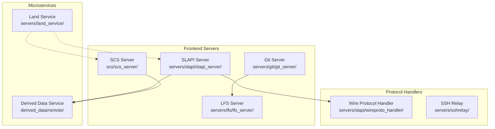
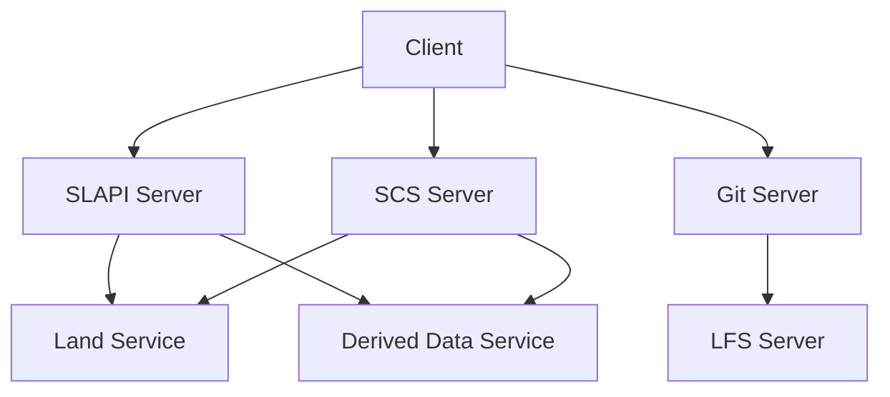
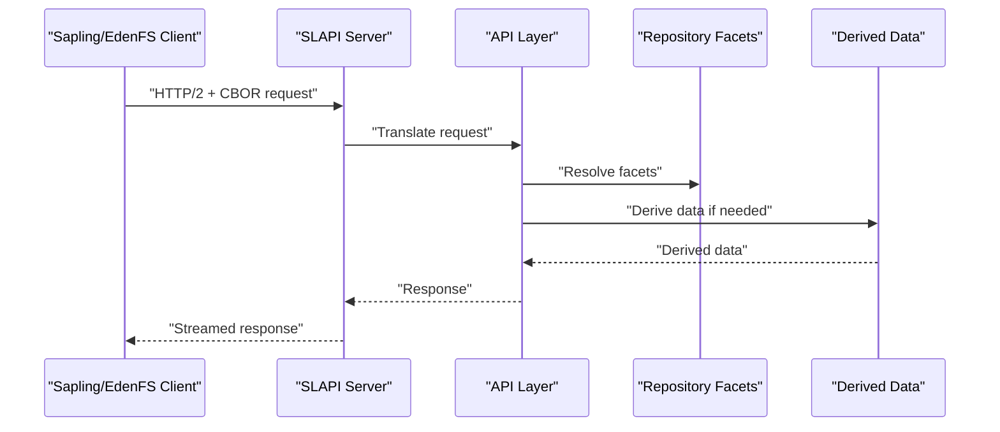
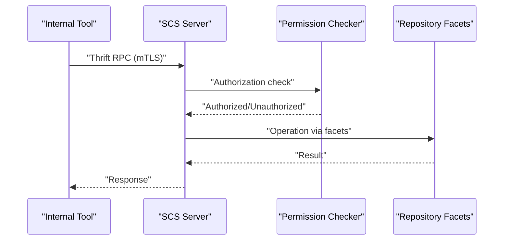
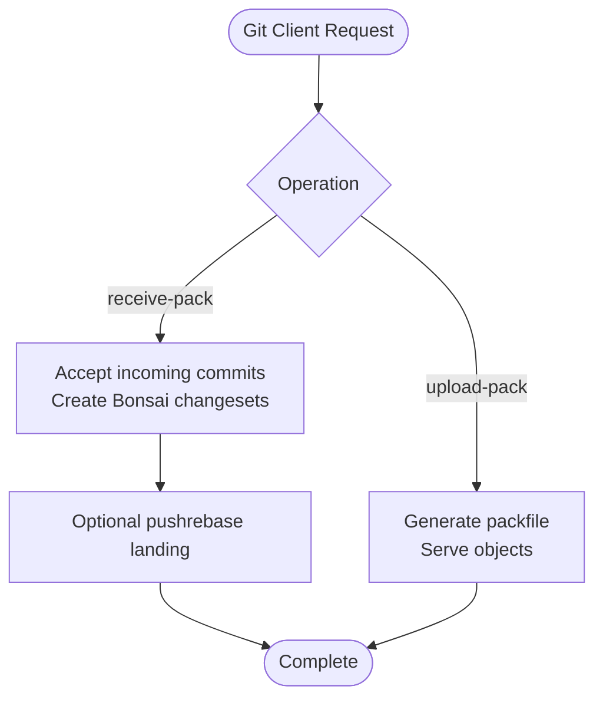
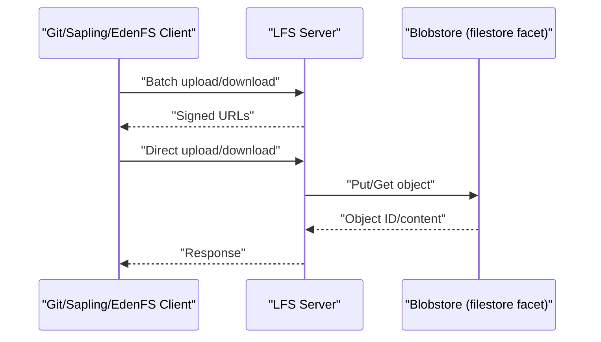
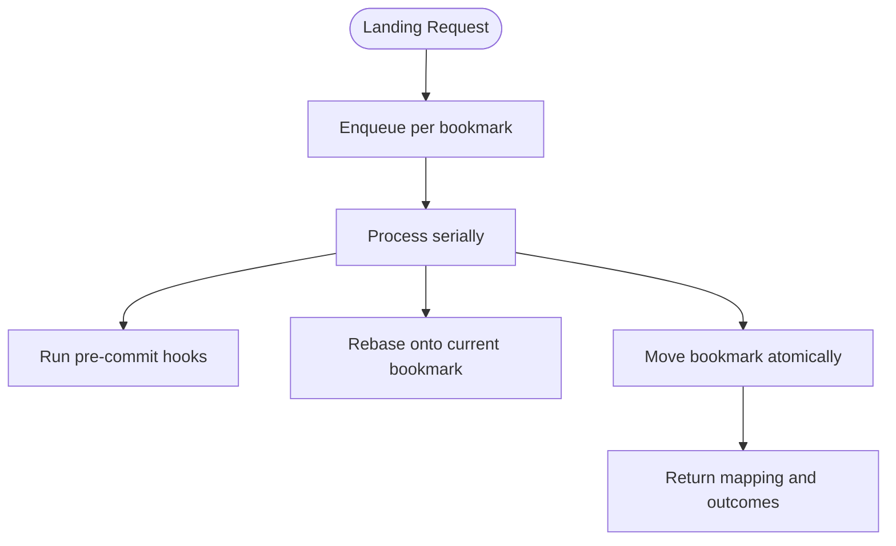
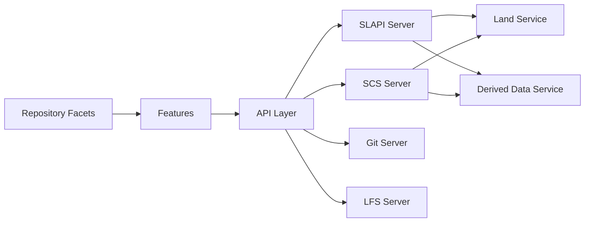

# Service Components

<cite>
**Referenced Files in This Document**
- [3.1-servers-and-services.md](file://eden/mononoke/docs/3.1-servers-and-services.md)
- [1.4-navigating-the-codebase.md](file://eden/mononoke/docs/1.4-navigating-the-codebase.md)
</cite>

## Table of Contents
1. [Introduction](#introduction)
2. [Project Structure](#project-structure)
3. [Core Components](#core-components)
4. [Architecture Overview](#architecture-overview)
5. [Detailed Component Analysis](#detailed-component-analysis)
6. [Dependency Analysis](#dependency-analysis)
7. [Performance Considerations](#performance-considerations)
8. [Troubleshooting Guide](#troubleshooting-guide)
9. [Conclusion](#conclusion)

## Introduction
This document explains the Mononoke Server service components and their roles in serving clients and coordinating repository operations. It covers the Git server, Land service, LFS server, SCS server, SLAPI server, and SSH relay. For each service, we describe purpose, functionality, request processing pipeline, authentication, data flow, configuration, deployment, monitoring, error handling, and performance optimization. The content is grounded in the repository’s official documentation.

## Project Structure
Mononoke organizes its servers and services under layered directories. The high-level structure groups servers by protocol and responsibility, with shared libraries for repository access, features, and APIs.

- Frontend servers (external clients):
  - SLAPI server (Mononoke server) under servers/slapi/slapi_server/
  - SCS server under scs/scs_server/
  - Git server under servers/git/git_server/
  - LFS server under servers/lfs/lfs_server/
- Microservices:
  - Land service under servers/land_service/
  - Derived Data remote service under derived_data/remote/
- Protocol handlers and integrations:
  - SLAPI service implementation under servers/slapi/slapi_service/
  - Wire protocol handler under servers/slapi/wireproto_handler/
  - SSH relay under servers/sshrelay/

**Diagram sources**
- [1.4-navigating-the-codebase.md:211-232](file://eden/mononoke/docs/1.4-navigating-the-codebase.md#L211-L232)

**Section sources**
- [1.4-navigating-the-codebase.md:211-232](file://eden/mononoke/docs/1.4-navigating-the-codebase.md#L211-L232)

## Core Components
This section summarizes each service’s purpose and role in the system.

- SLAPI Server (Mononoke server)
  - Purpose: Primary frontend for Sapling/EdenFS clients using the SLAPI protocol over HTTP/2 with CBOR encoding.
  - Responsibilities: Clone, pull, push, and on-demand file fetches; repository listener, TLS termination, routing; supports sharding and cache warmup.
  - Section sources
    - [3.1-servers-and-services.md:26-47](file://eden/mononoke/docs/3.1-servers-and-services.md#L26-L47)

- SCS Server (Source Control Service)
  - Purpose: Thrift-based programmatic API for repository operations; used by internal tools and automation.
  - Responsibilities: High-level methods for commits, history, blame, diffs, and write operations; mTLS authentication; authorization via repository permission checker.
  - Section sources
    - [3.1-servers-and-services.md:48-69](file://eden/mononoke/docs/3.1-servers-and-services.md#L48-L69)

- Git Server
  - Purpose: Implements Git protocol over HTTP for standard Git clients.
  - Responsibilities: Smart HTTP upload-pack and receive-pack; packfile generation; Git refs via symbolic refs facets; translation between Git and Bonsai formats.
  - Section sources
    - [3.1-servers-and-services.md:71-91](file://eden/mononoke/docs/3.1-servers-and-services.md#L71-L91)

- LFS Server
  - Purpose: Implements Git LFS protocol for large file storage.
  - Responsibilities: Upload/download via HTTP; batch endpoints; filestore facet for chunking and content-addressed storage; optional upstream federation.
  - Section sources
    - [3.1-servers-and-services.md:93-112](file://eden/mononoke/docs/3.1-servers-and-services.md#L93-L112)

- Land Service
  - Purpose: Serialized commit landing to public bookmarks via pushrebase.
  - Responsibilities: Queue per bookmark, atomic landing, conflict/hook failure reporting, mapping original to rebased commit IDs.
  - Section sources
    - [3.1-servers-and-services.md:120-139](file://eden/mononoke/docs/3.1-servers-and-services.md#L120-L139)

- SSH Relay
  - Purpose: SSH relay server used by protocol handlers and integrations.
  - Section sources
    - [1.4-navigating-the-codebase.md:231](file://eden/mononoke/docs/1.4-navigating-the-codebase.md#L231)

## Architecture Overview
Mononoke servers are stateless and rely on shared storage (blobstore and metadata database). They use a layered architecture:
- Base components (common utilities, blobstore backends)
- Repository attributes (facets)
- Features (composed operations)
- API layer (high-level abstractions)
- Servers/tools (protocols and applications)

Communication protocols:
- HTTP/2 with CBOR for SLAPI
- Git smart HTTP for Git
- HTTP for LFS
- Thrift over HTTP with mTLS for SCS and internal services

Stateless design enables horizontal scaling and operational simplicity.

**Diagram sources**
- [3.1-servers-and-services.md:242-378](file://eden/mononoke/docs/3.1-servers-and-services.md#L242-L378)

**Section sources**
- [3.1-servers-and-services.md:242-378](file://eden/mononoke/docs/3.1-servers-and-services.md#L242-L378)

## Detailed Component Analysis

### SLAPI Server (Mononoke Server)
- Purpose and clients: Serve Sapling/EdenFS clients via SLAPI over HTTP/2 with CBOR.
- Request processing pipeline:
  - TCP/TLS termination in repo listener
  - Routing to protocol handler
  - Translation to repository operations via API layer
  - Streaming responses for incremental operations
- Authentication and authorization:
  - Not detailed in the referenced document; typical mTLS and permission checks are implied by the stateless, secure design.
- Data flow:
  - Requests map to repository operations; derived data handled via features and facets.
- Configuration:
  - Listen address, ALPN negotiation, cache warmup settings.
- Deployment:
  - Stateless instances behind load balancers; supports sharding and deep/shallow modes.
- Monitoring:
  - Metrics, Scuba logging, tracing, health endpoints.
- Performance:
  - Streaming, multiplexing, and caching reduce latency and memory footprint.
- Operational scenarios:
  - Clone/pull/push flows; on-demand file fetches; cache warmup at startup.

**Diagram sources**
- [3.1-servers-and-services.md:26-47](file://eden/mononoke/docs/3.1-servers-and-services.md#L26-L47)

**Section sources**
- [3.1-servers-and-services.md:26-47](file://eden/mononoke/docs/3.1-servers-and-services.md#L26-L47)

### SCS Server (Source Control Service)
- Purpose and clients: Programmatic access for internal tools and automation.
- Request processing pipeline:
  - Thrift RPC over HTTP with mTLS
  - Authorization via repository permission checker
  - Methods for commits, history, blame, diffs, and write operations
- Authentication and authorization:
  - mTLS; authorization via repository permission checker facet.
- Data flow:
  - Translates between multiple commit identity schemes (Bonsai, Git, Mercurial, Globalrev, SVN) using VCS mapping facets.
- Configuration:
  - Thrift worker pool sizing, queue configuration, async request settings.
- Deployment:
  - Stateless Thrift service; integrates with repository layer through facets.
- Monitoring:
  - Metrics, logging, tracing, health checks.
- Performance:
  - Supports streaming for large result sets; async request patterns.

**Diagram sources**
- [3.1-servers-and-services.md:48-69](file://eden/mononoke/docs/3.1-servers-and-services.md#L48-L69)

**Section sources**
- [3.1-servers-and-services.md:48-69](file://eden/mononoke/docs/3.1-servers-and-services.md#L48-L69)

### Git Server
- Purpose and clients: Serve standard Git clients over HTTP using Git smart HTTP protocol.
- Request processing pipeline:
  - upload-pack (fetch) and receive-pack (push)
  - Packfile generation and Git object formats
  - References via symbolic refs facets
- Authentication and authorization:
  - Not detailed in the referenced document; consistent with Mononoke’s secure, stateless design.
- Data flow:
  - Git commits mapped to Bonsai via bonsai_git_mapping; trees derived from Bonsai file changes; push creates Bonsai changesets and can land via pushrebase.
- Configuration:
  - Upstream LFS server URL, rate limiting.
- Deployment:
  - Stateless instances; scalable behind load balancers.
- Monitoring:
  - Metrics, logging, tracing, health checks.
- Performance:
  - Efficient packfile transfers; reference handling via symbolic refs.

**Diagram sources**
- [3.1-servers-and-services.md:71-91](file://eden/mononoke/docs/3.1-servers-and-services.md#L71-L91)

**Section sources**
- [3.1-servers-and-services.md:71-91](file://eden/mononoke/docs/3.1-servers-and-services.md#L71-L91)

### LFS Server
- Purpose and clients: Serve Git LFS uploads/downloads for Git and non-Git clients.
- Request processing pipeline:
  - Batch API for upload/download URLs
  - Direct upload/download endpoints
  - Streaming for large files
- Authentication and authorization:
  - Not detailed in the referenced document.
- Data flow:
  - Stores LFS objects in blobstore via filestore facet; chunking and content-addressed storage; optional upstream federation.
- Configuration:
  - Self URLs, upstream server, max upload size.
- Deployment:
  - Stateless; can operate standalone or federated.
- Monitoring:
  - Metrics, logging, tracing, health checks.
- Performance:
  - Batch endpoints reduce round trips; streaming avoids memory pressure.

**Diagram sources**
- [3.1-servers-and-services.md:93-112](file://eden/mononoke/docs/3.1-servers-and-services.md#L93-L112)

**Section sources**
- [3.1-servers-and-services.md:93-112](file://eden/mononoke/docs/3.1-servers-and-services.md#L93-L112)

### Land Service
- Purpose and clients: Serialized landing of commits to public bookmarks via pushrebase.
- Request processing pipeline:
  - Queue per bookmark; process landing requests serially
  - Execute pushrebase: hooks, rebasing, bookmark movement
  - Return mapping of original to rebased commit IDs; report conflicts/hook failures
- Authentication and authorization:
  - Not detailed in the referenced document.
- Data flow:
  - Receives commit stacks; coordinates with repository facets for bookmarks, commit graph, derived data, and hooks.
- Configuration:
  - Thrift interface; integrates with repository layer via facets.
- Deployment:
  - Stateless microservice; coordinated by frontend servers.
- Monitoring:
  - Metrics, logging, tracing, health checks.
- Performance:
  - Serialization prevents wasted work from concurrent pushrebases.

**Diagram sources**
- [3.1-servers-and-services.md:120-139](file://eden/mononoke/docs/3.1-servers-and-services.md#L120-L139)

**Section sources**
- [3.1-servers-and-services.md:120-139](file://eden/mononoke/docs/3.1-servers-and-services.md#L120-L139)

### SSH Relay
- Purpose and clients: SSH relay used by protocol handlers and integrations.
- Section sources
  - [1.4-navigating-the-codebase.md:231](file://eden/mononoke/docs/1.4-navigating-the-codebase.md#L231)

## Dependency Analysis
Services share a common internal architecture:
- Facet-based repository access
- Feature composition for operations
- API layer abstractions
- Shared configuration and observability

**Diagram sources**
- [3.1-servers-and-services.md:179-241](file://eden/mononoke/docs/3.1-servers-and-services.md#L179-L241)

**Section sources**
- [3.1-servers-and-services.md:179-241](file://eden/mononoke/docs/3.1-servers-and-services.md#L179-L241)

## Performance Considerations
- Stateless design enables horizontal scaling without state migration.
- Streaming and multiplexing reduce latency and memory usage.
- Sharding (shallow/deep) supports scaling to large deployments.
- Cache warmup at startup improves initial performance.
- Asynchronous derived data and batch LFS endpoints reduce round trips.

[No sources needed since this section provides general guidance]

## Troubleshooting Guide
- Health monitoring:
  - Health endpoints and readiness flags used by load balancers and orchestrators.
- Observability:
  - Metrics (QPS, latency, error rates), Scuba logging, distributed tracing.
- Configuration:
  - Common configuration via mononoke_app; service-specific options (listen addresses, ALPN, worker pools, rate limits).
- Error handling:
  - Consistent patterns across services; errors propagated with context for tracing and logging.

**Section sources**
- [3.1-servers-and-services.md:337-357](file://eden/mononoke/docs/3.1-servers-and-services.md#L337-L357)

## Conclusion
Mononoke’s service architecture cleanly separates frontend protocol servers from internal microservices, enabling independent scaling and workload isolation. Each service is stateless, integrates via shared facets and features, and adheres to consistent protocols and observability. The documented components—SLAPI, SCS, Git, LFS, Land, and SSH relay—cover the primary client-facing and coordination needs, with clear operational patterns for configuration, deployment, monitoring, and performance.