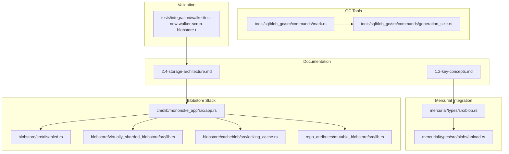
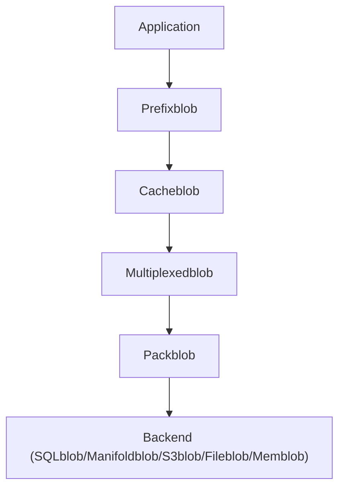
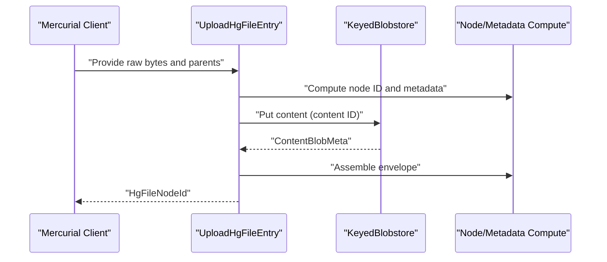
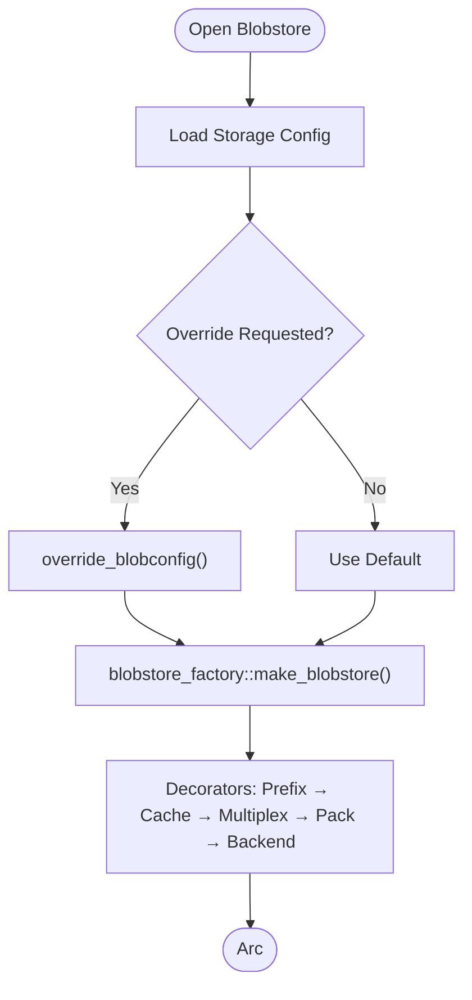
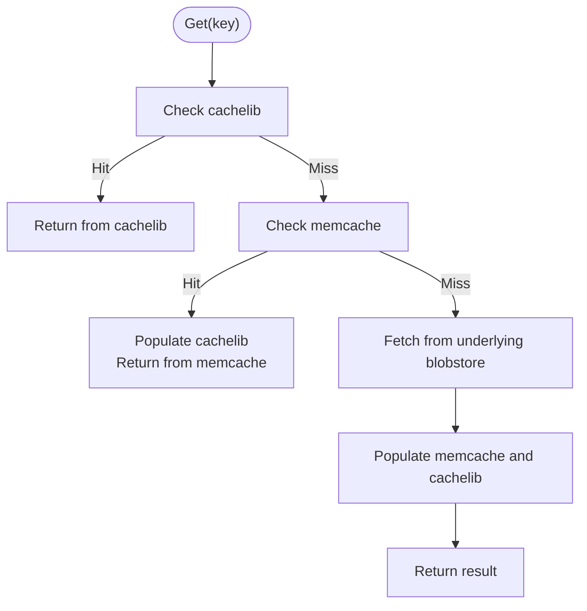
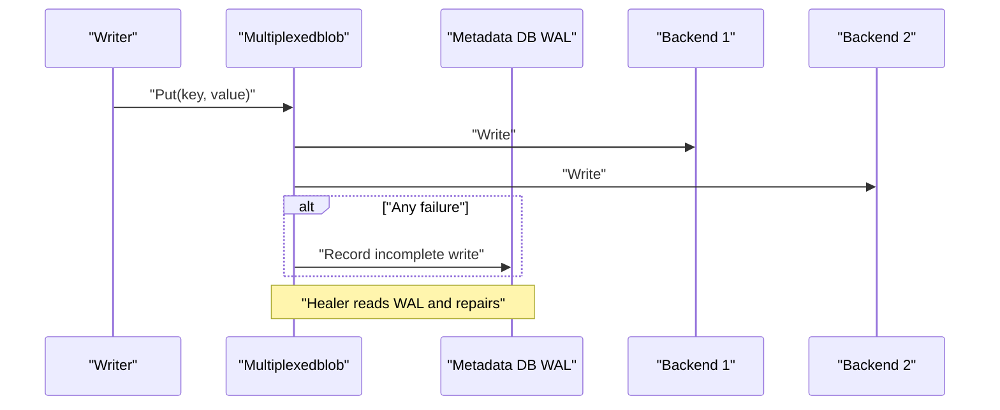
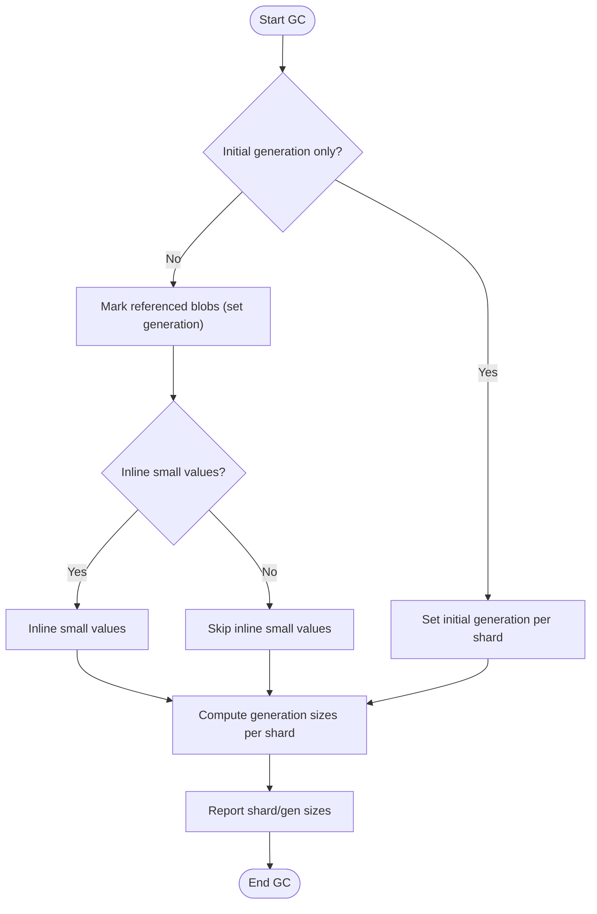
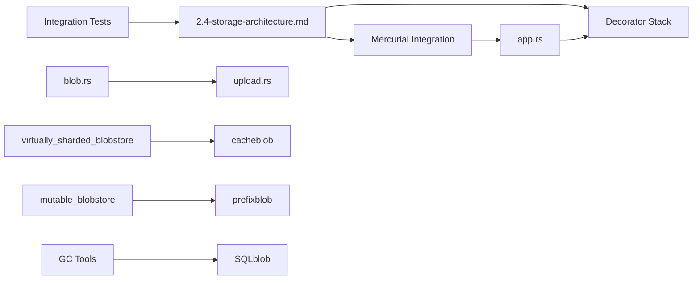

# Blob Repository and Content Storage

<cite>
**Referenced Files in This Document**
- [2.4-storage-architecture.md](file://eden/mononoke/docs/2.4-storage-architecture.md)
- [1.2-key-concepts.md](file://eden/mononoke/docs/1.2-key-concepts.md)
- [blob.rs](file://eden/mononoke/mercurial/types/src/blob.rs)
- [upload.rs](file://eden/mononoke/mercurial/types/src/blobs/upload.rs)
- [app.rs](file://eden/mononoke/cmdlib/mononoke_app/src/app.rs)
- [disabled.rs](file://eden/mononoke/blobstore/src/disabled.rs)
- [lib.rs (virtually_sharded_blobstore)](file://eden/mononoke/blobstore/virtually_sharded_blobstore/src/lib.rs)
- [locking_cache.rs](file://eden/mononoke/blobstore/cacheblob/src/locking_cache.rs)
- [lib.rs (mutable_blobstore)](file://eden/mononoke/repo_attributes/mutable_blobstore/src/lib.rs)
- [mark.rs](file://eden/mononoke/tools/sqlblob_gc/src/commands/mark.rs)
- [generation_size.rs](file://eden/mononoke/tools/sqlblob_gc/src/commands/generation_size.rs)
- [test-new-walker-scrub-blobstore.t](file://eden/mononoke/tests/integration/walker/test-new-walker-scrub-blobstore.t)
</cite>

## Table of Contents
1. [Introduction](#introduction)
2. [Project Structure](#project-structure)
3. [Core Components](#core-components)
4. [Architecture Overview](#architecture-overview)
5. [Detailed Component Analysis](#detailed-component-analysis)
6. [Dependency Analysis](#dependency-analysis)
7. [Performance Considerations](#performance-considerations)
8. [Troubleshooting Guide](#troubleshooting-guide)
9. [Conclusion](#conclusion)
10. [Appendices](#appendices)

## Introduction
This document explains the SAPLING SCM blob repository system and content storage architecture used by Mononoke. It covers the blob storage model, content addressing mechanisms, object persistence strategies, Mercurial blob repository integration, blob synchronization protocols, storage override mechanisms, retrieval operations, caching strategies, garbage collection processes, the blob repository API surface, transaction management, consistency guarantees, configuration examples, performance tuning, troubleshooting, deduplication, compression, and storage efficiency optimizations.

## Project Structure
The blob storage system spans multiple subsystems:
- Storage architecture and policy documentation
- Mercurial-specific blob types and upload flows
- Application-level blobstore construction and overrides
- Decorator-based blobstore stacks (prefix, cache, multiplex, pack)
- Specialized blobstores (mutable, virtually sharded)
- Garbage collection tools for SQL-backed blobstores
- Integration tests validating blobstore synchronization

**Diagram sources**
- [2.4-storage-architecture.md:1-392](file://eden/mononoke/docs/2.4-storage-architecture.md#L1-L392)
- [1.2-key-concepts.md:15-21](file://eden/mononoke/docs/1.2-key-concepts.md#L15-L21)
- [blob.rs:1-76](file://eden/mononoke/mercurial/types/src/blob.rs#L1-L76)
- [upload.rs:177-416](file://eden/mononoke/mercurial/types/src/blobs/upload.rs#L177-L416)
- [app.rs:861-902](file://eden/mononoke/cmdlib/mononoke_app/src/app.rs#L861-L902)
- [disabled.rs:1-53](file://eden/mononoke/blobstore/src/disabled.rs#L1-L53)
- [lib.rs (virtually_sharded_blobstore):89-703](file://eden/mononoke/blobstore/virtually_sharded_blobstore/src/lib.rs#L89-L703)
- [locking_cache.rs:308-358](file://eden/mononoke/blobstore/cacheblob/src/locking_cache.rs#L308-L358)
- [lib.rs (mutable_blobstore):1-35](file://eden/mononoke/repo_attributes/mutable_blobstore/src/lib.rs#L1-L35)
- [mark.rs:1-120](file://eden/mononoke/tools/sqlblob_gc/src/commands/mark.rs#L1-L120)
- [generation_size.rs:46-78](file://eden/mononoke/tools/sqlblob_gc/src/commands/generation_size.rs#L46-L78)
- [test-new-walker-scrub-blobstore.t:166-178](file://eden/mononoke/tests/integration/walker/test-new-walker-scrub-blobstore.t#L166-L178)

**Section sources**
- [2.4-storage-architecture.md:1-392](file://eden/mononoke/docs/2.4-storage-architecture.md#L1-L392)
- [1.2-key-concepts.md:15-21](file://eden/mononoke/docs/1.2-key-concepts.md#L15-L21)

## Core Components
- Immutable Blobstore: Content-addressed key-value store for immutable data (changesets, file contents, derived data). Keys are content hashes enabling deduplication and integrity.
- Metadata Database: SQL database for mutable repository state (bookmarks, mappings, commit graph indexes).
- Decorator Pattern: Composable layers for prefixing keys, caching, multiplexing, packing, redaction, throttling, logging, and read-only enforcement.
- Mercurial Integration: Mercurial-specific blob types and upload pipeline that integrates with the blobstore.
- Specialized Blobstores: Mutable and ephemeral blobstores for auxiliary and temporary data.
- GC Tools: Utilities to mark and size-generate blobs for safe deletion.

**Section sources**
- [2.4-storage-architecture.md:5-22](file://eden/mononoke/docs/2.4-storage-architecture.md#L5-L22)
- [2.4-storage-architecture.md:69-107](file://eden/mononoke/docs/2.4-storage-architecture.md#L69-L107)
- [1.2-key-concepts.md:15-21](file://eden/mononoke/docs/1.2-key-concepts.md#L15-L21)

## Architecture Overview
The blobstore is the primary storage layer for repository content. It separates immutable blobs from mutable metadata, enabling aggressive caching and replication for immutable data while keeping mutable state transactional.

**Diagram sources**
- [2.4-storage-architecture.md:109-136](file://eden/mononoke/docs/2.4-storage-architecture.md#L109-L136)

**Section sources**
- [2.4-storage-architecture.md:23-136](file://eden/mononoke/docs/2.4-storage-architecture.md#L23-L136)

## Detailed Component Analysis

### Blob Storage Model and Content Addressing
- Content-addressed keys: Most blobs use Blake2b hashing for keys, enabling deduplication and integrity verification. Some data is keyed by related objects (e.g., blame keyed by unode hash).
- Immutable semantics: Once written, blobs are never modified or deleted except via explicit redaction processes.
- Categories of stored data: Core repository data (changesets, file contents, metadata), derived data (manifests, blame, fastlogs), and VCS-specific artifacts (Mercurial/Git formats).

**Section sources**
- [2.4-storage-architecture.md:27-47](file://eden/mononoke/docs/2.4-storage-architecture.md#L27-L47)
- [1.2-key-concepts.md:15-17](file://eden/mononoke/docs/1.2-key-concepts.md#L15-L17)

### Mercurial Blob Repository Integration
- HgBlob type: Thin wrapper around bytes for Mercurial blobs, interoperable with BlobstoreBytes.
- Upload pipeline: Mercurial file uploads compute node IDs and metadata, optionally upload content to the blobstore, and assemble envelopes for storage.

**Diagram sources**
- [upload.rs:177-416](file://eden/mononoke/mercurial/types/src/blobs/upload.rs#L177-L416)
- [blob.rs:1-76](file://eden/mononoke/mercurial/types/src/blob.rs#L1-L76)

**Section sources**
- [upload.rs:177-416](file://eden/mononoke/mercurial/types/src/blobs/upload.rs#L177-L416)
- [blob.rs:1-76](file://eden/mononoke/mercurial/types/src/blob.rs#L1-L76)

### Blobstore Decorator Stack and Storage Override Mechanisms
- Decorators: Prefixblob (namespace by repo), Cacheblob (multi-level caching), Multiplexedblob (write-all/read-any), Packblob (compression), plus operational/testing decorators.
- Storage override: Application-level override of blobstore configuration for specific deployments or tests.

**Diagram sources**
- [app.rs:861-902](file://eden/mononoke/cmdlib/mononoke_app/src/app.rs#L861-L902)
- [2.4-storage-architecture.md:109-136](file://eden/mononoke/docs/2.4-storage-architecture.md#L109-L136)

**Section sources**
- [app.rs:861-902](file://eden/mononoke/cmdlib/mononoke_app/src/app.rs#L861-L902)
- [2.4-storage-architecture.md:69-107](file://eden/mononoke/docs/2.4-storage-architecture.md#L69-L107)

### Caching Strategies and Virtual Sharding
- Multi-level caching: In-process cache (cachelib) and shared cache (memcache), with cache warming and microwave preloading.
- Virtually sharded blobstore: Deduplicates in-flight requests across virtual shards to reduce redundant backend loads.

**Diagram sources**
- [2.4-storage-architecture.md:269-354](file://eden/mononoke/docs/2.4-storage-architecture.md#L269-L354)
- [locking_cache.rs:308-358](file://eden/mononoke/blobstore/cacheblob/src/locking_cache.rs#L308-L358)
- [lib.rs (virtually_sharded_blobstore):89-703](file://eden/mononoke/blobstore/virtually_sharded_blobstore/src/lib.rs#L89-L703)

**Section sources**
- [2.4-storage-architecture.md:269-354](file://eden/mononoke/docs/2.4-storage-architecture.md#L269-L354)
- [locking_cache.rs:308-358](file://eden/mononoke/blobstore/cacheblob/src/locking_cache.rs#L308-L358)
- [lib.rs (virtually_sharded_blobstore):89-703](file://eden/mononoke/blobstore/virtually_sharded_blobstore/src/lib.rs#L89-L703)

### Multiplexing, Synchronization, and Consistency Guarantees
- Multiplexedblob: Writes to multiple backends (write-all, read-any), with a WAL in the metadata database to heal inconsistencies.
- Healer job: Periodically replays WAL to repair missing blobs across backends.

**Diagram sources**
- [2.4-storage-architecture.md:138-166](file://eden/mononoke/docs/2.4-storage-architecture.md#L138-L166)

**Section sources**
- [2.4-storage-architecture.md:138-166](file://eden/mononoke/docs/2.4-storage-architecture.md#L138-L166)

### Compression and Packing
- Packblob: Packs multiple related blobs and applies Zstd delta compression using a dictionary to improve compression ratios for similar content (e.g., file versions).

**Section sources**
- [2.4-storage-architecture.md:167-199](file://eden/mononoke/docs/2.4-storage-architecture.md#L167-L199)

### Specialized Blobstores
- Mutable blobstore: Stores auxiliary, non-commit-graph data with prefixing and no redaction requirement.
- Disabled blobstore: Fails all operations with a reason; used as a placeholder for administratively disabled storage.

**Section sources**
- [lib.rs (mutable_blobstore):1-35](file://eden/mononoke/repo_attributes/mutable_blobstore/src/lib.rs#L1-L35)
- [disabled.rs:1-53](file://eden/mononoke/blobstore/src/disabled.rs#L1-L53)

### Blob Retrieval API Surface
- KeyedBlobstore interface: get, put, put_with_status, unlink, is_present, get_cache_only, get_no_cache_fill, etc.
- Mercurial integration: HgBlob conversions and upload flows operate over this interface.

**Section sources**
- [blob.rs:64-76](file://eden/mononoke/mercurial/types/src/blob.rs#L64-L76)
- [upload.rs:177-416](file://eden/mononoke/mercurial/types/src/blobs/upload.rs#L177-L416)

### Transaction Management and Consistency
- Metadata database: Transactional updates for mutable state (bookmarks, mappings, commit graph).
- Blobstore immutability: Ensures eventual consistency and strong integrity via content addressing; healing and multiplexing maintain cross-backend consistency.

**Section sources**
- [2.4-storage-architecture.md:201-267](file://eden/mononoke/docs/2.4-storage-architecture.md#L201-L267)
- [2.4-storage-architecture.md:138-166](file://eden/mononoke/docs/2.4-storage-architecture.md#L138-L166)

### Garbage Collection Processes
- Mark phase: Sets generations and marks referenced blobs as not safe to delete; supports initial generation and inline small values.
- Generation sizing: Computes shard-level sizes by generation for reporting and decisions.
- Scrubbing/validation: Integration tests compare blobstore contents across replicas to detect discrepancies.

**Diagram sources**
- [mark.rs:82-120](file://eden/mononoke/tools/sqlblob_gc/src/commands/mark.rs#L82-L120)
- [generation_size.rs:46-78](file://eden/mononoke/tools/sqlblob_gc/src/commands/generation_size.rs#L46-L78)
- [test-new-walker-scrub-blobstore.t:166-178](file://eden/mononoke/tests/integration/walker/test-new-walker-scrub-blobstore.t#L166-L178)

**Section sources**
- [mark.rs:1-120](file://eden/mononoke/tools/sqlblob_gc/src/commands/mark.rs#L1-L120)
- [generation_size.rs:46-78](file://eden/mononoke/tools/sqlblob_gc/src/commands/generation_size.rs#L46-L78)
- [test-new-walker-scrub-blobstore.t:166-178](file://eden/mononoke/tests/integration/walker/test-new-walker-scrub-blobstore.t#L166-L178)

## Dependency Analysis
- Documentation drives design: Storage architecture and decorator composition are defined in docs.
- Mercurial integration depends on blob types and upload flows.
- Application constructs blobstore stacks and supports overrides.
- Specialized blobstores and decorators plug into the same interface.
- GC tools operate on SQL-backed blobstores and rely on metadata DB for WAL.

**Diagram sources**
- [2.4-storage-architecture.md:1-392](file://eden/mononoke/docs/2.4-storage-architecture.md#L1-L392)
- [blob.rs:1-76](file://eden/mononoke/mercurial/types/src/blob.rs#L1-L76)
- [upload.rs:177-416](file://eden/mononoke/mercurial/types/src/blobs/upload.rs#L177-L416)
- [app.rs:861-902](file://eden/mononoke/cmdlib/mononoke_app/src/app.rs#L861-L902)
- [lib.rs (virtually_sharded_blobstore):89-703](file://eden/mononoke/blobstore/virtually_sharded_blobstore/src/lib.rs#L89-L703)
- [lib.rs (mutable_blobstore):1-35](file://eden/mononoke/repo_attributes/mutable_blobstore/src/lib.rs#L1-L35)
- [mark.rs:1-120](file://eden/mononoke/tools/sqlblob_gc/src/commands/mark.rs#L1-L120)
- [generation_size.rs:46-78](file://eden/mononoke/tools/sqlblob_gc/src/commands/generation_size.rs#L46-L78)
- [test-new-walker-scrub-blobstore.t:166-178](file://eden/mononoke/tests/integration/walker/test-new-walker-scrub-blobstore.t#L166-L178)

**Section sources**
- [2.4-storage-architecture.md:1-392](file://eden/mononoke/docs/2.4-storage-architecture.md#L1-L392)
- [blob.rs:1-76](file://eden/mononoke/mercurial/types/src/blob.rs#L1-L76)
- [upload.rs:177-416](file://eden/mononoke/mercurial/types/src/blobs/upload.rs#L177-L416)
- [app.rs:861-902](file://eden/mononoke/cmdlib/mononoke_app/src/app.rs#L861-L902)
- [lib.rs (virtually_sharded_blobstore):89-703](file://eden/mononoke/blobstore/virtually_sharded_blobstore/src/lib.rs#L89-L703)
- [lib.rs (mutable_blobstore):1-35](file://eden/mononoke/repo_attributes/mutable_blobstore/src/lib.rs#L1-L35)
- [mark.rs:1-120](file://eden/mononoke/tools/sqlblob_gc/src/commands/mark.rs#L1-L120)
- [generation_size.rs:46-78](file://eden/mononoke/tools/sqlblob_gc/src/commands/generation_size.rs#L46-L78)
- [test-new-walker-scrub-blobstore.t:166-178](file://eden/mononoke/tests/integration/walker/test-new-walker-scrub-blobstore.t#L166-L178)

## Performance Considerations
- Prefer content-addressed keys for deduplication and integrity.
- Use multi-level caching (cachelib + memcache) to minimize backend load.
- Employ Packblob for compression of related blobs to reduce storage footprint.
- Use Multiplexedblob to trade write latency for availability; tune quorum and backend independence.
- Warm caches (microwave) to mitigate cold-start effects.
- Shard caches and use virtually sharded blobstore to deduplicate in-flight requests.

[No sources needed since this section provides general guidance]

## Troubleshooting Guide
- Disabled storage: If a blobstore is administratively disabled, operations fail with a reason; verify configuration and re-enable.
- Multiplex inconsistency: If reads fail intermittently, inspect the metadata DB WAL and run the healer job to repair missing blobs.
- GC anomalies: Use GC mark and generation size tools to diagnose unreferenced blobs and shard sizes; compare blobstore contents across replicas with integration tests.
- Cache misses: Verify cache mode flags and warming strategies; confirm cache population on backend fetch.

**Section sources**
- [disabled.rs:1-53](file://eden/mononoke/blobstore/src/disabled.rs#L1-L53)
- [2.4-storage-architecture.md:138-166](file://eden/mononoke/docs/2.4-storage-architecture.md#L138-L166)
- [mark.rs:82-120](file://eden/mononoke/tools/sqlblob_gc/src/commands/mark.rs#L82-L120)
- [generation_size.rs:46-78](file://eden/mononoke/tools/sqlblob_gc/src/commands/generation_size.rs#L46-L78)
- [test-new-walker-scrub-blobstore.t:166-178](file://eden/mononoke/tests/integration/walker/test-new-walker-scrub-blobstore.t#L166-L178)

## Conclusion
Mononoke’s blob repository system leverages content-addressed storage, decorator composition, and multi-level caching to deliver scalable, durable, and efficient storage for SCM repositories. Mercurial integration is tightly coupled with the blobstore through typed blobs and upload pipelines. Operational tools ensure consistency and efficiency via multiplexing, healing, and garbage collection. Proper configuration, tuning, and monitoring enable robust performance and reliability.

[No sources needed since this section summarizes without analyzing specific files]

## Appendices

### Configuration Examples
- Enable/disable caching via cache mode flags.
- Configure decorator order: prefix → cache → multiplex → pack → backend.
- Override blobstore configuration per repository or deployment.

**Section sources**
- [2.4-storage-architecture.md:307-316](file://eden/mononoke/docs/2.4-storage-architecture.md#L307-L316)
- [2.4-storage-architecture.md:109-136](file://eden/mononoke/docs/2.4-storage-architecture.md#L109-L136)
- [app.rs:861-902](file://eden/mononoke/cmdlib/mononoke_app/src/app.rs#L861-L902)

### Storage Efficiency Optimizations
- Deduplication: Rely on content-addressed keys for identical content reuse.
- Compression: Use Packblob with delta compression for related blobs.
- Chunking and metadata: Large files are chunked; metadata is stored separately for efficient retrieval.

**Section sources**
- [2.4-storage-architecture.md:27-47](file://eden/mononoke/docs/2.4-storage-architecture.md#L27-L47)
- [2.4-storage-architecture.md:167-199](file://eden/mononoke/docs/2.4-storage-architecture.md#L167-L199)