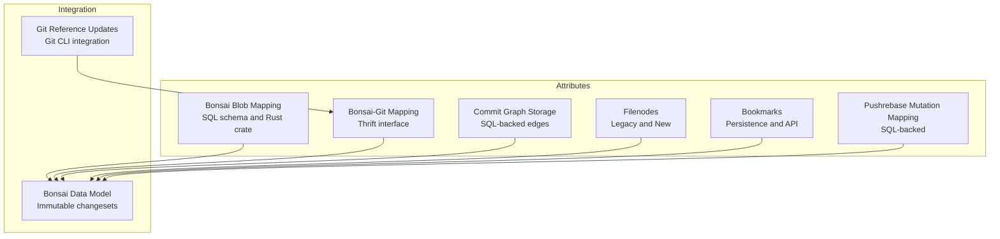
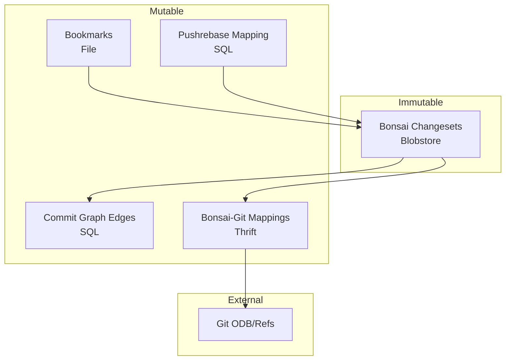
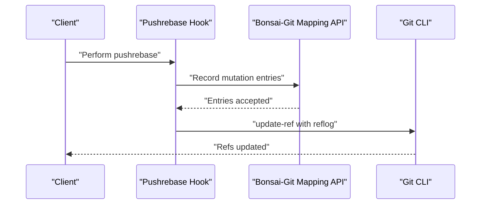
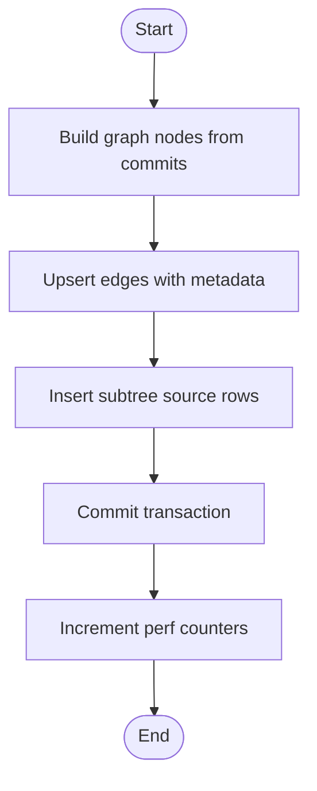
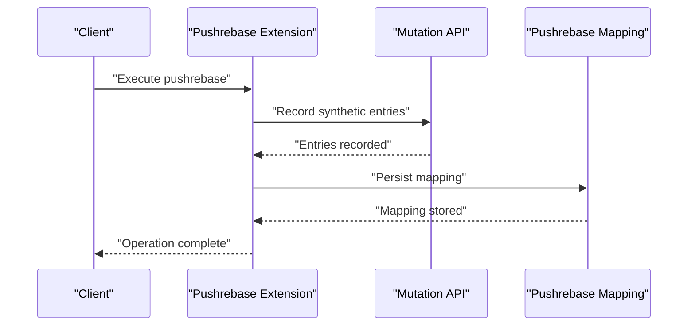
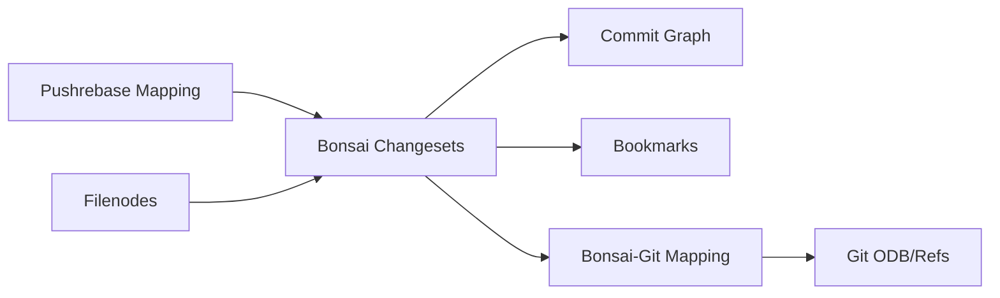

# Repository Attributes and Metadata

<cite>
**Referenced Files in This Document**
- [2.2-repository-facets.md](file://eden/mononoke/docs/2.2-repository-facets.md)
- [2.1-bonsai-data-model.md](file://eden/mononoke/docs/2.1-bonsai-data-model.md)
- [sqlite-bonsai-blob-mapping.sql](file://eden/mononoke/repo_attributes/bonsai_blob_mapping/schemas/sqlite-bonsai-blob-mapping.sql)
- [Cargo.toml](file://eden/mononoke/repo_attributes/bonsai_blob_mapping/Cargo.toml)
- [bookmarks.py](file://eden/scm/sapling/bookmarks.py)
- [git.rs](file://eden/scm/lib/commits/git/src/git.rs)
- [on_disk_commits.rs](file://eden/scm/lib/commits/src/on_disk_commits.rs)
- [lib.rs](file://eden/mononoke/repo_attributes/commit_graph/sql_commit_graph_storage/src/lib.rs)
- [history.rs](file://eden/mononoke/repo_attributes/newfilenodes/src/history.rs)
- [stackpush.py](file://eden/scm/sapling/ext/pushrebase/stackpush.py)
- [__init__.py](file://eden/scm/sapling/ext/pushrebase/__init__.py)
- [test.rs](file://eden/mononoke/repo_attributes/pushrebase_mutation_mapping/src/test.rs)
- [constants.rs](file://eden/scm/lib/repo/src/constants.rs)
</cite>

## Table of Contents
1. [Introduction](#introduction)
2. [Project Structure](#project-structure)
3. [Core Components](#core-components)
4. [Architecture Overview](#architecture-overview)
5. [Detailed Component Analysis](#detailed-component-analysis)
6. [Dependency Analysis](#dependency-analysis)
7. [Performance Considerations](#performance-considerations)
8. [Troubleshooting Guide](#troubleshooting-guide)
9. [Conclusion](#conclusion)

## Introduction
This document explains the repository attributes and metadata management system in SAPLING SCM. It focuses on how repository attributes enable cross-repository synchronization, identity management, and metadata consistency. It covers Bonsai blob mappings, bookmark management, commit graph maintenance, and filenode tracking. It also documents the Git reference content mapping system, mutation tracking, phase management, and pushrebase mutation mapping. Examples of attribute queries, updates, and maintenance operations are included, along with storage mechanisms, indexing strategies, and performance optimization techniques.

## Project Structure
The repository attributes subsystem spans multiple facets:
- Bonsai blob mapping: persistent mapping between Bonsai changesets and blobstore keys.
- Git reference mapping: mapping between Bonsai and Git identifiers and pushrebase mutation mapping.
- Commit graph: metadata storage for commit topology and ancestry relationships.
- Filenodes: legacy and new filenode history tracking for file change provenance.
- Bookmarks: branch pointer management and persistence.
- Pushrebase mutation mapping: tracking commit rewrites during pushrebase operations.

**Section sources**
- [2.2-repository-facets.md:191-239](file://eden/mononoke/docs/2.2-repository-facets.md#L191-L239)

## Core Components
- Bonsai blob mapping: Stores immutable Bonsai changesets keyed by repository ID, changeset ID, and blob key. Indexes optimize lookups by blob key.
- Git reference mapping: Provides Thrift interfaces and pushrebase hooks to maintain Bonsai-Git identifier mappings and handle pushrebase mutations.
- Commit graph: Maintains edges and ancestry metadata for efficient DAG traversal and commit queries.
- Filenodes: Legacy and new filenode history tracking for file provenance across commits.
- Bookmarks: Persistent branch pointers with active bookmark support and atomic updates.
- Pushrebase mutation mapping: Records pre/post commit identities during pushrebase to support rewriting and visibility.

**Section sources**
- [sqlite-bonsai-blob-mapping.sql:8-15](file://eden/mononoke/repo_attributes/bonsai_blob_mapping/schemas/sqlite-bonsai-blob-mapping.sql#L8-L15)
- [Cargo.toml:10-27](file://eden/mononoke/repo_attributes/bonsai_blob_mapping/Cargo.toml#L10-L27)
- [2.2-repository-facets.md:191-239](file://eden/mononoke/docs/2.2-repository-facets.md#L191-L239)
- [2.1-bonsai-data-model.md:183-208](file://eden/mononoke/docs/2.1-bonsai-data-model.md#L183-L208)

## Architecture Overview
The repository attributes architecture separates immutable content from mutable references:
- Immutable content: Bonsai changesets stored in blobstore.
- Mutable references: Commit graph, bookmarks, and VCS mappings.
- Cross-VCS mapping: Bonsai-Git mapping enables Git-centric operations while preserving Bonsai semantics.

**Diagram sources**
- [2.1-bonsai-data-model.md:183-208](file://eden/mononoke/docs/2.1-bonsai-data-model.md#L183-L208)
- [git.rs:602-642](file://eden/scm/lib/commits/git/src/git.rs#L602-L642)

## Detailed Component Analysis

### Bonsai Blob Mapping
Purpose:
- Persist mapping from repository ID, Bonsai changeset ID, and blob key.
- Enable fast retrieval of blobstore keys for given changesets.

Schema highlights:
- Composite primary key: repository ID, changeset ID, blob key.
- Secondary index on repository ID and blob key for efficient lookups.

Rust crate dependencies:
- SQL construction and execution utilities.
- Mononoke types and context for repository identity.

Example operations:
- Insert mapping for a changeset and blob key.
- Query blob key by repository and changeset.
- Maintain index coverage for hot lookup patterns.

**Section sources**
- [sqlite-bonsai-blob-mapping.sql:8-15](file://eden/mononoke/repo_attributes/bonsai_blob_mapping/schemas/sqlite-bonsai-blob-mapping.sql#L8-L15)
- [Cargo.toml:10-27](file://eden/mononoke/repo_attributes/bonsai_blob_mapping/Cargo.toml#L10-L27)

### Git Reference Content Mapping
Purpose:
- Maintain Bonsai-Git identifier mappings.
- Support pushrebase mutation mapping via hooks and Thrift interfaces.

Key elements:
- Thrift interface for mapping entries.
- Pushrebase hook to record and propagate mutations.
- Git CLI integration to update refs and logs.

Sequence: Git reference update and pushrebase mutation recording

**Diagram sources**
- [git.rs:602-642](file://eden/scm/lib/commits/git/src/git.rs#L602-L642)
- [__init__.py:459-495](file://eden/scm/sapling/ext/pushrebase/__init__.py#L459-L495)

**Section sources**
- [git.rs:602-642](file://eden/scm/lib/commits/git/src/git.rs#L602-L642)
- [__init__.py:459-495](file://eden/scm/sapling/ext/pushrebase/__init__.py#L459-L495)

### Commit Graph Maintenance
Purpose:
- Store and update commit graph edges for efficient ancestry queries.
- Maintain metadata such as parent, merge ancestor, linear skew ancestor, subtree sources.

Processing logic:
- Convert incoming commits to graph nodes.
- Insert/update edges with conflict resolution.
- Commit transaction and increment performance counters.

Flowchart: Adding and updating commit graph edges

**Diagram sources**
- [lib.rs:546-566](file://eden/mononoke/repo_attributes/commit_graph/sql_commit_graph_storage/src/lib.rs#L546-L566)
- [lib.rs:1838-1871](file://eden/mononoke/repo_attributes/commit_graph/sql_commit_graph_storage/src/lib.rs#L1838-L1871)

**Section sources**
- [on_disk_commits.rs:119-154](file://eden/scm/lib/commits/src/on_disk_commits.rs#L119-L154)
- [lib.rs:546-566](file://eden/mononoke/repo_attributes/commit_graph/sql_commit_graph_storage/src/lib.rs#L546-L566)

### Filenode Tracking
Purpose:
- Track file history provenance across commits using filenodes.
- Support legacy and new filenode implementations.

Implementation notes:
- Legacy filenode history cached representation.
- Conversion utilities between cached and live filenode info.

**Section sources**
- [history.rs:1-28](file://eden/mononoke/repo_attributes/newfilenodes/src/history.rs#L1-L28)

### Bookmark Management
Purpose:
- Persist branch pointers and active bookmark state.
- Provide atomic updates and conflict resolution.

Operations:
- Add, rename, delete bookmarks.
- Apply changes within transactions.
- Encode/decode binary bookmark streams.

**Section sources**
- [bookmarks.py:64-178](file://eden/scm/sapling/bookmarks.py#L64-L178)
- [bookmarks.py:562-581](file://eden/scm/sapling/bookmarks.py#L562-L581)
- [bookmarks.py:839-874](file://eden/scm/sapling/bookmarks.py#L839-L874)

### Pushrebase Mutation Mapping
Purpose:
- Record commit rewrites during pushrebase.
- Enable visibility and predecessor tracking after rebase.

Mechanisms:
- Track replacement mapping for outgoing commits.
- Record synthetic mutation entries for rewritten commits.
- Query pre-pushrebase IDs for a given commit.

Sequence: Recording pushrebase mutations

**Diagram sources**
- [stackpush.py:193-233](file://eden/scm/sapling/ext/pushrebase/stackpush.py#L193-L233)
- [__init__.py:459-495](file://eden/scm/sapling/ext/pushrebase/__init__.py#L459-L495)
- [test.rs:40-67](file://eden/mononoke/repo_attributes/pushrebase_mutation_mapping/src/test.rs#L40-L67)

**Section sources**
- [stackpush.py:193-233](file://eden/scm/sapling/ext/pushrebase/stackpush.py#L193-L233)
- [__init__.py:459-495](file://eden/scm/sapling/ext/pushrebase/__init__.py#L459-L495)
- [test.rs:40-67](file://eden/mononoke/repo_attributes/pushrebase_mutation_mapping/src/test.rs#L40-L67)

## Dependency Analysis
Repository attributes rely on:
- SQL-backed storage for mutable metadata (commit graph, blob mapping, pushrebase mapping).
- Thrift interfaces for cross-service mapping and client communication.
- Git CLI integration for reference updates and reflogs.
- Bonsai data model for immutable changeset semantics.

**Diagram sources**
- [2.1-bonsai-data-model.md:183-208](file://eden/mononoke/docs/2.1-bonsai-data-model.md#L183-L208)
- [git.rs:602-642](file://eden/scm/lib/commits/git/src/git.rs#L602-L642)

**Section sources**
- [2.1-bonsai-data-model.md:183-208](file://eden/mononoke/docs/2.1-bonsai-data-model.md#L183-L208)
- [Cargo.toml:10-27](file://eden/mononoke/repo_attributes/bonsai_blob_mapping/Cargo.toml#L10-L27)

## Performance Considerations
- Use composite primary keys and secondary indexes to minimize lookup latency for blob mapping and pushrebase queries.
- Batch edge updates and subtree source inserts to reduce transaction overhead.
- Increment performance counters after successful writes to track throughput.
- Maintain separate immutable content (blobstore) from mutable references to avoid contention and enable caching.

[No sources needed since this section provides general guidance]

## Troubleshooting Guide
Common issues and resolutions:
- Blob mapping inconsistencies: Verify composite key uniqueness and secondary index coverage for blob key lookups.
- Commit graph edge conflicts: Ensure upsert logic handles duplicates and updates metadata fields correctly.
- Pushrebase mapping gaps: Confirm synthetic mutation entries are recorded and persisted before Git ref updates.
- Bookmark corruption: Validate binary encoding/decoding and transactional writes for atomic updates.

**Section sources**
- [sqlite-bonsai-blob-mapping.sql:8-15](file://eden/mononoke/repo_attributes/bonsai_blob_mapping/schemas/sqlite-bonsai-blob-mapping.sql#L8-L15)
- [lib.rs:546-566](file://eden/mononoke/repo_attributes/commit_graph/sql_commit_graph_storage/src/lib.rs#L546-L566)
- [test.rs:40-67](file://eden/mononoke/repo_attributes/pushrebase_mutation_mapping/src/test.rs#L40-L67)
- [bookmarks.py:64-178](file://eden/scm/sapling/bookmarks.py#L64-L178)

## Conclusion
The repository attributes and metadata system in SAPLING SCM cleanly separates immutable content from mutable references, enabling robust cross-repository synchronization, identity management, and metadata consistency. Through Bonsai blob mapping, Git reference mapping, commit graph maintenance, filenode tracking, bookmarks, and pushrebase mutation mapping, the system supports efficient operations, reliable integrity, and scalable performance.