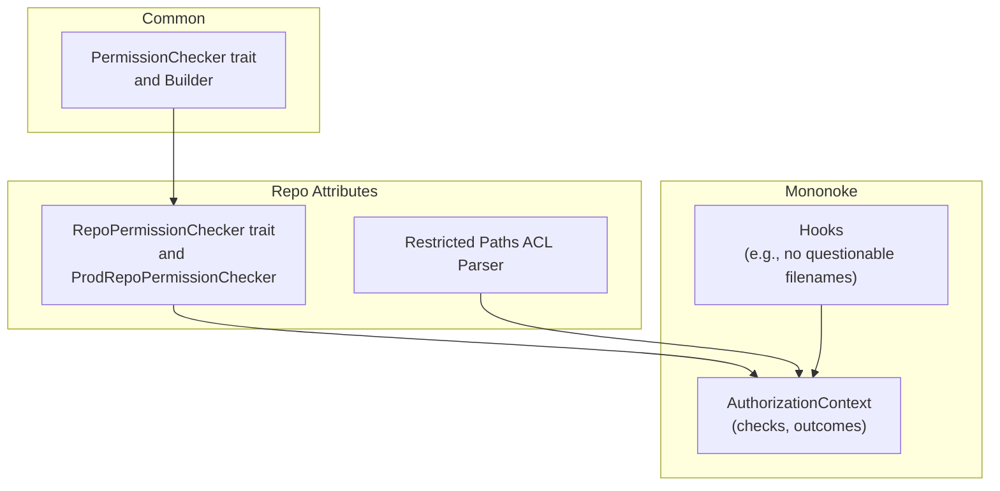
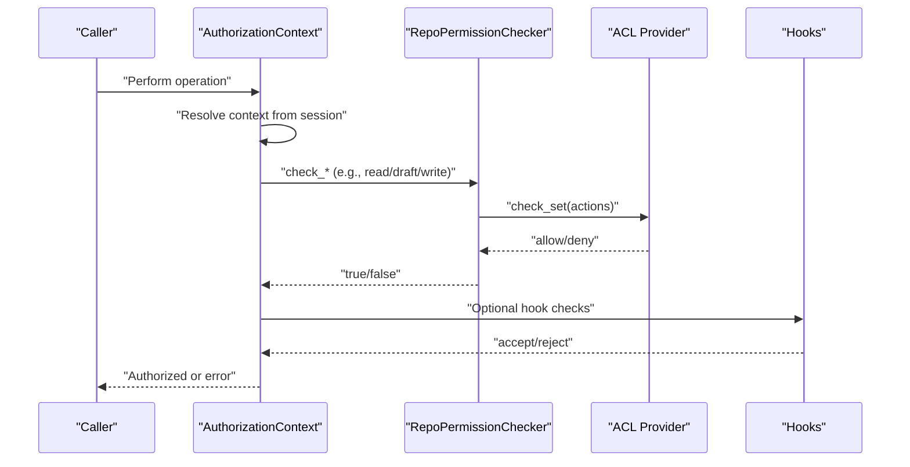
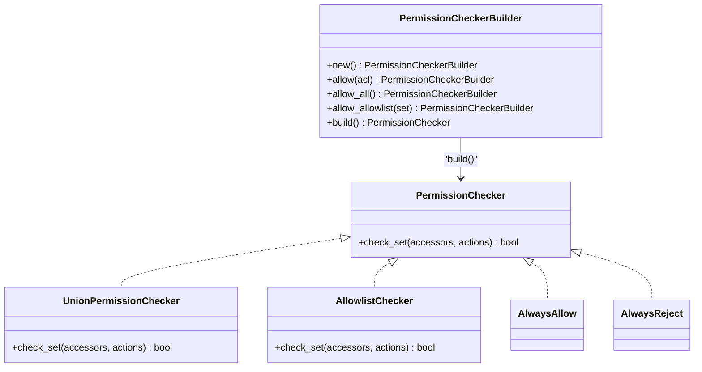
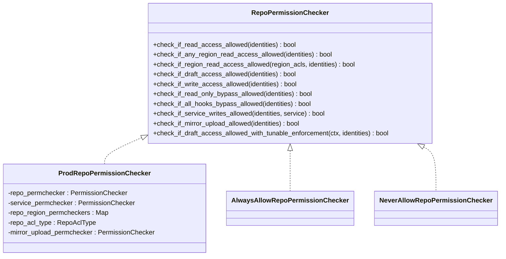
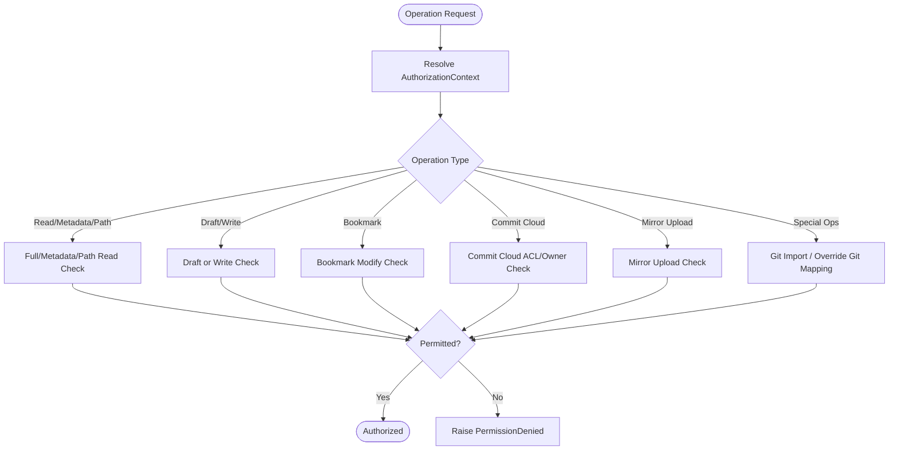
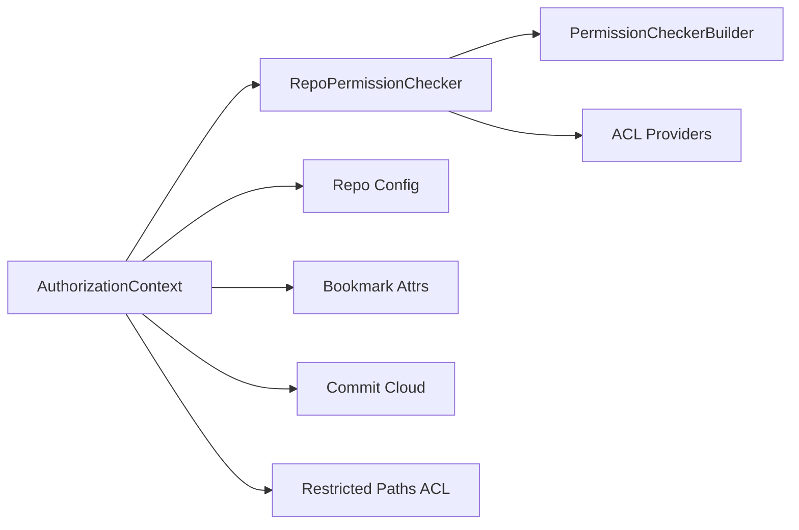

# Repository Authorization and Access Control

<cite>
**Referenced Files in This Document**
- [lib.rs](file://eden/mononoke/repo_attributes/repo_permission_checker/src/lib.rs)
- [context.rs](file://eden/mononoke/repo_authorization/src/context.rs)
- [checker.rs](file://eden/mononoke/common/permission_checker/src/checker.rs)
- [lib.rs](file://eden/mononoke/repo_attributes/restricted_paths_acl_file/src/lib.rs)
- [lib.rs](file://eden/mononoke/features/hooks/src/implementations/no_questionable_filenames.rs)
</cite>

## Table of Contents
1. [Introduction](#introduction)
2. [Project Structure](#project-structure)
3. [Core Components](#core-components)
4. [Architecture Overview](#architecture-overview)
5. [Detailed Component Analysis](#detailed-component-analysis)
6. [Dependency Analysis](#dependency-analysis)
7. [Performance Considerations](#performance-considerations)
8. [Troubleshooting Guide](#troubleshooting-guide)
9. [Conclusion](#conclusion)
10. [Appendices](#appendices)

## Introduction
This document explains the authorization and access control systems for SAPLING SCM repositories. It focuses on the permission model, role-based access control, repository-level security, authentication contexts, token/session handling, branch/bookmark protections, file path restrictions, sensitive operation controls, authorization caching, permission evaluation algorithms, and security audit trails. It also provides practical guidance for configuring access policies, managing user roles, and extending authorization logic, along with best practices, threat mitigations, and compliance considerations.

## Project Structure
The authorization system spans several crates:
- Permission evaluation engine: a generic permission checker interface and builder
- Repository permission checker: a concrete implementation backed by ACL providers and region ACLs
- Authorization context: a unified policy evaluator that interprets session metadata and translates operations into permission checks
- Restricted paths ACL file parser: parses .slacl files for path-level restrictions
- Hooks: enforcement of sensitive file naming rules during push operations

**Diagram sources**
- [checker.rs:1-118](file://eden/mononoke/common/permission_checker/src/checker.rs#L1-L118)
- [lib.rs:137-302](file://eden/mononoke/repo_attributes/repo_permission_checker/src/lib.rs#L137-L302)
- [context.rs:35-113](file://eden/mononoke/repo_authorization/src/context.rs#L35-L113)
- [lib.rs:19-42](file://eden/mononoke/repo_attributes/restricted_paths_acl_file/src/lib.rs#L19-L42)

**Section sources**
- [checker.rs:1-118](file://eden/mononoke/common/permission_checker/src/checker.rs#L1-L118)
- [lib.rs:137-302](file://eden/mononoke/repo_attributes/repo_permission_checker/src/lib.rs#L137-L302)
- [context.rs:35-113](file://eden/mononoke/repo_authorization/src/context.rs#L35-L113)
- [lib.rs:19-42](file://eden/mononoke/repo_attributes/restricted_paths_acl_file/src/lib.rs#L19-L42)

## Core Components
- PermissionChecker trait and builder: define a composable, parallel-checking permission engine with allowlists and union semantics.
- RepoPermissionChecker: evaluates repository-wide permissions (read, draft, write, bypass, service, mirror upload) using ACL providers and region ACLs.
- AuthorizationContext: maps session identity and trust level into a policy context and enforces checks for reads, writes, path access, bookmarks, commit cloud, and special operations.
- Restricted paths ACL parser: validates and parses TOML-based .slacl files for path-level access control.
- Hooks: enforce repository-level constraints (e.g., disallowing questionable filenames) during push operations.

**Section sources**
- [checker.rs:20-63](file://eden/mononoke/common/permission_checker/src/checker.rs#L20-L63)
- [lib.rs:23-114](file://eden/mononoke/repo_attributes/repo_permission_checker/src/lib.rs#L23-L114)
- [context.rs:140-391](file://eden/mononoke/repo_authorization/src/context.rs#L140-L391)
- [lib.rs:19-42](file://eden/mononoke/repo_attributes/restricted_paths_acl_file/src/lib.rs#L19-L42)

## Architecture Overview
The authorization pipeline:
- Session metadata determines the AuthorizationContext (full access, identity, read-only, draft-only, or service).
- Operations are mapped to checks (full repo read/write, metadata read, path read, bookmark modify, commit cloud, mirror upload, etc.).
- Permission evaluation uses RepoPermissionChecker and optional region ACLs, with tunable enforcement for draft access.
- Specialized checks (e.g., commit cloud workspace ownership, mirror uploads) are handled within AuthorizationContext.
- Hooks provide additional constraints for sensitive operations.

**Diagram sources**
- [context.rs:140-391](file://eden/mononoke/repo_authorization/src/context.rs#L140-L391)
- [lib.rs:227-302](file://eden/mononoke/repo_attributes/repo_permission_checker/src/lib.rs#L227-L302)
- [checker.rs:20-63](file://eden/mononoke/common/permission_checker/src/checker.rs#L20-L63)

## Detailed Component Analysis

### Permission Checker Engine
- Defines a PermissionChecker trait with asynchronous check_set(accessors, actions) returning a boolean.
- PermissionCheckerBuilder composes multiple checkers with union semantics and supports allowlists and “always allow”.
- Parallel evaluation short-circuits on first allow.

**Diagram sources**
- [checker.rs:20-118](file://eden/mononoke/common/permission_checker/src/checker.rs#L20-L118)

**Section sources**
- [checker.rs:20-118](file://eden/mononoke/common/permission_checker/src/checker.rs#L20-L118)

### Repository Permission Checker
- Provides repository-wide checks: read, any-region read, region read, draft, write, read-only bypass, all-hooks bypass, service writes, mirror upload.
- Supports ACL type detection (Git vs Sapling) and region ACLs via a map keyed by ACL names.
- Uses a tunable draft enforcement path that logs and optionally enforces draft ACLs independently of read.

**Diagram sources**
- [lib.rs:23-114](file://eden/mononoke/repo_attributes/repo_permission_checker/src/lib.rs#L23-L114)
- [lib.rs:137-302](file://eden/mononoke/repo_attributes/repo_permission_checker/src/lib.rs#L137-L302)
- [lib.rs:304-419](file://eden/mononoke/repo_attributes/repo_permission_checker/src/lib.rs#L304-L419)

**Section sources**
- [lib.rs:23-114](file://eden/mononoke/repo_attributes/repo_permission_checker/src/lib.rs#L23-L114)
- [lib.rs:137-302](file://eden/mononoke/repo_attributes/repo_permission_checker/src/lib.rs#L137-L302)
- [lib.rs:304-419](file://eden/mononoke/repo_attributes/repo_permission_checker/src/lib.rs#L304-L419)

### Authorization Context and Policy Evaluation
- AuthorizationContext resolves from session metadata: full access, identity, read-only identity, draft-only identity, or service.
- Checks include:
  - Full repo read and metadata read (with region ACL fallback)
  - Path read using region ACLs
  - Full repo draft and repo write (with draft vs public distinction)
  - Any path write and changeset path write (service-specific path restrictions)
  - Bookmark modify (user ownership or service permission)
  - Override Git mapping and Git import operations
  - Repo creation (ACL-driven)
  - Commit cloud workspace operations (ACLs and owner matching)
  - Mirror upload operations
- Outcomes are explicit and must not be ignored.

**Diagram sources**
- [context.rs:140-795](file://eden/mononoke/repo_authorization/src/context.rs#L140-L795)

**Section sources**
- [context.rs:35-113](file://eden/mononoke/repo_authorization/src/context.rs#L35-L113)
- [context.rs:140-795](file://eden/mononoke/repo_authorization/src/context.rs#L140-L795)

### Restricted Paths ACL Files
- Parses TOML-based .slacl files, validates version, and extracts repository region ACL and optional permission request group.
- Enables path-level access control aligned with repository region ACLs.

**Section sources**
- [lib.rs:19-42](file://eden/mononoke/repo_attributes/restricted_paths_acl_file/src/lib.rs#L19-L42)

### Hooks and Sensitive Operations
- Hooks enforce repository-level constraints (e.g., rejecting questionable filenames) during push operations.
- Service authors and redirected pushes may be exempted depending on hook configuration.

**Section sources**
- [no_questionable_filenames.rs:80-114](file://eden/mononoke/features/hooks/src/implementations/no_questionable_filenames.rs#L80-L114)

## Dependency Analysis
- PermissionCheckerBuilder composes multiple checkers and runs them in parallel; short-circuiting on first allow.
- RepoPermissionChecker depends on ACL providers for repo ACLs, service tier ACLs, mirror upload ACLs, and region ACLs.
- AuthorizationContext orchestrates checks and integrates with repo configuration, bookmark attributes, commit cloud, and restricted paths.

**Diagram sources**
- [context.rs:140-795](file://eden/mononoke/repo_authorization/src/context.rs#L140-L795)
- [lib.rs:137-302](file://eden/mononoke/repo_attributes/repo_permission_checker/src/lib.rs#L137-L302)
- [checker.rs:25-63](file://eden/mononoke/common/permission_checker/src/checker.rs#L25-L63)

**Section sources**
- [context.rs:140-795](file://eden/mononoke/repo_authorization/src/context.rs#L140-L795)
- [lib.rs:137-302](file://eden/mononoke/repo_attributes/repo_permission_checker/src/lib.rs#L137-L302)
- [checker.rs:25-63](file://eden/mononoke/common/permission_checker/src/checker.rs#L25-L63)

## Performance Considerations
- Parallel evaluation: UnionPermissionChecker runs multiple ACL checks concurrently and returns immediately upon first allow, reducing latency for composite ACLs.
- Tunable enforcement: Draft ACL enforcement can be logged without blocking, enabling gradual rollout and monitoring.
- Region ACL caching: RepoPermissionChecker caches region ACL checkers by ACL name to avoid repeated construction.

[No sources needed since this section provides general guidance]

## Troubleshooting Guide
- PermissionDenied errors: AuthorizationContext constructs detailed errors with context and identities; inspect DeniedAction and context to diagnose failures.
- Draft enforcement: When draft ACL enforcement is enabled, failures are logged; verify configuration knobs and adjust enforcement as needed.
- Service permissions: Ensure service_name is present in service tier ACL and that the service is permitted to perform the specific method.
- Path restrictions: Verify region ACLs and .slacl files align with intended paths and that identities are included in allowlists.
- Commit cloud access: Confirm workspace ACL exists and that owners match authenticated identities; allow-list ACLs can grant access when owner inference fails.

**Section sources**
- [context.rs:114-139](file://eden/mononoke/repo_authorization/src/context.rs#L114-L139)
- [lib.rs:80-111](file://eden/mononoke/repo_attributes/repo_permission_checker/src/lib.rs#L80-L111)
- [context.rs:620-762](file://eden/mononoke/repo_authorization/src/context.rs#L620-L762)

## Conclusion
SAPLING SCM’s authorization system combines a flexible permission checker engine, repository-level ACLs, region-based path controls, and contextual policy evaluation. It supports robust role-based access control, tunable enforcement, and specialized checks for sensitive operations. By leveraging ACL providers, region ACLs, and hooks, administrators can configure fine-grained access policies, monitor enforcement, and maintain strong security posture.

[No sources needed since this section summarizes without analyzing specific files]

## Appendices

### Permission Model and Roles
- Roles and actions:
  - read: general repository read access
  - draft: draft changes and scratch bookmarks
  - write: public changes and bookmarks
  - bypass_readonly: override repository read-only state
  - write_no_hooks: bypass hooks (Git repos only)
  - mirror_upload: mirror commit upload
  - service names: acting as a service with scoped write privileges
- Identity sets: composed from session metadata and allowlists.

**Section sources**
- [lib.rs:23-114](file://eden/mononoke/repo_attributes/repo_permission_checker/src/lib.rs#L23-L114)
- [checker.rs:20-63](file://eden/mononoke/common/permission_checker/src/checker.rs#L20-L63)

### Authentication and Session Handling
- AuthorizationContext derives from session metadata:
  - FullAccess: internal/test contexts
  - Identity: trusted, writable
  - ReadOnlyIdentity: read-only session
  - DraftOnlyIdentity: untrusted, writable for draft operations
  - Service(service_name): acting as a service with method-level permissions

**Section sources**
- [context.rs:35-113](file://eden/mononoke/repo_authorization/src/context.rs#L35-L113)

### Branch Protection and Bookmark Controls
- Bookmark modification requires either user ownership or service permission.
- Public vs draft operations differ: draft-only operations are constrained to scratch bookmarks and draft ACLs.

**Section sources**
- [context.rs:430-474](file://eden/mononoke/repo_authorization/src/context.rs#L430-L474)
- [context.rs:819-844](file://eden/mononoke/repo_authorization/src/context.rs#L819-L844)

### File Path Restrictions and Sensitive Operations
- Path read checks fall back to region ACLs associated with a changeset and path.
- Restricted paths ACL files (.slacl) define region ACLs and optional permission request groups.
- Hooks enforce repository-level constraints (e.g., disallowing questionable filenames) during push operations.

**Section sources**
- [context.rs:215-258](file://eden/mononoke/repo_authorization/src/context.rs#L215-L258)
- [lib.rs:19-42](file://eden/mononoke/repo_attributes/restricted_paths_acl_file/src/lib.rs#L19-L42)
- [no_questionable_filenames.rs:80-114](file://eden/mononoke/features/hooks/src/implementations/no_questionable_filenames.rs#L80-L114)

### Authorization Cache and Evaluation Algorithms
- Region ACL checkers are cached by ACL name in ProdRepoPermissionChecker.
- Permission evaluation uses UnionPermissionChecker with parallel checks and early exit on allow.
- Draft ACL enforcement can be toggled via configuration knobs and logs failures without blocking until enforced.

**Section sources**
- [lib.rs:197-224](file://eden/mononoke/repo_attributes/repo_permission_checker/src/lib.rs#L197-L224)
- [checker.rs:94-118](file://eden/mononoke/common/permission_checker/src/checker.rs#L94-L118)
- [lib.rs:80-111](file://eden/mononoke/repo_attributes/repo_permission_checker/src/lib.rs#L80-L111)

### Security Audit Trails
- Draft ACL enforcement logs decisions when logging or enforcing is enabled.
- Commit cloud operations log ACL check outcomes and reasons for denial.
- PermissionDenied errors capture context and identities for incident investigation.

**Section sources**
- [lib.rs:85-105](file://eden/mononoke/repo_attributes/repo_permission_checker/src/lib.rs#L85-L105)
- [context.rs:704-734](file://eden/mononoke/repo_authorization/src/context.rs#L704-L734)
- [context.rs:114-139](file://eden/mononoke/repo_authorization/src/context.rs#L114-L139)

### Best Practices and Compliance
- Principle of least privilege: restrict service permissions to specific methods and paths.
- Gradual enforcement: use tunable draft ACL enforcement to phase in stricter policies.
- Audit and monitoring: enable logging for denied operations and review logs regularly.
- Path-level controls: combine repo ACLs with .slacl and region ACLs for comprehensive coverage.
- Compliance: align ACLs and hooks with organizational policies; maintain allowlists and exemptions with documented approvals.

[No sources needed since this section provides general guidance]