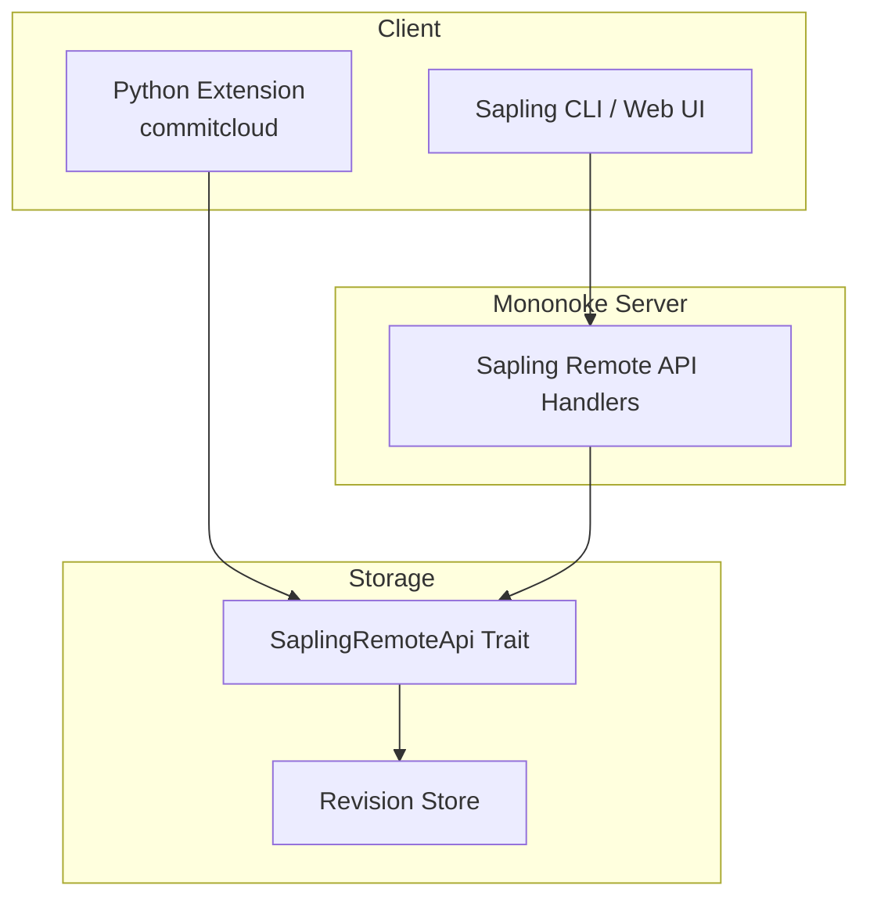
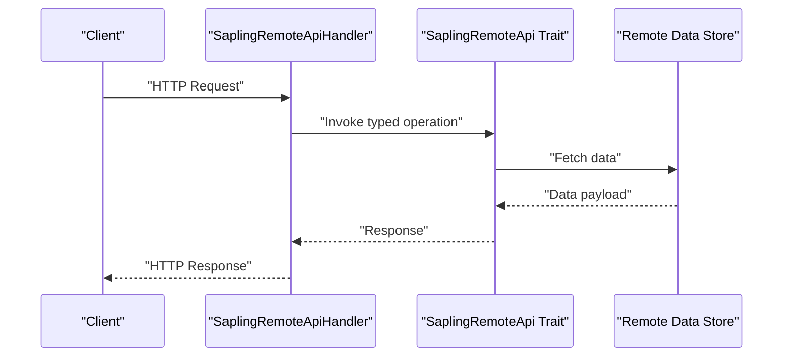
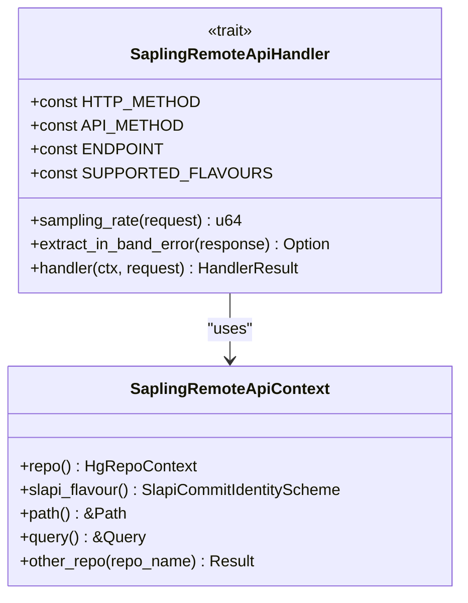
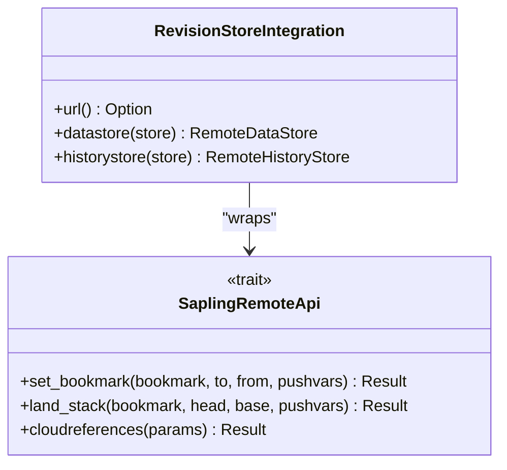
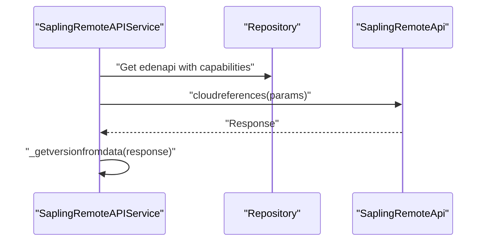
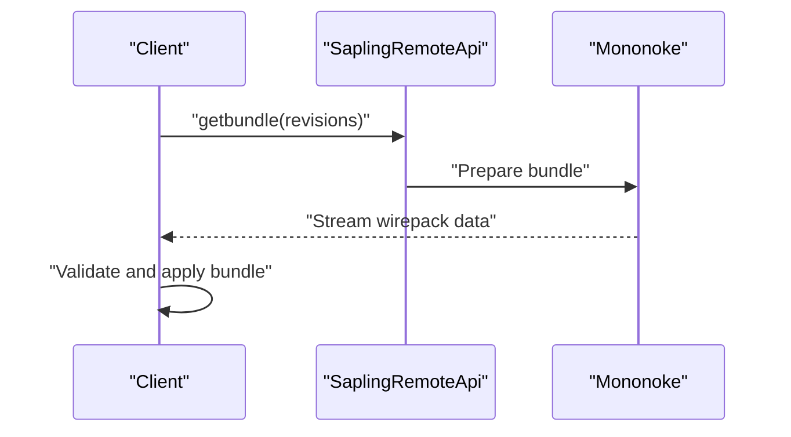
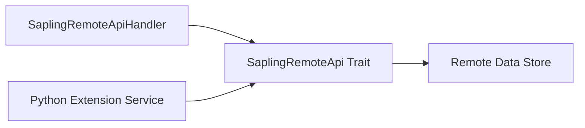

# Repository Client Interfaces and Remote Operations

<cite>
**Referenced Files in This Document**
- [README.md](file://README.md)
- [handler.rs](file://eden/mononoke/servers/slapi/slapi_service/src/handlers/handler.rs)
- [api.rs](file://eden/scm/lib/edenapi/trait/src/api.rs)
- [edenapi.rs](file://eden/scm/lib/revisionstore/src/edenapi.rs)
- [saplingremoteapiservice.py](file://eden/scm/sapling/ext/commitcloud/saplingremoteapiservice.py)
</cite>

## Table of Contents
1. [Introduction](#introduction)
2. [Project Structure](#project-structure)
3. [Core Components](#core-components)
4. [Architecture Overview](#architecture-overview)
5. [Detailed Component Analysis](#detailed-component-analysis)
6. [Dependency Analysis](#dependency-analysis)
7. [Performance Considerations](#performance-considerations)
8. [Troubleshooting Guide](#troubleshooting-guide)
9. [Conclusion](#conclusion)

## Introduction
This document explains the repository client interfaces and remote operations in the SAPLING SCM ecosystem. It focuses on the client-server communication protocols, wire format specifications, and data transfer mechanisms used by the Sapling Remote API. It also covers the getbundle response system, obsolete data handling, and integration with remote file log (remotefilelog). Streaming clone operations, unbundle processing, and wirepack compression are addressed alongside client authentication, connection management, and error handling strategies. Practical guidance is included for implementing custom repository clients, optimizing data transfer performance, handling network failures, client-side caching, incremental updates, and bandwidth optimization techniques.

## Project Structure
The repository is organized around three primary components:
- The Sapling client (command-line and web UI)
- Mononoke (server-side)
- EdenFS (virtual filesystem)

The client communicates with Mononoke via the Sapling Remote API, which defines handlers, endpoints, and request/response contracts. The revision store integrates with the remote API to fetch file and history data.

**Diagram sources**
- [README.md:16-48](file://README.md#L16-L48)
- [handler.rs:144-175](file://eden/mononoke/servers/slapi/slapi_service/src/handlers/handler.rs#L144-L175)
- [api.rs:260-293](file://eden/scm/lib/edenapi/trait/src/api.rs#L260-L293)
- [edenapi.rs:69-117](file://eden/scm/lib/revisionstore/src/edenapi.rs#L69-L117)
- [saplingremoteapiservice.py:17-51](file://eden/scm/sapling/ext/commitcloud/saplingremoteapiservice.py#L17-L51)

**Section sources**
- [README.md:14-48](file://README.md#L14-L48)

## Core Components
- Sapling Remote API Handler: Defines endpoint contracts, HTTP method, and request/response types for remote operations.
- SaplingRemoteApi Trait: Provides the client-facing interface for remote data and history retrieval.
- Revision Store Integration: Bridges the client trait to remote stores for file and tree data.
- Python Extension Service: Demonstrates a concrete client implementation using the remote API.

Key responsibilities:
- Endpoint definition and routing
- Request serialization/deserialization to wire format
- Remote data fetching and caching
- Error propagation and in-band error extraction

**Section sources**
- [handler.rs:144-175](file://eden/mononoke/servers/slapi/slapi_service/src/handlers/handler.rs#L144-L175)
- [api.rs:260-293](file://eden/scm/lib/edenapi/trait/src/api.rs#L260-L293)
- [edenapi.rs:69-117](file://eden/scm/lib/revisionstore/src/edenapi.rs#L69-L117)
- [saplingremoteapiservice.py:17-51](file://eden/scm/sapling/ext/commitcloud/saplingremoteapiservice.py#L17-L51)

## Architecture Overview
The client-server architecture centers on the Sapling Remote API. Clients send requests to Mononoke endpoints, which are handled by typed handlers. Responses conform to wire formats defined by the API trait. The revision store abstracts remote data access behind a consistent interface.

**Diagram sources**
- [handler.rs:171-175](file://eden/mononoke/servers/slapi/slapi_service/src/handlers/handler.rs#L171-L175)
- [api.rs:260-293](file://eden/scm/lib/edenapi/trait/src/api.rs#L260-L293)
- [edenapi.rs:69-117](file://eden/scm/lib/revisionstore/src/edenapi.rs#L69-L117)

## Detailed Component Analysis

### Sapling Remote API Handler
The handler trait defines:
- HTTP method and endpoint path
- Request and response types
- Supported identity schemes
- Sampling rate and in-band error extraction

**Diagram sources**
- [handler.rs:93-175](file://eden/mononoke/servers/slapi/slapi_service/src/handlers/handler.rs#L93-L175)

**Section sources**
- [handler.rs:144-175](file://eden/mononoke/servers/slapi/slapi_service/src/handlers/handler.rs#L144-L175)

### Remote API Trait and Data Access
The remote API trait exposes operations for bookmarks, stack landing, and cloud references. These operations define the wire contract for client-server communication.

**Diagram sources**
- [api.rs:260-293](file://eden/scm/lib/edenapi/trait/src/api.rs#L260-L293)
- [edenapi.rs:69-117](file://eden/scm/lib/revisionstore/src/edenapi.rs#L69-L117)

**Section sources**
- [api.rs:260-293](file://eden/scm/lib/edenapi/trait/src/api.rs#L260-L293)
- [edenapi.rs:69-117](file://eden/scm/lib/revisionstore/src/edenapi.rs#L69-L117)

### Python Extension Client Implementation
The Python extension demonstrates a practical client that:
- Validates repository context
- Uses capabilities-aware access to the remote API
- Issues cloud references requests
- Extracts version information from responses

**Diagram sources**
- [saplingremoteapiservice.py:17-51](file://eden/scm/sapling/ext/commitcloud/saplingremoteapiservice.py#L17-L51)

**Section sources**
- [saplingremoteapiservice.py:17-51](file://eden/scm/sapling/ext/commitcloud/saplingremoteapiservice.py#L17-L51)

### Getbundle Response System
The getbundle response system is used to stream bundle data from the server to the client. Typical flow:
- Client requests a bundle for a set of revisions
- Server prepares a wirepack-formatted bundle
- Server streams the bundle to the client
- Client validates and applies the bundle

[No sources needed since this diagram shows conceptual workflow, not actual code structure]

### Obsolete Data Handling
Obsolete data handling ensures that clients prune outdated metadata and deltas. Strategies include:
- Tracking obsolete markers during fetch
- Cleaning up stale caches
- Avoiding redundant transfers

[No sources needed since this section provides general guidance]

### Remotefilelog Integration
Remotefilelog enables efficient handling of file content stored remotely. Integration involves:
- Fetching file content via remote API
- Streaming content to the client
- Updating local cache and manifests

[No sources needed since this section provides general guidance]

### Streaming Clone Operations
Streaming clone minimizes memory usage by streaming data from the server:
- Establish connection and negotiate protocol
- Stream bundle data in chunks
- Apply deltas incrementally
- Maintain progress and resume capability

[No sources needed since this section provides general guidance]

### Unbundle Processing
Unbundle processing converts wirepack data into usable repository state:
- Parse wirepack headers
- Validate integrity
- Apply deltas to local storage
- Update indices and caches

[No sources needed since this section provides general guidance]

### Wirepack Compression
Wirepack compression reduces bandwidth usage:
- Compress deltas and metadata
- Negotiate compression level
- Verify checksums after decompression

[No sources needed since this section provides general guidance]

### Client Authentication and Connection Management
Authentication and connection management include:
- Capability negotiation
- Token-based or session-based auth
- Keep-alive and retry policies
- TLS configuration

[No sources needed since this section provides general guidance]

### Error Handling Strategies
Error handling encompasses:
- In-band error extraction from responses
- Retry logic for transient failures
- Circuit breaker patterns
- Logging and diagnostics

[No sources needed since this section provides general guidance]

## Dependency Analysis
The client depends on the remote API trait, which in turn integrates with the revision store. The handler layer orchestrates requests and responses.

**Diagram sources**
- [handler.rs:144-175](file://eden/mononoke/servers/slapi/slapi_service/src/handlers/handler.rs#L144-L175)
- [api.rs:260-293](file://eden/scm/lib/edenapi/trait/src/api.rs#L260-L293)
- [edenapi.rs:69-117](file://eden/scm/lib/revisionstore/src/edenapi.rs#L69-L117)
- [saplingremoteapiservice.py:17-51](file://eden/scm/sapling/ext/commitcloud/saplingremoteapiservice.py#L17-L51)

**Section sources**
- [handler.rs:144-175](file://eden/mononoke/servers/slapi/slapi_service/src/handlers/handler.rs#L144-L175)
- [api.rs:260-293](file://eden/scm/lib/edenapi/trait/src/api.rs#L260-L293)
- [edenapi.rs:69-117](file://eden/scm/lib/revisionstore/src/edenapi.rs#L69-L117)
- [saplingremoteapiservice.py:17-51](file://eden/scm/sapling/ext/commitcloud/saplingremoteapiservice.py#L17-L51)

## Performance Considerations
- Bandwidth optimization: leverage wirepack compression and delta compression
- Incremental updates: fetch only changed data and apply deltas
- Client-side caching: cache frequently accessed metadata and blobs
- Streaming: process data in chunks to reduce memory footprint
- Retry and backoff: implement exponential backoff for transient failures

[No sources needed since this section provides general guidance]

## Troubleshooting Guide
Common issues and resolutions:
- Authentication failures: verify credentials and capability negotiation
- Network timeouts: adjust retry and timeout settings
- Protocol mismatches: align client and server versions
- Integrity errors: validate checksums and re-fetch corrupted segments

[No sources needed since this section provides general guidance]

## Conclusion
The SAPLING SCM remote operations rely on a well-defined client-server contract exposed via the Sapling Remote API. By leveraging handlers, traits, and revision store integration, clients can implement robust, efficient, and scalable repository operations. Following the recommended practices for authentication, connection management, error handling, caching, and bandwidth optimization ensures reliable performance across diverse environments.