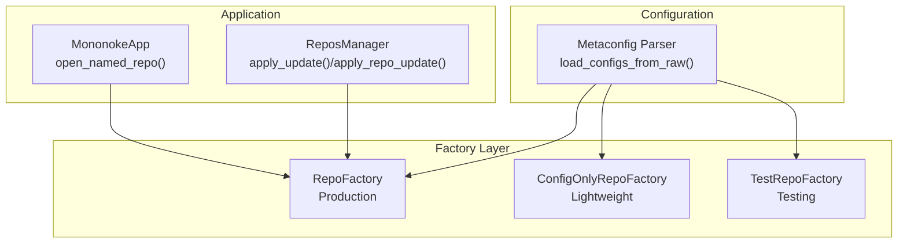
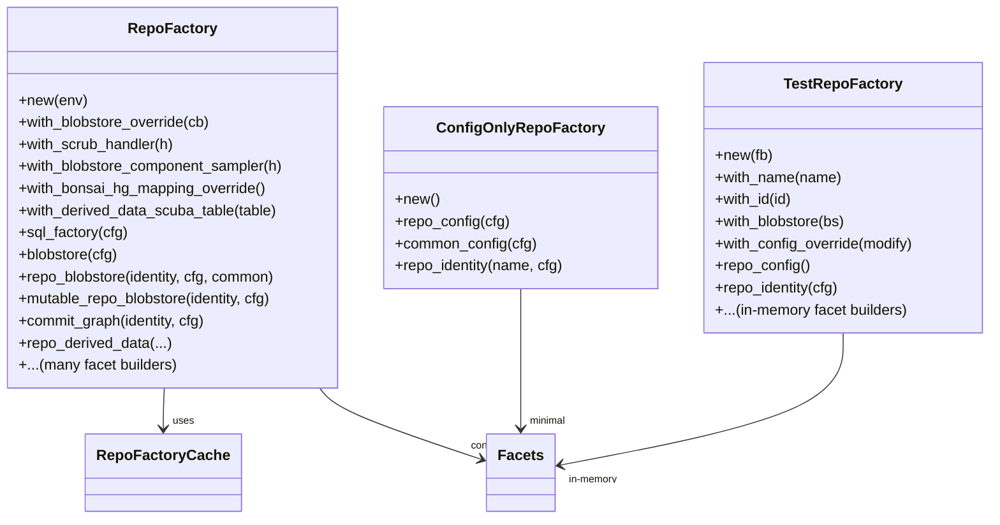
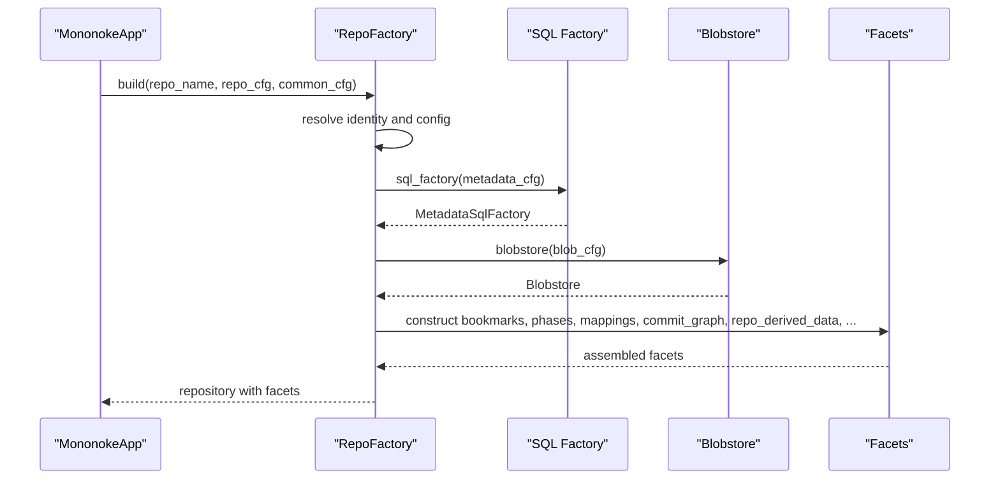
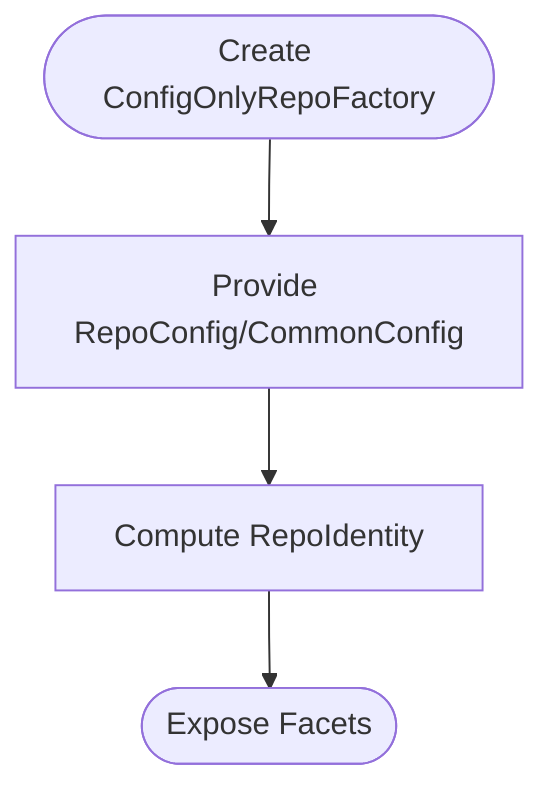
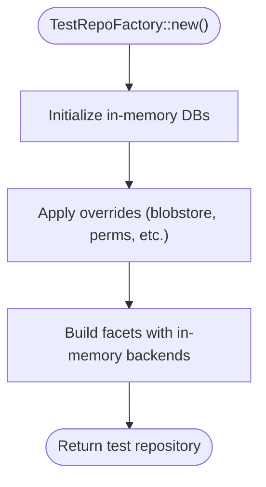
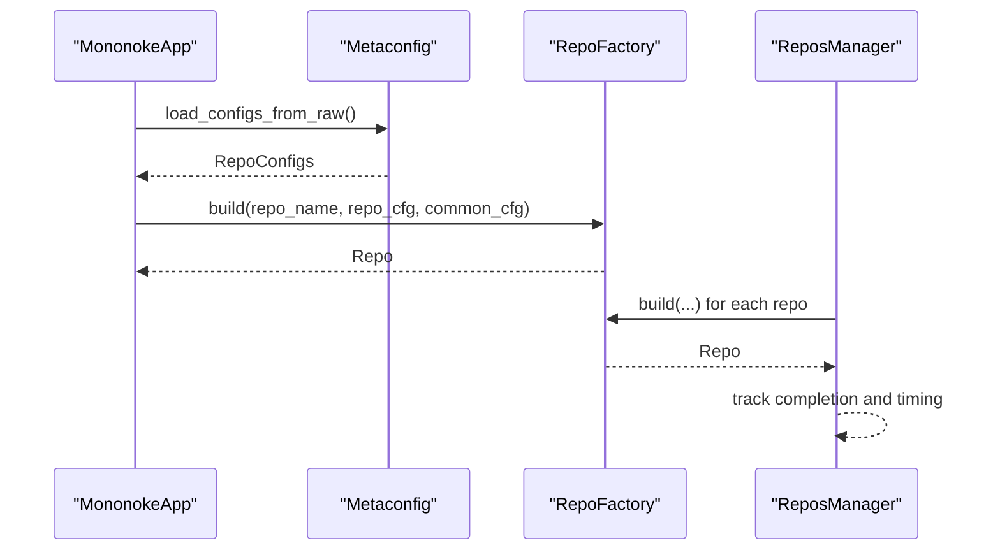
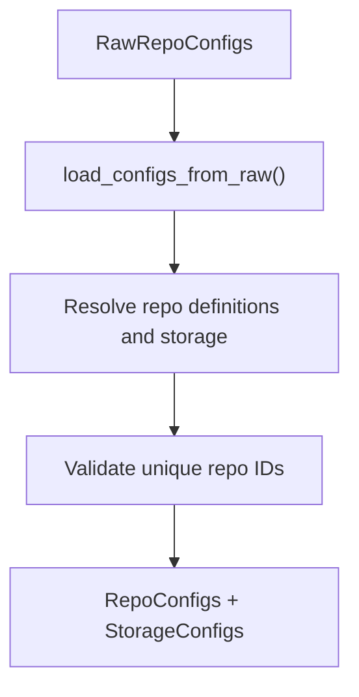
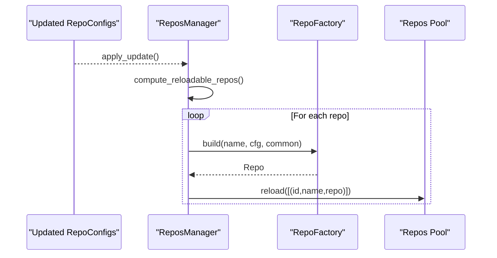
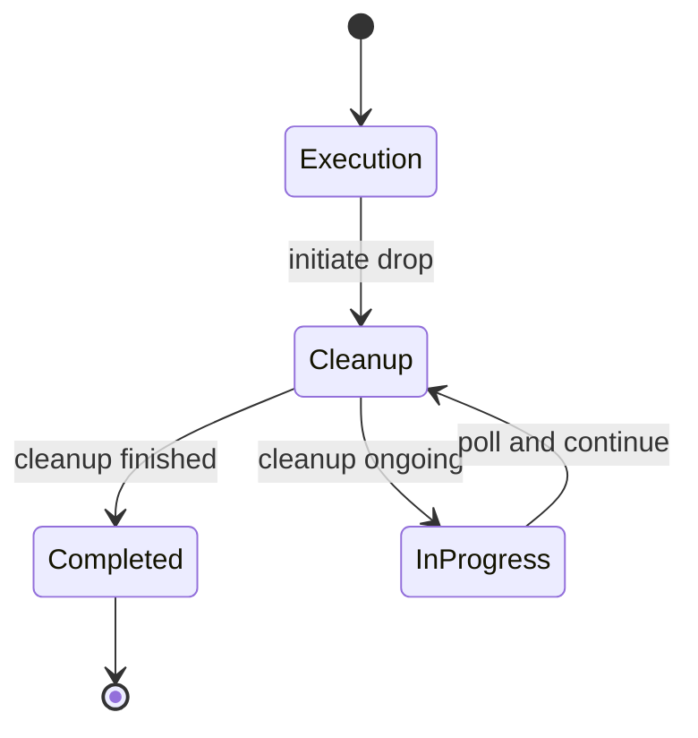
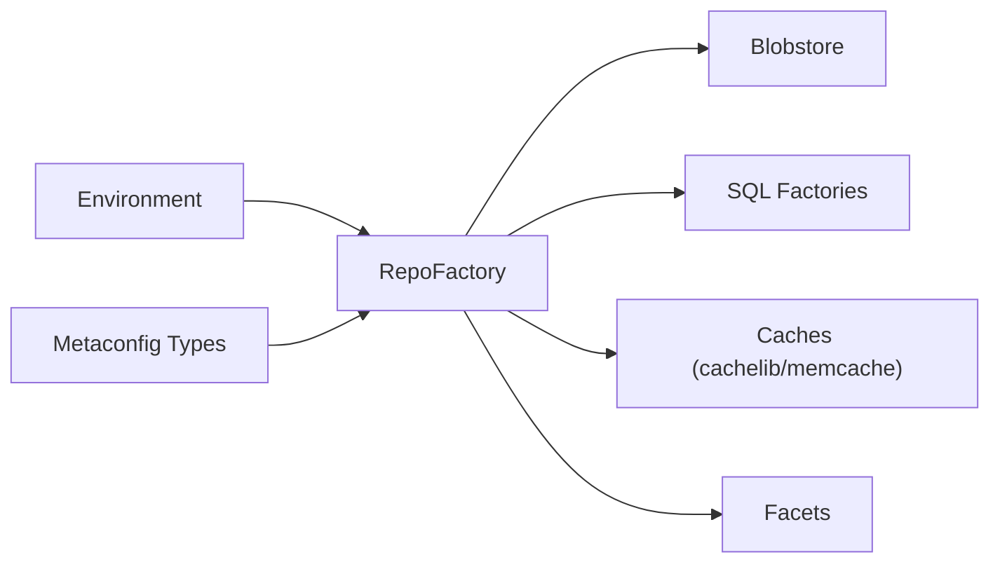

# Repository Factory and Lifecycle Management

<cite>
**Referenced Files in This Document**
- [lib.rs](file://eden/mononoke/repo_factory/src/lib.rs)
- [lib.rs](file://eden/mononoke/repo_factory/test_repo_factory/src/lib.rs)
- [lib.rs](file://eden/mononoke/repo_factory/config_only_repo_factory/src/lib.rs)
- [app.rs](file://eden/mononoke/cmdlib/mononoke_app/src/app.rs)
- [repos_manager.rs](file://eden/mononoke/cmdlib/mononoke_app/src/repos_manager.rs)
- [config.rs](file://eden/mononoke/metaconfig/parser/src/config.rs)
- [2.2-repository-facets.md](file://eden/mononoke/docs/2.2-repository-facets.md)
- [facebook.rs](file://eden/mononoke/cmdlib/sharding/src/facebook.rs)
</cite>

## Table of Contents
1. [Introduction](#introduction)
2. [Project Structure](#project-structure)
3. [Core Components](#core-components)
4. [Architecture Overview](#architecture-overview)
5. [Detailed Component Analysis](#detailed-component-analysis)
6. [Dependency Analysis](#dependency-analysis)
7. [Performance Considerations](#performance-considerations)
8. [Troubleshooting Guide](#troubleshooting-guide)
9. [Conclusion](#conclusion)
10. [Appendices](#appendices)

## Introduction
This document explains the SAPLING SCM repository factory system and lifecycle management. It focuses on how repositories are instantiated, configured, initialized, and managed over time. It covers:
- The primary repository factory and its caching and dependency injection mechanisms
- Lightweight configuration-only factory for short-lived binaries
- Test repository factory for development and testing
- Startup and reload sequences, including configuration updates and hot-swapping
- Shutdown and cleanup procedures with graceful degradation
- Examples for extending the factory, pooling, and maintenance mode operations

## Project Structure
The repository factory system is centered around three main components:
- Primary factory: constructs production repositories with full facets and caches
- Config-only factory: lightweight factory for configuration-only use cases
- Test factory: constructs test repositories with in-memory backends

**Diagram sources**
- [lib.rs:337-351](file://eden/mononoke/repo_factory/src/lib.rs#L337-L351)
- [lib.rs:26-48](file://eden/mononoke/repo_factory/config_only_repo_factory/src/lib.rs#L26-L48)
- [lib.rs:170-187](file://eden/mononoke/repo_factory/test_repo_factory/src/lib.rs#L170-L187)
- [config.rs:127-172](file://eden/mononoke/metaconfig/parser/src/config.rs#L127-L172)
- [app.rs:494-517](file://eden/mononoke/cmdlib/mononoke_app/src/app.rs#L494-L517)
- [repos_manager.rs:349-439](file://eden/mononoke/cmdlib/mononoke_app/src/repos_manager.rs#L349-L439)

**Section sources**
- [lib.rs:337-351](file://eden/mononoke/repo_factory/src/lib.rs#L337-L351)
- [lib.rs:26-48](file://eden/mononoke/repo_factory/config_only_repo_factory/src/lib.rs#L26-L48)
- [lib.rs:170-187](file://eden/mononoke/repo_factory/test_repo_factory/src/lib.rs#L170-L187)
- [config.rs:127-172](file://eden/mononoke/metaconfig/parser/src/config.rs#L127-L172)

## Core Components
- RepoFactory: central factory for production repositories, orchestrating storage backends, caching, and facet construction. It maintains caches for SQL factories, blobstores, redacted blobs, and event publishers.
- ConfigOnlyRepoFactory: minimal factory that exposes only configuration and identity facets for lightweight binaries.
- TestRepoFactory: specialized factory for tests using in-memory backends and simplified behavior.

Key responsibilities:
- Configuration loading and resolution
- Resource allocation for blobstores, SQL databases, and caches
- Facet construction and assembly
- Initialization and reloading under application control

**Section sources**
- [lib.rs:337-351](file://eden/mononoke/repo_factory/src/lib.rs#L337-L351)
- [lib.rs:268-333](file://eden/mononoke/repo_factory/src/lib.rs#L268-L333)
- [lib.rs:26-48](file://eden/mononoke/repo_factory/config_only_repo_factory/src/lib.rs#L26-L48)
- [lib.rs:170-187](file://eden/mononoke/repo_factory/test_repo_factory/src/lib.rs#L170-L187)

## Architecture Overview
The factory system composes repository facets from configuration and environment. Facets are trait-based components that provide specific capabilities. The factory constructs each facet with its dependencies and assembles them into a repository object.

**Diagram sources**
- [lib.rs:337-351](file://eden/mononoke/repo_factory/src/lib.rs#L337-L351)
- [lib.rs:268-333](file://eden/mononoke/repo_factory/src/lib.rs#L268-L333)
- [lib.rs:26-48](file://eden/mononoke/repo_factory/config_only_repo_factory/src/lib.rs#L26-L48)
- [lib.rs:170-187](file://eden/mononoke/repo_factory/test_repo_factory/src/lib.rs#L170-L187)

**Section sources**
- [2.2-repository-facets.md:254-266](file://eden/mononoke/docs/2.2-repository-facets.md#L254-L266)
- [lib.rs:337-351](file://eden/mononoke/repo_factory/src/lib.rs#L337-L351)

## Detailed Component Analysis

### Production Repository Factory (RepoFactory)
- Caching: Uses a generic cache keyed by configuration to avoid repeated initialization of expensive resources (SQL factories, blobstores, redacted blobs, event publishers).
- Dependency injection: Exposes methods to override blobstore behavior, scrub handler, and sampling handlers. Supports toggles for specific mappings and derived data telemetry.
- Facet construction: Provides builders for all major facets (bookmarks, phases, mappings, commit graph, derived data, permissions, locks, hooks, etc.), wiring dependencies and optional caching.

**Diagram sources**
- [app.rs:494-517](file://eden/mononoke/cmdlib/mononoke_app/src/app.rs#L494-L517)
- [lib.rs:402-450](file://eden/mononoke/repo_factory/src/lib.rs#L402-L450)
- [lib.rs:533-568](file://eden/mononoke/repo_factory/src/lib.rs#L533-L568)

**Section sources**
- [lib.rs:268-333](file://eden/mononoke/repo_factory/src/lib.rs#L268-L333)
- [lib.rs:337-351](file://eden/mononoke/repo_factory/src/lib.rs#L337-L351)
- [lib.rs:402-450](file://eden/mononoke/repo_factory/src/lib.rs#L402-L450)
- [lib.rs:533-568](file://eden/mononoke/repo_factory/src/lib.rs#L533-L568)

### Config-only Repository Factory (ConfigOnlyRepoFactory)
- Purpose: Lightweight factory for short-lived binaries that need configuration but not full repository initialization.
- Behavior: Exposes only repo_config, common_config, and repo_identity facets.

**Diagram sources**
- [lib.rs:26-48](file://eden/mononoke/repo_factory/config_only_repo_factory/src/lib.rs#L26-L48)

**Section sources**
- [lib.rs:26-48](file://eden/mononoke/repo_factory/config_only_repo_factory/src/lib.rs#L26-L48)

### Test Repository Factory (TestRepoFactory)
- Purpose: Construct test repositories with in-memory backends (memblob, SQLite) and simplified behavior.
- Capabilities: Allows overriding blobstores, permission checkers, restricted paths, live commit sync config, and filenodes. Provides builders for all facets backed by in-memory stores.

**Diagram sources**
- [lib.rs:264-337](file://eden/mononoke/repo_factory/test_repo_factory/src/lib.rs#L264-L337)
- [lib.rs:446-447](file://eden/mononoke/repo_factory/test_repo_factory/src/lib.rs#L446-L447)

**Section sources**
- [lib.rs:170-187](file://eden/mononoke/repo_factory/test_repo_factory/src/lib.rs#L170-L187)
- [lib.rs:264-337](file://eden/mononoke/repo_factory/test_repo_factory/src/lib.rs#L264-L337)
- [lib.rs:446-447](file://eden/mononoke/repo_factory/test_repo_factory/src/lib.rs#L446-L447)

### Repository Startup Sequences
- Application-level startup: The application opens a named repository by resolving repo configs and delegating to the factory’s build method.
- Manager-level startup: Repositories are initialized concurrently with progress tracking and timing metrics.

**Diagram sources**
- [config.rs:127-172](file://eden/mononoke/metaconfig/parser/src/config.rs#L127-L172)
- [app.rs:494-517](file://eden/mononoke/cmdlib/mononoke_app/src/app.rs#L494-L517)
- [repos_manager.rs:195-213](file://eden/mononoke/cmdlib/mononoke_app/src/repos_manager.rs#L195-L213)

**Section sources**
- [app.rs:494-517](file://eden/mononoke/cmdlib/mononoke_app/src/app.rs#L494-L517)
- [repos_manager.rs:189-213](file://eden/mononoke/cmdlib/mononoke_app/src/repos_manager.rs#L189-L213)

### Configuration Loading and Resolution
- The parser loads raw configurations and resolves them into structured RepoConfigs and StorageConfigs.
- It validates uniqueness of repository IDs and converts storage configs into runtime-friendly forms.

**Diagram sources**
- [config.rs:127-172](file://eden/mononoke/metaconfig/parser/src/config.rs#L127-L172)

**Section sources**
- [config.rs:127-172](file://eden/mononoke/metaconfig/parser/src/config.rs#L127-L172)

### Repository Reload and Hot-swapping
- The manager computes which repositories are reloadable and applies updates with retries and backoff.
- It replaces repositories in-place without removing others, ensuring continuity.

**Diagram sources**
- [repos_manager.rs:349-439](file://eden/mononoke/cmdlib/mononoke_app/src/repos_manager.rs#L349-L439)

**Section sources**
- [repos_manager.rs:349-439](file://eden/mononoke/cmdlib/mononoke_app/src/repos_manager.rs#L349-L439)

### Shutdown, Cleanup, and Graceful Degradation
- Sharded service cleanup uses a staged process to unload shards gracefully, transitioning from execution to cleanup and reporting progress.
- Cleanup returns either completion or in-progress status, enabling periodic polling until completion.

**Diagram sources**
- [facebook.rs:737-774](file://eden/mononoke/cmdlib/sharding/src/facebook.rs#L737-L774)

**Section sources**
- [facebook.rs:350-384](file://eden/mononoke/cmdlib/sharding/src/facebook.rs#L350-L384)
- [facebook.rs:658-774](file://eden/mononoke/cmdlib/sharding/src/facebook.rs#L658-L774)

### Examples and Extensibility
- Creating a custom repository factory:
  - Define a builder that implements the facet trait methods for the desired subset of facets.
  - Use the same patterns as the existing factories to resolve configuration, construct dependencies, and assemble facets.
- Extending repository functionality:
  - Add new facets via the facet pattern and register their construction in the factory.
  - Integrate optional caching and environment-dependent behavior similarly to existing facets.
- Implementing repository pooling:
  - Use the factory’s caches for SQL factories and blobstores to reuse connections and storage instances across repositories.
  - For test scenarios, share in-memory backends across multiple repositories via the test factory.

**Section sources**
- [lib.rs:268-333](file://eden/mononoke/repo_factory/src/lib.rs#L268-L333)
- [lib.rs:170-187](file://eden/mononoke/repo_factory/test_repo_factory/src/lib.rs#L170-L187)
- [2.2-repository-facets.md:254-266](file://eden/mononoke/docs/2.2-repository-facets.md#L254-L266)

## Dependency Analysis
The factory depends on:
- Environment configuration (caching, MySQL options, ACL provider, rendezvous options)
- Metaconfig types for repository and common configuration
- Storage backends (blobstore, SQL databases)
- Optional services (event publishing, derivation queues, memcache, cachelib)

**Diagram sources**
- [lib.rs:337-351](file://eden/mononoke/repo_factory/src/lib.rs#L337-L351)
- [lib.rs:402-450](file://eden/mononoke/repo_factory/src/lib.rs#L402-L450)

**Section sources**
- [lib.rs:337-351](file://eden/mononoke/repo_factory/src/lib.rs#L337-L351)

## Performance Considerations
- Caching: The factory caches expensive resources keyed by configuration to avoid repeated initialization costs.
- Concurrency: Repository initialization is parallelized with bounded concurrency and progress tracking.
- Optional caching: Many facets support optional caching layers controlled by environment and configuration.
- Memory footprint: The config-only factory avoids initializing blobstores and databases for lightweight binaries.

[No sources needed since this section provides general guidance]

## Troubleshooting Guide
- Initialization failures: The factory tracks cache miss and init error statistics and logs diagnostics during initialization.
- Configuration errors: The parser validates repository IDs and converts storage configurations; errors surface during parsing.
- Reloading failures: The manager applies updates with retries and backoff; logs indicate progress and failures.

**Section sources**
- [lib.rs:252-266](file://eden/mononoke/repo_factory/src/lib.rs#L252-L266)
- [lib.rs:416-422](file://eden/mononoke/repo_factory/src/lib.rs#L416-L422)
- [config.rs:153-155](file://eden/mononoke/metaconfig/parser/src/config.rs#L153-L155)
- [repos_manager.rs:375-389](file://eden/mononoke/cmdlib/mononoke_app/src/repos_manager.rs#L375-L389)

## Conclusion
The SAPLING SCM repository factory system provides a robust, extensible framework for constructing repositories from configuration. It supports production-grade initialization with caching and dependency injection, lightweight configuration-only usage, and comprehensive test support with in-memory backends. The system offers safe reload and hot-swapping mechanisms, along with graceful cleanup and monitoring, enabling reliable repository lifecycle management across diverse operational contexts.

[No sources needed since this section summarizes without analyzing specific files]

## Appendices

### Maintenance Mode Operations
- The system supports disabling or bypassing certain services (e.g., event publishing, derivation queues) in non-production environments.
- Test factories provide no-op or simplified implementations for facets to facilitate isolated testing.

**Section sources**
- [lib.rs:942-957](file://eden/mononoke/repo_factory/test_repo_factory/src/lib.rs#L942-L957)
- [lib.rs:1472-1487](file://eden/mononoke/repo_factory/src/lib.rs#L1472-L1487)