# Repository Management

<cite>
**Referenced Files in This Document**
- [create_repos.rs](file://eden/mononoke/servers/scs/scs_methods/src/methods/create_repos.rs)
- [bookmarks.py](file://eden/scm/sapling/bookmarks.py)
- [2.2-repository-facets.md](file://eden/mononoke/docs/2.2-repository-facets.md)
- [lib.rs](file://eden/mononoke/repo_attributes/repo_permission_checker/src/lib.rs)
- [context.rs](file://eden/mononoke/repo_authorization/src/context.rs)
- [remotestore.rs](file://eden/scm/lib/revisionstore/src/remotestore.rs)
- [handler.rs](file://eden/mononoke/servers/slapi/slapi_service/src/handlers/handler.rs)
- [2.4-storage-architecture.md](file://eden/mononoke/docs/2.4-storage-architecture.md)
- [4.2-cross-repo-sync.md](file://eden/mononoke/docs/4.2-cross-repo-sync.md)
- [lib.rs](file://eden/mononoke/repo_attributes/repo_cross_repo/src/lib.rs)
- [main.rs](file://eden/mononoke/tools/repo_import/src/main.rs)
</cite>

## Table of Contents
1. [Introduction](#introduction)
2. [Project Structure](#project-structure)
3. [Core Components](#core-components)
4. [Architecture Overview](#architecture-overview)
5. [Detailed Component Analysis](#detailed-component-analysis)
6. [Dependency Analysis](#dependency-analysis)
7. [Performance Considerations](#performance-considerations)
8. [Troubleshooting Guide](#troubleshooting-guide)
9. [Conclusion](#conclusion)
10. [Appendices](#appendices)

## Introduction
This document explains repository management within SAPLING SCM, focusing on repository creation, configuration, lifecycle management, repository attributes, bookmark management, cross-repository synchronization, authorization and permissions, client interfaces for remote operations, data consistency guarantees, migration and recovery, and performance and scaling considerations. The content is grounded in the repository’s facet-based architecture and operational components.

## Project Structure
SAPLING SCM organizes repository capabilities as “facets” — composable traits that expose specific repository features. The repository lifecycle spans creation, configuration, authorization, synchronization, and operational maintenance. Key subsystems include:
- Repository creation and configuration via SCS (Source Control Service) methods
- Faceted repository attributes (identity, blobstore, commit graph, bookmarks, cross-repo sync)
- Authorization and permission checking
- Remote client interfaces and cross-repo sync
- Storage architecture and derived data management
- Migration and recovery tools

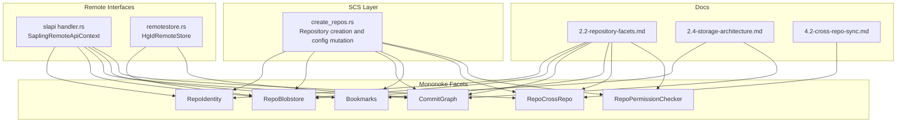

**Diagram sources**
- [create_repos.rs:635-732](file://eden/mononoke/servers/scs/scs_methods/src/methods/create_repos.rs#L635-L732)
- [2.2-repository-facets.md:93-253](file://eden/mononoke/docs/2.2-repository-facets.md#L93-L253)
- [handler.rs:93-142](file://eden/mononoke/servers/slapi/slapi_service/src/handlers/handler.rs#L93-L142)
- [remotestore.rs:15-24](file://eden/scm/lib/revisionstore/src/remotestore.rs#L15-L24)
- [2.4-storage-architecture.md:1-365](file://eden/mononoke/docs/2.4-storage-architecture.md#L1-L365)
- [4.2-cross-repo-sync.md:1-244](file://eden/mononoke/docs/4.2-cross-repo-sync.md#L1-L244)

**Section sources**
- [2.2-repository-facets.md:1-346](file://eden/mononoke/docs/2.2-repository-facets.md#L1-L346)

## Core Components
- Repository creation and configuration: Automated reservation of repository IDs, ACL setup, and mutation of repository definitions/specs in configuration systems.
- Faceted repository attributes: Identity, blobstore, commit graph, bookmarks, cross-repo sync, and permission checker.
- Authorization and permissions: Fine-grained checks for read, write, draft, and service-level access.
- Remote interfaces: Remote store abstractions and SLAPI handlers enabling cross-repo operations.
- Storage architecture: Immutable blobstore plus metadata database, with caching and decorator patterns.
- Cross-repo synchronization: Bidirectional sync with path mapping, bookmark mapping, and commit rewriting.
- Migration and recovery: Import tooling with recovery state and backsync flows.

**Section sources**
- [create_repos.rs:635-833](file://eden/mononoke/servers/scs/scs_methods/src/methods/create_repos.rs#L635-L833)
- [2.2-repository-facets.md:93-253](file://eden/mononoke/docs/2.2-repository-facets.md#L93-L253)
- [lib.rs:30-114](file://eden/mononoke/repo_attributes/repo_permission_checker/src/lib.rs#L30-L114)
- [handler.rs:132-141](file://eden/mononoke/servers/slapi/slapi_service/src/handlers/handler.rs#L132-L141)
- [2.4-storage-architecture.md:1-365](file://eden/mononoke/docs/2.4-storage-architecture.md#L1-L365)
- [4.2-cross-repo-sync.md:1-244](file://eden/mononoke/docs/4.2-cross-repo-sync.md#L1-L244)
- [main.rs:986-1100](file://eden/mononoke/tools/repo_import/src/main.rs#L986-L1100)

## Architecture Overview
The repository management architecture is built around the facet pattern. Repositories are assembled from composable traits, each encapsulating a specific capability. The SCS layer orchestrates repository creation and configuration, while authorization enforces access controls. Remote interfaces and cross-repo sync enable distributed operations and synchronization across repositories. Storage is separated into immutable blobstore and mutable metadata database, with caching and decorators optimizing performance.

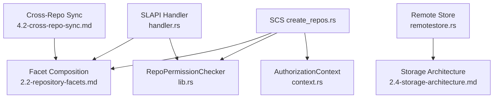

**Diagram sources**
- [create_repos.rs:635-833](file://eden/mononoke/servers/scs/scs_methods/src/methods/create_repos.rs#L635-L833)
- [context.rs:327-356](file://eden/mononoke/repo_authorization/src/context.rs#L327-L356)
- [2.2-repository-facets.md:254-346](file://eden/mononoke/docs/2.2-repository-facets.md#L254-L346)
- [lib.rs:137-225](file://eden/mononoke/repo_attributes/repo_permission_checker/src/lib.rs#L137-L225)
- [handler.rs:93-142](file://eden/mononoke/servers/slapi/slapi_service/src/handlers/handler.rs#L93-L142)
- [remotestore.rs:15-24](file://eden/scm/lib/revisionstore/src/remotestore.rs#L15-L24)
- [2.4-storage-architecture.md:1-365](file://eden/mononoke/docs/2.4-storage-architecture.md#L1-L365)
- [4.2-cross-repo-sync.md:1-244](file://eden/mononoke/docs/4.2-cross-repo-sync.md#L1-L244)

## Detailed Component Analysis

### Repository Creation and Lifecycle
- Reservation and uniqueness: Repository IDs are reserved and validated against source-of-truth constraints to prevent conflicts and split-brain scenarios.
- Configuration mutation: Repository definitions/specs are written via transactions to configuration systems, with optional RepoSpec or QuickRepoDefinition formats.
- ACL provisioning: Initial ACL grants are created or validated for maintainers and service identities.
- Source-of-truth transitions: After preparation, source-of-truth is updated to Mononoke and mutations are landed.

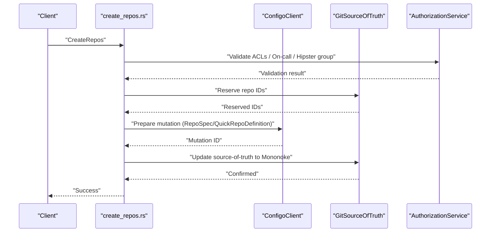

**Diagram sources**
- [create_repos.rs:444-541](file://eden/mononoke/servers/scs/scs_methods/src/methods/create_repos.rs#L444-L541)
- [create_repos.rs:674-732](file://eden/mononoke/servers/scs/scs_methods/src/methods/create_repos.rs#L674-L732)
- [create_repos.rs:734-744](file://eden/mononoke/servers/scs/scs_methods/src/methods/create_repos.rs#L734-L744)

**Section sources**
- [create_repos.rs:444-541](file://eden/mononoke/servers/scs/scs_methods/src/methods/create_repos.rs#L444-L541)
- [create_repos.rs:674-744](file://eden/mononoke/servers/scs/scs_methods/src/methods/create_repos.rs#L674-L744)

### Repository Attribute System
- Facet pattern: Repositories are composed from traits (e.g., RepoIdentity, RepoBlobstore, CommitGraph, Bookmarks, RepoCrossRepo, RepoPermissionChecker).
- Attribute categories: Identity, storage access, commit graph/history, derived data, VCS mappings, Git-specific facets, file/data management, operational facets, metadata/events, and SQL query configuration.
- Construction: Repositories are constructed by the factory from configuration, assembling facets and exposing them through accessor traits.

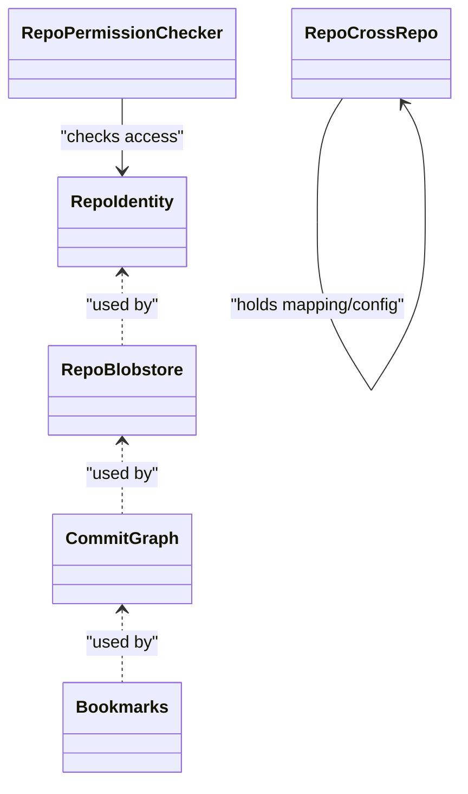

**Diagram sources**
- [2.2-repository-facets.md:93-253](file://eden/mononoke/docs/2.2-repository-facets.md#L93-L253)

**Section sources**
- [2.2-repository-facets.md:93-253](file://eden/mononoke/docs/2.2-repository-facets.md#L93-L253)

### Bookmark Management
- Storage and active bookmark: Bookmarks are stored in a dedicated file and tracked with an active bookmark indicator.
- Conflict detection and resolution: Validation ensures forward-only moves and handles divergent bookmarks.
- Remote synchronization: Compare and update bookmarks across repositories, including divergent naming and explicit overrides.
- Listing and streaming: Binary encoding/decoding for efficient transport and listing filtered bookmarks.

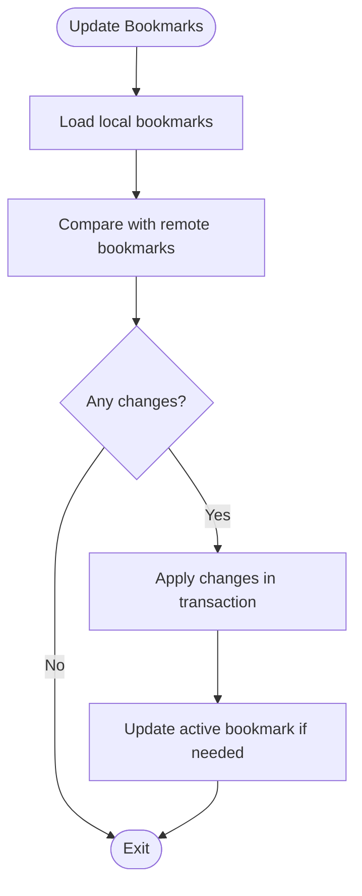

**Diagram sources**
- [bookmarks.py:444-518](file://eden/scm/sapling/bookmarks.py#L444-L518)
- [bookmarks.py:616-687](file://eden/scm/sapling/bookmarks.py#L616-L687)

**Section sources**
- [bookmarks.py:64-201](file://eden/scm/sapling/bookmarks.py#L64-L201)
- [bookmarks.py:444-518](file://eden/scm/sapling/bookmarks.py#L444-L518)
- [bookmarks.py:616-687](file://eden/scm/sapling/bookmarks.py#L616-L687)

### Cross-Repository Synchronization
- Purpose: Maintain bidirectional synchronization between repositories, transforming paths and commit metadata.
- Config: CommitSyncConfig defines large/small repo relationships, default actions, path maps, and submodule handling.
- Outcomes: RewrittenAs, EquivalentWorkingCopyAncestor, NotSyncCandidate; mapping stored for deduplication and parent remapping.
- Constraints: Merge commits, root commits, path conflicts, bookmark filters, and sequential processing limitations.
- Performance: Incremental sync, batching, leasing, asynchronous derived data, and cached live config.

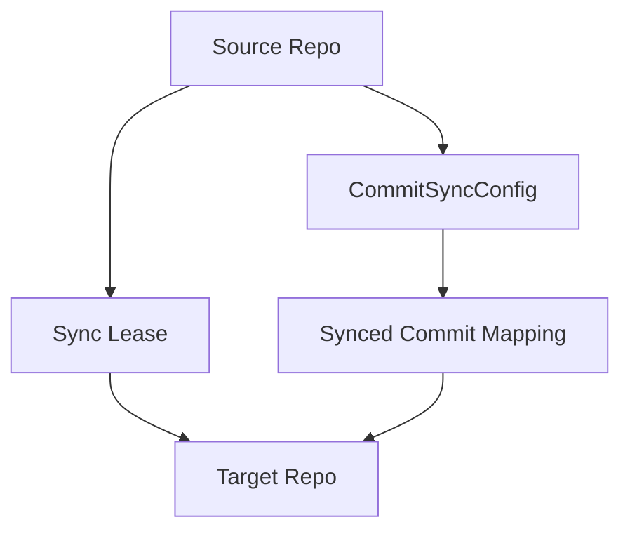

**Diagram sources**
- [4.2-cross-repo-sync.md:123-136](file://eden/mononoke/docs/4.2-cross-repo-sync.md#L123-L136)
- [lib.rs:22-45](file://eden/mononoke/repo_attributes/repo_cross_repo/src/lib.rs#L22-L45)

**Section sources**
- [4.2-cross-repo-sync.md:1-244](file://eden/mononoke/docs/4.2-cross-repo-sync.md#L1-L244)
- [lib.rs:22-45](file://eden/mononoke/repo_attributes/repo_cross_repo/src/lib.rs#L22-L45)

### Authorization and Permissions
- Permission model: Read, write, draft, bypass read-only, bypass hooks, service writes, mirror uploads.
- Enforcement: AuthorizationContext selects policy based on identity/service context and repository configuration; tunable enforcement for draft access.
- ACL provider: Hierarchical ACLs with hipster groups and on-call point of contact validation; initial grants for service identities.

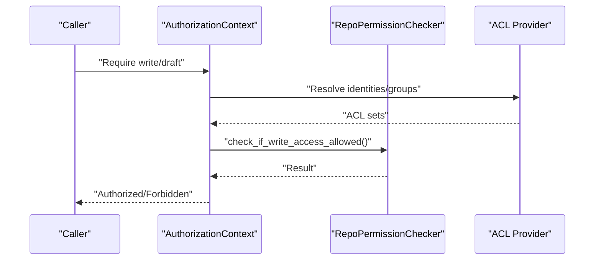

**Diagram sources**
- [context.rs:327-356](file://eden/mononoke/repo_authorization/src/context.rs#L327-L356)
- [lib.rs:227-301](file://eden/mononoke/repo_attributes/repo_permission_checker/src/lib.rs#L227-L301)

**Section sources**
- [lib.rs:30-114](file://eden/mononoke/repo_attributes/repo_permission_checker/src/lib.rs#L30-L114)
- [context.rs:327-356](file://eden/mononoke/repo_authorization/src/context.rs#L327-L356)

### Repository Client Interfaces and Remote Operations
- SLAPI handler: Provides access to other repositories via other_repo and exposes repository context for remote operations.
- Remote store abstraction: HgIdRemoteStore exposes RemoteDataStore and RemoteHistoryStore for delta and history synchronization.

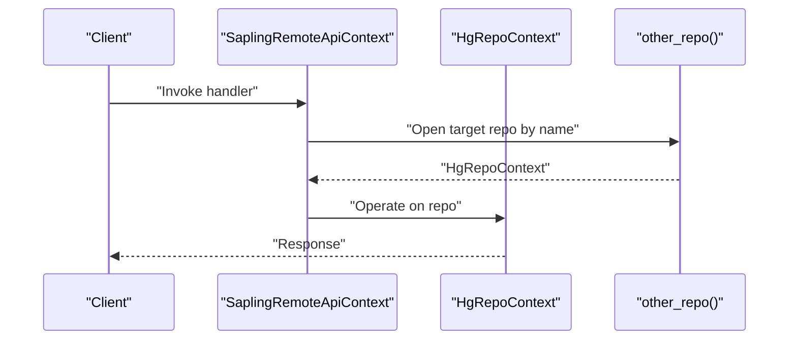

**Diagram sources**
- [handler.rs:132-141](file://eden/mononoke/servers/slapi/slapi_service/src/handlers/handler.rs#L132-L141)

**Section sources**
- [handler.rs:93-142](file://eden/mononoke/servers/slapi/slapi_service/src/handlers/handler.rs#L93-L142)
- [remotestore.rs:15-24](file://eden/scm/lib/revisionstore/src/remotestore.rs#L15-L24)

### Storage Architecture and Derived Data
- Immutable blobstore and metadata database: Immutable content addressed storage plus SQL for mutable state and indexes.
- Decorators and caching: Packblob, virtually sharded blobstore, and cacheblob enable optimization and deduplication.
- Derived data: Managed by RepoDerivedData and queues; cross-repo sync leverages derived data asynchronously.

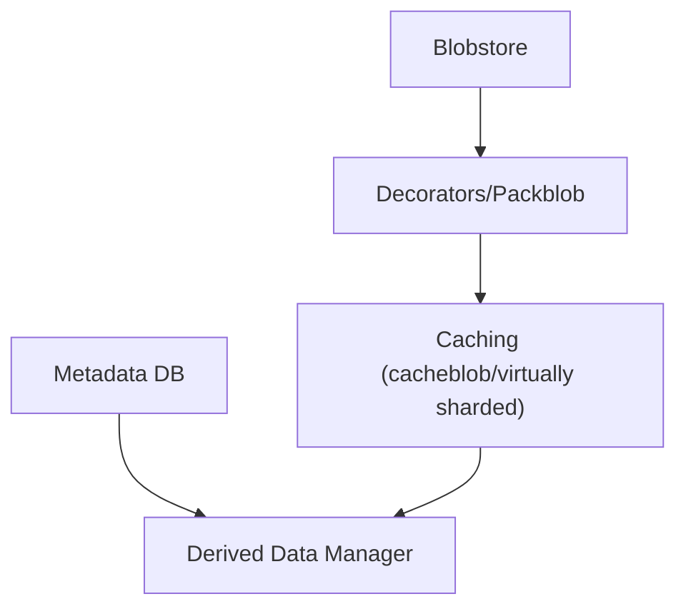

**Diagram sources**
- [2.4-storage-architecture.md:1-365](file://eden/mononoke/docs/2.4-storage-architecture.md#L1-L365)

**Section sources**
- [2.4-storage-architecture.md:1-365](file://eden/mononoke/docs/2.4-storage-architecture.md#L1-L365)

### Migration and Recovery Procedures
- Import tooling: Supports importing from Git repositories into Mononoke, validating settings, and handling pushredirected small repos.
- Recovery state: JSON-based recovery fields persisted to resume interrupted imports.
- Backsync: After importing into a large repo, backsync to small repos is coordinated with versioned movers.

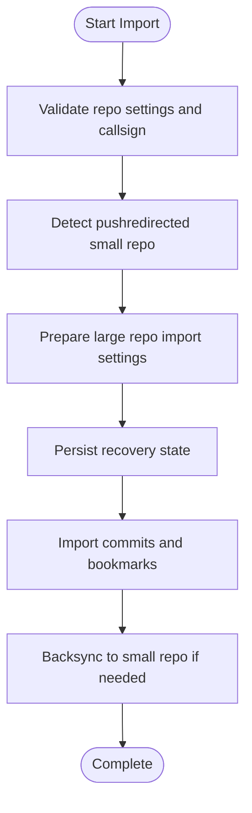

**Diagram sources**
- [main.rs:986-1100](file://eden/mononoke/tools/repo_import/src/main.rs#L986-L1100)
- [main.rs:922-945](file://eden/mononoke/tools/repo_import/src/main.rs#L922-L945)

**Section sources**
- [main.rs:986-1100](file://eden/mononoke/tools/repo_import/src/main.rs#L986-L1100)
- [main.rs:922-945](file://eden/mononoke/tools/repo_import/src/main.rs#L922-L945)

## Dependency Analysis
- Repository creation depends on:
  - Git source-of-truth for ID reservation and uniqueness
  - Authorization service for ACL validation
  - Configo for preparing and landing mutations
- Faceted repositories depend on:
  - Storage backends (blobstore, SQL)
  - Derived data managers
  - Cross-repo sync mapping and leases
- Remote operations depend on:
  - SLAPI handler context
  - Remote store abstractions for data/history sync

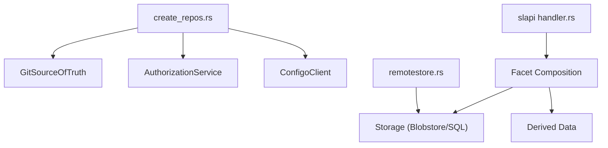

**Diagram sources**
- [create_repos.rs:444-541](file://eden/mononoke/servers/scs/scs_methods/src/methods/create_repos.rs#L444-L541)
- [handler.rs:93-142](file://eden/mononoke/servers/slapi/slapi_service/src/handlers/handler.rs#L93-L142)
- [remotestore.rs:15-24](file://eden/scm/lib/revisionstore/src/remotestore.rs#L15-L24)

**Section sources**
- [create_repos.rs:444-541](file://eden/mononoke/servers/scs/scs_methods/src/methods/create_repos.rs#L444-L541)
- [handler.rs:93-142](file://eden/mononoke/servers/slapi/slapi_service/src/handlers/handler.rs#L93-L142)
- [remotestore.rs:15-24](file://eden/scm/lib/revisionstore/src/remotestore.rs#L15-L24)

## Performance Considerations
- Storage characteristics: Immutability enables aggressive caching; multiplexing trades write latency for availability; decorator composition increases flexibility.
- Derived data: Computation can be deferred to keep sync operations responsive.
- Cross-repo sync: Incremental processing, batching, leasing, and caching improve throughput.
- Benchmarking: Production-like latency modeling and counting blobstore operations support performance tuning.

[No sources needed since this section provides general guidance]

## Troubleshooting Guide
- Repository creation failures:
  - Unique constraint violations on source-of-truth entries; stale “Reserved” rows require manual cleanup before retry.
  - Missing top-level ACL for repository hierarchy.
- Bookmark synchronization:
  - Divergent bookmark naming and explicit overrides; ensure valid bookmark suffixes and handle unknown nodes gracefully.
- Cross-repo sync:
  - Merge commits and root commits may not sync; path conflicts and unsupported bookmark filters block sync.
- Permissions:
  - Draft access enforcement is tunable; ensure correct ACLs for service identities and hipster groups.

**Section sources**
- [create_repos.rs:483-534](file://eden/mononoke/servers/scs/scs_methods/src/methods/create_repos.rs#L483-L534)
- [bookmarks.py:616-687](file://eden/scm/sapling/bookmarks.py#L616-L687)
- [4.2-cross-repo-sync.md:216-230](file://eden/mononoke/docs/4.2-cross-repo-sync.md#L216-L230)
- [lib.rs:80-111](file://eden/mononoke/repo_attributes/repo_permission_checker/src/lib.rs#L80-L111)

## Conclusion
SAPLING SCM’s repository management is built on a robust facet-based architecture with strong separation of concerns. Repository creation and configuration are automated and auditable, while authorization and permission checking provide fine-grained access control. Remote interfaces and cross-repository synchronization enable distributed workflows, and the storage architecture supports scalability and performance. Migration and recovery tooling ensures operational continuity, and performance characteristics are optimized through caching, batching, and asynchronous derived data computation.

## Appendices
- Additional documentation references:
  - Repository facets overview and construction
  - Storage architecture and caching strategies
  - Cross-repository sync configuration and outcomes
  - SLAPI handler patterns for remote operations

**Section sources**
- [2.2-repository-facets.md:254-346](file://eden/mononoke/docs/2.2-repository-facets.md#L254-L346)
- [2.4-storage-architecture.md:1-365](file://eden/mononoke/docs/2.4-storage-architecture.md#L1-L365)
- [4.2-cross-repo-sync.md:123-136](file://eden/mononoke/docs/4.2-cross-repo-sync.md#L123-L136)
- [handler.rs:93-142](file://eden/mononoke/servers/slapi/slapi_service/src/handlers/handler.rs#L93-L142)