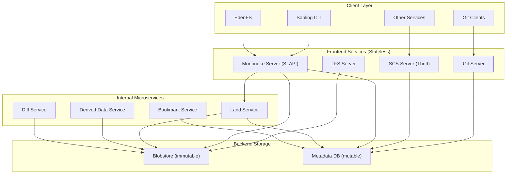
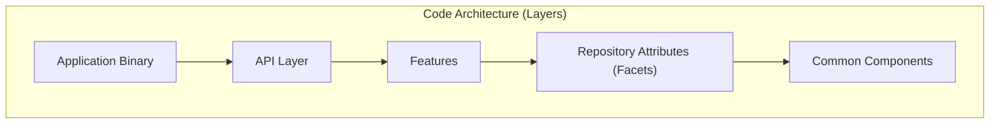
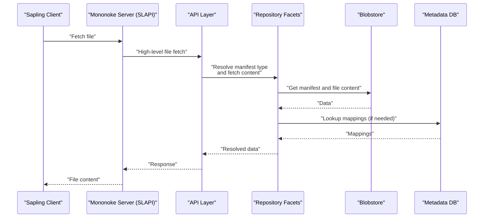
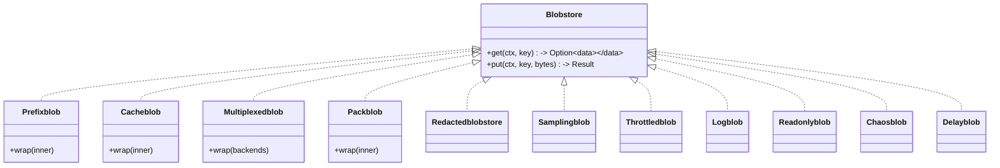
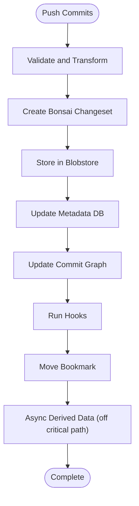
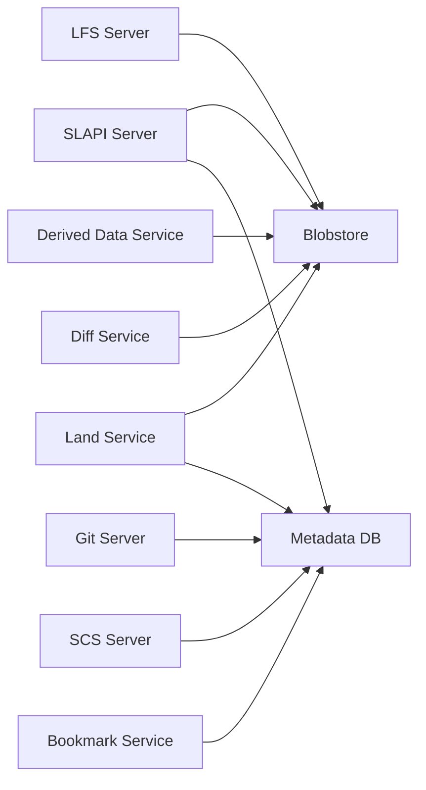

# Server Architecture

<cite>
**Referenced Files in This Document**
- [README.md](file://README.md)
- [1.3-architecture-overview.md](file://eden/mononoke/docs/1.3-architecture-overview.md)
- [2.1-bonsai-data-model.md](file://eden/mononoke/docs/2.1-bonsai-data-model.md)
- [2.4-storage-architecture.md](file://eden/mononoke/docs/2.4-storage-architecture.md)
- [lib.rs](file://eden/mononoke/blobstore/src/lib.rs)
- [lib.rs](file://eden/mononoke/blobstore/delayblob/src/lib.rs)
- [fb303.thrift](file://common/fb303/if/fb303.thrift)
- [hgclient.thrift](file://configerator/structs/scm/hg/hgclientconf/hgclient.thrift)
- [adaptive_rate_limiter.thrift](file://configerator/structs/scm/mononoke/adaptive_rate_limiter/adaptive_rate_limiter.thrift)
- [lfs_server.thrift](file://configerator/structs/scm/mononoke/lfs_server/lfs_server.thrift)
- [qps_config.thrift](file://configerator/structs/scm/mononoke/qps/qps_config.thrift)
- [repos.thrift](file://configerator/structs/scm/mononoke/repos/repos.thrift)
- [regions.thrift](file://configerator/structs/scm/mononoke/sharding/regions.thrift)
- [sharding.thrift](file://configerator/structs/scm/mononoke/sharding/sharding.thrift)
- [observability_config.thrift](file://configerator/structs/scm/mononoke/observability/observability_config.thrift)
- [constants.thrift](file://configerator/structs/scm/mononoke/constants/constants.thrift)
</cite>

## Table of Contents
1. [Introduction](#introduction)
2. [Project Structure](#project-structure)
3. [Core Components](#core-components)
4. [Architecture Overview](#architecture-overview)
5. [Detailed Component Analysis](#detailed-component-analysis)
6. [Dependency Analysis](#dependency-analysis)
7. [Performance Considerations](#performance-considerations)
8. [Troubleshooting Guide](#troubleshooting-guide)
9. [Conclusion](#conclusion)
10. [Appendices](#appendices)

## Introduction
This document describes the server architecture of the Mononoke SCM server as implemented in the repository. It focuses on the distributed service composition, storage architecture, repository management services, and the interactions among Mononoke servers, authentication systems, and repository caches. It also documents technical decisions behind the architecture, scalability considerations, deployment topology, infrastructure requirements, service dependencies, and operational aspects such as security, monitoring, and maintenance.

## Project Structure
The repository organizes Mononoke’s server-side components into:
- Service tiers: frontend protocol servers, internal microservices, and backend storage
- Code architecture layers: common components, repository facets, features, API layer, and application framework
- Storage subsystems: immutable blobstore and mutable metadata database
- Configuration and contracts: Thrift interfaces for clients and internal services

**Diagram sources**
- [1.3-architecture-overview.md: Service Tiers and Storage Systems:23-59](file://eden/mononoke/docs/1.3-architecture-overview.md#L23-L59)
- [1.3-architecture-overview.md: Service Architecture Characteristics:95-108](file://eden/mononoke/docs/1.3-architecture-overview.md#L95-L108)

**Section sources**
- [1.3-architecture-overview.md: Service Tiers:23-59](file://eden/mononoke/docs/1.3-architecture-overview.md#L23-L59)
- [1.3-architecture-overview.md: Code Architecture Layers:118-294](file://eden/mononoke/docs/1.3-architecture-overview.md#L118-L294)

## Core Components
- Frontend protocol servers:
  - Mononoke Server (SLAPI) for Sapling CLI and EdenFS clients
  - Git Server for Git clients
  - LFS Server for Git LFS requests
  - SCS Server (Thrift) for programmatic access
- Internal microservices:
  - Land Service for commit landing
  - Derived Data Service for asynchronous derivation
  - Diff Service for diff computations
  - Bookmark Service for warm caches
- Backend storage:
  - Blobstore (immutable key-value store)
  - Metadata Database (mutable SQL store)

These components are designed to be stateless, horizontally scalable, and separated by clear boundaries to isolate write-path and read-path concerns.

**Section sources**
- [1.3-architecture-overview.md: Frontend Services:27-37](file://eden/mononoke/docs/1.3-architecture-overview.md#L27-L37)
- [1.3-architecture-overview.md: Internal Microservices:39-49](file://eden/mononoke/docs/1.3-architecture-overview.md#L39-L49)
- [1.3-architecture-overview.md: Backend Storage:51-59](file://eden/mononoke/docs/1.3-architecture-overview.md#L51-L59)

## Architecture Overview
Mononoke’s architecture is service-oriented and code-layered:
- Service composition: Stateless frontend services, dedicated microservices, and shared backend storage
- Code architecture: Common components → Repository facets → Features → API layer → Application framework
- Data model: Bonsai (VCS-agnostic, content-addressed) as the canonical representation
- Storage: Immutable blobstore plus mutable metadata database with multi-level caching

**Diagram sources**
- [1.3-architecture-overview.md: Code Architecture:118-294](file://eden/mononoke/docs/1.3-architecture-overview.md#L118-L294)

**Section sources**
- [1.3-architecture-overview.md: System Architecture Characteristics:95-108](file://eden/mononoke/docs/1.3-architecture-overview.md#L95-L108)
- [1.3-architecture-overview.md: Data Model and Flow:295-370](file://eden/mononoke/docs/1.3-architecture-overview.md#L295-L370)
- [2.1-bonsai-data-model.md: Introduction:1-22](file://eden/mononoke/docs/2.1-bonsai-data-model.md#L1-L22)

## Detailed Component Analysis

### Mononoke Server (SLAPI)
- Purpose: Serve Sapling CLI and EdenFS clients using the SLAPI protocol over HTTP
- Responsibilities:
  - Authentication and authorization
  - Translate client requests to internal Bonsai operations
  - Coordinate with backend storage and microservices
- Scalability: Stateless, horizontally scalable

**Diagram sources**
- [1.3-architecture-overview.md: Request Flow Example:355-370](file://eden/mononoke/docs/1.3-architecture-overview.md#L355-L370)

**Section sources**
- [1.3-architecture-overview.md: Frontend Services:27-37](file://eden/mononoke/docs/1.3-architecture-overview.md#L27-L37)
- [1.3-architecture-overview.md: Data Flow Patterns (Pull):511-516](file://eden/mononoke/docs/1.3-architecture-overview.md#L511-L516)

### Git Server
- Purpose: Serve Git clients using the Git protocol over HTTP
- Responsibilities:
  - Translate Git operations to Bonsai and derived data
  - Maintain VCS mappings for Git-specific formats

**Section sources**
- [1.3-architecture-overview.md: Frontend Services:27-37](file://eden/mononoke/docs/1.3-architecture-overview.md#L27-L37)

### LFS Server
- Purpose: Serve Git LFS requests
- Responsibilities:
  - Handle large file pointers and batched transfers
  - Integrate with blobstore for content retrieval

**Section sources**
- [1.3-architecture-overview.md: Frontend Services:27-37](file://eden/mononoke/docs/1.3-architecture-overview.md#L27-L37)

### SCS Server (Thrift)
- Purpose: Provide a Thrift API for programmatic access to repositories
- Responsibilities:
  - Expose repository operations via Thrift contracts
  - Coordinate with backend storage and microservices

**Section sources**
- [1.3-architecture-overview.md: Frontend Services:27-37](file://eden/mononoke/docs/1.3-architecture-overview.md#L27-L37)

### Land Service
- Purpose: Handle commit landing (merging) operations with serialization
- Responsibilities:
  - Serialize writes to public bookmarks
  - Coordinate with blobstore and metadata database
  - Offload expensive operations from frontend servers

**Section sources**
- [1.3-architecture-overview.md: Internal Microservices:44-45](file://eden/mononoke/docs/1.3-architecture-overview.md#L44-L45)

### Derived Data Service
- Purpose: Coordinate asynchronous computation of derived data
- Responsibilities:
  - Compute manifests, blame, filenodes, and other indexes
  - Manage derivation queues and worker coordination

**Section sources**
- [1.3-architecture-overview.md: Internal Microservices:45-46](file://eden/mononoke/docs/1.3-architecture-overview.md#L45-L46)

### Diff Service
- Purpose: Compute diffs for code review and tools
- Responsibilities:
  - Offload diff computation from frontend servers
  - Integrate with blobstore and derived data

**Section sources**
- [1.3-architecture-overview.md: Internal Microservices:46-47](file://eden/mononoke/docs/1.3-architecture-overview.md#L46-L47)

### Bookmark Service
- Purpose: Maintain warm caches of bookmark state
- Responsibilities:
  - Reduce latency for bookmark queries
  - Coordinate with metadata database and derived data

**Section sources**
- [1.3-architecture-overview.md: Internal Microservices:47-48](file://eden/mononoke/docs/1.3-architecture-overview.md#L47-L48)

### Blobstore (Immutable Storage)
- Purpose: Immutable key-value storage for file contents, Bonsai changesets, derived data, and VCS-specific formats
- Features:
  - Decorator pattern for caching, multiplexing, compression, and operational controls
  - Multiplexed writes/read-any for availability
  - Packblob for compression and storage efficiency
- Implementations:
  - Production: Manifoldblob
  - Alternative: SQLblob, S3blob, Fileblob, Memblob

**Diagram sources**
- [lib.rs (Blobstore traits):302-308](file://eden/mononoke/blobstore/src/lib.rs#L302-L308)
- [2.4-storage-architecture.md: Decorator Pattern:69-108](file://eden/mononoke/docs/2.4-storage-architecture.md#L69-L108)
- [lib.rs (Delayblob):141-194](file://eden/mononoke/blobstore/delayblob/src/lib.rs#L141-L194)

**Section sources**
- [2.4-storage-architecture.md: Blobstore Architecture:23-68](file://eden/mononoke/docs/2.4-storage-architecture.md#L23-L68)
- [2.4-storage-architecture.md: Multiplexing for Availability:138-166](file://eden/mononoke/docs/2.4-storage-architecture.md#L138-L166)
- [2.4-storage-architecture.md: Packblob:167-200](file://eden/mononoke/docs/2.4-storage-architecture.md#L167-L200)

### Metadata Database (Mutable Storage)
- Purpose: Mutable SQL database storing bookmarks, VCS mappings, commit graph index, and repository state
- Characteristics:
  - Transactional updates for mutable data
  - Indexed queries and range scans
  - Schemas for multiple mapping types and operational tables

**Section sources**
- [2.4-storage-architecture.md: Metadata Database:201-268](file://eden/mononoke/docs/2.4-storage-architecture.md#L201-L268)

### Bonsai Data Model
- Purpose: Canonical, VCS-agnostic representation of repository data
- Characteristics:
  - Content-addressed Merkle DAG using Blake2b
  - Separation of inherent (immutable) and derived (indexes) data
  - VCS mappings for Git and Mercurial compatibility

**Diagram sources**
- [2.1-bonsai-data-model.md: Inherent vs Derived Data:9-22](file://eden/mononoke/docs/2.1-bonsai-data-model.md#L9-L22)
- [2.1-bonsai-data-model.md: Content Addressing:86-111](file://eden/mononoke/docs/2.1-bonsai-data-model.md#L86-L111)
- [1.3-architecture-overview.md: Write Path vs Read Path:312-354](file://eden/mononoke/docs/1.3-architecture-overview.md#L312-L354)

**Section sources**
- [2.1-bonsai-data-model.md: Bonsai Changesets:23-86](file://eden/mononoke/docs/2.1-bonsai-data-model.md#L23-L86)
- [2.1-bonsai-data-model.md: Content Addressing:86-111](file://eden/mononoke/docs/2.1-bonsai-data-model.md#L86-L111)
- [2.1-bonsai-data-model.md: VCS-Agnostic Design:131-173](file://eden/mononoke/docs/2.1-bonsai-data-model.md#L131-L173)

## Dependency Analysis
- Service dependencies:
  - Frontend services depend on backend storage and microservices
  - Microservices coordinate with backend storage and each other
- Code architecture dependencies:
  - Applications depend on API layer → features → facets → common components
- Storage dependencies:
  - Blobstore and metadata database are shared by all services
  - Decorators layer functionality on top of storage backends

**Diagram sources**
- [1.3-architecture-overview.md: Service Composition:454-481](file://eden/mononoke/docs/1.3-architecture-overview.md#L454-L481)

**Section sources**
- [1.3-architecture-overview.md: Code Layer Dependencies:482-499](file://eden/mononoke/docs/1.3-architecture-overview.md#L482-L499)

## Performance Considerations
- Stateless servers enable horizontal scaling
- Asynchronous derivation reduces write-path latency
- Multi-level caching (cachelib + memcache) minimizes backend load
- Multiplexed blobstore improves availability at the cost of write latency
- Packblob reduces storage footprint and improves transfer efficiency
- Warm bookmark cache mitigates eventual-consistency delays for hot branches

**Section sources**
- [1.3-architecture-overview.md: Architectural Characteristics:438-453](file://eden/mononoke/docs/1.3-architecture-overview.md#L438-L453)
- [2.4-storage-architecture.md: Caching Strategy:269-354](file://eden/mononoke/docs/2.4-storage-architecture.md#L269-L354)
- [2.4-storage-architecture.md: Storage Characteristics:355-370](file://eden/mononoke/docs/2.4-storage-architecture.md#L355-L370)

## Troubleshooting Guide
- Storage healing:
  - Blobstore healer job repairs missing blobs across multiplexed backends using a write-ahead log
- Validation:
  - Walker job traverses commit graph to verify referenced blobs exist and are readable
- Observability:
  - Samplingblob and logblob decorators aid debugging and monitoring
  - FB303 Thrift interface for service health and stats
- Rate limiting and QPS control:
  - Adaptive rate limiter and QPS configuration Thrift structs govern traffic shaping

**Section sources**
- [2.4-storage-architecture.md: Blobstore Healer:375-377](file://eden/mononoke/docs/2.4-storage-architecture.md#L375-L377)
- [2.4-storage-architecture.md: Walker:377-379](file://eden/mononoke/docs/2.4-storage-architecture.md#L377-L379)
- [2.4-storage-architecture.md: Samplingblob and Logblob:87-92](file://eden/mononoke/docs/2.4-storage-architecture.md#L87-L92)
- [fb303.thrift](file://common/fb303/if/fb303.thrift)
- [adaptive_rate_limiter.thrift](file://configerator/structs/scm/mononoke/adaptive_rate_limiter/adaptive_rate_limiter.thrift)
- [qps_config.thrift](file://configerator/structs/scm/mononoke/qps/qps_config.thrift)

## Conclusion
Mononoke’s architecture balances scalability, modularity, and performance through:
- Stateless frontend services and dedicated microservices
- A shared immutable blobstore and mutable metadata database
- A VCS-agnostic Bonsai data model with asynchronous derivation
- Multi-level caching and decorator-based storage flexibility
This design enables horizontal scaling, robust availability, and efficient operations across large repositories.

## Appendices

### Technology Stack and Third-Party Dependencies
- Core languages and frameworks:
  - Rust libraries composing the Mononoke codebase
  - Thrift for service contracts and configuration structures
- Storage backends:
  - Manifoldblob (production internal)
  - SQLblob (MySQL/SQLite)
  - S3blob (AWS)
  - Fileblob (filesystem)
  - Memblob (memory)
- Caching and observability:
  - Cachelib (in-process)
  - Memcache (shared)
  - FB303 (service stats)
- Client integrations:
  - SLAPI for Sapling CLI and EdenFS
  - Git protocol server
  - LFS server
  - SCS Thrift API

**Section sources**
- [2.4-storage-architecture.md: Storage Backends:49-68](file://eden/mononoke/docs/2.4-storage-architecture.md#L49-L68)
- [2.4-storage-architecture.md: Caching Strategy:269-354](file://eden/mononoke/docs/2.4-storage-architecture.md#L269-L354)
- [fb303.thrift](file://common/fb303/if/fb303.thrift)

### Infrastructure Requirements and Deployment Topology
- Stateless service deployment:
  - Frontend services scale horizontally behind load balancers
  - Microservices scale independently based on workload
- Storage:
  - Blobstore backends configured via decorator stacks
  - Metadata database with MySQL/SQLite variants
- Sharding and regions:
  - Sharding and region configuration Thrift structures define partitioning and topology

**Section sources**
- [1.3-architecture-overview.md: Service Architecture Characteristics:95-108](file://eden/mononoke/docs/1.3-architecture-overview.md#L95-L108)
- [sharding.thrift](file://configerator/structs/scm/mononoke/sharding/sharding.thrift)
- [regions.thrift](file://configerator/structs/scm/mononoke/sharding/regions.thrift)

### Operational Considerations
- Security:
  - Access control via repository facets and permission checker
  - Redactedblobstore for content redaction
- Monitoring:
  - FB303 for service health
  - Samplingblob for observability
- Maintenance:
  - Blobstore healer for consistency
  - Walker for integrity validation
  - Microwave for cache warming

**Section sources**
- [2.4-storage-architecture.md: Redactedblobstore:85-86](file://eden/mononoke/docs/2.4-storage-architecture.md#L85-L86)
- [2.4-storage-architecture.md: Blobstore Healer:375-377](file://eden/mononoke/docs/2.4-storage-architecture.md#L375-L377)
- [2.4-storage-architecture.md: Walker:377-379](file://eden/mononoke/docs/2.4-storage-architecture.md#L377-L379)
- [2.4-storage-architecture.md: Microwave:323-334](file://eden/mononoke/docs/2.4-storage-architecture.md#L323-L334)

### Integration Patterns with Client Components
- SLAPI for Sapling CLI and EdenFS
- Git protocol server for Git clients
- LFS server for Git LFS
- SCS Thrift API for programmatic access
- Configuration and contracts defined via Thrift (hgclient, lfs_server, observability, constants, repos, etc.)

**Section sources**
- [1.3-architecture-overview.md: Frontend Services:27-37](file://eden/mononoke/docs/1.3-architecture-overview.md#L27-L37)
- [hgclient.thrift](file://configerator/structs/scm/hg/hgclientconf/hgclient.thrift)
- [lfs_server.thrift](file://configerator/structs/scm/mononoke/lfs_server/lfs_server.thrift)
- [observability_config.thrift](file://configerator/structs/scm/mononoke/observability/observability_config.thrift)
- [constants.thrift](file://configerator/structs/scm/mononoke/constants/constants.thrift)
- [repos.thrift](file://configerator/structs/scm/mononoke/repos/repos.thrift)