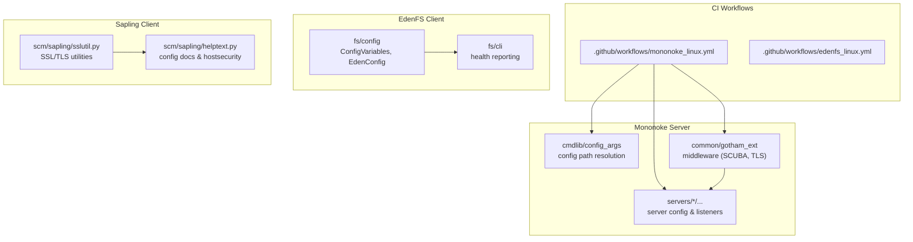
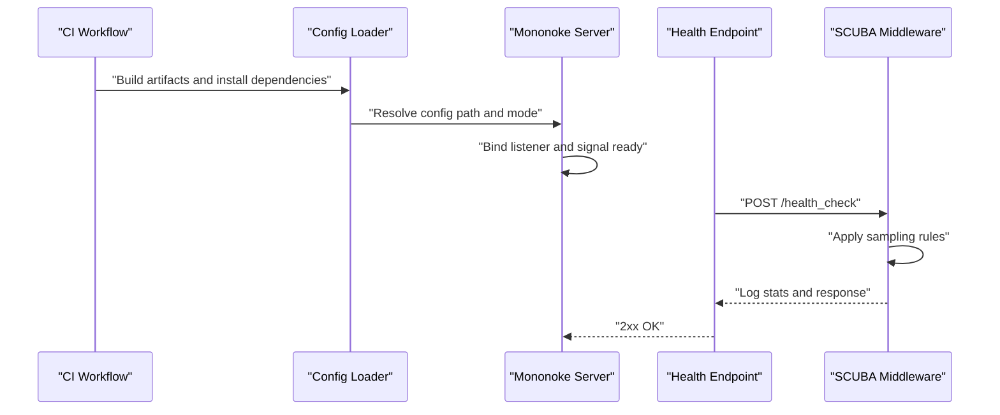
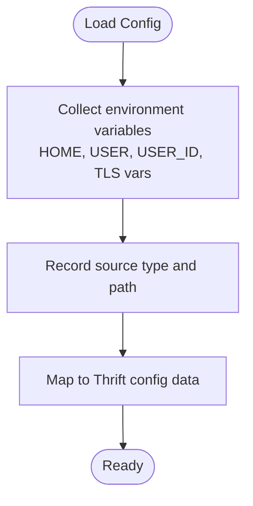
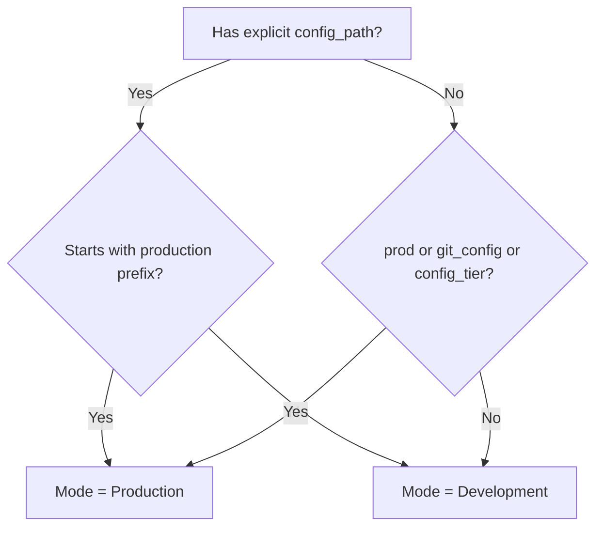
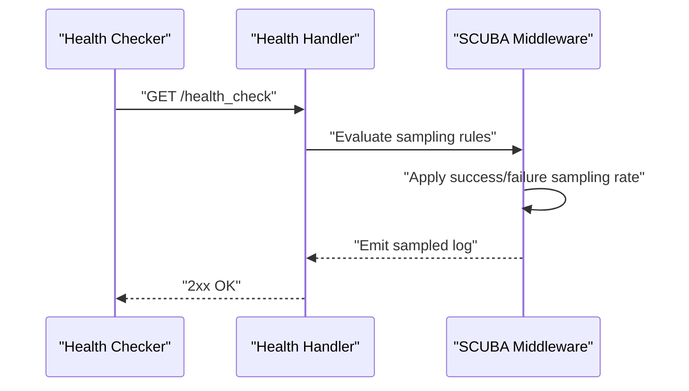
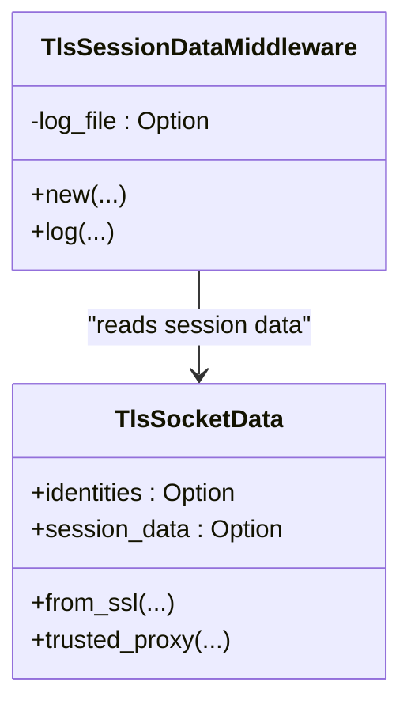
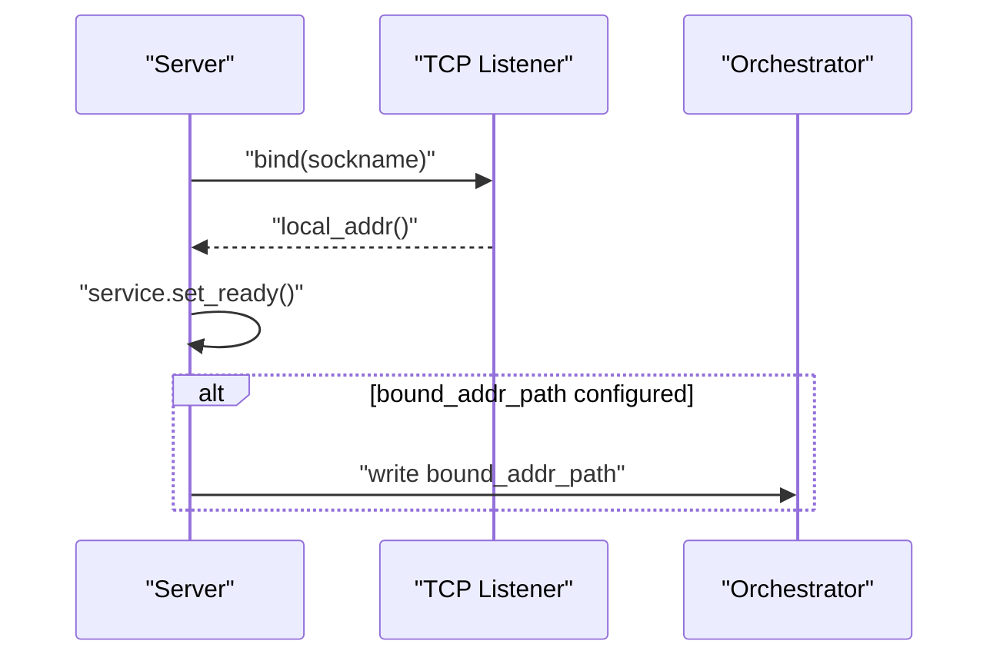
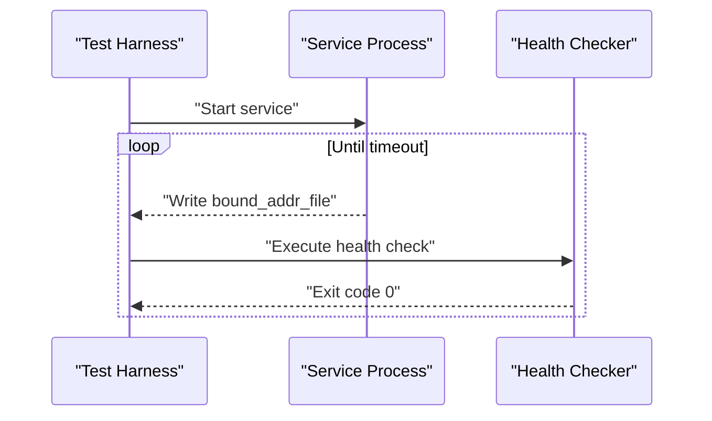
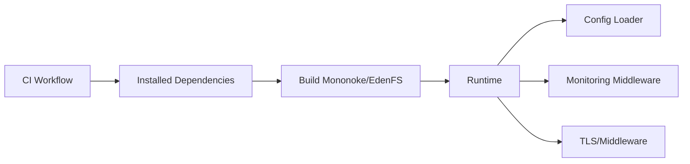
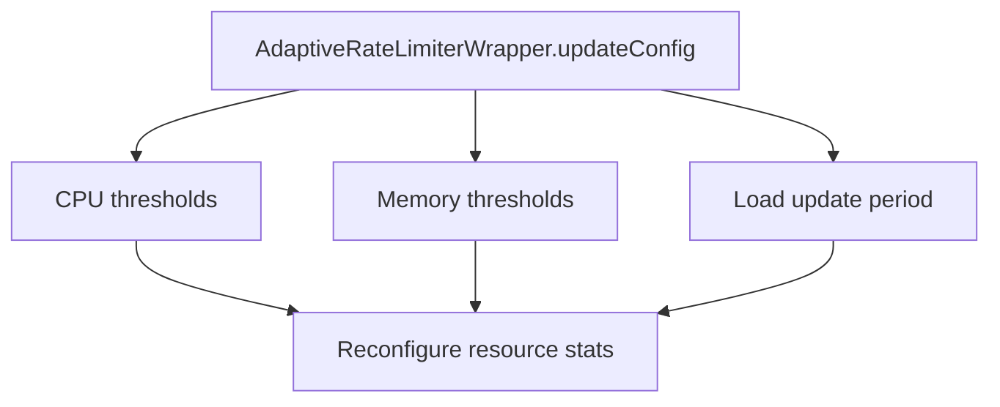

# Server Configuration & Deployment

<cite>
**Referenced Files in This Document**
- [README.md](file://README.md)
- [mononoke_linux.yml](file://.github/workflows/mononoke_linux.yml)
- [edenfs_linux.yml](file://.github/workflows/edenfs_linux.yml)
- [ConfigVariables.cpp](file://eden/fs/config/ConfigVariables.cpp)
- [EdenConfig.cpp](file://eden/fs/config/EdenConfig.cpp)
- [ConfigSettingTest.cpp](file://eden/fs/config/test/ConfigSettingTest.cpp)
- [config_args lib.rs](file://eden/mononoke/cmdlib/config_args/src/lib.rs)
- [schematized_logging.rs](file://eden/mononoke/common/scuba_ext/src/schematized_logging.rs)
- [scuba.rs](file://eden/mononoke/common/gotham_ext/src/middleware/scuba.rs)
- [connection_acceptor.rs](file://eden/mononoke/servers/slapi/slapi_server/repo_listener/src/connection_acceptor.rs)
- [socket_data.rs](file://eden/mononoke/common/gotham_ext/src/socket_data.rs)
- [tls_session_data.rs](file://eden/mononoke/common/gotham_ext/src/middleware/tls_session_data.rs)
- [config.rs](file://eden/mononoke/servers/lfs/lfs_server/src/config.rs)
- [sslutil.py](file://eden/scm/sapling/sslutil.py)
- [helptext.py](file://eden/scm/sapling/helptext.py)
- [main.py](file://eden/fs/cli/main.py)
- [mononoke.py](file://eden/scm/sapling/testing/ext/mononoke.py)
- [AdaptiveRateLimiterWrapper.cpp](file://eden/mononoke/common/adaptive_rate_limiter/cpp/AdaptiveRateLimiterWrapper.cpp)
</cite>

## Table of Contents
1. [Introduction](#introduction)
2. [Project Structure](#project-structure)
3. [Core Components](#core-components)
4. [Architecture Overview](#architecture-overview)
5. [Detailed Component Analysis](#detailed-component-analysis)
6. [Dependency Analysis](#dependency-analysis)
7. [Performance Considerations](#performance-considerations)
8. [Troubleshooting Guide](#troubleshooting-guide)
9. [Conclusion](#conclusion)
10. [Appendices](#appendices)

## Introduction
This document describes server configuration and deployment procedures for the Mononoke server ecosystem within the repository. It covers configuration file formats, parameter settings, environment variable usage, deployment scenarios (development, staging, production), service startup procedures, dependency management, health checks, performance tuning, monitoring and alerting, security hardening, SSL/TLS configuration, and operational dashboards. It synthesizes information from repository-provided configuration loaders, server runtime behavior, CI workflows, and monitoring middleware.

## Project Structure
The repository organizes server-related logic primarily under:
- eden/mononoke: server runtime, configuration parsing, and monitoring middleware
- eden/fs: client/server configuration and environment variable substitution
- eden/scm: client-side configuration and SSL/TLS utilities
- .github/workflows: CI pipelines for building and testing server components

**Diagram sources**
- [mononoke_linux.yml:1-676](file://.github/workflows/mononoke_linux.yml#L1-L676)
- [edenfs_linux.yml:1-1011](file://.github/workflows/edenfs_linux.yml#L1-L1011)
- [config_args lib.rs:45-87](file://eden/mononoke/cmdlib/config_args/src/lib.rs#L45-L87)
- [scuba.rs:531-566](file://eden/mononoke/common/gotham_ext/src/middleware/scuba.rs#L531-L566)
- [connection_acceptor.rs:127-161](file://eden/mononoke/servers/slapi/slapi_server/repo_listener/src/connection_acceptor.rs#L127-L161)
- [ConfigVariables.cpp:14-32](file://eden/fs/config/ConfigVariables.cpp#L14-L32)
- [EdenConfig.cpp:95-125](file://eden/fs/config/EdenConfig.cpp#L95-L125)
- [sslutil.py:164-604](file://eden/scm/sapling/sslutil.py#L164-L604)
- [helptext.py:1341-1374](file://eden/scm/sapling/helptext.py#L1341-L1374)

**Section sources**
- [README.md:1-80](file://README.md#L1-L80)
- [mononoke_linux.yml:1-676](file://.github/workflows/mononoke_linux.yml#L1-L676)
- [edenfs_linux.yml:1-1011](file://.github/workflows/edenfs_linux.yml#L1-L1011)

## Core Components
- Configuration loading and environment substitution:
  - Environment variable substitution for TLS client certificates and user identity variables.
  - Configuration sources and parsed values mapping to Thrift structures.
- Server configuration and modes:
  - Config path resolution and production vs development mode detection.
- Monitoring and observability:
  - SCUBA logging for health checks with sampling controls.
- Security and TLS:
  - TLS minimum protocol selection, cipher preferences, and certificate verification.
  - mTLS and TLS session data capture/logging.
- Startup and readiness:
  - Listener binding, readiness signaling, and optional bound address file writing.
- Health checks:
  - Health endpoint logging and client-side health wait logic.

**Section sources**
- [ConfigVariables.cpp:14-32](file://eden/fs/config/ConfigVariables.cpp#L14-L32)
- [EdenConfig.cpp:95-125](file://eden/fs/config/EdenConfig.cpp#L95-L125)
- [config_args lib.rs:45-87](file://eden/mononoke/cmdlib/config_args/src/lib.rs#L45-L87)
- [scuba.rs:531-566](file://eden/mononoke/common/gotham_ext/src/middleware/scuba.rs#L531-L566)
- [sslutil.py:164-604](file://eden/scm/sapling/sslutil.py#L164-L604)
- [socket_data.rs:16-48](file://eden/mononoke/common/gotham_ext/src/socket_data.rs#L16-L48)
- [tls_session_data.rs:24-48](file://eden/mononoke/common/gotham_ext/src/middleware/tls_session_data.rs#L24-L48)
- [connection_acceptor.rs:127-161](file://eden/mononoke/servers/slapi/slapi_server/repo_listener/src/connection_acceptor.rs#L127-L161)
- [main.py:1151-1184](file://eden/fs/cli/main.py#L1151-L1184)

## Architecture Overview
The server configuration and deployment pipeline integrates CI-built artifacts, runtime configuration resolution, and monitoring middleware.

**Diagram sources**
- [mononoke_linux.yml:663-672](file://.github/workflows/mononoke_linux.yml#L663-L672)
- [config_args lib.rs:63-86](file://eden/mononoke/cmdlib/config_args/src/lib.rs#L63-L86)
- [connection_acceptor.rs:147-161](file://eden/mononoke/servers/slapi/slapi_server/repo_listener/src/connection_acceptor.rs#L147-L161)
- [scuba.rs:531-566](file://eden/mononoke/common/gotham_ext/src/middleware/scuba.rs#L531-L566)

## Detailed Component Analysis

### Configuration Loading and Environment Variables
- Environment substitution:
  - Specific environment variables are injected into the configuration variable map for user and TLS contexts.
  - User identity variables (HOME, USER, USER_ID) are populated from the runtime user context.
- Configuration sources and Thrift mapping:
  - Configuration settings are tracked with source type and source path.
  - Parsed values are mapped into a Thrift structure for downstream consumption.

**Diagram sources**
- [ConfigVariables.cpp:14-32](file://eden/fs/config/ConfigVariables.cpp#L14-L32)
- [EdenConfig.cpp:95-125](file://eden/fs/config/EdenConfig.cpp#L95-L125)

**Section sources**
- [ConfigVariables.cpp:14-32](file://eden/fs/config/ConfigVariables.cpp#L14-L32)
- [EdenConfig.cpp:95-125](file://eden/fs/config/EdenConfig.cpp#L95-L125)
- [ConfigSettingTest.cpp:108-140](file://eden/fs/config/test/ConfigSettingTest.cpp#L108-L140)

### Server Configuration Modes and Paths
- Mode detection:
  - Production mode if a production-prefixed path is used or if production tiers are requested.
  - Development mode otherwise.
- Config path resolution:
  - Tier-based path construction for production-like configurations.
  - Fallback to local path when no tier is specified.

**Diagram sources**
- [config_args lib.rs:63-86](file://eden/mononoke/cmdlib/config_args/src/lib.rs#L63-L86)

**Section sources**
- [config_args lib.rs:45-87](file://eden/mononoke/cmdlib/config_args/src/lib.rs#L45-L87)

### Monitoring and Observability (SCUBA)
- Health check logging:
  - Conditional SCUBA logging for health endpoints with separate sampling rates for success and failure.
- Common server metadata:
  - Hostname, region, datacenter, tier, and build info are collected from environment and runtime.

**Diagram sources**
- [scuba.rs:531-566](file://eden/mononoke/common/gotham_ext/src/middleware/scuba.rs#L531-L566)
- [schematized_logging.rs:45-73](file://eden/mononoke/common/scuba_ext/src/schematized_logging.rs#L45-L73)

**Section sources**
- [scuba.rs:531-566](file://eden/mononoke/common/gotham_ext/src/middleware/scuba.rs#L531-L566)
- [schematized_logging.rs:45-73](file://eden/mononoke/common/scuba_ext/src/schematized_logging.rs#L45-L73)

### Security Hardening and TLS
- Minimum protocol and cipher selection:
  - Minimum protocol resolved per host with fallbacks and validation.
  - Cipher lists and fingerprint-based verification supported.
- TLS session data capture:
  - Optional TLS session data logging to a file for diagnostics.
- mTLS and identity handling:
  - TLS socket data includes identities and optional session data for security checks.

**Diagram sources**
- [socket_data.rs:16-48](file://eden/mononoke/common/gotham_ext/src/socket_data.rs#L16-L48)
- [tls_session_data.rs:24-48](file://eden/mononoke/common/gotham_ext/src/middleware/tls_session_data.rs#L24-L48)

**Section sources**
- [sslutil.py:164-604](file://eden/scm/sapling/sslutil.py#L164-L604)
- [socket_data.rs:16-48](file://eden/mononoke/common/gotham_ext/src/socket_data.rs#L16-L48)
- [tls_session_data.rs:24-48](file://eden/mononoke/common/gotham_ext/src/middleware/tls_session_data.rs#L24-L48)

### Service Startup and Listener Management
- Listener binding and readiness:
  - TCP listener creation and readiness signaling occur after binding.
  - Optional writing of bound address to a file for external orchestration.
- Control API toggle:
  - HTTP control API can be enabled via configuration.

**Diagram sources**
- [connection_acceptor.rs:127-161](file://eden/mononoke/servers/slapi/slapi_server/repo_listener/src/connection_acceptor.rs#L127-L161)

**Section sources**
- [connection_acceptor.rs:127-161](file://eden/mononoke/servers/slapi/slapi_server/repo_listener/src/connection_acceptor.rs#L127-L161)

### Health Checks and Operational Dashboards
- Health endpoint:
  - Standardized health check path and logging behavior with sampling.
- Client-side health wait:
  - Waits for a port file, then executes a health check command until success or timeout.
- Client-side health report:
  - JSON serialization of health errors and optional OS notifications.

**Diagram sources**
- [mononoke.py:242-281](file://eden/scm/sapling/testing/ext/mononoke.py#L242-L281)
- [scuba.rs:531-566](file://eden/mononoke/common/gotham_ext/src/middleware/scuba.rs#L531-L566)
- [main.py:1151-1184](file://eden/fs/cli/main.py#L1151-L1184)

**Section sources**
- [scuba.rs:531-566](file://eden/mononoke/common/gotham_ext/src/middleware/scuba.rs#L531-L566)
- [mononoke.py:242-281](file://eden/scm/sapling/testing/ext/mononoke.py#L242-L281)
- [main.py:1151-1184](file://eden/fs/cli/main.py#L1151-L1184)

### Server-Specific Configuration Examples
- LFS server toggles:
  - Compression, ACL enforcement, authentication, and hostname logging controls.
- SLAPI server listener:
  - Accepts connections on a configured socket address and initializes security checks.

**Section sources**
- [config.rs:200-242](file://eden/mononoke/servers/lfs/lfs_server/src/config.rs#L200-L242)
- [connection_acceptor.rs:127-161](file://eden/mononoke/servers/slapi/slapi_server/repo_listener/src/connection_acceptor.rs#L127-L161)

## Dependency Analysis
- CI-driven dependency installation:
  - System dependencies and third-party libraries are fetched and built in CI for Mononoke and EdenFS.
- Runtime configuration dependencies:
  - Configuration loader depends on environment variables and user identity.
  - Server runtime depends on configuration mode and path resolution.

**Diagram sources**
- [mononoke_linux.yml:24-666](file://.github/workflows/mononoke_linux.yml#L24-L666)
- [edenfs_linux.yml:24-800](file://.github/workflows/edenfs_linux.yml#L24-L800)
- [config_args lib.rs:63-86](file://eden/mononoke/cmdlib/config_args/src/lib.rs#L63-L86)

**Section sources**
- [mononoke_linux.yml:24-666](file://.github/workflows/mononoke_linux.yml#L24-L666)
- [edenfs_linux.yml:24-800](file://.github/workflows/edenfs_linux.yml#L24-L800)
- [config_args lib.rs:63-86](file://eden/mononoke/cmdlib/config_args/src/lib.rs#L63-L86)

## Performance Considerations
- Adaptive rate limiting:
  - CPU and memory thresholds, hard/soft limits, and load update periods are configurable and applied dynamically.
- Compression toggles:
  - Server-side compression can be disabled or identity-scoped to reduce overhead.
- Load shedding:
  - Configurable load shedding limits to protect backend stability.

**Diagram sources**
- [AdaptiveRateLimiterWrapper.cpp:229-261](file://eden/mononoke/common/adaptive_rate_limiter/cpp/AdaptiveRateLimiterWrapper.cpp#L229-L261)

**Section sources**
- [AdaptiveRateLimiterWrapper.cpp:229-261](file://eden/mononoke/common/adaptive_rate_limiter/cpp/AdaptiveRateLimiterWrapper.cpp#L229-L261)
- [config.rs:200-242](file://eden/mononoke/servers/lfs/lfs_server/src/config.rs#L200-L242)

## Troubleshooting Guide
- Health check failures:
  - Verify the health endpoint path and ensure sampling rules are not overly restrictive.
  - Inspect SCUBA logs emitted during health checks.
- Port binding and readiness:
  - Confirm the listener binds to the expected address and writes the bound address file if configured.
- TLS configuration issues:
  - Validate minimum protocol, ciphers, and certificate fingerprints.
  - Ensure TLS session data logging is enabled if diagnosing mTLS issues.
- Client-side health waits:
  - Confirm the port file exists and the health check command succeeds within the timeout window.
  - Review service logs when the health check fails.

**Section sources**
- [scuba.rs:531-566](file://eden/mononoke/common/gotham_ext/src/middleware/scuba.rs#L531-L566)
- [connection_acceptor.rs:127-161](file://eden/mononoke/servers/slapi/slapi_server/repo_listener/src/connection_acceptor.rs#L127-L161)
- [sslutil.py:164-604](file://eden/scm/sapling/sslutil.py#L164-L604)
- [mononoke.py:242-281](file://eden/scm/sapling/testing/ext/mononoke.py#L242-L281)
- [main.py:1151-1184](file://eden/fs/cli/main.py#L1151-L1184)

## Conclusion
This guide consolidates server configuration and deployment practices across the repository’s Mononoke server, client configuration, and CI workflows. By leveraging environment variable substitution, robust configuration mode detection, SCUBA-based monitoring, and TLS utilities, operators can deploy and operate Mononoke with strong observability, security, and performance controls.

## Appendices

### Configuration File Formats and Parameters
- Client configuration:
  - Host-specific security settings, minimum protocol, ciphers, and certificate fingerprints.
- Server configuration:
  - Compression toggles, ACL enforcement, authentication, and hostname logging controls.

**Section sources**
- [helptext.py:1341-1374](file://eden/scm/sapling/helptext.py#L1341-L1374)
- [config.rs:200-242](file://eden/mononoke/servers/lfs/lfs_server/src/config.rs#L200-L242)

### Environment Variables
- TLS client certificate path injection.
- User identity variables (HOME, USER, USER_ID).
- Server tier identification for monitoring.

**Section sources**
- [ConfigVariables.cpp:14-32](file://eden/fs/config/ConfigVariables.cpp#L14-L32)
- [schematized_logging.rs:45-73](file://eden/mononoke/common/scuba_ext/src/schematized_logging.rs#L45-L73)

### Deployment Scenarios
- Development:
  - Local configuration paths and development mode.
- Staging:
  - Tier-based configuration paths and production-like mode detection.
- Production:
  - Production-prefixed configuration paths and strict monitoring.

**Section sources**
- [config_args lib.rs:63-86](file://eden/mononoke/cmdlib/config_args/src/lib.rs#L63-L86)

### Service Startup Procedures
- CI builds and installs dependencies.
- Server binds listener, signals readiness, and optionally writes bound address.
- Health checks executed externally or via test harness.

**Section sources**
- [mononoke_linux.yml:24-666](file://.github/workflows/mononoke_linux.yml#L24-L666)
- [connection_acceptor.rs:127-161](file://eden/mononoke/servers/slapi/slapi_server/repo_listener/src/connection_acceptor.rs#L127-L161)
- [mononoke.py:242-281](file://eden/scm/sapling/testing/ext/mononoke.py#L242-L281)

### Monitoring Configuration and Alerting
- Health check SCUBA logging with sampling controls.
- Common server metadata collection for dashboards.

**Section sources**
- [scuba.rs:531-566](file://eden/mononoke/common/gotham_ext/src/middleware/scuba.rs#L531-L566)
- [schematized_logging.rs:45-73](file://eden/mononoke/common/scuba_ext/src/schematized_logging.rs#L45-L73)

### Security Hardening and SSL/TLS
- Minimum protocol selection, cipher preferences, and fingerprint verification.
- TLS session data capture for diagnostics.
- mTLS identity handling and trusted proxy support.

**Section sources**
- [sslutil.py:164-604](file://eden/scm/sapling/sslutil.py#L164-L604)
- [socket_data.rs:16-48](file://eden/mononoke/common/gotham_ext/src/socket_data.rs#L16-L48)
- [tls_session_data.rs:24-48](file://eden/mononoke/common/gotham_ext/src/middleware/tls_session_data.rs#L24-L48)