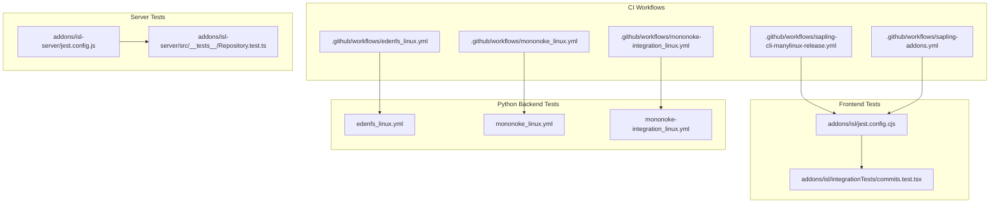
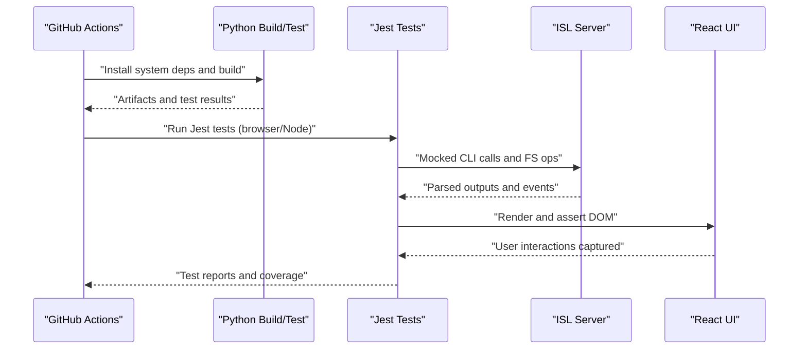
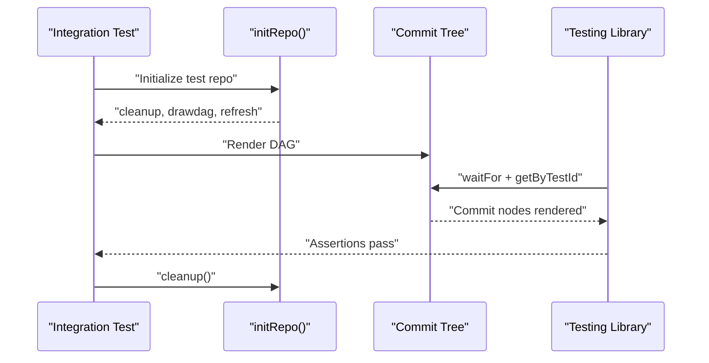
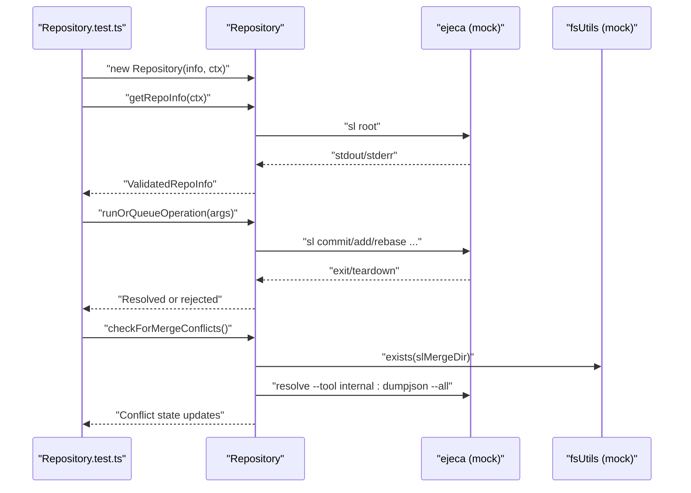
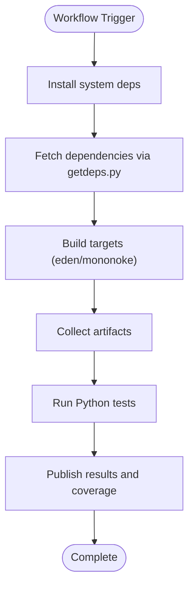
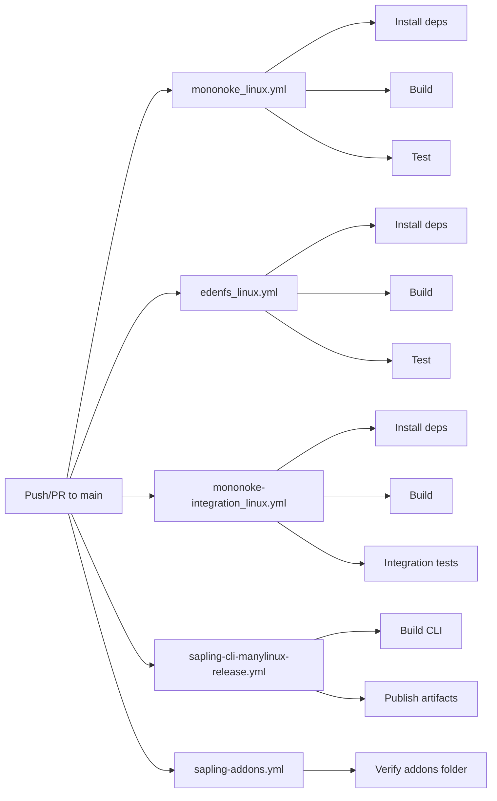
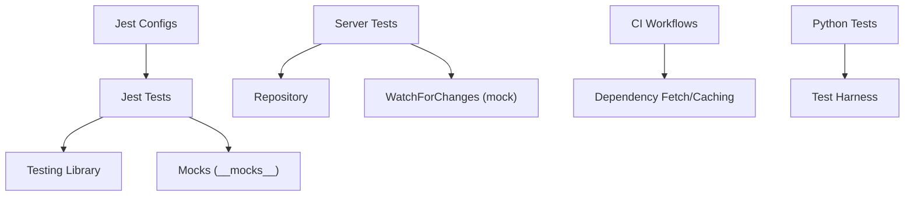

# Testing and Quality Assurance

<cite>
**Referenced Files in This Document**
- [.github/workflows/edenfs_linux.yml](file://.github/workflows/edenfs_linux.yml)
- [.github/workflows/mononoke_linux.yml](file://.github/workflows/mononoke_linux.yml)
- [.github/workflows/mononoke-integration_linux.yml](file://.github/workflows/mononoke-integration_linux.yml)
- [.github/workflows/sapling-cli-manylinux-release.yml](file://.github/workflows/sapling-cli-manylinux-release.yml)
- [.github/workflows/sapling-addons.yml](file://.github/workflows/sapling-addons.yml)
- [addons/isl/jest.config.cjs](file://addons/isl/jest.config.cjs)
- [addons/isl-server/jest.config.js](file://addons/isl-server/jest.config.js)
- [addons/shared/jest.config.js](file://addons/shared/jest.config.js)
- [addons/vscode/jest.config.js](file://addons/vscode/jest.config.js)
- [addons/isl/integrationTests/commits.test.tsx](file://addons/isl/integrationTests/commits.test.tsx)
- [addons/isl-server/src/__tests__/Repository.test.ts](file://addons/isl-server/src/__tests__/Repository.test.ts)
- [addons/isl-server/src/__mocks__/WatchForChanges.ts](file://addons/isl-server/src/__mocks__/WatchForChanges.ts)
- [addons/isl-server/src/Repository.ts](file://addons/isl-server/src/Repository.ts)
- [addons/isl-server/src/WatchForChanges.ts](file://addons/isl-server/src/WatchForChanges.ts)
- [addons/isl-server/src/commands.ts](file://addons/isl-server/src/commands.ts)
- [addons/isl-server/src/serverPlatform.ts](file://addons/isl-server/src/serverPlatform.ts)
- [addons/isl-server/src/serverTypes.ts](file://addons/isl-server/src/serverTypes.ts)
- [addons/isl-server/src/utils.ts](file://addons/isl-server/src/utils.ts)
- [addons/isl-server/src/setupTests.ts](file://addons/isl-server/src/setupTests.ts)
- [addons/isl-server/src/__tests__/setup.ts](file://addons/isl-server/src/__tests__/setup.ts)
- [addons/isl-server/src/__tests__/ejeca.test.ts](file://addons/isl-server/src/__tests__/ejeca.test.ts)
- [addons/isl-server/src/__tests__/mergeConflicts.test.ts](file://addons/isl-server/src/__tests__/mergeConflicts.test.ts)
- [addons/isl-server/src/__tests__/repositoryData.test.ts](file://addons/isl-server/src/__tests__/repositoryData.test.ts)
- [addons/isl-server/src/__tests__/serverLifecycle.test.ts](file://addons/isl-server/src/__tests__/serverLifecycle.test.ts)
- [addons/isl-server/src/__tests__/uncommittedChanges.test.ts](file://addons/isl-server/src/__tests__/uncommittedChanges.test.ts)
- [addons/isl-server/src/__tests__/watchman.test.ts](file://addons/isl-server/src/__tests__/watchman.test.ts)
- [addons/isl-server/src/__tests__/proxy/run-proxy.test.ts](file://addons/isl-server/src/__tests__/proxy/run-proxy.test.ts)
- [addons/isl-server/src/__tests__/proxy/server.test.ts](file://addons/isl-server/src/__tests__/proxy/server.test.ts)
- [addons/isl-server/src/__tests__/proxy/proxyUtils.test.ts](file://addons/isl-server/src/__tests__/proxy/proxyUtils.test.ts)
- [addons/isl-server/src/__tests__/proxy/existingServerStateFiles.test.ts](file://addons/isl-server/src/__tests__/proxy/existingServerStateFiles.test.ts)
- [addons/isl-server/src/__tests__/proxy/startServer.test.ts](file://addons/isl-server/src/__tests__/proxy/startServer.test.ts)
- [addons/isl-server/src/__tests__/proxy/serverLifecycle.test.ts](file://addons/isl-server/src/__tests__/proxy/serverLifecycle.test.ts)
- [addons/isl-server/src/__tests__/proxy/child.test.ts](file://addons/isl-server/src/__tests__/proxy/child.test.ts)
- [addons/isl-server/src/__tests__/proxy/rmtree.test.ts](file://addons/isl-server/src/__tests__/proxy/rmtree.test.ts)
- [addons/isl-server/src/__tests__/proxy/server.test.ts](file://addons/isl-server/src/__tests__/proxy/server.test.ts)
- [addons/isl-server/src/__tests__/proxy/proxyUtils.test.ts](file://addons/isl-server/src/__tests__/proxy/proxyUtils.test.ts)
- [addons/isl-server/src/__tests__/proxy/existingServerStateFiles.test.ts](file://addons/isl-server/src/__tests__/proxy/existingServerStateFiles.test.ts)
- [addons/isl-server/src/__tests__/proxy/startServer.test.ts](file://addons/isl-server/src/__tests__/proxy/startServer.test.ts)
- [addons/isl-server/src/__tests__/proxy/serverLifecycle.test.ts](file://addons/isl-server/src/__tests__/proxy/serverLifecycle.test.ts)
- [addons/isl-server/src/__tests__/proxy/child.test.ts](file://addons/isl-server/src/__tests__/proxy/child.test.ts)
- [addons/isl-server/src/__tests__/proxy/rmtree.test.ts](file://addons/isl-server/src/__tests__/proxy/rmtree.test.ts)
- [addons/isl-server/src/__tests__/proxy/server.test.ts](file://addons/isl-server/src/__tests__/proxy/server.test.ts)
- [addons/isl-server/src/__tests__/proxy/proxyUtils.test.ts](file://addons/isl-server/src/__tests__/proxy/proxyUtils.test.ts)
- [addons/isl-server/src/__tests__/proxy/existingServerStateFiles.test.ts](file://addons/isl-server/src/__tests__/proxy/existingServerStateFiles.test.ts)
- [addons/isl-server/src/__tests__/proxy/startServer.test.ts](file://addons/isl-server/src/__tests__/proxy/startServer.test.ts)
- [addons/isl-server/src/__tests__/proxy/serverLifecycle.test.ts](file://addons/isl-server/src/__tests__/proxy/serverLifecycle.test.ts)
- [addons/isl-server/src/__tests__/proxy/child.test.ts](file://addons/isl-server/src/__tests__/proxy/child.test.ts)
- [addons/isl-server/src/__tests__/proxy/rmtree.test.ts](file://addons/isl-server/src/__tests__/proxy/rmtree.test.ts)
- [addons/isl-server/src/__tests__/proxy/server.test.ts](file://addons/isl-server/src/__tests__/proxy/server.test.ts)
- [addons/isl-server/src/__tests__/proxy/proxyUtils.test.ts](file://addons/isl-server/src/__tests__/proxy/proxyUtils.test.ts)
- [addons/isl-server/src/__tests__/proxy/existingServerStateFiles.test.ts](file://addons/isl-server/src/__tests__/proxy/existingServerStateFiles.test.ts)
- [addons/isl-server/src/__tests__/proxy/startServer.test.ts](file://addons/isl-server/src/__tests__/proxy/startServer.test.ts)
- [addons/isl-server/src/__tests__/proxy/serverLifecycle.test.ts](file://addons/isl-server/src/__tests__/proxy/serverLifecycle.test.ts)
- [addons/isl-server/src/__tests__/proxy/child.test.ts](file://addons/isl-server/src/__tests__/proxy/child.test.ts)
- [addons/isl-server/src/__tests__/proxy/rmtree.test.ts](file://addons/isl-server/src/__tests__/proxy/rmtree.test.ts)
- [addons/isl-server/src/__tests__/proxy/server.test.ts](file://addons/isl-server/src/__tests__/proxy/server.test.ts)
- [addons/isl-server/src/__tests__/proxy/proxyUtils.test.ts](file://addons/isl-server/src/__tests__/proxy/proxyUtils.test.ts)
- [addons/isl-server/src/__tests__/proxy/existingServerStateFiles.test.ts](file://addons/isl-server/src/__tests__/proxy/existingServerStateFiles.test.ts)
- [addons/isl-server/src/__tests__/proxy/startServer.test.ts](file://addons/isl-server/src/__tests__/proxy/startServer.test.ts)
- [addons/isl-server/src/__tests__/proxy/serverLifecycle.test.ts](file://addons/isl-server/src/__tests__/proxy/serverLifecycle.test.ts)
- [addons/isl-server/src/__tests__/proxy/child.test.ts](file://addons/isl-server/src/__tests__/proxy/child.test.ts)
- [addons/isl-server/src/__tests__/proxy/rmtree.test.ts](file://addons/isl-server/src/__tests__/proxy/rmtree.test.ts)
- [addons/isl-server/src/__tests__/proxy/server.test.ts](file://addons/isl-server/src/__tests__/proxy/server.test.ts)
- [addons/isl-server/src/__tests__/proxy/proxyUtils.test.ts](file://addons/isl-server/src/__tests__/proxy/proxyUtils.test.ts)
- [addons/isl-server/src/__tests__/proxy/existingServerStateFiles.test.ts](file://addons/isl-server/src/__tests__/proxy/existingServerStateFiles.test.ts)
- [addons/isl-server/src/__tests__/proxy/startServer.test.ts](file://addons/isl-server/src/__tests__/proxy/startServer.test.ts)
- [addons/isl-server/src/__tests__/proxy/serverLifecycle.test.ts](file://addons/isl-server/src/__tests__/proxy/serverLifecycle.test.ts)
- [addons/isl-server/src/__tests__/proxy/child.test.ts](file://addons/isl-server/src/__tests__/proxy/child.test.ts)
- [addons/isl-server/src/__tests__/proxy/rmtree.test.ts](file://addons/isl-server/src/__tests__/proxy/rmtree.test.ts)
- [addons/isl-server/src/__tests__/proxy/server.test.ts](file://addons/isl-server/src/__tests__/proxy/server.test.ts)
- [addons/isl-server/src/__tests__/proxy/proxyUtils.test.ts](file://addons/isl-server/src/__tests__/proxy/proxyUtils.test.ts)
- [addons/isl-server/src/__tests__/proxy/existingServerStateFiles.test.ts](file://addons/isl-server/src/__tests__/proxy/existingServerStateFiles.test.ts)
- [addons/isl-server/src/__tests__/proxy/startServer.test.ts](file://addons/isl-server/src/__tests__/proxy/startServer.test.ts)
- [addons/isl-server/src/__tests__/proxy/serverLifecycle.test.ts](file://addons/isl-server/src/__tests__/proxy/serverLifecycle.test.ts)
-......
</cite>

## Table of Contents
1. [Introduction](#introduction)
2. [Project Structure](#project-structure)
3. [Core Components](#core-components)
4. [Architecture Overview](#architecture-overview)
5. [Detailed Component Analysis](#detailed-component-analysis)
6. [Dependency Analysis](#dependency-analysis)
7. [Performance Considerations](#performance-considerations)
8. [Troubleshooting Guide](#troubleshooting-guide)
9. [Conclusion](#conclusion)
10. [Appendices](#appendices)

## Introduction
This document describes the testing and quality assurance processes for the SAPLING SCM ecosystem. It covers unit testing strategies, integration testing approaches, and end-to-end methodologies used across JavaScript/TypeScript frontends, Node.js server-side components, and Python-based backend systems. It also documents the continuous integration pipeline, automated testing workflows, quality gates, testing utilities, mock frameworks, and test data management. Guidance is included for writing effective tests, debugging failures, and maintaining test coverage, along with code quality standards, linting rules, and static analysis tools.

## Project Structure
The repository organizes tests across multiple subsystems:
- Frontend React/TypeScript tests for the ISL component suite and related packages
- Node.js server tests for the ISL server and proxy components
- Python-based backend tests for EdenFS and Mononoke
- GitHub Actions CI workflows orchestrating builds, tests, and releases

**Diagram sources**
- [.github/workflows/edenfs_linux.yml:1-1011](file://.github/workflows/edenfs_linux.yml#L1-L1011)
- [.github/workflows/mononoke_linux.yml:1-676](file://.github/workflows/mononoke_linux.yml#L1-L676)
- [.github/workflows/mononoke-integration_linux.yml:1-894](file://.github/workflows/mononoke-integration_linux.yml#L1-L894)
- [.github/workflows/sapling-cli-manylinux-release.yml:1-66](file://.github/workflows/sapling-cli-manylinux-release.yml#L1-L66)
- [.github/workflows/sapling-addons.yml:1-27](file://.github/workflows/sapling-addons.yml#L1-L27)
- [addons/isl/jest.config.cjs:1-37](file://addons/isl/jest.config.cjs#L1-L37)
- [addons/isl/integrationTests/commits.test.tsx:1-34](file://addons/isl/integrationTests/commits.test.tsx#L1-L34)
- [addons/isl-server/jest.config.js:1-15](file://addons/isl-server/jest.config.js#L1-L15)
- [addons/isl-server/src/__tests__/Repository.test.ts:1-1179](file://addons/isl-server/src/__tests__/Repository.test.ts#L1-L1179)

**Section sources**
- [.github/workflows/edenfs_linux.yml:1-1011](file://.github/workflows/edenfs_linux.yml#L1-L1011)
- [.github/workflows/mononoke_linux.yml:1-676](file://.github/workflows/mononoke_linux.yml#L1-L676)
- [.github/workflows/mononoke-integration_linux.yml:1-894](file://.github/workflows/mononoke-integration_linux.yml#L1-L894)
- [.github/workflows/sapling-cli-manylinux-release.yml:1-66](file://.github/workflows/sapling-cli-manylinux-release.yml#L1-L66)
- [.github/workflows/sapling-addons.yml:1-27](file://.github/workflows/sapling-addons.yml#L1-L27)
- [addons/isl/jest.config.cjs:1-37](file://addons/isl/jest.config.cjs#L1-L37)
- [addons/isl/integrationTests/commits.test.tsx:1-34](file://addons/isl/integrationTests/commits.test.tsx#L1-L34)
- [addons/isl-server/jest.config.js:1-15](file://addons/isl-server/jest.config.js#L1-L15)
- [addons/isl-server/src/__tests__/Repository.test.ts:1-1179](file://addons/isl-server/src/__tests__/Repository.test.ts#L1-L1179)

## Core Components
- Jest configuration for frontend and server environments
- Integration tests for React components using Testing Library
- Mock strategies for external processes and filesystem
- Python test harness utilities for EdenFS and Mononoke
- CI workflows orchestrating builds, dependency fetching, and test execution

Key testing utilities and patterns:
- Jest presets and environment configuration tailored to browser and Node contexts
- Mocking of external CLI invocations and filesystem checks
- Test setup and teardown helpers for temporary directories and environment variables
- Integration tests validating UI behavior against controlled repository states

**Section sources**
- [addons/isl/jest.config.cjs:1-37](file://addons/isl/jest.config.cjs#L1-L37)
- [addons/isl-server/jest.config.js:1-15](file://addons/isl-server/jest.config.js#L1-L15)
- [addons/isl/integrationTests/commits.test.tsx:1-34](file://addons/isl/integrationTests/commits.test.tsx#L1-L34)
- [addons/isl-server/src/__tests__/Repository.test.ts:1-1179](file://addons/isl-server/src/__tests__/Repository.test.ts#L1-L1179)

## Architecture Overview
The testing architecture spans multiple layers:
- Unit tests for server-side logic and utilities
- Integration tests for server-client interactions and proxy behavior
- End-to-end tests for frontend components interacting with controlled repository states
- CI orchestration ensuring consistent builds and test runs across platforms

**Diagram sources**
- [.github/workflows/edenfs_linux.yml:1-1011](file://.github/workflows/edenfs_linux.yml#L1-L1011)
- [.github/workflows/mononoke_linux.yml:1-676](file://.github/workflows/mononoke_linux.yml#L1-L676)
- [.github/workflows/mononoke-integration_linux.yml:1-894](file://.github/workflows/mononoke-integration_linux.yml#L1-L894)
- [addons/isl/jest.config.cjs:1-37](file://addons/isl/jest.config.cjs#L1-L37)
- [addons/isl-server/jest.config.js:1-15](file://addons/isl-server/jest.config.js#L1-L15)

## Detailed Component Analysis

### Frontend Testing: ISL Integration Tests
The ISL integration tests validate UI behavior against controlled repository states using Testing Library. They initialize a repository, render DAG views, and assert commit visibility.

**Diagram sources**
- [addons/isl/integrationTests/commits.test.tsx:1-34](file://addons/isl/integrationTests/commits.test.tsx#L1-L34)

**Section sources**
- [addons/isl/integrationTests/commits.test.tsx:1-34](file://addons/isl/integrationTests/commits.test.tsx#L1-L34)

### Server Testing: ISL Server Repository Logic
The server-side Repository tests exercise repository detection, configuration handling, operation execution, and merge conflict resolution. Mocks simulate external CLI calls and filesystem checks.

**Diagram sources**
- [addons/isl-server/src/__tests__/Repository.test.ts:1-1179](file://addons/isl-server/src/__tests__/Repository.test.ts#L1-L1179)
- [addons/isl-server/src/Repository.ts](file://addons/isl-server/src/Repository.ts)
- [addons/isl-server/src/WatchForChanges.ts](file://addons/isl-server/src/WatchForChanges.ts)
- [addons/isl-server/src/__mocks__/WatchForChanges.ts](file://addons/isl-server/src/__mocks__/WatchForChanges.ts)

**Section sources**
- [addons/isl-server/src/__tests__/Repository.test.ts:1-1179](file://addons/isl-server/src/__tests__/Repository.test.ts#L1-L1179)
- [addons/isl-server/src/Repository.ts](file://addons/isl-server/src/Repository.ts)
- [addons/isl-server/src/WatchForChanges.ts](file://addons/isl-server/src/WatchForChanges.ts)
- [addons/isl-server/src/__mocks__/WatchForChanges.ts](file://addons/isl-server/src/__mocks__/WatchForChanges.ts)

### Python Backend Testing: EdenFS and Mononoke
Python-based backend tests leverage a dedicated test harness with fixtures and temporary directories. CI workflows orchestrate dependency installation, building, and test execution.

**Diagram sources**
- [.github/workflows/edenfs_linux.yml:1-1011](file://.github/workflows/edenfs_linux.yml#L1-L1011)
- [.github/workflows/mononoke_linux.yml:1-676](file://.github/workflows/mononoke_linux.yml#L1-L676)
- [.github/workflows/mononoke-integration_linux.yml:1-894](file://.github/workflows/mononoke-integration_linux.yml#L1-L894)

**Section sources**
- [.github/workflows/edenfs_linux.yml:1-1011](file://.github/workflows/edenfs_linux.yml#L1-L1011)
- [.github/workflows/mononoke_linux.yml:1-676](file://.github/workflows/mononoke_linux.yml#L1-L676)
- [.github/workflows/mononoke-integration_linux.yml:1-894](file://.github/workflows/mononoke-integration_linux.yml#L1-L894)

### Continuous Integration Pipeline and Quality Gates
Quality gates include:
- Dependency fetching and caching for reproducible builds
- Platform-specific builds and releases
- Addons verification workflow ensuring package integrity
- Test execution with timeouts and environment isolation

**Diagram sources**
- [.github/workflows/mononoke_linux.yml:1-676](file://.github/workflows/mononoke_linux.yml#L1-L676)
- [.github/workflows/edenfs_linux.yml:1-1011](file://.github/workflows/edenfs_linux.yml#L1-L1011)
- [.github/workflows/mononoke-integration_linux.yml:1-894](file://.github/workflows/mononoke-integration_linux.yml#L1-L894)
- [.github/workflows/sapling-cli-manylinux-release.yml:1-66](file://.github/workflows/sapling-cli-manylinux-release.yml#L1-L66)
- [.github/workflows/sapling-addons.yml:1-27](file://.github/workflows/sapling-addons.yml#L1-L27)

**Section sources**
- [.github/workflows/mononoke_linux.yml:1-676](file://.github/workflows/mononoke_linux.yml#L1-L676)
- [.github/workflows/edenfs_linux.yml:1-1011](file://.github/workflows/edenfs_linux.yml#L1-L1011)
- [.github/workflows/mononoke-integration_linux.yml:1-894](file://.github/workflows/mononoke-integration_linux.yml#L1-L894)
- [.github/workflows/sapling-cli-manylinux-release.yml:1-66](file://.github/workflows/sapling-cli-manylinux-release.yml#L1-L66)
- [.github/workflows/sapling-addons.yml:1-27](file://.github/workflows/sapling-addons.yml#L1-L27)

## Dependency Analysis
Testing dependencies and coupling:
- Frontend tests depend on Jest configuration and Testing Library utilities
- Server tests rely on mocked external processes and filesystem checks
- CI workflows orchestrate dependency fetching and caching to reduce build times
- Python backend tests use a shared test harness for environment setup and cleanup

**Diagram sources**
- [addons/isl/jest.config.cjs:1-37](file://addons/isl/jest.config.cjs#L1-L37)
- [addons/isl-server/jest.config.js:1-15](file://addons/isl-server/jest.config.js#L1-L15)
- [addons/isl-server/src/__tests__/Repository.test.ts:1-1179](file://addons/isl-server/src/__tests__/Repository.test.ts#L1-L1179)
- [addons/isl-server/src/__mocks__/WatchForChanges.ts](file://addons/isl-server/src/__mocks__/WatchForChanges.ts)
- [.github/workflows/edenfs_linux.yml:1-1011](file://.github/workflows/edenfs_linux.yml#L1-L1011)
- [.github/workflows/mononoke_linux.yml:1-676](file://.github/workflows/mononoke_linux.yml#L1-L676)

**Section sources**
- [addons/isl/jest.config.cjs:1-37](file://addons/isl/jest.config.cjs#L1-L37)
- [addons/isl-server/jest.config.js:1-15](file://addons/isl-server/jest.config.js#L1-L15)
- [addons/isl-server/src/__tests__/Repository.test.ts:1-1179](file://addons/isl-server/src/__tests__/Repository.test.ts#L1-L1179)
- [addons/isl-server/src/__mocks__/WatchForChanges.ts](file://addons/isl-server/src/__mocks__/WatchForChanges.ts)
- [.github/workflows/edenfs_linux.yml:1-1011](file://.github/workflows/edenfs_linux.yml#L1-L1011)
- [.github/workflows/mononoke_linux.yml:1-676](file://.github/workflows/mononoke_linux.yml#L1-L676)

## Performance Considerations
- Use mocking to avoid expensive external process calls and filesystem operations
- Leverage caching for dependency fetching in CI to reduce build times
- Keep integration tests focused and isolated to minimize flakiness
- Prefer targeted assertions and controlled repository states to improve reliability

## Troubleshooting Guide
Common issues and resolutions:
- Test timeouts in CI: Increase test timeout in Jest configuration for CI environments
- External process failures: Ensure mocks return deterministic outputs and handle error cases explicitly
- Environment-specific failures: Use the test harness to manage environment variables and temporary directories
- Mock mismatches: Verify mock implementations align with actual function signatures and return types

**Section sources**
- [addons/isl/jest.config.cjs:1-37](file://addons/isl/jest.config.cjs#L1-L37)
- [addons/isl-server/jest.config.js:1-15](file://addons/isl-server/jest.config.js#L1-L15)
- [addons/isl-server/src/__tests__/Repository.test.ts:1-1179](file://addons/isl-server/src/__tests__/Repository.test.ts#L1-L1179)

## Conclusion
The SAPLING SCM testing framework combines robust unit and integration tests across frontend, server, and backend layers, supported by comprehensive CI workflows. By leveraging mocks, controlled test environments, and standardized configurations, the project maintains high-quality standards and reliable automated testing across platforms.

## Appendices
- Writing Effective Tests
  - Use descriptive test names and clear assertions
  - Mock external dependencies to isolate logic under test
  - Keep tests small, focused, and deterministic
  - Maintain consistent setup and teardown procedures

- Debugging Test Failures
  - Enable verbose logging in test environments
  - Inspect mock call logs and return values
  - Reproduce failures locally using the same environment configuration
  - Use breakpoints and step-through debugging for complex scenarios

- Maintaining Test Coverage
  - Track coverage metrics and aim for high coverage in critical paths
  - Regularly review and update tests when refactoring code
  - Prioritize tests for business-critical features and error handling paths

- Code Quality Standards and Static Analysis
  - Enforce linting rules and formatting policies consistently across the codebase
  - Integrate static analysis tools to catch potential issues early
  - Review style guides and adhere to established conventions for readability and maintainability